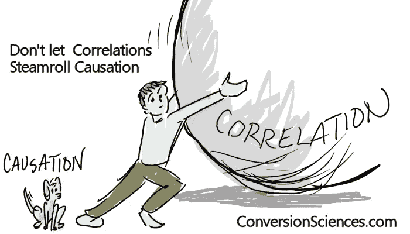
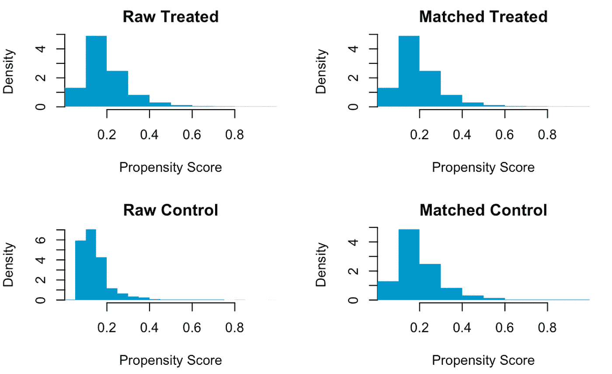
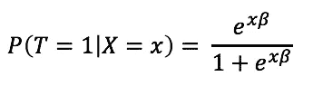
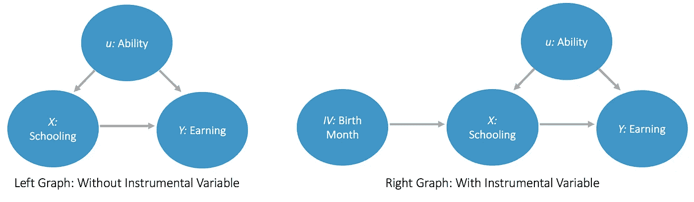
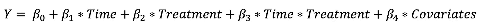

# 非 A/B 测试的因果推理:理论与实践指南

> 原文：<https://towardsdatascience.com/causal-inference-thats-not-a-b-testing-theory-practical-guide-f3c824ac9ed2?source=collection_archive---------14----------------------->



[https://conversionsciences.com/conversion-optimization-blog/](https://conversionsciences.com/conversion-optimization-blog/)

毫无疑问，随机实验(假设正确进行)是建立因果关系的最直接的方法(参考我之前的一篇关于 A/B 测试学习资源的文章！).然而，实际上，有些情况下实验并不是一个可行的选择:

*   您正在处理没有控制或测试组分配的回顾性干预数据，这可能是由于实验的高成本
*   干预是一个足够大的变化，你不能只向一半的目标受众展示(例如，主要产品发布、UI 改进等。)
*   治疗是观察而不是分配的(例如吸烟者和非吸烟者之间的比较，社交媒体平台上的活动水平)，也称为**选择偏差**
*   还有更多…

上述案例经常被称为 [**观察性研究**](https://en.wikipedia.org/wiki/Observational_study) ，其中自变量不在研究人员的控制之下。观察性研究揭示了衡量因果效应的一个基本问题——也就是说，我们在治疗组和非治疗组之间观察到的任何变化都是**反事实**，这意味着我们不知道如果治疗组的人没有接受治疗，他们会发生什么。

从众所周知的统计书籍、研究论文和课程讲义中提取理论，本文介绍了在非实验数据存在的情况下**做出反事实推理的 5 种不同方法**。还包括简单的代码示例和技术行业中的应用，以便您可以看到理论是如何付诸实践的。

*特别感谢****iris&Joe****的灵感和知识分享，并感谢****matt****的点评。* [*关注我在 Medium.com 的*](https://medium.com/@eva.gong) *定期发表关于科技&商业相关话题的博客！📚*😊❤️

## 方法 1:使用混杂变量的 OLS

**您从整个用户群中收集数据，并希望回归新功能点击次数的参与指数。这是一个合理的方法吗？**

***理论:*** 最有可能的答案是否定的。在上面的案例中，我们试图衡量新功能的使用对用户整体参与度的影响(下图 I 中左侧的因果图)。


Plot 1: Causal Graphs with Confounding Variables

然而，有可能 [**混淆变量**](https://en.wikipedia.org/wiki/Confounding) 被从模型中省略，并且对自变量和因变量都有影响。这种混淆变量可以包括用户的特征(例如，年龄、地区、行业等。).很有可能，这些用户特征决定了用户使用新特性的频率，以及他们在发布后的参与程度(见上面图 1 中的右因果图)。这些混淆的变量需要在模型中加以控制。

***示例代码:*** 假设你有 10k MAU…

```
## Parameter setup
total_num_user = 10000
pre_engagement_level = rnorm(total_num_user)
new_feature_usage = .6 * pre_engagement_level + rnorm(total_num_user)
post_engagement_level = .4 * pre_engagement_level + .5 * new_feature_usage + rnorm(total_num_user)## Model without the confounder
summary(lm(post_engagement_level~new_feature_usage))## Model with the confounder
summary(lm(post_engagement_level~new_feature_usage+pre_engagement_level))
```

由于混杂因素对自变量和因变量的积极影响，第一次回归会导致系数估计值的向上偏差。

***当这种方法不起作用时:*** 现在你可能想知道，控制混杂因素总是有效吗？不。它仅在满足以下假设时有效[1]:

*   a)治疗组和非治疗组是可比的(意味着没有不平衡或没有完全重叠)
*   b)观察所有能同时影响因变量和治疗变量的变量

当这些假设不成立时，我们将继续讨论其他方法。

## 方法 2:匹配/倾向分数匹配

***理论:*** 当治疗组和非治疗组不可比时，即当混杂协变量的分布或范围在对照组和治疗组之间变化时，系数估计值有偏差[1]。**匹配**技术通过识别治疗组和非治疗组中相互接近的成对数据点来确保平衡分布，混杂协变量定义了成对数据点之间的距离。这些技术输出较小的数据集，其中每个治疗观察与最接近它的一个(或多个)非治疗观察相匹配。



Plot 2: Raw vs. Matched Control and Treatment Groups Using PSM

对于具有大量预处理变量的模型，匹配过程可能是昂贵的。**倾向得分匹配(PSM)** 通过计算每个观察值的单个得分来简化问题，然后该得分可用于识别匹配对(参见左边的示例，使用下面的示例代码生成)。

倾向得分通常使用标准模型(如逻辑回归)进行估计，其中治疗变量为因变量***【T】***，混杂协变量***【X】***为自变量。因此，它估计了一个人接受治疗的概率，以混杂协变量为条件。



Formula 1: PSM with Logistic Regression

***行业应用:*** 作为 A/B 测试的替代方法，这种方法也被科技公司的研究人员所应用。例如， [LinkedIn 在 2016 年发表了一篇论文](https://dl.acm.org/citation.cfm?id=2939703)，分享了在其移动应用采用分析中使用的准实验方法。移动应用程序 UI 的彻底改造以及基础设施的挑战使得 A/B 测试不可行。在历史发布数据的帮助下，他们证明了倾向评分技术如何减少采用偏差，并可用于衡量主要产品发布的影响[2]。

***示例代码:*** R 的 [Matchit 包](https://cran.r-project.org/web/packages/MatchIt/MatchIt.pdf)提供了使用不同的距离定义、匹配技术等选择匹配对的多种方式。，我们将在下面的例子中说明它。在下面的代码示例中，我们使用了 2015 年 [BRFSS 调查](https://www.cdc.gov/brfss/index.html)数据的样本，可通过弗吉尼亚大学图书馆访问。该样本有 5000 个记录和 7 个变量，在控制了种族、年龄、性别、体重和平均饮酒习惯协变量后，我们有兴趣了解吸烟对慢性阻塞性肺病(CODP)的影响。

```
## Read in data and identify matched pairs
library(MatchIt)
sample = read.csv("[http://static.lib.virginia.edu/statlab/materials/data/brfss_2015_sample.csv](http://static.lib.virginia.edu/statlab/materials/data/brfss_2015_sample.csv)")
match_result = matchit(SMOKE ~ RACE + AGE + SEX + WTLBS + AVEDRNK2, 
                       data = sample,
                       method = "nearest",
                       distancce = "logit")
par(family = "sans")
plot(match_result,  type = "hist", col = "#0099cc",lty="blank")
sample_match = match.data(match_result)## Models with imbalanced and balanced data distribution
sample$SMOKE = factor(sample$SMOKE, labels = c("No", "Yes"))
sample_match$SMOKE = factor(sample_match$SMOKE, labels = c("No", "Yes"))
mod_matching1 = glm(COPD ~ SMOKE + AGE + RACE + SEX + WTLBS + AVEDRNK2, data = sample, family = "binomial")
mod_matching2 = glm(COPD ~ SMOKE + AGE + RACE + SEX + WTLBS + AVEDRNK2, data = sample_match, family = "binomial")
summary(mod_matching1)
summary(mod_matching2)
```

## 方法 3:工具变量

***理论*** *:* 当假设 b)不满足，即存在无法观测到的混杂变量时，使用**工具变量(IV)** 可以减少遗漏变量偏倚。如果:1) Z 与 X 相关，则变量 Z 有资格作为工具变量；2) Z 不与任何对 Y 有影响的协变量(包括误差项)相关[3]。这些条件意味着 Z 仅通过其对 x 的影响来影响 Y。因此，Z 引起的 Y 的变化不会混淆，并可用于估计治疗效果。

例如，为了研究学校教育(如受教育年限)对收入的影响，“能力”是一个重要但难以衡量的变量，它对学生在学校的表现以及毕业后的收入都有影响。研究人员研究的一个工具变量是出生月份，它决定入学年份，从而决定受教育年限，但同时对收入没有影响(如图 3 所示)。



Plot 3: Using “Birth Month” as an Instrumental Variable

在实践中，通常使用**两阶段最小二乘法**来估计 IV。在第一阶段，IV 用于在 X 上回归以测量 X 之间的协方差& IV。在第二阶段，来自第一阶段的预测 X 和其他协变量一起用于回归 Y，从而集中于由 IV 引起的 Y 的变化。

这种方法最大的挑战是工具变量很难找到。一般来说，独立变量更广泛地应用于计量经济学和社会科学研究。因此，这里省略了行业应用和代码示例。

## **方法 4:差异中的差异**

***理论:*** 当 IVs 没有好的候选者时，我们需要一种替代的方式来说明未观测的协变量。**差异中的差异(DiD)** 方法通过比较对照组&治疗组的治疗后差异与治疗前差异进行工作，假设如果没有干预，两组的因变量将遵循相似的趋势。与试图识别彼此相似的数据点对的匹配/PSM 不同，DiD 估计器考虑了两组之间的任何初始异质性。


Source: What is difference-in-differences ([https://stats.stackexchange.com/questions/564/what-is-difference-in-differences](https://stats.stackexchange.com/questions/564/what-is-difference-in-differences))

DiD 方法的**关键** **假设**是对照组&治疗组的因变量遵循相同的趋势**平行世界**假设 **)** 。这并不意味着它们需要具有相同的平均值，或者在预处理期间根本没有趋势[4]。参见左侧的示例图，其中控制&试验组在预处理期间具有相似的趋势。如果假设成立，治疗组的治疗后差异可以分解为对照组中类似观察到的差异和治疗本身引起的差异。DID 通常被实现为回归模型中时间和治疗组虚拟变量之间的交互项。



Formula 2: DiD in a Regression Model

有几种不同的方法来验证平行世界的假设。最简单的方法是进行目视检查。或者，您可以让治疗变量与时间虚拟变量相互作用，以查看两组之间的差异在治疗前期间是否不显著[5]。

***行业应用:*** 类似于倾向得分匹配，这种方法一直受到希望在非实验性设置中研究用户行为的科技公司的青睐。例如，[脸书在他们 2016 年的论文](https://research.fb.com/publications/changes-in-engagement-before-and-after-posting-to-facebook/)中应用 DiD 方法来研究贡献者的敬业度在被派往脸书前后是如何变化的。他们发现，在发布内容后，人们“更有内在动力更频繁地访问网站……”[6]。这是另一个很好的例子，发帖与否的行为不受研究者的控制，只能通过因果推理技术来分析。

***示例代码:*** 这里我们来看看如何使用 DiD 来估计 1993 年 EITC(劳动所得税收抵免)对至少有一个孩子的妇女就业率的影响。感谢[7]&【8】的原创分析，下面的代码只是一个简单的版本来演示是如何工作的！

```
## Read in data and create dummy variables
library(dplyr)
library(ggplot2)
data_file = '../did.dat'
if (!file.exists(data_file)) {
    download.file(url = '[https://drive.google.com/uc?authuser=0&id=0B0iAUHM7ljQ1cUZvRWxjUmpfVXM&export=download'](https://drive.google.com/uc?authuser=0&id=0B0iAUHM7ljQ1cUZvRWxjUmpfVXM&export=download'), destfile = data_file)}
df = haven::read_dta(data_file)
df = df %>%
    mutate(time_dummy = ifelse(year >= 1994, 1, 0), 
           if_treatment = ifelse(children >= 1, 1, 0))## Visualize the trend to validate the parallel world assumption
ggplot(df, aes(year, work, color = as.factor(if_treatment))) +
    stat_summary(geom = 'line') +
    geom_vline(xintercept = 1994)## Two ways to estimate the DiD effect: shift in means & regression
var1 = mean( (df %>% filter(time_dummy==0 & if_treatment==0 ))$work)
var2 = mean( (df %>% filter(time_dummy==0 & if_treatment==1 ))$work)
var3 = mean( (df %>% filter(time_dummy==1 & if_treatment==0 ))$work)
var4 = mean( (df %>% filter(time_dummy==1 & if_treatment==1 ))$work)
(var4 - var3) - (var2 - var1)mod_did1 = lm(work~time_dummy*if_treatment, data = df)
summary(mod_did1)
```

## 方法 5:贝叶斯模型

尽管 DiD 是一种流行的因果推理方法，但它有一些局限性:

*   a)它假设影响没有时间演变；相反，我们只是分析前后的变化
*   b)它假设观察值是独立且同分布的，因此不适用于序列相关的数据点

最近一系列基于状态空间模型的研究，通过利用完全贝叶斯时间序列对效果进行估计，并对最佳综合控制进行模型平均，概括了更灵活的用例[9]。Google 出版物[和相应的 R 包“CausalImpact”展示了这种状态空间模型背后的理论和实现，建议进一步阅读。](https://research.google/pubs/pub41854/)

 [## 因果影响

### 这个包是做什么的？这个 R 包实现了一种方法来估计因果效应的设计…

google.github.io](https://google.github.io/CausalImpact/CausalImpact.html) 

参考资料:

[1]安德鲁·盖尔曼和珍妮弗·希尔。[使用回归和多级/分层模型的数据分析](http://www.stat.columbia.edu/~gelman/arm/chap10.pdf)(2007)

[2]用 A/B 和准 A/B 测试评估移动 app。[https://dl.acm.org/citation.cfm?id=2939703](https://dl.acm.org/citation.cfm?id=2939703)

[3]珀尔，J. (2000 年)。*因果关系:模型、推理和推论*。纽约:剑桥大学出版社。

[4]讲稿:差异中的差异，实证方法[http://finance . Wharton . upenn . edu/~ Mr Robert/resources/Teaching/CorpFinPhD/Dif-In-Dif-slides . pdf](http://finance.wharton.upenn.edu/~mrrobert/resources/Teaching/CorpFinPhD/Dif-In-Dif-Slides.pdf)

[5][https://stats . stack exchange . com/questions/160359/difference-in-difference-method-how-to-test-of-assumption-of-common-trend-betw](https://stats.stackexchange.com/questions/160359/difference-in-difference-method-how-to-test-for-assumption-of-common-trend-betw)

[6]发布到脸书前后参与度的变化[https://research . FB . com/publications/Changes-in-Engagement-Before-and-After-Posting-Facebook/](https://research.fb.com/publications/changes-in-engagement-before-and-after-posting-to-facebook/)

[7][https://thetarzan . WordPress . com/2011/06/20/差异估算中的差异-r-and-stata/](https://thetarzan.wordpress.com/2011/06/20/differences-in-differences-estimation-in-r-and-stata/)

[https://dhicks.github.io/2018-10-10-did/](https://dhicks.github.io/2018-10-10-did/)

[9]使用贝叶斯结构时间序列模型推断因果影响[https://research.google/pubs/pub41854/](https://research.google/pubs/pub41854/)