# 使用综合控制的因果推理:最终指南

> 原文：<https://towardsdatascience.com/causal-inference-using-synthetic-control-the-ultimate-guide-a622ad5cf827?source=collection_archive---------4----------------------->

## 实验和因果推理

## 我们可以只用一个治疗病例和少数对照病例进行因果推断吗？


Photo by [Franki Chamaki](https://unsplash.com/@franki?utm_source=unsplash&utm_medium=referral&utm_content=creditCopyText) on [Unsplash](https://unsplash.com/s/photos/artificial-intelligence?utm_source=unsplash&utm_medium=referral&utm_content=creditCopyText)

# 技术困境

在其他帖子中，我解释了什么是因果关系，以及如何使用准实验设计进行因果推断([做了](/does-minimum-wage-decrease-employment-a-difference-in-differences-approach-cb208ed07327)，[做了](/what-is-the-strongest-quasi-experimental-method-interrupted-time-series-period-f59fe5b00b31)， [RDD](/the-crown-jewel-of-causal-inference-regression-discontinuity-design-rdd-bad37a68e786) )。几乎所有的研究方法都必须满足两个前提条件，才能产生有意义的见解:

> 1.治疗组看起来与对照组相似(**相似性可比性**)；
> 
> 2.每组内足够多的观察值(**大 n** )。

这两个前提条件为因果推断奠定了基础。但是，如果我们只有一个治疗病例和几个对照病例，有可能做因果推断吗？更糟糕的是，如果没有与治疗病例有相似协变量的对照病例，我们该怎么办？

在这些情况下，基于回归的解决方案(例如，关键变量匹配或倾向得分匹配)表现不佳。此外，其他准实验设计，如 DID 方法，在治疗组和对照组之间需要相似的协变量，在这两种情况下会产生巨大的偏差。

在这篇文章中，我自豪地提出一个统计解决方案，即**综合控制方法(SCM)** ，它是由一群像我一样的政治科学家提出的。老实说，供应链管理有巨大的因果潜力，但目前仍未得到充分重视。随着面向消费者的公司希望了解模拟的消费者行为，它开始在行业中引起一些关注。

# 基础

SCM 使用来自“供体”池的多个病例的加权平均值来创建人工对照病例。

下面是一个简化的过程:

1.  假设有 J + 1 个单位；
2.  j(1)是已治疗的病例(一个 ***注意*** *:* ***只有一个已治疗的病例***)；从 j(2)到 j(j+1)的单元是构成“ ***供体池*** ”的未曝光病例；
3.  从捐献者那里收集并得到单位的加权平均值
4.  选择使以下损失函数最小的加权值 W*:


*(详细描述请参考* ***阿巴迪等人 2010*** *和* ***阿巴迪等人 2015*** *)。)*

总之，SCM 通过提供正式的标准和程序引导我们通过生成控制案例的过程，这是 [matching](https://www.ncbi.nlm.nih.gov/pmc/articles/PMC2943670/) 或其他基于回归的方法无法实现的。

SCM 的另一个优点是，它能够使合成病例在关键指标方面看起来像治疗过的病例，如先前的协变量和其他事后结果预测(Abadie 等人，2010 年)。**换句话说，供应链管理可以提供比较。**

# **什么时候使用 SCM？**

SCM 是以下两种情况的理想选择:

1.  社会事件发生在总体层面，如县、州、省。
2.  只有一个治疗病例和几个对照病例。

由于这两个特点，当涉及到大规模项目评估时，SCM 是一种可行的方法(例如，[加州的烟草控制项目](https://economics.mit.edu/files/11859)，[评估基于场所的犯罪干预](https://link.springer.com/article/10.1007/s10940-014-9226-5))。说真的，业界真的应该把它添加到他们的 DS 工具包中。

# **优点**

总的来说，供应链管理有三个优势。

1.  它在 0 和 1 之间分配权重，因此**避免了外推**。外推意味着我们不将权重限制在 0 和 1 之间，但是如果权重保持在 100%之外，这是没有意义的。我是说怎么解读一个权重 200%？完全没有任何直觉。
2.  它列出了选择标准，并解释了每个捐赠者的相对重要性。
3.  合成对照病例与治疗病例非常相似，几乎相同。
4.  合成对照的选择不依赖于干预后的结果，这使得不可能挑选可能影响结论的研究设计。

# 怎么用？

## **1。行业应用**

1.  **程序评估。**

*   [比较案例研究的综合控制方法:评估加州烟草控制项目的效果](https://economics.mit.edu/files/11859)
*   [冲突的经济成本:巴斯克地区的案例研究](https://www.aeaweb.org/articles?id=10.1257/000282803321455188)

**2。犯罪研究**

*   [评估基于场所的犯罪干预的综合控制方法](https://link.springer.com/article/10.1007/s10940-014-9226-5)
*   [干旱对加州犯罪的影响:综合控制方法](https://journals.plos.org/plosone/article?id=10.1371/journal.pone.0185629)

**3。罕见事件**

*   潜在地，我们可以应用合成控制来为罕见事件生成更多的案例，因为罕见事件缺乏数据供应。请查看我的另一篇关于如何使用 5 个机器学习分类器对罕见事件进行分类的帖子。

[](/classifying-rare-events-using-five-machine-learning-techniques-fab464573233) [## 脖子上的痛:使用 5 种机器学习方法预测罕见事件

### 哪一种最适合不平衡数据？有什么权衡吗？

towardsdatascience.com](/classifying-rare-events-using-five-machine-learning-techniques-fab464573233) 

## 2.r 实施

在这一节中，我将复制 Abadie (2003) 的结果，该结果研究了恐怖主义如何影响西班牙巴斯克地区的经济产出。我们将使用 R 包“Synth”进行分析，详细的数学解释和 R 指令请参考 [Synth:比较案例研究中综合控制方法的 R 包](https://core.ac.uk/download/pdf/6287910.pdf)。

**步骤 0:包、库和探索性数据分析**

```
# install and load package
install.packages("Synth") 
library(Synth)# read the dataset "basque"
data("basque")#EDA
dim(basque) #774*17
basque[1:10,]
```

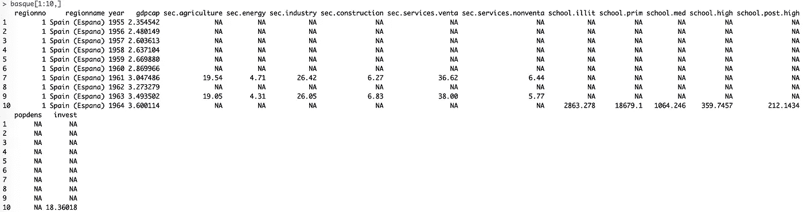

Table 1

从表 1 中，有 774 个观察值和 17 个变量(列)。

*第 1–3 列:地区号、名称和年份(ID 信息)*

*DV: gdpcap(人均 GDP)*

*其他列:有 13 个预测变量。*

**第一步:数据准备**

原始数据集“巴斯克”有一个传统的面板格式，为了使用 **synth()** ，我们需要以另一种形式读取它。

```
# set up different arguments
# foo: dataprep.out <- dataprep(foo = basque,
 predictors = c(“school.illit”, “school.prim”, “school.med”,
 “school.high”, “school.post.high”, “invest”),
 predictors.op = “mean”, **# the operator**
 time.predictors.prior = 1964:1969, **#the entire time frame from the #beginning to the end**
 special.predictors = list(
 list(“gdpcap”, 1960:1969, “mean”),
 list(“sec.agriculture”, seq(1961,1969,2),”mean”),
 list(“sec.energy”,seq(1961,1969,2),”mean”),
 list(“sec.industry”, seq(1961,1969,2),”mean”),
 list(“sec.construction”, seq(1961,1969,2),”mean”),
 list(“sec.services.venta”, seq(1961,1969,2),”mean”),
 list(“sec.services.nonventa”,seq(1961,1969,2),”mean”),
 list(“popdens”, 1969, “mean”)),
 dependent = “gdpcap”, **# dv**
 unit.variable = “regionno”,**#identifying unit numbers**
 unit.names.variable = “regionname”,**#identifying unit names**
 time.variable = “year”,**#time-periods**
 treatment.identifier = 17,**#the treated case**
 controls.identifier = c(2:16, 18),**#the control cases; all others #except number 17**
 time.optimize.ssr = 1960:1969,**#the time-period over which to optimize**
 time.plot = 1955:1997)**#the entire time period before/after the treatment**
```

**dataprep.out** 获得四个值(X1，X0，Z1，Z0 ),允许我们进行因果推断。

**X1** :治疗前的对照病例

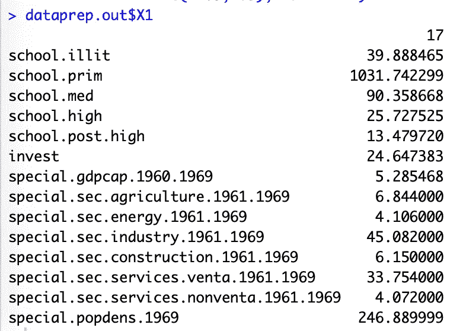

**X0** :治疗后对照病例

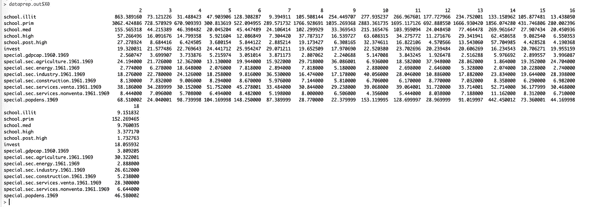

**Z1** :治疗前的治疗案例

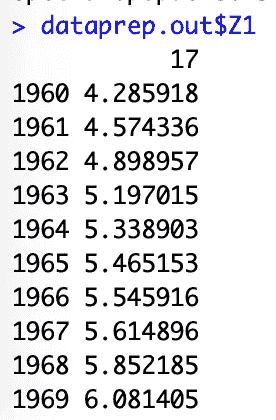

**Z0** :治疗后的治疗案例

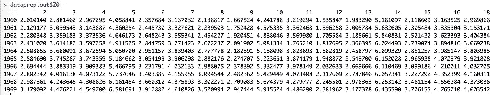

**第二步:运行 synth()**

```
synth.out = synth(data.prep.obj = dataprep.out, method = “BFGS”)
```

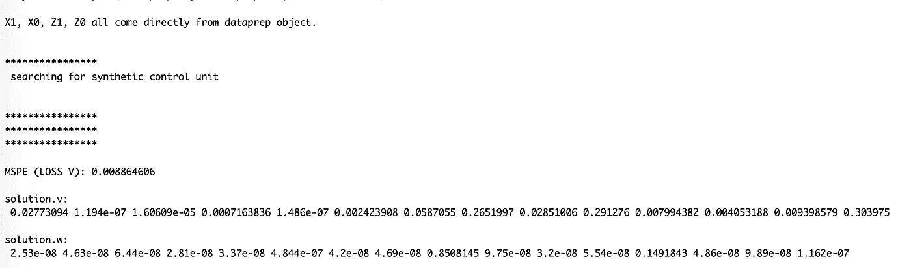

要计算真实基本区域和合成控制之间的差异，如下所示:

```
gaps = dataprep.out$Y1plot — (dataprep.out$Y0plot 
                                     %*% synth.out$solution.w)
gaps[1:3,1]
```

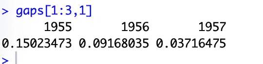

为了提供一些汇总表，

```
synth.tables = synth.tab(dataprep.res = dataprep.out,
                         synth.res = synth.out)
names(synth.tables)
[1] "tab.pred" "tab.v"    "tab.w"    "tab.loss"
```

注: **synth.tables$tab.pred** 是一个比较处理单元、合成对照和样本中所有单元的预处理预测值的表格

```
synth.tables$tab.pred[1:13,]
```

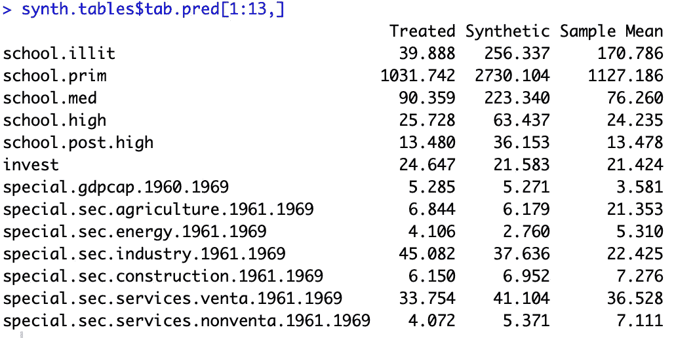

老实说，我无法生成与原始论文相同的结果。原始代码(synth.tables$tab.pred[1:5，])查看了处理案例和合成案例之间的前 5 个协变量，发现它们非常相似。因此，我将代码扩展到包括 13 个协变量，并发现除了少数几个之外，其余变量都非常相似。

如上所述，SCM 允许我们检查每个单元的相对重要性。

```
synth.tables$tab.w[8:14, ]
```

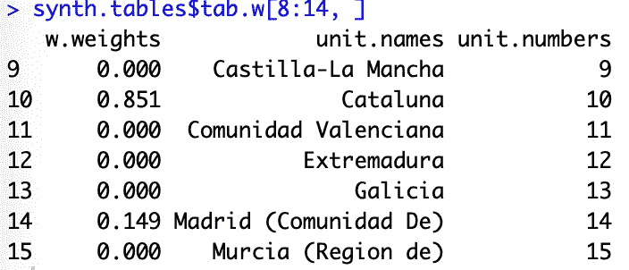

如图所示，第 10 号单位 Cataluna 对该案件的贡献为 85.1%，第 14 号单位 Madrid (Comunidad De)对其余的 14.9%做出了贡献。所有其他对照案例都没有贡献。

```
# plot the changes before and after the treatment 
path.plot(synth.res=synth.out,dataprep.res = dataprep.out, 
          Ylab="real per-capita gdp (1986 USD, thousand)",Xlab="year",
          Ylim = c(0,12),Legend = c("Basque country", 
                                    "synthetic Basque country"),
          Legend.position = "bottomright")
```

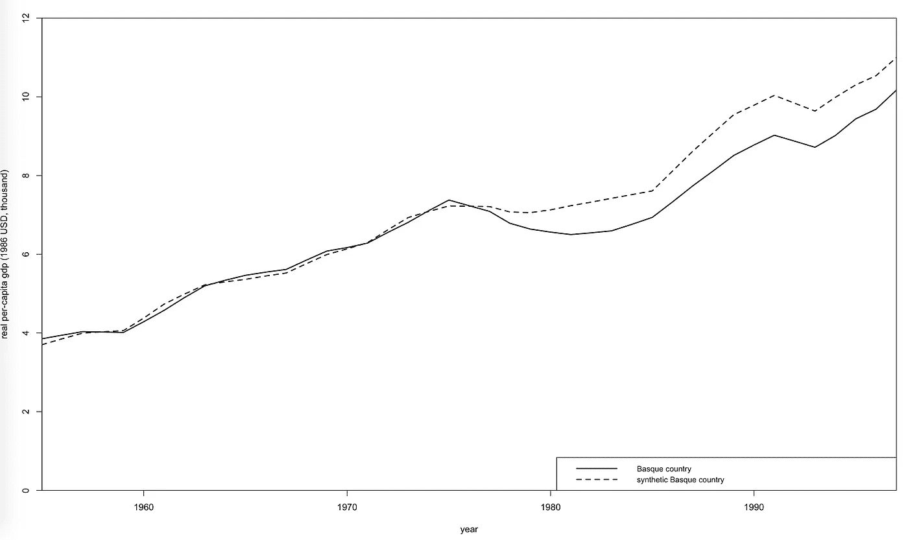

```
gaps.plot(synth.res = synth.out, dataprep.res = dataprep.out,
 Ylab = “gap in real per-capita GDP (1986 USD, thousand)”, Xlab= “year”,
 Ylim = c(-1.5,1.5), Main = NA)
```

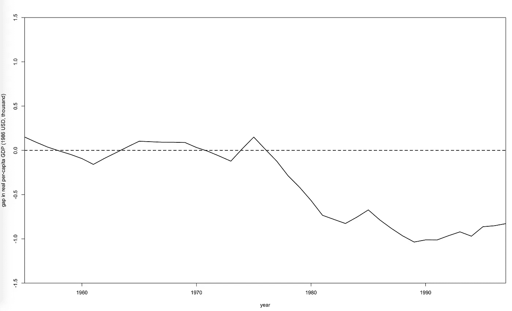

# 参考和更多资源

*   Synth:在比较案例研究中综合控制方法的 R 包
*   [包‘合成’](https://cran.r-project.org/web/packages/Synth/Synth.pdf)
*   [微合成:一个教程](https://cran.r-project.org/web/packages/microsynth/vignettes/introduction.html)
*   阿巴迪等人，2003 年。冲突的经济成本
*   [阿巴迪等人，2010 年。对比案例研究的综合控制方法](https://amstat.tandfonline.com/doi/abs/10.1198/jasa.2009.ap08746)
*   [阿巴迪等人 2015 年。比较政治学与综合控制方法](https://onlinelibrary.wiley.com/doi/abs/10.1111/ajps.12116)

*Medium 最近进化出了自己的* [*作家合伙人计划*](https://blog.medium.com/evolving-the-partner-program-2613708f9f3c) *，支持像我这样的普通作家。如果你还不是订户，通过下面的链接注册，我会收到一部分会员费。*

[](https://leihua-ye.medium.com/membership) [## 阅读叶雷华博士研究员(以及其他成千上万的媒体作家)的每一个故事

### 作为一个媒体会员，你的会员费的一部分会给你阅读的作家，你可以完全接触到每一个故事…

leihua-ye.medium.com](https://leihua-ye.medium.com/membership) 

# 延伸阅读:

[](/classifying-rare-events-using-five-machine-learning-techniques-fab464573233) [## 一个巨大的挑战:如何使用 5 种机器学习方法预测罕见事件

### 当结果变量高度不平衡时，哪种 ML 方法效果最好？有哪些权衡？

towardsdatascience.com](/classifying-rare-events-using-five-machine-learning-techniques-fab464573233) [](/beginners-guide-to-k-nearest-neighbors-in-r-from-zero-to-hero-d92cd4074bdb) [## R 中 K-最近邻初学者指南:从零到英雄

### 使用各种度量标准在 R 中构建 KNN 模型的管道

towardsdatascience.com](/beginners-guide-to-k-nearest-neighbors-in-r-from-zero-to-hero-d92cd4074bdb) [](/how-to-build-a-spam-classifier-using-decision-tree-b75d0c7f25e) [## 如何使用决策树构建垃圾邮件分类器

### 简单的方法是更好的方法！

towardsdatascience.com](/how-to-build-a-spam-classifier-using-decision-tree-b75d0c7f25e) 

# 喜欢读这本书吗？

> 请在 [LinkedIn](https://www.linkedin.com/in/leihuaye/) 和 [Youtube](https://www.youtube.com/channel/UCBBu2nqs6iZPyNSgMjXUGPg) 上找到我。
> 
> 还有，看看我其他关于人工智能和机器学习的帖子。