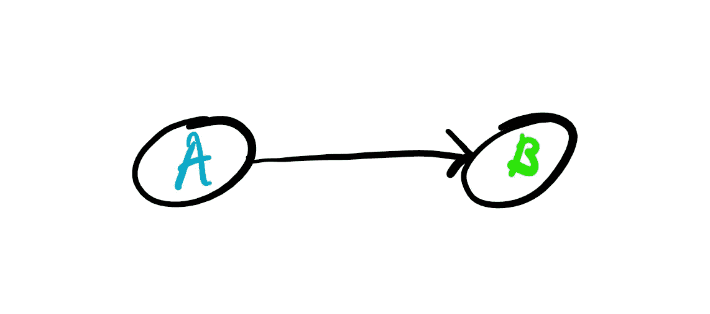

# 因果推理与统计推理

> 原文：<https://towardsdatascience.com/causal-vs-statistical-inference-3f2c3e617220?source=collection_archive---------3----------------------->

Photo by [Steinar Engeland](https://unsplash.com/@steinart?utm_source=medium&utm_medium=referral) on [Unsplash](https://unsplash.com?utm_source=medium&utm_medium=referral)

## 为什么说相关性不够，或者说相关性足够？这个问题困扰了科学界一个世纪。关于这个主题的机器学习观点。

近年来，因果推理，或一般的因果关系问题，受到了很多关注。问题很简单，相关性是否足以进行推断？我将陈述如下，更有见识的无知的人将会提出一个类似这样的论点:

> 因果关系就是非常强的相关性

如果这是你的意见，我不想打断你，但不，它不是，它肯定不是。我可以看到，这是相对容易说服，但一旦我们开始思考一点，我们很容易意识到它不是。如果你在读完这篇文章后仍然不相信，请联系我进一步讨论，因为我对你的想法很感兴趣。

为了说明相关性不一定意味着因果关系，让我们来看看最简单的相关性公式，或者著名的皮尔逊相关系数:

For those wondering what the Greek letters stand for, μ is the mean of the respective variable and σ is the standard deviation. The E in the numerator denotes expectation, which is effectively a weighted average over different X-Y realizations, where the weights are their probability.

所以这个相关系数在-1 到 1 的范围内，告诉我们变量是负相关还是正相关。换句话说，当一个高于平均值，而另一个同时高于或低于平均值时。这个相关系数是以著名数学家卡尔·皮尔逊的名字命名的，我们非常感谢他。人们认为他是现代统计学的创始人，他还在伦敦大学学院建立了世界上第一个大学统计系。谢谢你，皮尔逊教授。但有一件事他并不热衷，那就是因果关系的论证。

Photo by [Mike Enerio](https://unsplash.com/@mikeenerio?utm_source=medium&utm_medium=referral) on [Unsplash](https://unsplash.com?utm_source=medium&utm_medium=referral)

请注意，相关公式直接存在一个问题，即**没有方向感**。尽管两个变量可能高度相关，但我们并不真正知道什么导致了什么。举个例子，以天气为例。如果下雨，你肯定有云。很自然，你会问自己这个问题，是什么导致了这场雨。以云和雨的相关性为例，你会注意到正相关。不错，但那又怎样？你真的能说是云导致了雨而不是雨导致了云吗？不，你不能，不能基于这个简单的相关系数。也许你会注意到一件事，很明显，云出现在雨之前。然后你会意识到，但是等等，如果我把一个时间方面引入到我的变量中，并计算出滞后相关性，那么我会意识到是云导致了雨，而不是相反。这是真的，但这引出了我的下一个论点。

## 诺贝尔奖得主巧克力上瘾的问题

Photo by [Joanna Kosinska](https://unsplash.com/@joannakosinska?utm_source=medium&utm_medium=referral) on [Unsplash](https://unsplash.com?utm_source=medium&utm_medium=referral)

有一项著名的研究表明，一个国家的巧克力消费量和来自这个国家的诺贝尔奖获得者的数量之间有很强的相关性。所以你会说巧克力消费导致一个人成为诺贝尔奖得主的概率更高，马上开始疯狂消费巧克力吗？我希望不是，我怀疑期望巧克力不会导致一个人成为诺贝尔奖获得者是合理的。所以让我们从这个陈述中提取两个变量。b——成为诺贝尔奖获得者，A——消费巧克力。这一陈述的因果图基本上如下所示:

箭头的意思是 A 引起 b，你可以看到，这是一个非常原始的因果图。现在我们可以进入正题，虽然我们在巧克力消费和获得诺贝尔奖之间有很强的相关性，我们可以问自己，是否有其他一些变量，C，比如国家的财富导致了诺贝尔奖和巧克力消费，或者是国家的教育制度导致了两者等等。让我们想象，事实也确实如此，两者有一个共同的原因。那么因果图看起来是这样的:

现在我们可以提到赖兴巴赫的共因原理，该原理指出，如果变量 A 和 B 有一个共因 C，那么当我们以 C 为条件时，这些变量之间的相关性被消除，这意味着以共因为条件的随机变量的条件分布变得独立。够好了。实际上，我们应该关注的因果图如下:

这就是因果关系的全部，确定没有一个共同的原因使 A 和 B 看起来像是 A 导致 B。这种做法已经在医学界以医学试验的形式建立起来，远在人们开始谈论因果推断之前。那么我们如何证明这一点呢？首先，我们将用一个更通用、更有用的名字来称呼一项医学试验。我们称之为对照实验。受控实验很好，我们可以直接作用于一个变量，看看我们的因果图中其他变量是如何变化的。在一项医学试验中，我们将 1 组和 2 组人分成两组，1 组服用安慰剂，2 组服用实际药物，观察结果。自然地，在医学试验中，我们希望这些人来自相同的分布，即相似。实际上，理想情况下，我们希望它们是相同的，这将是完美的医学试验，将消除任何其他潜在的共同原因，但这是不现实的期望，一个完美的控制实验。现在你观察各组的结果，并在一定的信心基础上确定药物是否能有效治愈疾病。

用因果语言来说，这叫做**干预**。如果我们可以把一个变量手动设置为一个值，而不改变其他任何东西。这基本上是说，我们在使用安慰剂和药物之前，让同样的人服用两种药物，看看疾病是否被药物或其他东西治愈了。一般来说，人们发现很难区分干预和将事件实现的概率设置为 1。不同之处在于，干预会导致两种不同的因果图，我们可以根据这两种因果图计算概率，并得出关于图中实际因果结构的结论。

幸运的是，我们要感谢朱迪亚·珀尔教授发明了因果演算，为此他获得了著名的图灵奖，并可能作为现代因果推理的创始人而闻名。我建议阅读他关于因果关系的书籍，以便更深入地探究这个话题:

1.[为什么之书](https://amzn.to/2WIQ6UM)

2.[因果关系:模型、推理和推论](https://amzn.to/2Ikd8xl)

3.[统计学中的因果推断:初级读本](https://amzn.to/2IkdeVJ)

我个人认为，第一个对普通观众来说是好的，因为它也很好地展示了统计学和因果关系的历史，然后更深入地研究了因果推理背后的理论。

到目前为止，我们一直在谈论一些统计数据，但问题仍然是这如何实际反映在人工智能算法上，即机器学习算法。这种联系相当直接。我们目前使用的方法无法通过从数据中学习来区分因果，因为我们主要谈论的是机器学习和学习模型中的概率分布，这些模型基本上看到事情同时发生，并自动假设一个可以预测另一个。就个人而言，我无法想象这些模型能够或者将会安全地部署在现实世界中。特别是在这种情况下，如果我们想像 Schmidhueber 的人工科学家一样开发一些东西，我们需要能够区分因果和关于它们的原因。

Photo by [Josh Riemer](https://unsplash.com/@joshriemer?utm_source=medium&utm_medium=referral) on [Unsplash](https://unsplash.com?utm_source=medium&utm_medium=referral)

在科学中，我们需要不断地接受或拒绝假说来得出结论。这就是为什么因果推理不仅仅是好的，如果我们想要得到有效的结论，它是必要的。有无数的例子表明，由于不能正确使用统计数据，研究得出了错误的结论，如[这篇文章](https://bigthink.com/neurobonkers/believe-it-or-not-most-published-research-findings-are-probably-false)或[这篇文章](https://journals.plos.org/plosmedicine/article?id=10.1371/journal.pmed.0020124)所示。我相信这个领域将会在社会上引起一场科学复兴。作为这篇文章的一个收获，请记住以下您可能已经知道的内容:

> 相关性并不意味着因果关系

下次见！

Photo by [Volkan Olmez](https://unsplash.com/@volkanolmez?utm_source=medium&utm_medium=referral) on [Unsplash](https://unsplash.com?utm_source=medium&utm_medium=referral)