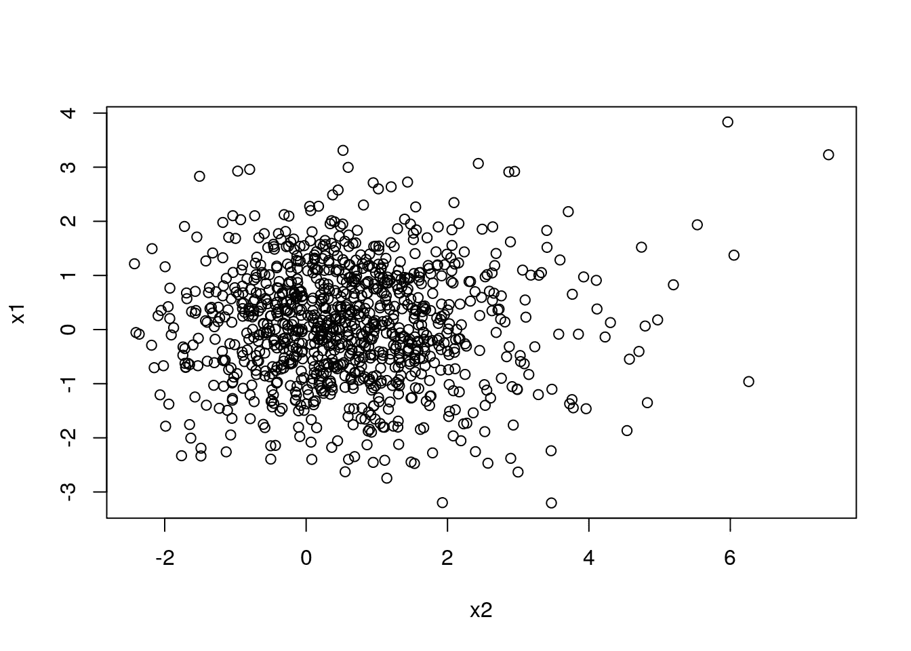
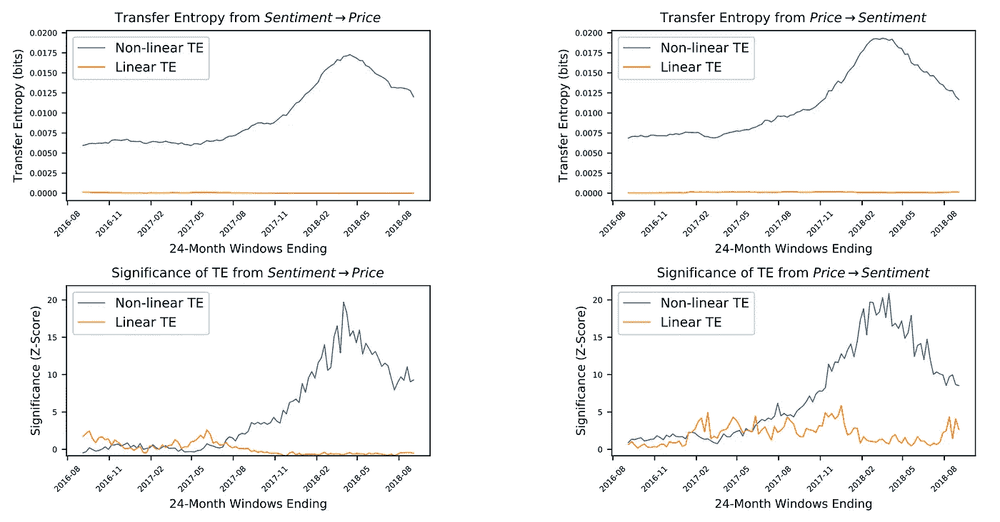

# 如何测量统计因果关系:金融应用的转移熵方法

> 原文：<https://towardsdatascience.com/causality-931372313a1c?source=collection_archive---------3----------------------->

## 用[开源](http://www.openquants.com/book)代码让你入门。


我们都听说过“相关性并不意味着因果关系”，但是我们如何量化因果关系呢？这是一项极其困难且经常误导的任务，尤其是当试图从观察数据中推断因果关系时，我们无法进行对照试验或 A/B 测试。


以图 4.1 中的二维系统为例。



Figure 4.1: Life is Random (or Nonlinear?)

乍一看，人们可能会说，随机变量 x₁和 x₂.之间没有明确的关系或因果关系然而，这个明显的随机系统呈现了由以下等式定义的非常简单的因果关系:

在 x₂和 x₁的关系中引入一个简单的非线性足以给系统带来复杂性，并潜在地误导一个天真的人。

幸运的是，我们可以利用统计学和信息论从观察数据中揭示复杂的因果关系(记住，这仍然是一项非常具有挑战性的任务)。

这一条的目标如下:

*   介绍基于预测的因果关系定义及其使用向量自回归公式的实现。
*   介绍因果关系的概率定义及其使用信息理论框架的实现。
*   用建议的方法模拟线性和非线性系统并揭示因果联系。
*   量化全球股票指数之间的信息流，进一步揭示哪些指数正在推动全球金融市场。
*   讨论进一步的应用，包括金融和密码市场中社交媒体情绪的影响。

作为我们[开源 Live Book Initiative](http://www.openquants.com/book) 的一部分，我们还提供代码来复制结果。

[](http://www.patreon.com/openquants)

# 统计因果关系的第一个定义

我们通过使用格兰杰(维纳 1956；Granger 1969)，其中，如果 Y 的未来实现可以使用 X 和 Y 的过去信息而不是单独使用 Y 来更好地解释，则信号 X 被认为是 Y 的格兰杰原因。


Economist [Clive Granger](https://en.wikipedia.org/wiki/Clive_Granger), who won the 2003 Nobel Prize in Economics.

格兰杰因果关系最常见的定义(**G-因果关系**)依赖于通过使用 X 和 Y 本身的过去值来预测变量 Y 的未来值。在那种形式中，如果 X 的使用提高了 Y 的预测，那么 X 被称为 **G-cause** Y。

在这两个模型中，函数 f₁(.)和 f₂(.)被选择来最小化损失函数的期望值。在大多数情况下，这些函数是用线性的，也可能是用非线性回归、神经网络等来检索的。g(.)是 l1 范数或 l2 范数。

我们现在可以在格兰杰因果概念下给出统计因果关系的第一个定义，如下所示:


标准格兰杰因果关系检验假设因果关系中的函数形式，并通过拟合自回归模型来实现(维纳 1956；格兰杰 1969)。

考虑线性向量自回归(VAR)方程:


其中 k 是考虑的滞后次数。或者，您可以选择适合该模型的 DL/SVM/RF/GLM 方法。

来自 Def。4.1，X 不 G-引起 Y 当且仅当 X 的预测误差在约束方程中。(4.1)和无限制回归模型方程。(4.2)是相等的(即，它们在统计上是不可区分的)。可以利用单向 ANOVA 测试来测试等式 1 和等式 2 的残差。(4.1)和(4.2)彼此显著不同。当测试一个以上的滞后 k 时，应应用多个假设测试的校正，例如错误发现率(FDR)或 Bonferroni 校正。

# 基于概率的定义

比 Def 更一般的定义。4.1 这不依赖于假设预测函数可以通过考虑条件概率来公式化。


净化 4.2 没有假定 X 和 y 之间耦合的任何函数形式。然而，它需要一种方法来评估它们的条件依赖性。在下一节中，我们将利用信息理论框架来实现这一目的。

# 转移熵和统计因果关系


Shannon, Claude. The concept of information entropy was introduced by Claude Shannon in his 1948 paper “A Mathematical Theory of Communication”.

为了计算 G-因果关系，我们使用转移熵的概念。自从它被提出(Schreiber 2000)以来，转移熵已经被认为是分析非线性系统因果关系的重要工具(Hlavackovaschindler 等人 2007)。它检测方向和动态信息(蒙塔尔托 2014 年)，而不采取任何特定的功能形式来描述系统之间的相互作用。


# 净信息流


人们可以把这个量解释为信息流主导方向的量度。换句话说，一个积极的结果表明，与其他方向相比，从 X 到 Y 的信息流占主导地位，或者类似地，它表明哪个系统提供了关于其他系统的更多预测信息(Michalowicz、Nichols 和 Bucholtz，2013 年)。

# 格兰杰因果关系与转移熵的联系

已经证明(Barnett，Barrett 和 Seth 2009)，如果所有过程都是联合高斯过程，那么线性 G-因果关系和转移熵是等价的。特别是，假设双变量情况下线性 G-因果关系的标准度量(L2-范数损失函数)如下:


可以证明以下几点(Barnett、Barrett 和 Seth 2009):


这个结果提供了转移熵和在标准 VAR 框架中实现的线性 G-因果关系之间的直接映射。因此，有可能估计一般形式的 te 和线性 G-因果关系的等价形式。

# 模拟系统上的信息流

在本节中，我们构建模拟系统，以因果方式耦合随机变量。然后，我们使用本文中研究的方法量化信息流。

我们首先假设一个线性系统，其中随机变量具有如下定义的线性关系:


我们用下面的代码模拟这个线性系统:

图 4.2 表示模拟线性系统的相关性。


Figure 4.2: Interactions between the variables of the simulated linear system.

我们首先定义一个函数，计算一个双变量的 G-因果关系的衡量标准，如等式。(4.4)如下:

我们使用 R 包**R 变换**中的函数`calc_te`和之前定义的函数`Linear.GC`来计算模拟变量之间的成对信息流，如下所示:

函数`FApply.Pairwise`是一个辅助函数，它简单地将给定函数`D.Func`应用于给定矩阵`X`中所有可能的列对，如下所示:

图 4.3 A)和 B)分别显示了系统变量之间的格兰杰因果关系和转移熵。单元格(x，y)表示从变量 y 到变量 x 的信息流。我们观察到格兰杰因果关系(线性)和转移熵(非线性)方法显示了类似的结果，即两种方法都类似地捕捉到了系统的依赖性。这一结果是预料之中的，因为系统是纯线性的，转移熵能够捕捉线性和非线性相互作用。


Fig. 4.3: Granger-Causality and Transfer Entropy for simulated linear system.

我们通过引入 x₁与变量 x₂和 x₅之间的非线性相互作用来定义第二个系统，如下:


我们用下面的代码模拟这个非线性系统:

图 4.5 表示模拟的非线性系统的相关性。


Figure 4.5: Interactions between the variables of the simulated nonlinear system.

我们计算模拟非线性系统的格兰杰因果关系和转移熵如下:

从图 4.6 A)和 B)中，我们观察到引入的非线性相互作用没有被格兰杰因果关系的线性公式所捕获。虽然所有的线性相互作用呈现相似的线性和非线性信息流，但是引入系统的两个非线性相互作用与线性公式相比呈现相对更高的非线性信息流。


Fig. 4.6: Granger-Causality and Transfer Entropy for simulated nonlinear system.

# 国际股票市场指数间的信息流

世界金融市场形成了一个复杂的动态网络，在这个网络中，各个市场相互影响。这种大量的相互作用会导致非常显著和意想不到的影响，因此准确理解世界各地的各种市场如何相互影响至关重要(Junior、Mullokandov 和 Kenett，2015)。

在这一节中，我们使用转移熵来识别国际股票市场指数之间的依赖关系。首先，我们选择一些[主要全球指数](https://finance.yahoo.com/world-indices/)进行分析，即标准普尔 500 指数、富时 100 指数、DAX 指数、泛欧 100 指数和 IBOVESPA 指数，它们分别跟踪以下市场:美国、英国、德国、欧洲和巴西。它们由以下代码定义:

```
tickers<-**c**("^GSPC", "^FTSE", "^GDAXI", "^N100", "^BVSP")
```

接下来，我们将加载所选指数的每日收盘调整价格的日志回报，如下所示(点击[此处](https://github.com/souzatharsis/open-quant-live-book/tree/master/data)可访问该数据集):

```
**library**(xts)
dataset<-**as.xts**(**read.zoo**('./data/global_indices_returns.csv',
                  header=TRUE,
                  index.column=1, sep=","))
**head**(dataset)##                        X.GSPC   X.FTSE  X.GDAXI   X.N100   X.BVSP
## 2000-01-02 19:00:00  0.000000       NA  0.00000  0.00000  0.00000
## 2000-01-03 19:00:00 -0.039099  0.00000 -0.02456 -0.04179 -0.06585
## 2000-01-04 19:00:00  0.001920 -0.01969 -0.01297 -0.02726  0.02455
## 2000-01-05 19:00:00  0.000955 -0.01366 -0.00418 -0.00842 -0.00853
## 2000-01-06 19:00:00  0.026730  0.00889  0.04618  0.02296  0.01246
## 2000-01-09 19:00:00  0.011128  0.01570  0.02109  0.01716  0.04279
```

一个市场对另一个市场的影响是动态的。这里，我们将考虑从 2014 年 1 月 1 日到 2019 年 8 月 19 日的时间段，并且我们将使用包 **IDPmisc** 中的函数`NARV.omit`忽略由于数据缺失而导致无效退货的日期，如下所示:

```
**library**(IDPmisc)
dataset.post.crisis <- **NaRV.omit**(**as.data.frame**(dataset["2014-01-01/"]))
```

我们将在考虑的所有索引中计算成对转移熵，并构建一个矩阵，使得位置(I，j)中的每个值将包含从 ticker[I]到 ticker[j]的转移熵，如下所示:

```
*# Calculate pairwise Transfer Entropy among global indices*
TE.matrix<-**FApply.Pairwise**(dataset.post.crisis, calc_ete)
**rownames**(TE.matrix)<-**colnames**(TE.matrix)<-tickers
```

图 4.8 显示了由此产生的传递熵矩阵。我们通过将传递熵值除以矩阵中的最大值来归一化传递熵值，使得所有值的范围从 0 到 1。我们观察到，所研究的国际指数在分析期间高度相关，从美国市场到英国市场(^GSPC -> ^FTSE).)的信息流最多第二大信息流的流向相反，即从英国市场流向美国市场。这是我们预期的结果，因为从历史上看，美国和英国市场是紧密相连的。


Figure 4.8: Normalized Transfer Entropy among international stock market indices.

我们还通过计算转移熵矩阵中每一行的转移熵之和来计算每个市场对系统中总转移熵的边际贡献，我们还对转移熵矩阵进行归一化，使得所有值的范围从 0 到 1:

```
TE.marginal<-**apply**(TE.matrix, 1, sum)
TE.marginal.norm<-TE.marginal/**sum**(TE.marginal)
**print**(TE.marginal.norm)##  ^GSPC  ^FTSE ^GDAXI  ^N100  ^BVSP 
##  0.346  0.215  0.187  0.117  0.135
```

我们观察到，在所研究的时间段内，美国是最有影响力的市场，占总转移熵的 34.6%，其次是英国和德国，分别占 21.4%和 18.6%。日本和巴西是影响力最小的市场，标准化转移熵分别为 11.7%和 13.4%。

留给读者的一个实验是建立一个利用国际市场信息流的每日交易策略。提出的论点是，人们可以通过押注市场指数的期货来建立一个有利可图的策略，这些指数从观察到意外回报/运动的市场接收大量信息流。

有关使用更广泛的一组指数的扩展分析，请参见(Junior、Mullokandov 和 Kenett，2015)。作者使用信息理论框架开发了国际股票市场指数网络。他们使用不同国家的 83 个股票市场指数，以及它们的单日滞后值，在考虑不同的操作时间的情况下，探索相关性和从一个股票指数到另一个股票指数的信息流。他们发现转移熵是量化指数之间信息流的有效方法，滞后一天的指数之间的高度信息流与它们之间的当天相关性相一致。

# 其他应用

## 量化社交媒体和股票市场之间的信息流

投资者的决策不仅受到公司基本面的影响，还受到个人信念、同行影响以及新闻和互联网信息的影响。理性和非理性投资者的行为及其与市场效率假说(Fama 1970)的关系在经济学和金融文献(Shleifer 2000)中有很大争议。然而，直到最近，来自在线系统的大量数据的可用性才为大规模调查金融市场中投资者的集体行为铺平了道路。

一篇研究论文( [Souza](http://www.souzatharsis.com) 和 Aste 2016)使用了本文研究的一些方法来揭示从社交媒体到股票市场的信息流，揭示了推文正通过非线性复杂的相互作用引起市场运动。作者提供的经验证据表明，社交媒体和股票市场之间存在非线性因果关系。他们利用了由与 DJIA 指数成分相关的社交媒体消息组成的大量数据集。通过使用信息理论的措施来应对社交媒体和股票市场之间可能的非线性因果关系，这项工作指出了关于线性耦合的结果中令人震惊的差异。得出两个主要结论:第一，社交媒体对股票收益的显著因果关系在大多数情况下是纯非线性的；第二，社交媒体主导了与股票市场的定向耦合，这种效应在线性模型中是观察不到的。在社会技术和金融系统的调查中，结果也作为模型充分性的经验指导。

图 4.9 显示了社交媒体和股票收益之间的显著因果关系，考虑了两种情况:非线性(转移熵)和线性 G-因果关系(线性 VAR 框架)。线性分析发现只有三只股票具有显著的因果关系:英特尔公司、耐克公司和华特迪士尼公司。非线性分析发现其他几只股票具有显著的因果关系。除了 3 只股票具有显著的线性因果关系外，其他 8 只股票呈现纯粹的非线性因果关系。


Figure 4.9: Demonstration that the causality between social media and stocks’ returns are mostly nonlinear. Linear causality test indicated that social media caused stock’s returns only for 3 stocks. Nonparametric analysis showed that almost 1/3 of the stocks rejected in the linear case have significant nonlinear causality. In the nonlinear case, Transfer Entropy was used to quantify causal inference between the systems with randomized permutations test for significance estimation. In the linear case, a standard linear G-causality test was performed with a F-test under a linear vector-autoregressive framework. A significant linear G-causality was accepted if its linear specification was not rejected by the BDS test. p-values are adjusted with the Bonferroni correction. Significance is given at p-value < 0.05.

在线性约束条件下获得的低水平因果关系与文献中类似研究的结果一致，其中发现股票回报显示出弱因果关系联系(Alanyali、Moat 和 Preis 2013、Antweiler 和 Frank (2004))和社交媒体情绪分析，至少在单独使用时，具有很小或没有预测能力(Ranco 2015)，并且没有关于大多数股票运动的重要提前期信息(Zheludev、Smith 和 Aste 2014)。相反，非线性分析的结果揭示了更高层次的因果关系，表明线性约束可能忽略了社交媒体和股票市场之间的关系。

总之，( [Souza](http://www.souzatharsis.com) 和 Aste 2016)是一个很好的例子，说明因果关系不仅复杂，而且会产生误导，从而进一步突出了选择用于量化因果关系的方法的重要性。

## 检测投资者情绪和加密货币价格之间的因果关系

在(Keskin 和 Aste 2019 年)中，作者使用本文中研究的信息论方法对社交媒体情绪和加密货币价格进行非线性因果检测。

使用这些技术对截至 2018 年 8 月的 48 个月期间的情绪和价格数据进行分析，对于四种主要的加密货币，即比特币(BTC)、ripple (XRP)、莱特币(LTC)和以太坊(ETH)，作者在每小时的时间尺度上检测到情绪到价格和价格到情绪的重要信息转移。这项工作报告了非线性因果关系的规模比线性因果关系大一个数量级。

信息论研究在 BTC、长期资本成本和 XRP 发现了显著的非线性因果关系，在多个时间尺度上，在情绪对价格和价格对情绪两个方向上都是如此。对 BTC 和 LTC 的影响最强且最一致。图 4.10 显示了 BTC 情绪和 BTC 价格之间的转移熵结果。



Figure 4.10: Evidence that BTC sentiment and price are causally coupled in both directions in a non-linear way. Non-linear TE is calculated by multidimensional histograms with 6 quantile bins per dimension. Z-scores, calculated over 50 shuffles, show a high level of significance, especially during 2017 and 2018, in both directions.

本文的所有分析都是使用 Python 包(PyCausality)进行的，该包可从 https://github.com/ZacKeskin/PyCausality 的[获得。](https://github.com/ZacKeskin/PyCausality)

# 结论

理清因果关系可能极其困难。然而，统计工具可以帮助我们区分相关性和因果性。

在本文中，我们介绍了格兰杰因果关系的概念及其在线性向量自回归框架中的传统实现。然后，我们定义了信息论措施，以量化转移熵作为一种方法来估计非线性系统中的统计因果关系。

我们模拟了线性和非线性系统，进一步表明传统的线性 G-因果方法未能检测到系统中引入的简单非线性，而转移熵成功地检测到了这种关系。

最后，我们展示了如何转移熵可以用来量化全球股票指数之间的关系。我们还讨论了文献中的进一步应用，其中信息理论测量被用于量化投资者情绪和股票和密码市场运动之间的因果关系。

我们希望你喜欢这个偶然的因果旅程，并记住:负责任地量化因果关系。

[](http://www.patreon.com/openquants)