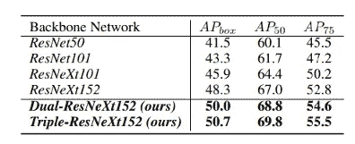
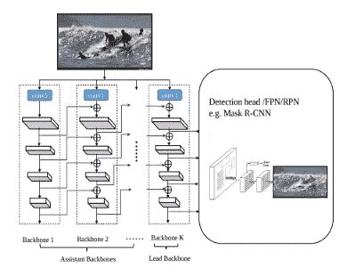
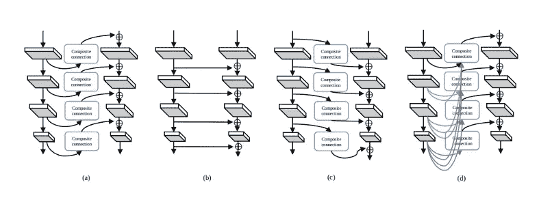
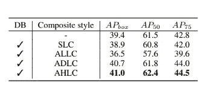
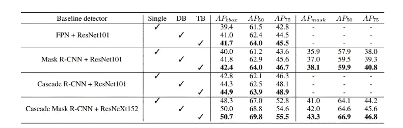

# CBNet:一种用于目标检测的新型复合主干网络体系结构综述

> 原文：<https://towardsdatascience.com/cbnet-a-novel-composite-backbone-network-architecture-for-object-detection-review-ec98e8b7bc9b?source=collection_archive---------40----------------------->

截至目前，在 COCO 数据集上表现最好的对象检测网络是 CBNet，在 COCO 测试数据集上的平均精度为 53.3。

作者声称，结合更强大的主干可以提高对象检测器的性能。为此，他们提出了一种新的策略，通过相邻主链之间的复合连接来组装多个相同的主链。通过这样做，他们提出了一种更强大的主干网，称为复合主干网。

如上图所示，CBNet 由多个相同的主干网和相邻主干网之间的复合连接组成。从左至右，输出的每一个阶段，在一个助理骨干，这也可以被视为更高层次的功能。每个功能级别的输出通过复合连接作为输入的一部分流向后续主干的并行级。通过这样做，多个高级和低级特征被融合以生成更丰富的特征表示。

文章介绍了两种架构:**双主干网(DB)** 和**三主干网(TB)** 。从命名上可以猜到，DB 由两条相同的主链组成，TB 由三条相同的主链组成。性能差异将在本文稍后讨论。

为了合成来自主干的多路输出，本文引入了一个**复合连接**模块。该模块由一个 1x1 卷积和一个批处理归一化层组成。添加这些层是为了减少通道数量并执行上采样操作。

最终的主干(图中最右边的)被称为引导主干，用于对象检测。来自引导主干的输出特征被馈送到 RPN/检测头，而每个辅助主干的输出被馈送到其相邻主干。

# 复合样式

还有四种复合风格。

*   **相邻的较高级别组合**是前面章节中解释的风格。使用复合连接块将来自辅助主干的每个输出特征馈入相邻主干。
*   **同级别合成**是另一种简单的合成风格，它将前一个主干的相邻低级别阶段的输出反馈给后一个主干。如图所示，这种风格没有使用复合连接块。较低级别的主干中的特征会直接添加到相邻的主干中。
*   **相邻的低层成分**与 AHLC 非常相似。唯一的区别是，来自前一个主干的较低级阶段的特征被传递到随后的主干。
*   **密集的更高层次构图**的灵感来自 DenseNet 纸，其中每一层都连接到所有后续层，以在一个阶段中建立密集的连接。

上表是不同构图风格的对比。我们可以观察到 AHLC 风格优于其他复合风格。这背后的原因在论文中有很好的解释。作者声称，直接将前一个主干的较低级特征添加到后一个主干的较高级特征会损害后一个特征的语义信息。另一方面，将前一主干的较深特征添加到后一主干的较浅特征，增强了后一特征的语义信息。

# 结果

上表显示了在 MS-COCO 测试数据集上的检测结果。第 5–7 列显示对象检测结果，而第 8–10 列显示实例分割结果。它清楚地表明，利用更多的主干架构可以提升网络的性能。

# 结论

本文提出了一种新的体系结构，称为 CBNet。通过组成多个主干架构，所提出的网络将检测网络的准确度提高了约 1.5%至 3%。

值得进一步检查增加的参数大小和训练时间。

# 参考

 [## CBNet:一种用于目标检测的新型复合骨干网络体系结构

### 在现有的基于 CNN 的检测器中，主干网络是基本特征提取的一个非常重要的组成部分。

arxiv.org](https://arxiv.org/abs/1909.03625)  [## COCO 测试开发中用于对象检测的最先进的工作台

### 82 种方法的性能比较。

paperswithcode.com](https://paperswithcode.com/sota/object-detection-on-coco)