# 用 Keras 进行 CelebA 属性预测和聚类

> 原文：<https://towardsdatascience.com/celeba-attribute-prediction-and-clustering-with-keras-3d148063098d?source=collection_archive---------11----------------------->

## 关于如何使用高效的基于 MobileNetV2 的模型检测和聚类多达 40 个面部属性的完整指南。

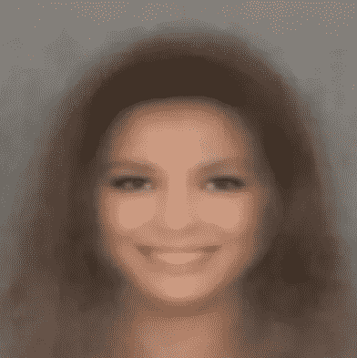

A synthetic face obtained from images of young smiling brown-haired women

在本文中，我们讨论面部属性预测。我们将检查数据集并指出它的弱点。此外，我们将构建和训练一个深度模型，并最终讨论总体结果。

# 介绍

**面部属性预测**是一项关于推断面部属性集的计算机视觉(CV)任务。示例属性有*头发的颜色*、*发型*、*年龄*、*性别*等。

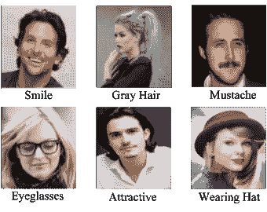

Some facial Attributes. [Source](https://www.groundai.com/project/multi-task-learning-of-cascaded-cnn-for-facial-attribute-classification/).

一般来说，面部属性预测是一项具有挑战性的任务:它首先涉及面部定位，然后是属性预测。此外，人脸由于其复杂的外观而固有地难以分析。通过**面部变化**，面部的外观可以被改变，变得更加复杂。面部变化最常见的形式如下:

*   **遮挡:** *发型*、*妆容*、*眼镜*(尤其是太阳镜)、*帽子*等种类的*物体*可以隐藏模型检测人脸及其属性所需的有意义的像素。在极度遮挡的情况下，模型可能根本无法定位人脸！
*   **光照:**极端*闪电*或极端*阴影*会让检测算法的工作变得更加困难(如果不是不可能的话)，就像遮挡一样。
*   **表情:** *情绪*可以改变一张脸正常出现的方式。如果检测系统在训练期间从未见过受情绪影响的人脸，它可能无法正确检测到它们。
*   **姿态:**根据*滚动* (x 轴)*偏转* (z 轴)e *俯仰* (y 轴)的高度旋转最终可以改变人脸的外观，并隐藏其面部特征。

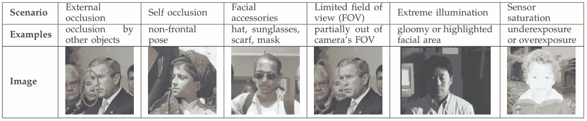

Examples of challenging face variations.

因此，卷积模型在困难的人脸样本上进行训练非常重要，以便很好地推广到在野外捕获的*人脸*(在任何条件下捕获的人脸)。

面部属性预测不仅是一项学术挑战，也是改进现有应用的一种方法。例如，照片应用程序可以检测“微笑”属性，以便在给定的序列中确定哪张照片是最好的。

# 数据探索

一个很好的、广泛的、多样化的数据集是 [**CelebA 数据集**](http://mmlab.ie.cuhk.edu.hk/projects/CelebA.html) **。**它是一个大规模的人脸属性数据集，拥有超过 **20 万张**名人图片，涵盖了大量的变化，每张图片都有 **40 个属性**标注。

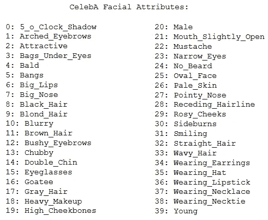

The complete list of facial attributes provided by CelebA.

所以，首先要做的是下载数据集。通过在终端中执行以下代码，可以在或 Kaggle 上找到[:](http://mmlab.ie.cuhk.edu.hk/projects/CelebA.html)

```
# install kaggle first: 
$> **pip install kaggle**# set your Kaggle API key:
**os.**environ['**KAGGLE_USERNAME**'] = "YOUR_USERNAME"                       **os.**environ['**KAGGLE_KEY**'] = "YOUR_API_KEY"# then download: 
$> **kaggle datasets download -d jessicali9530/celeba-dataset**
```

下载并**解压**之后，我们可以将它加载到我们的 Python 环境或 Jupyter 笔记本中。为此，我准备了完成所有枯燥工作的`CelebA`类，将数据集加载到一个漂亮的熊猫`DataFrame`:

现在，**加载**数据集(我假设它的路径是`celeba-dataset\`)并最终选择面部属性的子集是小菜一碟。在示例代码中，我们删除了三个特性。

```
# load the dataset with 37 out of 40 features:
celeba = **CelebA**(drop_features=**[**
    '**Attractive**',
    '**Pale_Skin**',
    '**Blurry**',
**]**)
```

之后，我们可以展示一些随机样本来理解`celeba`数据帧的结构。

```
# shows five random samples
celeba.attributes.**sample**(5)
```

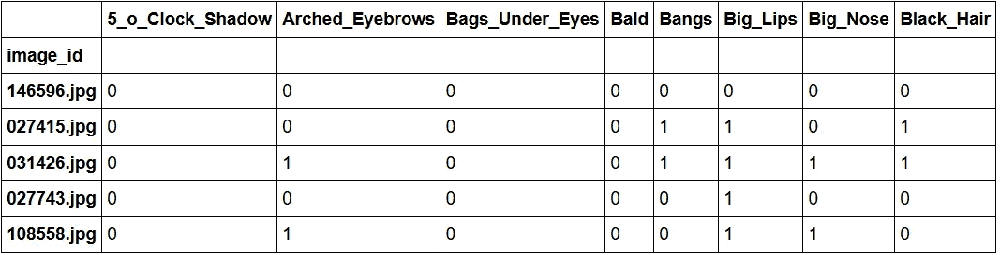

Random samples. Every attribute is binary: 0 means absent, 1 means present.

现在我们知道每个例子都关联到一个二进制标签的**向量，其中每个属性可以是 **0** 或 **1** 。因此，知道一个属性属于多少个面是非常有用的(我省略了这一点，但是数据集的每个图像都描绘了一个面)。通过统计某个属性出现 1 的次数，就可以计算出它的**绝对频率**(甚至是 ***相对频率*** 除以样本总数)。**

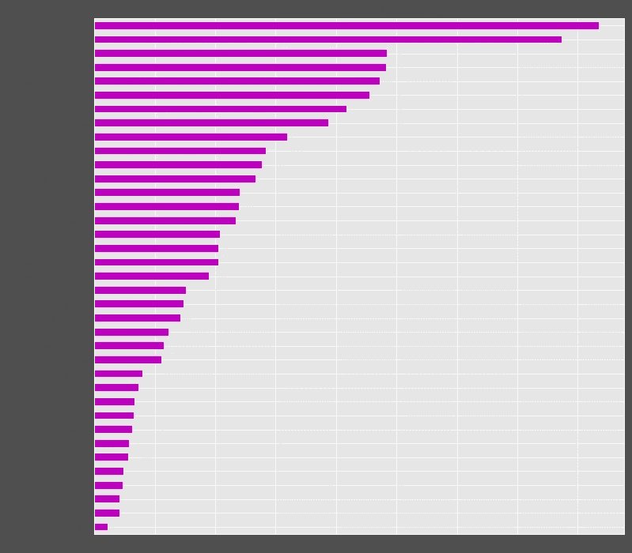

The relative frequency of every attribute.

在这里，我们可以清楚地观察到一个**数据不平衡问题**。面部属性的频率变化很大，而不是彼此大致相等。出现频率在 10%以下的有**稀有属性** ( `Bald`、`Mustache`、`Double_Chin`等)，出现频率在 70%以上的有几个非常**常见属性** ( `No_Beard`、`Young`)。

> 这展示了另一个问题:数据集对年轻人和没有胡子的人有偏见。

当数据不平衡时，模型很容易**过拟合**数据点。在这种情况下，它可以学习对每个常见属性总是输出一个 **1** ，对稀有属性总是输出一个 **0** :模型发现这个策略(预测 0 和 1)是好的(这是不成立的，因为它不学习模式)。按照这种方式，模型的输出预测将看起来像`[1, 0, ..., 0, 1]`向量，对每张图像都一样。

> 如果发生这种情况，产生的模型是相当愚蠢的:它只会浪费计算资源，因为它可以被简单的代码(例如，随机猜测，或一个常量值)所取代。

好消息是，可以通过使用适当的损失函数来缓解这个问题(下一节将详细介绍)。

最后，上图展示了一些摄自 CelebA 的图片:

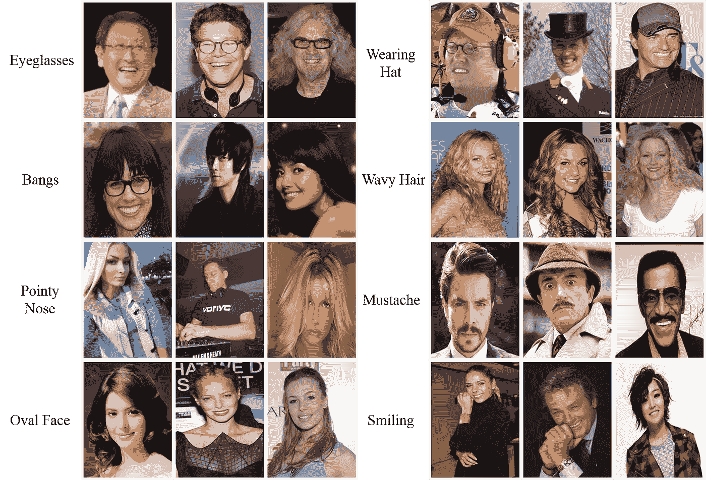

Source: [CelebA](http://mmlab.ie.cuhk.edu.hk/projects/CelebA.html).

# 模型

我们将要构建的模型主要基于 MobileNetV2 架构，基本上是相同的模型，但是没有顶级分类层(MobileNetV2 构建为输出 1000 个类别概率)。

首先，该模型一次获取一个图像(3 个通道，大小为 224×224)作为**输入**，并输出一个大小为 *n* 的概率向量(通常，大小根据您想要检测的属性的多少而变化)。向量的第 *i* 个元素是一个介于 **0** (属性 *i* 不存在)和 **1** (属性 *i* 存在)之间的实数。

> 请注意，输出向量可以包含多个非零元素，这意味着多个属性可以属于一个面。

## 模型架构

为了定义模型架构，我们必须加载没有顶层的 **MobileNetV2** 架构，将输入大小设置为 224×224，并添加新的顶层。以下代码实现了所有需要的操作:

然后，要创建模型并显示其摘要(层、参数数量等)，请运行以下代码:

```
model = **build_model**(num_features=**celeba.num_features**)
model.summary()
```

如您所见，创建模型很简单。在这里，我们将回顾新添加的顶层:

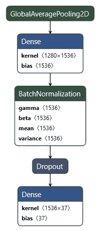

The model’s top layers. Image created with [Netron](https://github.com/lutzroeder/netron).

*   **globaveragepool2d:**使用内核 big 作为最后卷积层的内核来产生 1×1 特征图。因此，如果最后的卷积层输出 *n* 个特征图，每个都是宽 *w* 和高 *h* ，全局*平均池层将对每个特征图应用一个核( *w* ， *h* ，以获得 *n* **置信度得分**。当核与特征图一样大时，结果是一个标量，或者等价地，一个 1×1 的特征图。这样做可以减少全连接(密集)层的数量(通常至少为 2 层，由于 GlobalAveragePooling，只需要一层)，从而减少参数数量、训练时间和加速推理。GlobalAveragePooling 层是 GoogleLeNet 模型的关键创新之一。*

> 请注意，如果没有 GlobalAveragePooling 图层，则需要一个展平图层。展平(w，h，n)要素地图会生成一个具有 w×h×n 个单位的图层，而不是通过应用全局平均池生成的 n 个单位(因此，参数的数量要少得多)。

*   **密集:**之后，我们使用一个激活了 1536 个单元 **ReLU** 的密集层，来执行置信度得分的非线性组合(这增加了模型的容量及其辨别能力)。
*   **BatchNormalization:** 模型基于非常深的架构，有几百层。为了加速训练并减少渐变消失或爆炸的机会，我们应用批量归一化，即 ***归一化*** 、 ***缩放*** 、 ***在应用激活函数之前移动*** 输入。批处理规范化通过学习四个附加参数来实现这一点。在某些情况下，批处理规范化具有正则化效果。
*   **退出:**根据一个概率 *p* 在训练中随机停用单位。以这种方式，一个神经元(单元)较少依赖于它的相邻单元。这迫使模型更好地概括。此外，dropout 可以被视为一种简单有效(但近似)的方法来训练许多神经网络的集合:在每次迭代中，不同的神经元被停用，从而产生不同的网络。当训练结束时，得到的网络大致表现为对训练期间获得的所有不同网络进行平均。
*   **密集:**这是网络的**输出层**。这里我们使用 **sigmoid** 作为激活函数，因为它允许具有不互斥的类(属性)(对于 softmax 层，只有一个输出元素可以是 1)，更重要的是，直接估计每个属性的概率。

最后，该模型创建起来非常简单，甚至很小:它只有 4.3M 的参数，重量轻，速度快，也适合移动和网络应用。

# 培养

有时，训练神经网络来解决给定数据集的某个任务，可以被视为试图使网络**符合生成数据集和真实世界数据的真实底层概率分布**(数据集只是整个数据的一部分)。通常，真实的概率分布是未知的，并且由于在训练期间使用了数据集，因此只能**部分估计**。

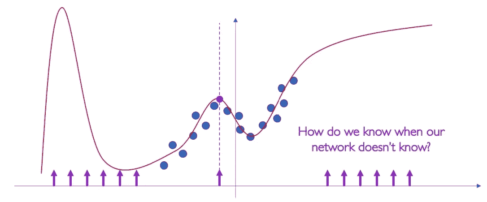

Trying to capture the data distribution through training-data. [Source](http://introtodeeplearning.com/materials/2019_6S191_L6.pdf).

训练数据的数量直接影响我们试图训练的网络的泛化能力。简而言之，**泛化误差**随着训练数据量的增加而下降。

坏消息是，通常，训练数据不能捕获整个概率分布，因为不可能有覆盖分布的特定情况的例子。

实际上，我们可以做的是稍微“**编辑**”训练数据，以便有意引入一些变化(例如，旋转、移位……)—我们假设真实世界的数据可能会有这样的变化。

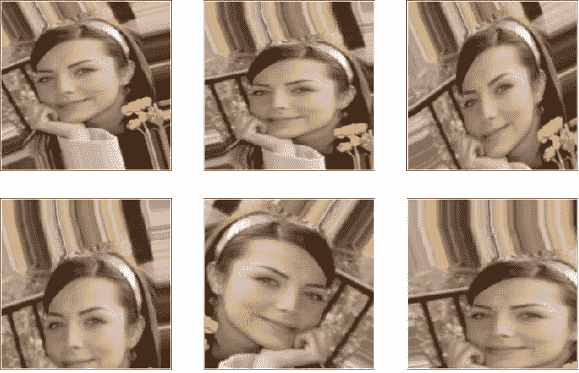

Example of image augmentations.

## 数据扩充

**数据扩充**的实践是增加训练集规模的有效方法。增加训练示例允许网络在训练期间“看到”更多样化但仍有代表性的数据点。

下面的代码为训练集定义了一组扩展:*旋转*、*移动*、*剪切*、*翻转*和*缩放*。

> 请注意，验证集和测试集都不能增加。

然后我们定义两个数据生成器:一个用于训练数据，另一个用于验证数据。

当我们处理不适合内存的大数据集时，我们必须找到一种方法只加载实际需要的数据。

一个**数据生成器**能够直接从源文件夹中加载所需数量的数据(一个小批量的图像)，将它们转换成*训练数据*(馈送给模型)和*训练目标*(一个属性向量——监督信号)。

> 对于我的实验，我通常设置`batch_size = 80`。一般来说，介于 64 和 128 之间的值应该可以。通常，您希望根据计算资源和模型性能来增加/减少批量大小。

## 优化器、损失函数和指标

此时，我们选择具有默认值的`adadelta`优化器(adam 优化器也很好，但它的性能似乎稍差一些):与 adam 一样，adadelta 是一个几乎不需要调整的优化器，因为它能够**自动调整学习速率**(当出现问题时速度会变慢，或者朝着有希望的方向移动得更快)。

下一步，选择**损失函数:**负责监控模型的性能并指导优化过程。

我发现一个**好的**属性预测任务的损失函数，是一个能够区分属性向量的单个元素的函数，而不是将整个向量视为单个对象。我的意思是损耗一定要明白，向量`[0, 1, 1, 0]`和这个向量`[1, 0, 0, 1]`差很多(损耗要高)；有意义的是 1 和 0 的**数量**，以及输入向量中单个元素的**精确位置**。

像平均绝对误差(MAE)、均方误差(MSE)或均方根误差(RMSE)这样的损失函数不能进行这种区分:直觉上，它们只是对向量上的 1 进行计数，并对它们求平均值，因此丢失了关于位置的信息。

相反，像**二元交叉熵**和**余弦接近度**这样的损失函数是理想的选择**。从经验上看，后者似乎表现稍好。**

最后一步，是选择我们的目标绩效指标。在这种情况下，我们关心的是最大化模型预测的二进制精度。

最后，我们可以**编译**我们的模型:

```
model**.compile**(loss='**cosine_proximity**',
              optimizer='**adadelta',
**              metrics='**binary_accuracy**')
```

## 适合的

在训练之前，模型有助于定义一个或多个**回调**。挺好用的一个，有:`ModelCheckpoint`和`EarlyStopping`。

*   **ModelCheckpoint:** 当训练需要大量时间来达到一个好的结果时，通常需要多次迭代(或者一些代价高昂的迭代)。在这种情况下，最好只在改进度量的时期结束时保存最佳执行模型的**副本**。
*   **提前停止:**有时，在训练期间，我们可以注意到**泛化差距**(即训练和验证误差之间的差异)开始增加，而不是减少。这是**过拟合**的症状，可以用很多方法解决(*减少模型容量*、*增加训练数据*、*数据增加*、*正则化*、*退出*等)。通常，一个实用有效的解决方案是当泛化差距越来越大时**停止训练**。

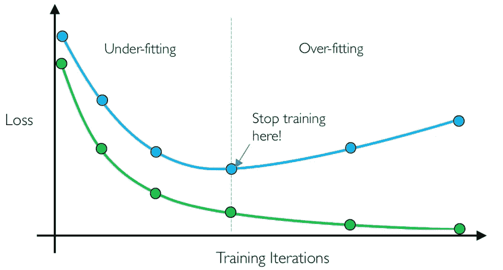

**Early stopping**. [Source](http://introtodeeplearning.com/materials/2019_6S191_L1.pdf).

实际上，我只使用了 ModelCheckpoint 回调，因为不需要使用提前停止。无论如何，如果您想通过改变模型架构、超参数、损失和优化器来玩游戏，建议使用早期停止。

下面的代码将开始训练，将拟合信息收集到提供两条学习曲线的`history`变量中:一条是损失曲线，另一条是准确度曲线；两者都可以被绘制出来。

通常我把`num_epochs`设置在 **10** 和 **20** 之间。注意，该模型在前两个时期达到大约 89%的准确度。但是需要更长的训练来保持在大约 91%的精确度(至少这是我得到的最大精确度)。

> 注意:每个**历元**花费大约 **40 分钟来完成**(在 Google Colab GPU 上)。

## 估价

为了评估数据集的**测试分区**上的模型，我们必须设置测试数据生成器，并让模型对每个测试数据进行预测:

我得到的测试精度大约是 **90.95%** 。具体而言，每个面部属性以以下准确度被检测:

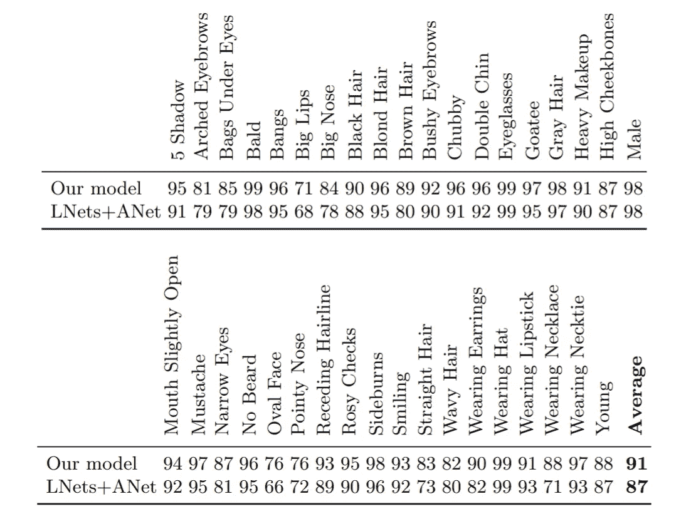

Accuracy of each facial attribute. The model presented here is compared to a SOTA approach, which uses a combination of two kind of networks: LNet and ANet (more details [here](https://openaccess.thecvf.com/content_iccv_2015/papers/Liu_Deep_Learning_Face_ICCV_2015_paper.pdf)).

# 聚类和结果

一旦我们有了一个工作模型，我们就可以做类似**集群**这样的事情。对于此任务，聚类的目标是将图像分组为聚类，其中每个聚类在其包含的图像中共享最大可能数量的面部属性。

换句话说，我们希望对面部属性相似的图像进行分组，比如有一个 ***金发女郎群******戴着帽子和眼镜的家伙*** 等。

例如，如果我们要对以下十个属性进行聚类:

```
'Wearing_Lipstick'
'Smiling'
'No_Beard'             
'Heavy_Makeup'
'Bald'
'Male'           
'Young'
'Eyeglasses'
'Blond_Hair'
'Wearing_Hat'
```

我们可能会得到这些集群:

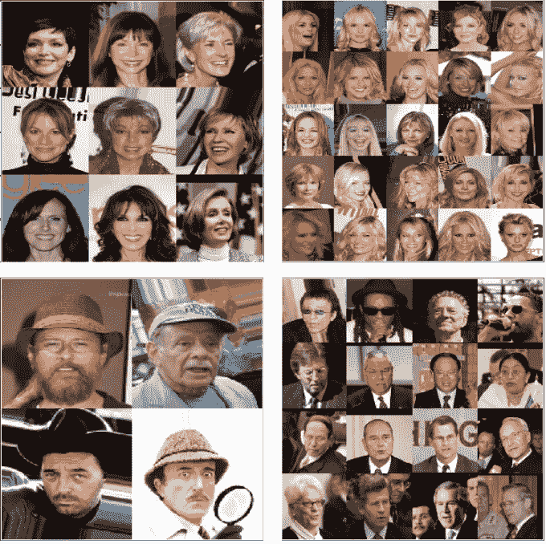

**Top left: “**smiling” cluster. **Top right:** “blonde” cluster. **Bottom left:** “hat” cluster. **Bottom right:** “eyeglasses” cluster.

在这里，我们可以看到每个聚类在我们选择的属性中捕获了一个或多个面部属性。

> 注意:以上聚类是通过对模型的预测运行标准聚类算法(如 K-Means)获得的。

为了更好地理解集群捕获的属性，我们可以**总结**它，并观察集群的总结。

一个聚类可以通过提取其*【区别特征】*来概括。这可以通过计算描述集群的主成分(例如使用 PCA)来完成。在这种情况下，我们有脸的集群，所以我们可以尝试计算每个集群的**特征脸**，看看它看起来像什么…

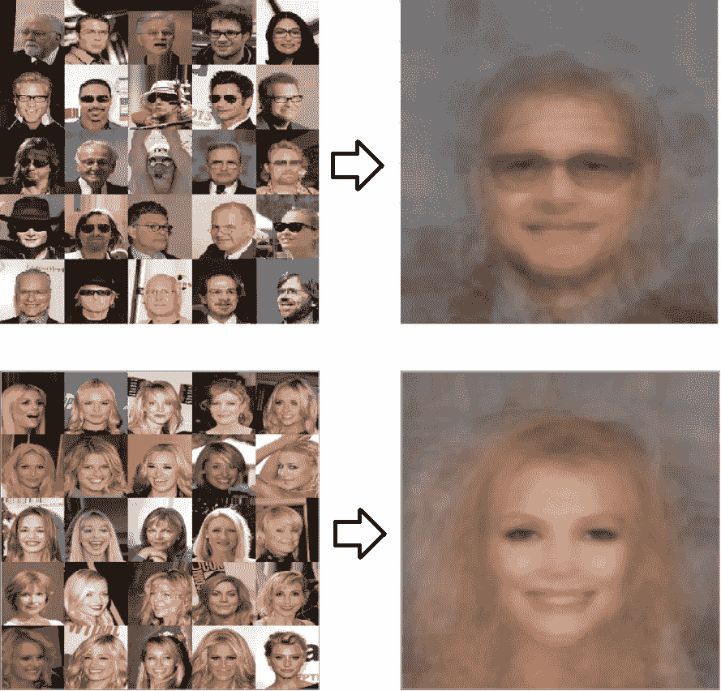

**Left:** clusters. **Right:** eigenfaces of the corresponding clusters.

令人惊讶的是，一个聚类的特征脸能够通过产生一个**合成脸**(不属于该聚类)来概括整个聚类，该合成脸的面部属性是该聚类所捕获的。

这样，我们就能一眼看出一组图像中有哪些**突出的面部属性**，分组到同一个聚类中。

# 结论

总之，像 MobileNetV2(或 Inception 和 Resnet 模型)这样设计良好的通用模型，使得构建有效的特定于任务的模型成为可能。

为了理解数据集的结构、数据和最终的缺陷，分析数据集并观察它的一些样本总是一个好的做法。

属性预测是一项可以改进许多现有应用和领域(例如，安全、摄影等)的任务。

我省略了关于集群的代码，因为它有点长且复杂。无论如何，你可以在这个[仓库](https://github.com/Luca96/face-clustering)找到所有的代码。

我推荐使用 Jupyter 笔记本版本的代码进行实验。

希望你喜欢它，并感谢阅读它！

# 参考

*   面部属性预测和聚类的迁移学习。*智慧城市与信息化国际会议*。2019 年，新加坡施普林格。
*   刘，，等，“野外深度学习人脸属性”IEEE 计算机视觉国际会议论文集*。2015.*
*   [麻省理工 6。S191:深度学习介绍](https://www.google.com/url?sa=t&rct=j&q=&esrc=s&source=web&cd=2&cad=rja&uact=8&ved=2ahUKEwil44qR4rLkAhXBzaQKHUcRAuUQFjABegQIARAB&url=http%3A%2F%2Fintrotodeeplearning.com%2F&usg=AOvVaw0pc46QlF-SLjGePsq0gDPA)
*   古德菲勒、伊恩、约舒阿·本吉奥和亚伦·库维尔。*深度学习*。麻省理工学院出版社，2016 年。
*   克里斯蒂安·塞格迪等着《用回旋深化》IEEE 计算机视觉和模式识别会议论文集。2015.