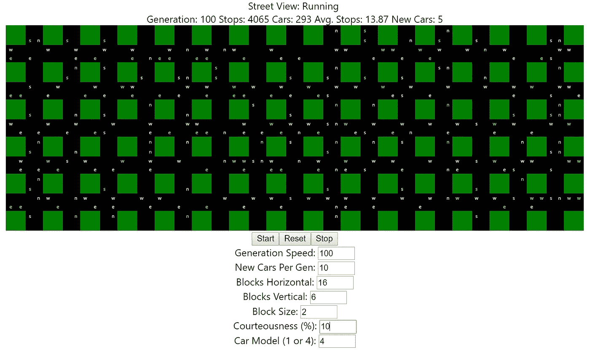

# 细胞自动机和无人驾驶汽车

> 原文：<https://towardsdatascience.com/cellular-automata-and-driverless-cars-aa461ca14814?source=collection_archive---------25----------------------->

## 自组织网络、物联网、机器学习和火车

## 介绍

本文以一个简单的思维实验开始:如果所有的汽车都是无人驾驶的，我们还需要红绿灯吗？

在这种情况下，我指的是专门的无人驾驶汽车，而不是仍然需要人类驾驶的自动驾驶汽车。也许是语义上的差异，但在本文的其余部分，它们将被称为无人驾驶汽车。

很明显，从每个主要技术和汽车制造商投入的多年努力和数十亿美元的 R&D 来看，目标是最终将人类从驾驶等式中移除。所以，当我们最终到达那里时，一些令人困惑的问题出现了:

1.  一个 100%无人驾驶汽车的系统本质上不会是下一代火车(就像很好的机车类型的火车)网络吗？尽管现在铁轨是公路，火车是实时联网的汽车。
2.  机器学习和深度神经网络等复杂的过渡技术将会发生什么，这些技术被训练成在人类水平上驾驶(坏主意！)与实际的人类驾驶进行交互(即，在仍然允许人类驾驶员的“过渡期”期间)？一旦所有汽车都实现无人驾驶和联网，我们就不需要所有这些了——我们只需要确保汽车保持在轨道上，不会相互碰撞。那我们在做什么？

## 火车，第一辆无人驾驶汽车

让我们坐上时光机，回到过去，想象一下，如果轨道交通取代了免费的汽车，某种轨道技术形成了我们现在所知的当地街道，以及后来的城镇和城市。这很容易发生——迪斯尼设想未来的交通是单轨铁路。它可能不是真正的轨道，也可能是线控技术。我们所有的街道都可能是用简单的线路“铺设”的，或者街道涂料可能具有某种电磁特性。我们将拥有自动驾驶汽车专家声称的所有好处——减少事故，更好地利用驾驶员(现在是乘客)的时间，等等。

但是，唉，这并没有发生！现在我们有失控的青少年开着 100 英里的时速，一边喝着啤酒一边给他们的朋友发短信。因此，让我们回到时间机器中，随着汽车向 100%无人驾驶(完全没有人类驾驶)的发展，向前迈进，想象一下实现这一目标将会使用或需要的技术(或许更有趣的是，可能不会使用的技术)。

如果火车挂钩，即防止火车车厢相互碰撞并保持最佳间距的连接器，被某种自组织算法取代，该算法在每辆无人驾驶汽车内部和之间运行，会怎么样？每辆车可以与附近的所有其他车进行通信，他们可以就如何最佳地前进达成有组织的共识。例如，每一个都可以用细胞自动机启发的算法来操作，这将在后面描述。今天，我们已经有了能“感知”何时与另一辆车靠得太近，甚至能自动平行泊车的汽车。这些可以被视为这些算法的早期版本，为火车挂钩提供了虚拟的替代品。

接下来，为了增强这些“计算机感官”(接下来将详细描述)，我们看到了物联网(IoT)的最终成果。街道铺设了可以感知的技术，以及与交通有关的一切(人、障碍物等)。)还被灌输了一种可以感知的物联网设备。

## 电脑感官

电脑看东西不像人类。这是当今 AI 最大的错误。我们花了这么多时间让计算机像人类一样行动——听语音、看面孔——却没有意识到这些不是计算机的感官，这难道不奇怪吗？不要太深入创或矩阵的领域，但计算机并不像我们一样有自然的感觉。

例如，当 5G 无处不在时，一组十几辆接近十字路口的无人驾驶汽车可以立即相互联网，并确定它们如何高效地通过十字路口。12 个人的小组不能实时地将彼此的思想联网。人类没有 WiFi“感应”，电脑有。

因此，在这个简单的例子中，自然的计算机“感觉”——即“看到”网络上的其他计算机并立即交换算法数据的能力——在无人驾驶汽车场景中比经过训练识别物体的神经网络更有用。我们如此专注于用具有人类感官的机器来取代人类，以至于我们没有意识到机器也有自己优越得多但不同的感官。

这在无人驾驶汽车的世界中意味着，如果要让无人驾驶汽车“看到”，一切都必须有一个数字表示。不是教神经网络识别一个正在过马路的人，那个人必须有一些设备，让无人驾驶汽车使用他们的计算机感官看到他们。

听起来很疯狂？嗯，狗身上已经植入了芯片，几乎地球上每个人的口袋里(或手腕上)都有一部智能手机。我们差不多已经到了。可穿戴设备，可植入设备，它们都是我们的未来。我们正在做的是创建我们自己的数字表示，以便计算机可以看到我们。

## 让我们从蚂蚁开始

你曾经从上面实时观察过交通状况吗？也许是从当地新闻拍摄的交通直升机上，或者是当你即将着陆时从飞机上。每辆小车看起来很像一只蚂蚁，整个系统看起来很像你在自然界宏观层面上看到的东西。你不会注意到每一辆单独的车，或者蚂蚁，但作为一个整体，它们以流体动力学的方式运动。事实上，也许是宇宙中最聪明的生物驾驶着一辆汽车，从上面看完全看不出来，它看起来只是一个在溪流中流动的水分子。一个完全愚蠢的分子。(当然，有些司机近距离看起来也是这样)。

这里有许多讽刺之处:

1.  首先，今天的机器学习无法精确地复制蚂蚁大脑——然而我们正在开始复制人脑来驾驶我们的汽车？我们先把蚂蚁模拟做好怎么样？
2.  蚂蚁的感官与人类不同。也许我们不能模拟蚂蚁，因为我们没有模拟它们的感官。
3.  为什么我们要花费如此多的时间和精力来重新创造一个驾驶一辆汽车的智能生物，而我们可以很容易地从上面重现交通流的宏观特征，并且多年来一直能够用传统算法做到这一点？
4.  顺便问一下，当人类在驾驶方面表现糟糕时，我们为什么要训练神经网络像人类一样驾驶？

## 元胞自动机

元胞自动机或元胞自动机(CA)的完整历史超出了本文的范围，但将讨论其过去的一些简要内容。此外，为支持本文而构建的计算机模拟没有使用传统的 CA 规则或网格，而是借用了 CA 的基本概念。

CA 的基本思想是创建一个网格(传统上是 1 或 2 维),其中每个单元可以是“开”或“关”。每个单元使用一个规则来确定它应该打开还是关闭，例如“当我有 3 个以上的邻居单元打开时，我关闭，否则我打开”。CA 算法在迭代(即世代)中运行，并且单元根据规则打开和关闭。

当人类查看这些算法的输出时，我们的大脑会看到有机行为——它看起来像自然，像从直升机上看到的交通视图。我们知道这实际上不是有机行为，这是计算机模拟，但我们的大脑认为它是有机的。最常提到的 CA 的例子是康威的“生命的游戏”，在这篇维基百科文章中有充分的描述和演示。快速浏览一下这个例子，你会发现它的输出是有机的。*尽管控制细胞生命的规则(无论它是开着还是关着)极其简单，但由此产生的行为却极其复杂，几乎不可能用其他方式来编码。*

史蒂夫·沃尔夫勒姆在 2002 年写了一本关于这个主题的大部头书，书名大胆地定为“一种新的科学”。在这本 1197 页的书中，Wolfram 分析了大量的规则以及它们经过多次迭代后的结果。他提出并实现了一门新的科学，该科学关注于利用简单规则的 CA 系统的涌现行为。一门新的科学，研究从简单中脱颖而出的复杂事物。

## 下一个(或真正的)人工智能——人工生命

人工智能必须超越简单的模仿人类。有了足够的向量匹配，这实际上是所有神经网络，我们将能够识别地球上的每一张脸。这不是智能——因为一个特定的人不可能认出地球上的每一张脸。这只是大规模回归算法在起作用。

在欧文·薛定谔的名著《什么是生命》中，他讨论了为什么事物是“大”的，但却是由像原子这样非常微小的其他东西构成的。更重要的是，为什么微观层面的随机性(例如布朗运动)会产生看起来相对稳定的“大”东西。(剧透一下，事情所以大，要从微观的不稳定创造宏观的稳定。)

我们的大脑是 1000 亿个神经元的集合，每个神经元的行为更像是 CA 算法，而不是机器学习算法。不知何故，大脑设法将这些大量的微小元素整合成一个连贯的整体——一组产生“大”智能的小东西。

人们还可以认为，机器学习算法类似于 CA，因为它们是在模拟的“神经元”级别与模拟的层一起定义的，例如在反向误差传播算法(或其他梯度下降算法)中。然而，有一个总体控制算法通常不是并行的，实际上专注于简单的向量匹配，而不是利用意外的突发行为。

人工生命将通过复制从上面看起来有机的东西来实现。通过这种方式，康威的“生命游戏”比神经网络更具生活气息。CA 也是大规模并行算法，从计算的角度来看比机器学习简单得多。人工生命将把人工智能放在适当的位置——即在向 100%无人驾驶汽车过渡的时期，更准确地将人类的感官转化为计算机的感官。

## 代码示例

本文附带了一个简单的软件模拟([从 GitHub](https://github.com/robrennie/auto-car) 下载)来对本文提出的概念进行具体化。**本文开头显示了程序输出的一个截屏。**

模拟的目标很简单:

1.  模拟一个在街道和十字路口网格中向各个方向行驶的汽车系统。
2.  给每辆车一个简单的规则来管理它相对于其他车的运动。
3.  汽车可以相互交谈，但没有一个支配性的算法来控制它们的运动。
4.  确保没有汽车相撞。
5.  确保没有任何东西被“卡住”。

简而言之，这个模拟是文章开头提出的原始问题的结果:“如果所有的汽车都是无人驾驶的，我们还需要红绿灯吗”？**模拟演示的答案显然是否定的**

当项目运行时，点击“开始”按钮，汽车开始出现在网格的边缘。随着时间的推移，越来越多的汽车出现，所有的汽车都必须相互协商，以避免撞车，尤其是在十字路口。看了几秒钟后，你会看到汽车行为的有机本质，就像你看“生命的游戏”一样。

更有趣的是，当这些车的各种规则被尝试时，事情被卡住了，很多。很容易出现这样一种情况，四辆车同时来到一个十字路口，因为他们的规则造成了僵局而被卡住。事实上源代码中的“Car1”就是这样一辆简单的汽车。它的规则是“如果在我的方向下一个细胞是明确的，采取它”。尽管这条规则很简单，但在路上车少的情况下，它确实相对有效。

但是“Car4”按照预期工作(Car2 和 Car3 是不值得包括在内的失败尝试)。汽车不会卡住，模型永远运行，显示了其有机的突现行为的一面。它的规则稍微复杂一些，但关键是创造了礼貌的概念——偶尔(随机地)，一辆可以通过十字路口的汽车决定等待，并慷慨地让其他人通过。

**“礼貌”因素是一堂算法人生课！**

## 摘要

在观看本文提供的模拟时，有趣的是，将简单的规则应用于作为一个群体一起工作的独立汽车，可以创造出人工生命，可以与当今最复杂的算法和数十亿美元的无人驾驶汽车研究相媲美——但仍然不起作用。*这值得重复，从上面看，一个简单的模型只用了几天时间就组装好了，已经可以媲美最复杂的自动驾驶汽车“人工智能”。*

可能很难想象我们将如何为所有无人驾驶汽车的未来“铺设轨道”，以及无人驾驶汽车必须“看到”的所有实体如何必须有一些与计算机感官兼容的数字表示。但是有了物联网，智能手机，手表，可穿戴设备等。我们已经走上了这样的道路。至少，在可预见的未来，过渡时期的自动驾驶汽车将需要一种冗余机制(目前是一名人类司机，当神经网络转向一边时，他会接管控制权)。也许我们现在应该铺设一些轨道，为 100%无人驾驶汽车或火车的未来提供这样的冗余。

## 代码详细信息:

该代码是一个 React.js 项目，因为它使在 Web 浏览器中更新用户界面变得简单，所以可以将重点放在算法上，而不是编写用户界面代码。要安装和使用，只需安装 Node.js，git 拉出 [auto-car 存储库](https://github.com/robrennie/auto-car)，然后运行“npm install ”,然后从 auto-car 项目目录中的命令提示符下运行“npm start”。

*   /src:包含模板 React.js 支架。
*   /src/components:包含渲染网格和汽车的用户界面控件(JSX)。
*   /src/modules/autostimdel . js:容纳实际的网格。next()方法运行下一代。
*   /src/modules/cars:该目录包含 car 对象(及其基类)。请注意，Car4 是最有效的，因为它具有一些利他主义的特征。Car1 制造的汽车在快速添加汽车时会很快被卡住，但是如果汽车添加得很慢，它仍然可以正常工作。

## 参考文献/参考书目:

*   康威，J.H. (1970 年)。*生命的游戏。*取自[https://en.wikipedia.org/wiki/Conway%27s_Game_of_Life](https://en.wikipedia.org/wiki/Conway%27s_Game_of_Life)
*   Schrodinger，e .，& Penrose，R. (1992)。*什么是生活？:《有心灵、有物质、有自传的素描》* (Canto)。剑桥:剑桥大学出版社。doi:10.1017/CBO9781139644129
*   沃尔夫拉姆，斯蒂芬。(2002).*一种新的科学*。Wolfram Research。伊利诺伊州香槟。
*   孔宪娟。(2007).*基于元胞自动机的交通流建模与特征分析研究*。北京交通大学，2007。

## 更新:

我增加这一部分是为了捕捉相关的新闻文章或其他与此处讨论的主题相关和/或支持此处讨论的主题的更新，以使本文更像一份“活的”文件。

*   **2019 年 4 月 22 日**:我刚收到一篇关于“V2X”的文章。(参见[https://en.wikipedia.org/wiki/Vehicle-to-everything](https://en.wikipedia.org/wiki/Vehicle-to-everything))。我真希望我第一次写这篇文章时就遇到了这个问题。这项技术与我对计算机如何看起来像计算机，而不像人类，以及所有东西必须如何连接(即使是行人和骑自行车的人)的想法完全吻合。知道其他人也不那么疯狂总是好的，或者也许就像！
*   **2019 年 1 月 5 日:**《华尔街日报》一篇题为*“杂货机器人来了”*的文章出现在今天的问题中，讨论了正在测试的自动驾驶汽车运送杂货。两个关键的报价是“除非城市为自动驾驶货车创造特殊的车道，否则它们可能会成为行人的麻烦”。特殊车道？听起来很像“跟踪”不是吗？此外，“几乎所有这些机器人都需要这样或那样的看护人”。[这是文章。](https://www.wsj.com/articles/why-your-ice-cream-will-ride-in-a-self-driving-car-before-you-do-11546664589)