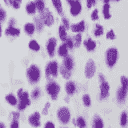
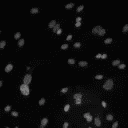
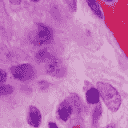
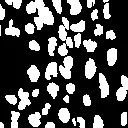
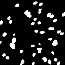
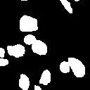
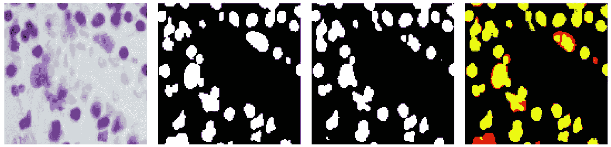

# 细胞核图像分割项目

> 原文：<https://towardsdatascience.com/cellular-nucleus-image-segmentation-project-85e02e020455?source=collection_archive---------15----------------------->

2018 年 [*数据科学碗*](https://www.kaggle.com/c/data-science-bowl-2018) Kaggle 竞赛引起了我的注意，因为它有可能对生物技术行业产生深远的实际影响。这篇文章涵盖了我的全部经历，而我工作的详细总结可以在我的 [*Github*](https://github.com/ChristopherBui3/Metis_Projects/tree/master/Project_5) 上找到。

**挑战:**

给定在不同环境条件下拍摄的多种类型细胞核的显微镜图像，建立一个可以检测细胞核的机器学习模型。



3 raw microscope images of differentiating cellular nuclei from the training set. Note that the samples have most likely undergone some type of fluorescence filtering to distinguish the nuclei from potential background interference.

**动机:**

这个挑战的目标是为量化生物系统的一个方面的能力建立一个基础。具体而言，通过具有能够在显微镜图像的混乱中分割出细胞核的模型，可以应用当前可用的软件来*计数*检测到的细胞核的数量。知道了生物样本中的细胞核数量，科学家就可以量化他们的观察结果，而不是“瞎猜”。

例如，在药物发现研究领域，将测试药物应用于一批细胞后，该模型将能够报告细胞计数是否因药物而增加或减少。此外，执行相同任务的传统软件方法能力有限，可能需要几天到一周才能完成。通过减少这项任务的时间，我只能想象相关研究的成本会降低，发现有益药物的机会会更快到来。

来自挑战赛组织者的这段 [*视频*](https://www.youtube.com/watch?v=Dbiq6l50zO8) 详细阐述了这一动机。

**型号:**

这个项目的挑战是图像分割问题。有许多卷积神经网络(CNN)架构，每一个都适合于特定的任务。然而对于生物医学应用来说， [*U-Net 架构*](https://lmb.informatik.uni-freiburg.de/people/ronneber/u-net/) 已经被证明是相当成功的。因此，我根据这个架构建立了我的模型。我的目标是利用 U-Net CNN 从图像中的各种物体中分割出细胞核。


U-Net CNN Architecture. Note the “U” shape.

训练数据由 670 幅原始显微镜图像组成。此外，每个原始图像具有其各自的二进制掩模，即单独的图像，使得白色像素指定细胞核存在的区域，而黑色像素指定细胞核不存在的区域。比赛的组织者手工给二元面具贴上了标签。我们需要这些二进制掩码，以便模型在训练阶段有一个参考来知道它是否正确地分割了细胞核。



Respective binary masks of the 3 raw microscope images depicted earlier. White pixels signify present nuclei. Black pixels signify absence of nuclei.

然后我用 600 张图片训练这个模型，留出 70 张作为测试集。

**结果:**

这里是 [*U-Net 架构的 Python 代码*](https://github.com/ChristopherBui3/Metis_Projects/blob/master/Project_5/code/model.py) 。在训练完模型后，我在测试集中的 70 张图片上对它进行了测试。对于每个测试图像，模型返回一个预测的二进制图像。

我们通过在预测结果上叠加原始图像的二值掩码来评估模型的性能。由此，我们可以看到模型预测正确和不正确的区域。



From Left to Right: Original Image, Original’s Binary Mask, Model’s Prediction, Overlay of Original + Prediction Masks

上面叠加图像中的颜色如下:

*   黄色:真阳性
*   黑色:真阴性
*   绿色:假阳性(错误)
*   红色:假阴性(错误)

为了量化模型的性能，我使用了 *Jaccard 距离(也称为联合上的交集)*度量。这个 *Jaccard 距离*值是通过获得正确预测细胞核(真阳性)的区域面积，并将该值除以假阴性、假阳性和真阳性面积的总和来计算的。

```
Jaccard Distance = True Positive / (True Positive + False Negative + False Positive)
```

因此，这个度量值的范围在 0 到 1 之间。满分为 1 意味着该模型能够检测细胞核的所有区域，而没有任何假阴性和假阳性。

对于 70 张测试图像，我的**平均 Jaccard 距离等于 0.75** 。这意味着平均而言，该模型能够正确地检测所有细胞核的相当大的一部分。

**结论:**

结果表明，U-Net 结构在分割细胞核区域方面是令人满意的。虽然不是 100%最佳，但结果足以满足生物学家的工作和需求。

该模型始终捕捉到大块的细胞核，对于生物学家来说，任何误差区域都无关紧要。对于分割细胞核的重要部分，您可以应用其他软件来计数它们的数量或计算它们的大小。这将使生物学家能够进行细胞计数，但与传统方法相比，时间要短得多。著名的 Python 库 *OpenCV* 具有对象检测功能，可以用来实现这一点。

然而，在原子核重叠的情况下，仍然存在一个共同的挑战。该模型如何区分两个或多个重叠的原子核与单个原子核？

我对这个问题的初步建议解决方法是测量一种细胞的平均细胞核大小(在这种情况下是局部区域，因为图像描绘了细胞核的 2D 表示)。然后，在模型返回相同类型细胞核的二进制图像之后，在合理的误差量内，识别面积大于平均细胞核尺寸的相连白色像素区域。如果这样一个区域超过一个任意的阈值，比如平均值的 1.5 倍，那么将这个区域计为 2 个细胞核。我再说一遍，这是一个粗略的建议，它只适用于单一类型的原子核，因为不同类型的原子核大小不同。对这一挑战的进一步探索留待今后的工作去做。

总的来说，这次 Kaggle 比赛的目标是实现一个可以分割细胞核的机器学习模型，我说我的努力相当令人满意。

如果这项任务可以通过解决上述问题得到进一步改进，那么我看到了这样一个有能力的模型可以作为一个软件产品为学术界和工业界的生物学研究人员商业化的潜力。