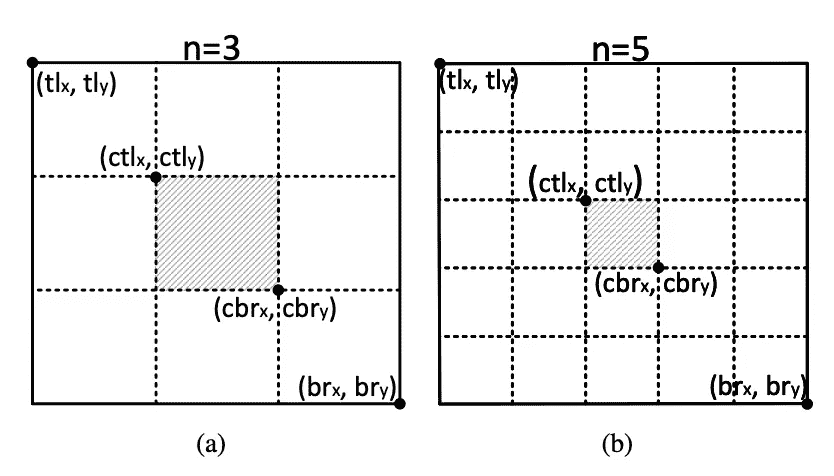
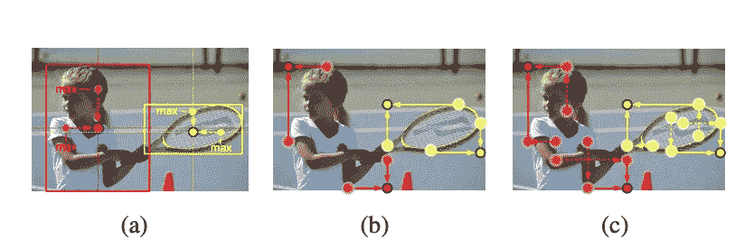
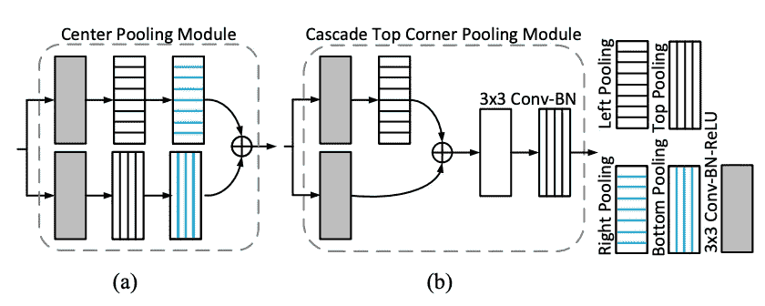
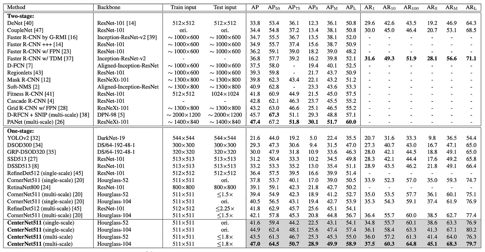

# 对象检测评论中心网关键点三元组

> 原文：<https://towardsdatascience.com/centernet-keypoint-triplets-for-object-detection-review-a314a8e4d4b0?source=collection_archive---------19----------------------->

CenterNet 的论文是 CornerNet 的后续。CornerNet 使用一对角点来克服使用基于锚的方法的缺点。然而，当检测物体的边界时，角网的性能仍然受到限制，因为它参考物体的全局信息的能力较弱。CenterNet 论文的作者分析了 CornerNet 的性能。他们发现，由于不正确的边界框的比例，在 MS-COCO 验证集上 CornerNet 的错误发现率很高(特别是在小对象上)。

Diagram of the CenterNet

CenterNet 试图克服 CornerNet 中遇到的限制。顾名思义，该网络使用附加信息(中心化信息)来感知每个建议区域内的视觉模式。现在，它不再使用两个角信息，而是使用三元组来定位对象。该工作指出，如果预测的边界框具有与地面实况框的高 IoU，则在其中心区域的中心关键点被预测为相同类别的概率高，反之亦然。在推断过程中，给定角点作为提议，网络通过检查是否有相同类别的中心关键点落在其中心区域内来验证角提议是否确实是对象。对象中心化的额外使用使网络保持为单阶段检测器，但继承了 RoI 轮询的功能，就像在两阶段检测器中使用的一样。

中心网络图显示了检测中心热图的附加分支。预测角点的分支的工作方式与 CornerNet 论文中描述的方式类似。CornerNet 有两个输出通道，分别用于预测对象的左上角和右下角。它还预测嵌入和一组偏移，学习将热图中的角重新映射到输入图像。

# 中心池

提出了一种新的池化方法来捕捉更丰富、更易识别的视觉模式。这种方法是必需的，因为对象的中心点不一定传达非常容易识别的视觉模式。上图显示了如何执行中心池。给定主干层的特征图，我们确定特征图中的像素是否是中心关键点。特征图中的像素本身并不包含足够的物体中心信息。因此，水平和垂直方向的最大值被找到并加在一起。通过这样做，作者声称可以更好地检测中心关键点。

# 级联角池

在 CornerNet 论文中，提出了角池来捕获对象的角点中的局部外观特征。与中心池在水平和垂直方向都取最大值不同，角池只在边界方向取最大值。

a) center pooling taking max values in both horizontal and vertical directions b) corner pooling taking max values in boundary directions c) cascade corner pooling taking max values in both boundary directions and internal directions of objects

然而，仅在边界方向上取最大值使得角点的检测对边缘敏感。为了解决这个问题，提出了级联角池。该方法的不同之处在于，它不是仅在边界方向上取最大值，而是首先沿着边界寻找边界最大值，然后沿着边界最大值的位置向内寻找内部最大值，最后将两个最大值相加。

a) center pooling module and b) the cascade top corner pooling module

通过组合不同方向的拐角汇集，可以容易地实现中心汇集和级联拐角汇集。上图 a)显示了中心汇集模块的结构，b)显示了级联顶角汇集模块的结构。与 CornerNet 中的顶角池相比，在顶角池之前增加了左角池。

# 结果

上表显示了 CenterNet 在 MS-COCO 数据集上的性能。结果表明，CenterNet 加强了 CornerNet 的弱点，并且优于大多数一阶段方法。

# 参考

 [## 角网:将对象检测为成对的关键点

### 我们提出了 CornerNet，一种新的对象检测方法，其中我们将对象包围盒检测为一对关键点…

arxiv.org](https://arxiv.org/abs/1808.01244)  [## CenterNet:用于对象检测的关键点三元组

### 在对象检测中，基于关键点的方法经常遭受大量不正确的对象包围盒，可以说…

arxiv.org](https://arxiv.org/abs/1904.08189)