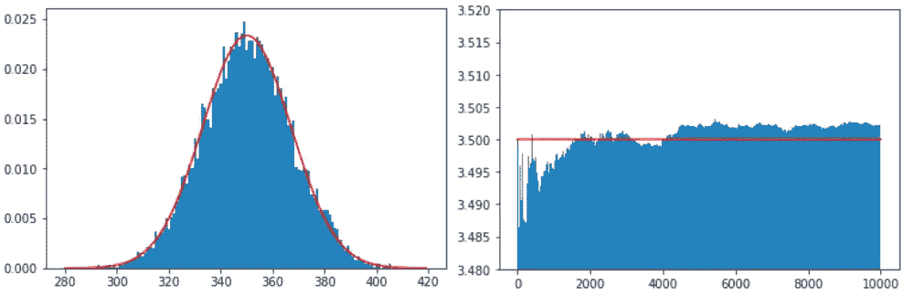
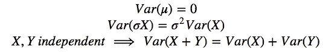

# 中心极限和大数

> 原文：<https://towardsdatascience.com/central-limit-large-numbers-b86713585491?source=collection_archive---------26----------------------->

很好奇中心极限定理和大数定律是如何工作和相互联系的？来和我一起看看吧！

如果你学习一些概率论和统计学，你会发现两个突出的定理:

*   *CLT* ，是*中心极限定理*的简称
*   *LLN* ，是*大数定律*的简称

因为它们似乎在这个领域非常重要，所以我想确保我理解了它们的实质。我相信，阅读关于他们的各种文章让我有了这种感觉，但同时这样做也有点令人困惑，因为在他们的陈述所基于的概念中有许多微妙的细节。此外，它们实际上不仅仅是两个不同的定理，而是每一个都有几个版本。

为了让我理解它们，并最终将它们的精髓留在我的长期记忆中，我运用了三种技巧:

1.  将它们的种类减少到最简单和实际上最相关的情况
2.  通过利用对最简单情况的限制，找到两者的最大共性和明显差异的表示
3.  写这篇关于它的文章；-)

Bell curves arise from frequencies of sums of random numbers

首先，让我用简单的术语给你这些定理的松散和非正式的陈述。

大致说来，最简单版本的 **CLT** 告诉我们这一点:

> *进行相同但独立的实验，每个实验产生一个随机数，并将所有这些数相加。如果重复这个过程得出一个随机数的和，得到的和的频率将近似遵循正态分布(即高斯钟形曲线)。每次实验的数字加起来越多(实验越多)，近似值就越好。*

同样，LLN 最简单的版本**声明:**

> *进行相同但独立的实验，每个实验产生一个随机数，并对所有这些数进行平均。你做的实验越多，平均值就越有可能接近(实验的)预期值。*

尽管很简单，让我们看看用 Python 模拟的一个例子的图表结果:我们投掷一个普通骰子 100 次，然后把所有的数字加起来。然后我们重复这个过程 10.000 次。对于 *CLT* ，我们在分布图中记录不同结果总和的相对频率，并将曲率与正态分布的密度函数图进行比较。对于 *LLN* ，我们计算增长总和的平均值，最后将这些平均值与预期值 3.5 进行比较。

Left Plot: Distribution of Sums (blue) approximating the theoretical distribution of the limiting case (red) — Right Plot: Averages (blue) approximating the Expected Value 3.5 (red) — [Find the code at https://gist.github.com/BigNerd/04aef94af57f72d4d94f13be3f7fde70](https://gist.github.com/BigNerd/04aef94af57f72d4d94f13be3f7fde70)

在另一个模拟中，我们想看看重复实验的次数和每次实验的随机数总和的变化如何影响 CLT 陈述的结果。作为可视化，我们以标准化的方式(平均值为 0，标准偏差为 1)绘制结果分布图，以便于比较，并且每隔一个条形使用绿色而不是蓝色，以便更好地查看它们的宽度:

Summing more numbers yields finer resolution along the x-axis, repeating the experiment more often gives better accordance with the red Gaussian curve along the y-axis — Find the code at [https://gist.github.com/BigNerd/63ad5e3e85e0b676b0db61efddedf839](https://gist.github.com/BigNerd/63ad5e3e85e0b676b0db61efddedf839)

如果你对数学方程感兴趣，让我们现在转向定理的形式表示，以便更精确地理解它们的主张和两者之间的关系。

# 中心极限定理

让

是独立同分布的随机变量，具有期望值*、有限方差***【σ***。然后*

**

*收敛于分布中的标准正态分布。分布收敛意味着随机变量的累积分布函数(CDF)向一个极限值收敛，在这种情况下，随着 ***n*** 变大，它们向标准正态分布的 CDF**φ**收敛:*

**

*这就是所谓的林德伯格/李维版的 CLT。*

# *大数定律*

*再说一遍，让*

**

*是具有期望值 ***μ*** 和有限方差 ***σ*** 的独立同分布随机变量。然后*

**

*或者用不同的方式书写*

**

*它变成了*

**

*这就是众所周知的切比雪夫版本的**弱** *大数定律*(据说还有其他版本也是如此)。第一个极限方程更适合与 *CLT* 进行比较，后者更适合捕捉用平均值逼近期望值的直觉。*

# *类似*

*通过模式匹配可以看出 *CLT* 的极限项*

**

*以及上述 *LLN* 的极限项的第一个变型，*

**

*它们确实非常相似(不同之处是蓝色)。*

*两者都陈述了在围绕 **0** 的任意边界框内获得其表达式值的概率，即**-*ϵ*， *ϵ* [** 。此外，两者都计算相同随机变量的相同和，两者都需要通过从和中减去增加的期望值来居中，并且两者都需要通过增加的因子来收缩，以使收敛在技术上可行。*

# *差异*

*所比较的两个极限项的区别显然是分母的顺序(**√*n***vs .***n***)以及右边的结果极限:**【1−2φ(−ϵ】**vs .**1**。因此，基本上，两者都处理相同的过程，即随着 ***n*** 变大，聚合数变得越来越接近零均值的正态分布。但是，由于我们更积极地缩小了 *LLN* 中的值，它们的方差趋近于零，而不是保持不变，这就将所有概率渐近地浓缩在期望值上。*

*通过对差异应用以下基本规则*

**

*我们可以证明这是这样的:*

**

*最后，从另一个模拟中，我们得到了方差减少的可视化，因为*在由 *LLN* 描述的平均过程中变大:**

****

**Averaging more numbers per experiment reduces the variance of the averages around the true mean — Find the code at [https://gist.github.com/BigNerd/ad880941bbe6987e6621cf99e3b2af78](https://gist.github.com/BigNerd/ad880941bbe6987e6621cf99e3b2af78)**

# **结果**

**当将两个定理限制在一个特殊但重要的情况下，即具有有限期望和方差的独立同分布随机变量，并进一步将比较限制在弱 *LLN* 时，我们可以发现相似之处和不同之处，这有助于加深我们对两者的理解。**