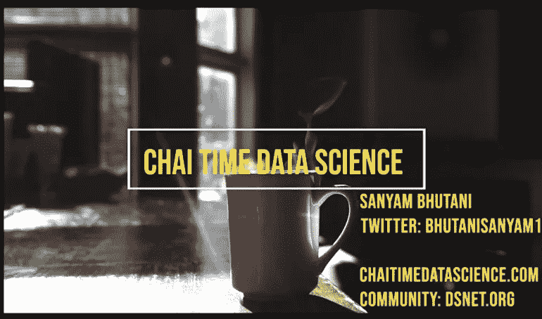

# 柴时代数据科学展公告

> 原文：<https://towardsdatascience.com/chai-time-data-science-show-announcement-2e930ed92f89?source=collection_archive---------19----------------------->

## 重启《机器学习英雄访谈》并收集最佳建议

在过去的几个月里，我非常幸运地采访了一些顶尖的 Kagglers，研究者和实践者。这些采访以博客的形式发布，每个星期，所有的 ML 英雄都很友好地分享许多给初学者的令人惊叹的话，分享他们进入这个领域的旅程。

在本帖中，我非常激动地宣布柴时代数据科学:

柴时间数据科学是机器学习访谈的重启，我在过去的 3 个月里一直致力于这个项目，我非常高兴地分享，第一集将于 7 月 21 日周日发布，每周日和周四发布。

我稍后会谈到这个节目，但首先我想分享一下之前 25 次采访中的最佳建议:

请注意，这将是一个非常精简的建议，可能有点缺乏上下文。我建议你也看看所有的采访，以获得更详细、更丰富的指导

**采访 DL 从业者:Dominic Monn**

> *不管是在商业还是机器学习领域，都不要害怕尽可能早地暴露自己的名字，弄脏自己的手。快速出货，获得实习机会，下定决心，剩下的事情自然会到来。*

[**采访深度学习自由职业者图瓦蒂尼·戈达尔**](https://medium.com/dsnet/interview-with-deep-learning-freelancer-tuatini-godard-e661a3995fb1?source=post_page---------------------------)

> *不要放弃，数据科学是一个多学科领域，很难在每个方面都做得很好。一开始选择一个专业，把全部精力放在上面。例如，我为计算机视觉选择了深度学习，而不是时间序列或 NLP。不要像我 2 年前开始时那样被人工智能炒作所迷惑，没有人工智能(或 AGI，随你怎么说)，如果你选择了计算机视觉道路，那么你就成为了计算机视觉专家，对于 NLP 你就成为了 NLP 专家。深度学习只帮助解决大图的一部分，它不是大图本身，只是添加到你的工具带上的一个工具。作为一名自由职业者或“专家”(随你怎么称呼)，你将被要求做更多的事情，而不仅仅是在大部分时间里玩深度学习模型。了解数据准备、软件工程技能、一些 devops 和 co，基本上是在生产中创建和交付深度学习项目的整个堆栈，而不仅仅是有趣的部分。但最重要的是，学会学习和适应，关注最新趋势，并始终跟上数据科学领域的发展。*

[**采访 Kaggle Kernels 专家:aa kash Nain:**](https://medium.com/dsnet/interview-with-kaggle-kernels-expert-aakash-nain-73209223bbd0?source=post_page---------------------------)

> *有时，看到大量的研究正在进行，你也会感到沮丧。如果你有这种感觉，没关系。只有两件事我们应该永远记住:*
> 
> 你的成功不依赖他人，反之亦然。
> 
> 即使是最基本的问题，也不要害羞/害怕去问。如果你不问，你就是阻碍你进步的人。

[**两次采访卡格勒大师:江泽龙·普吉特博士(CPMP)**](https://medium.com/dsnet/interview-with-twice-kaggle-grandmaster-dr-jean-francois-puget-cpmp-6d92328e433a?source=post_page---------------------------)

> *每次比赛结束后，阅读并撰写顶级团队的评论。如果你参加比赛会更好，因为你会从报道中得到更多，但是阅读所有报道是有用的。那是你在 Kaggle 上学习最多的时候。*

[**采访卡格尔大赛特级大师:卡扎诺娃(排名第三):马里奥斯·米凯利迪斯博士**](https://medium.com/dsnet/interview-with-kaggle-competitions-grandmaster-kazanova-rank-3-dr-marios-michailidis-cc515194cb67?source=post_page---------------------------)

> *理解问题和* [*度量*](https://www.kaggle.com/wiki/Metrics?source=post_page---------------------------) *我们都在考——这是关键。*
> 
> *创建一个可靠的交叉验证流程，最好类似于排行榜或测试集，因为这将允许我探索许多不同的算法和方法，知道它们可能产生的影响。*
> 
> *了解不同算法族的重要性，看何时何地强度最大化(是线性还是非线性类型的问题？)*
> 
> *在给定的问题上尝试许多不同的方法/技术，并从算法选择、超参数优化、特征工程、缺失值处理等所有可能的角度抓住它——我将所有这些元素视为最终解决方案的超参数。*

[**深度学习与 NLP 研究员访谈:Sebastian Ruder**](https://medium.com/dsnet/interview-with-deep-learning-and-nlp-researcher-sebastian-ruder-91ddaf473c4b?source=post_page---------------------------)

> 当我开始为自己写博客以更好地理解某个特定话题时，我有过写博客的最好经历。如果你发现自己不得不投入大量的工作来建立直觉或做大量的研究来掌握一个主题，考虑写一篇关于它的帖子，这样你就可以在未来加快其他人的学习。在研究论文中，通常没有足够的空间来恰当地描述一部作品，突出动机和直觉等。博客文章是让技术内容更容易理解和接近的好方法。
> 
> *博客的伟大之处在于它不需要完美。你可以用它来提高你的沟通技巧，并获得关于你的想法和你可能错过的事情的反馈。*

[**深度学习研究员、GANfather:Ian good fellow 博士**](https://medium.com/dsnet/interview-with-deep-learning-researcher-and-the-ganfather-dr-ian-goodfellow-cd300863ecff?source=post_page---------------------------) 访谈

> 从真正学好基础知识开始:编程、调试、线性代数、概率。大多数先进的研究项目要求你在基础方面非常优秀，而不是要求你知道一些非常先进的东西。例如，今天我正在调试一个阻止我运行我的一个实验的内存泄漏，并且我正在加速一个软件库的单元测试，以便我们可以更快地尝试更多的研究想法。当我还是本科生和早期博士生时，我经常向吴恩达寻求建议，他总是告诉我要努力彻底掌握这些基础知识。我认为那真的很无聊，并一直希望他会告诉我学习超实数或类似的东西，但现在几年过去了，我认为这个建议绝对是正确的。

[**采访 OpenAI 研究员:Christine McLeavey Payne**](https://medium.com/dsnet/interview-with-openai-fellow-christine-mcleavey-payne-aaef948ad571?source=post_page---------------------------)

> *就细节而言——我最喜欢的一条建议来自 FastAI 的杰瑞米·霍华德。他告诉我要专注于做一个真正伟大的项目，展示我的技能。他说，很多人在 github 上有很多有趣但尚未完成的项目，最好有一个真正完善的项目。*
> 
> *我要补充的另一件事是，当我把深度学习教给别人时，我学到了最多。我成了吴恩达 Coursera 课程的导师，试图回答其他学生的问题推动我在更深层次上理解这些材料。每当你学习一个新的话题时，试着向别人解释一下(这也是为工作面试做好准备！).*

[**采访最年轻的卡格尔特级大师:米克尔·波贝尔-伊里扎(阿诺卡斯)**](https://medium.com/dsnet/interview-with-the-youngest-kaggle-grandmaster-mikel-bober-irizar-anokas-17dfd2461070?source=post_page---------------------------)

> *如果你刚刚开始，看看操场上的比赛或者过去几年的比赛是很有用的。Kaggle 内核可能是最好的学习资源，因为人们分享了大量的分析和所有比赛的解决方案。最重要的只是自己去实验，努力提高分数！*

[**深度学习研究员、OpenMined 负责人安德鲁·特拉斯克**](https://medium.com/dsnet/interview-with-deep-learning-researcher-and-leader-of-openmined-andrew-trask-77cd33570a8c?source=post_page---------------------------) 访谈

> *进入深度学习社区的秘诀是高质量的博客。阅读关于同一主题的 5 篇不同的博客文章，然后尝试综合你自己的观点。也不要只是写一些好的东西——花 3 到 4 天的时间写一篇文章，尽量使它简短(但完整)。重写多次。当你一遍又一遍地写，思考你想教的主题时，你会逐渐理解它。此外，其他人也会理解它(他们会理解你理解它，这有助于你找到工作)。大多数人希望有人在整个过程中牵着他们的手，但最好的学习方法是写一篇牵着别人的手的博客，一步一步地(用玩具代码示例！).还有，做代码示例的时候，不要写一些面向对象的大乱七八糟的东西。越少越好。把它写成剧本。只使用 numpy。教授每行的功能。冲洗并重复。当你感觉足够舒服的时候，你就可以用最近发表的论文来做这件事了——这是你真正知道你在进步的时候！*

[**访 Keras 创始人艾研究员:弗朗索瓦·乔莱**](https://medium.com/dsnet/interview-with-the-creator-of-keras-ai-researcher-fran%C3%A7ois-chollet-823cf1099b7c?source=post_page---------------------------)

> 我认为你不应该把你的梦想和外在的身份标志联系在一起，比如为一家特定的大公司工作，或者赚一笔特定的钱，或者获得一个特定的职位。弄清楚你在生活中看重什么，然后忠于你的价值观。你永远不会后悔任何一个决定。

[**专访 PyImageSearch 作者、计算机视觉从业者:Adrian Rosebrock 博士**](https://medium.com/dsnet/interview-with-the-author-of-pyimagesearch-and-computer-vision-practitioner-dr-adrian-rosebrock-e00583a225a0?source=post_page---------------------------)

> *开始写任何东西的最糟糕的方式之一，不管是不是技术性的，是打开一个新文档，然后期待你会有文字涌出，神奇地填满页面——这很少会发生，而且通常会导致沮丧和失败。*
> 
> 相反，我建议先列出大纲。我个人用要点概括。
> 
> 先从你的标题开始——你打算写些什么？按什么顺序？
> 
> *从那里返回并开始填充子标题。你需要在每一部分涵盖什么？*
> 
> *最后，我返回并包含每个部分的详细信息。有时我甚至用完整的句子来写，但那是个人的选择。*
> 
> *我总是给自己留便条，比如“在这里插入一张图片”或者“some_script.py 的 X-Y 行到这里”。我尽量让自己专注于实际的写作过程。实际的图像和代码可以在排版过程中插入。*

[**数据科学家 Kaggle 大师访谈:Bojan Tunguz 博士**](https://medium.com/dsnet/interview-with-kaggle-grandmaster-dr-bojan-tunguz-726b28e601e?source=post_page---------------------------)

> 不要害怕失败，试着从错误中学习。阅读论坛中的讨论，看看最好的内核，并尝试对它们进行改进。

[**专访 fast.ai 深度学习研究员:Sylvain Gugger**](https://medium.com/dsnet/interview-with-deep-learning-researcher-at-fast-ai-sylvain-gugger-7cb08fe2ff53?source=post_page---------------------------)

> 这并不是说这个理论没有用，它将是帮助初学者打造直觉的关键部分，但是在解释背后的东西之前，从训练一个实际的模型并部署它开始是很有意义的。

[**专访 Salesforce 首席科学家:Richard Socher 博士**](https://medium.com/dsnet/interview-with-chief-scientist-at-salesforce-dr-richard-socher-c982b9edcd12?source=post_page---------------------------)

> 区分无根据的恐惧和实际的威胁。人工智能偏见是一种迫在眉睫的恐惧，需要得到解决，而周二的场景是一种危险的分心。人们需要开始密切关注，以确保人工智能训练的数据集是多样化的，没有偏见，并且建立这些系统的团队也代表了一系列多样化的观点。

[**采访 kaggle 的数据科学家:Rachael Tatman 博士**](https://medium.com/dsnet/interview-with-data-scientist-at-kaggle-dr-rachael-tatman-8bc61f9efdb9?source=post_page---------------------------)

> 我的普遍建议是不要获得博士学位。我前阵子甚至写了一篇关于此事的博文。这个博客是专门关于语言学的，但大部分也适用于机器学习。我认为，当你寻找数据科学工作时，拥有博士学位可能是一个优势，但除非你真的想 1)做研究或 2)成为教授，否则获得博士学位真的没有任何好处。你不能更快地获得博士学位。
> 
> 我认为 Kaggle 或其他实践经验会让你更快地找到工作。不过，我可能不会建议只做卡格尔比赛。通过这种方式，你会学到很多关于算法的知识，但是你不会得到像清理数据或设计指标这样的实践。这也是我建议人们也做自己的项目的部分原因。这展示了你提出有趣问题、获取和注释数据、清理数据以及思考用户需求的能力。

[**深度学习自由顾问、区块链开发者访谈:Mamy andré-Ratsimbazafy**](https://medium.com/dsnet/interview-with-deep-learning-freelance-consultant-and-blockchain-dev-mamy-andr%C3%A9-ratsimbazafy-f74db35443e1?source=post_page---------------------------)

> 我认为大部分招聘人员和公司对候选人的评估还不够成熟。许多人仍在组建自己的团队，没有内部专业知识来寻找招聘能力的外部迹象。我更关心的是经验要求。深度学习的兴起是在 2012 年有了 AlexNet。除了美国，我猜想许多专注于数据科学的硕士是在 2014 年左右在大学里产生的，因此大多数拥有实际数据科学学位的新员工最多有大约 3 年的经验。大多数更有经验的人可能是自学的。

[**在 H2O.ai 采访两次 Kaggle 特级大师和数据科学家:苏达莱·拉杰库马尔**](https://medium.com/dsnet/interview-with-twice-kaggle-grandmaster-and-data-scientist-at-h20-ai-sudalai-rajkumar-cd952ef0c522?source=post_page---------------------------)

> *阅读多种好内核，并尝试详细理解它们。了解他们如何从数据中创造洞察力，他们用来描绘数据的图表，他们得出的推论。接受一个新概念(比如一个新的算法或一种新的技术)并就此教育人们也是一个好主意。我个人不喜欢混合了两三个其他内核的输出并得到高分的内核。*

[**专访放射科医师、fast.ai 研究员、Kaggle 专家:亚历山大·卡德林-钱纳维特博士**](https://medium.com/dsnet/interview-with-radiologist-fast-ai-fellow-and-kaggle-expert-dr-alexandre-cadrin-chenevert-94145d446da8?source=post_page---------------------------)

> *参加 Kaggle 比赛在我深度学习的学习曲线中至关重要。几乎任何学习过程的成熟都是基于知识到技能，或概念到行动的转化。每次比赛都是朝这个方向发展的机会。但是，自然地，代价是你在这些比赛上投入的时间。因此，我自己的观点是参加数量有限的计算机视觉竞赛，这些竞赛被选中来有效地捕捉最大的潜在利益。*

[**采访 DeOldify，fast.ai 的创作者学生:Jason Antic**](https://medium.com/dsnet/interview-with-the-creator-of-deoldify-fast-ai-fellow-jason-antic-c0437670059b?source=post_page---------------------------)

> 是的，你必须知道什么时候该退出，这是一门艺术。事实上，我对很多事情说“不”，或者退出。为什么？因为你对每件事说“是”，你就在对许多其他事情说“不”。时间(和理智)是宝贵的。结果，尤其是最近，我拒绝了很多别人觉得难以拒绝的机会。
> 
> 因此，对我来说，放弃首先取决于这条路是否完全符合我的价值观、兴趣和保持理智。如果你在谈论一个雄心勃勃的技术项目，那么你必须更进一步，评估它实际上是否可行。通常你不能马上回答这个问题，尤其是如果你正在做一个雄心勃勃的项目！这就是为什么你要做实验。如果你找到了一个合理的理由(而不仅仅是愤怒-放弃合理化)来解释为什么有些事情行不通，那么就放弃，从中吸取教训，继续前进！但是在这一点上要小心——许多问题都可以通过稍微转换一下视角来轻松解决。出于这个原因，我会比看起来合理的时间更长地坚持一个问题，因为我的观点经常是错误的。通常，当我走开的时候，解决方案就来了(基本上是淋浴的想法)。

[**专访 X5 零售集团计算机视觉负责人 Kaggle 特级大师:阿图尔·库津**](https://medium.com/dsnet/interview-with-kaggle-grandmaster-lead-data-scientist-at-dbrain-artur-kunzin-28f516a91e3?source=post_page---------------------------)

> Kaggle 可以让你快速发展特定的技能。用正确的方法，这些技能可以转化为工作所必需的素质(**)。此外，比赛可以让你尝试许多不同的任务，并大大扩展你的知识。最后，如果你能找到一个像 ODS.ai 这样友好的社区，那真是太有趣了**

*[**专访美国海军研究实验室高级研究科学家:莱斯利·史密斯博士**](https://medium.com/dsnet/interview-with-senior-research-scientist-at-the-us-naval-research-laboratory-dr-leslie-smith-a516ae631170?source=post_page---------------------------)*

> *嗯，如果我正在阅读一篇论文，并由此产生一个想法，一个重要的因素是作者是否公开了他们的代码。如果是的话，我会下载并运行它来复制他们的实验。然后我可以迅速尝试我自己的想法，看看它是否有意义。快速原型制作对我来说很重要。此外，他们的代码提供了一个基线。*

*[**访 Lyft 高级计算机视觉工程师 Kaggle 大师:Vladimir I. Iglovikov 博士**](https://medium.com/dsnet/interview-with-kaggle-grandmaster-senior-cv-engineer-at-lyft-dr-vladimir-i-iglovikov-9938e1fc7c?source=post_page---------------------------)*

> *真的希望越来越多的卡格勒人投入写作。可以是博客帖子、论文，也可以是其他东西。人与人之间的信息交流越多越好。写一篇博文或技术报告将有助于你构建对问题的想法，它将有助于其他人在类似的挑战中有一个温暖的开始，最有可能的是，它将有助于你获得职业机会。这意味着你将致力于更令人兴奋的问题，同时获得更高的报酬。*

*[**采访 Kaggle 特级大师，Point API (NLP startup)的数据科学家:帕维尔·普莱斯科夫**](https://medium.com/dsnet/interview-with-kaggle-grandmaster-data-scientist-at-point-api-pavel-pleskov-cc8ca67de249?source=post_page---------------------------)*

> *因此，我给每个人的建议是:不要浪费宝贵的时间，尽快开始练习——你会在以后弥补理论上的差距。*

# *好了，什么是柴时间数据科学？*

*这是早期系列的重新启动，也是:*

*   *播客*
*   *视频采访*
*   *博客帖子采访*

*[现在我刚刚毕业，很遗憾没能参加谷歌人工智能常驻项目](/interviewing-for-google-ai-residency-a-kaggle-gold-finish-dsnet-launch-c621930b043d?source=post_page---------------------------)，我决定把这段时间以视频、音频和博客帖子的形式提供给大家！这是可能，因为我远程工作，但讨论是为了节目(很快就会发布的集！)*

# *名字*

*在大学的最后一个学期，我有足够的带宽为社区做更多的贡献:我花了很多时间在数据科学网络和 TWiMLAI 社区上。*

*我决定花 50 个小时/月的时间打开我的日历，让任何人都可以进行“Chai Time DS 对话”。因为我已经是一个贡献者，并得到了了不起的人们的认可。我一个月的时间不到一天就被预订了！*

*接下来，我决定开展一项投票，如果我得到的表情符号反应超过 25 个(这是一种新的投票方式，不是吗？)*

********

*不到一天就被预订了！*

*我最终在五月、六月的整个月里，每天都做 3 次对话。我个人在帮助社区的过程中学到了很多。对话的主题通常是 Kaggle、fast.ai 和项目创意。我强烈建议所有阅读这篇文章的人尝试这样做！*

*由此得名，柴次秀听起来最为贴切。这个展览也收集了我最常见的问题，一如既往地希望帮助社区成长并成为更好的数据科学从业者。*

*希望你喜欢这场演出！*

*请点击此处查看网站:请每周与柴一起关注数据科学讨论。*

*该节目将在所有最常用的播客平台上发布，视频记录将在 YouTube 上发布，当然还会通过博客发布。*

**

**如果你觉得这很有趣，想成为我的学习之路***的一部分，你可以在 Twitter* [*这里*](http://twitter.com/bhutanisanyam1?source=post_page---------------------------) *找到我。***

***如果你有兴趣阅读关于深度学习和计算机视觉的新闻，可以在这里* *查看我的* [*简讯。*](http://tinyletter.com/sanyambhutani/?source=post_page---------------------------)**