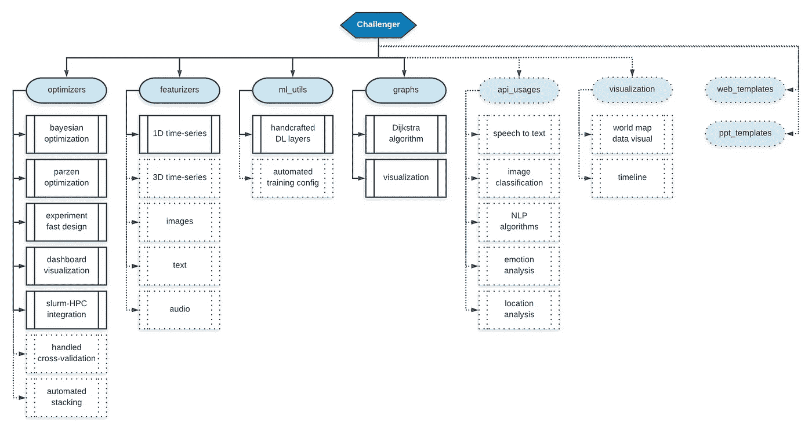
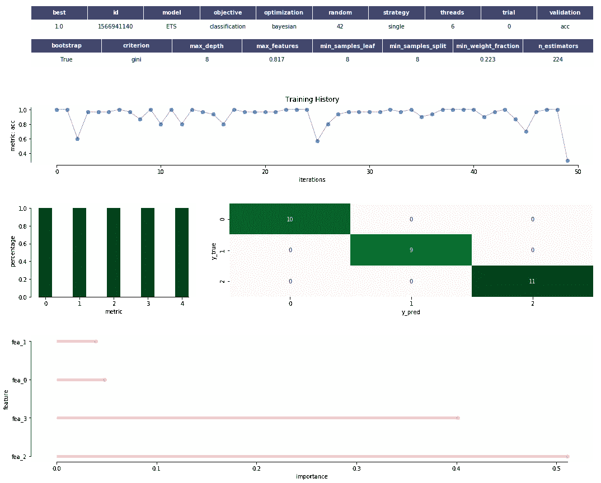
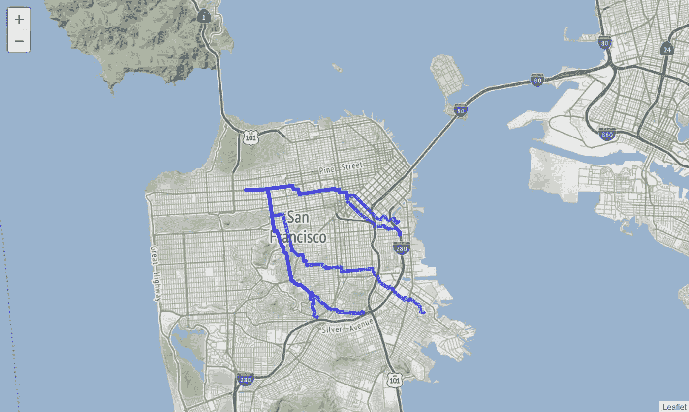

# 挑战者:一个快速原型项目

> 原文：<https://towardsdatascience.com/challenger-a-fast-prototyping-project-f3d97265529c?source=collection_archive---------27----------------------->

📷 — Gwen Gummersall from Citadel at West Coast Citadel Hackathon

黑客马拉松，一切都始于黑客马拉松。他们的内在功能很简单:**在有限的时间内设计**一个新产品，**说服**陪审团这个产品值得人们使用。我在这里提出的区别通常是改变游戏规则的，因为没有好故事的好产品不会影响任何观众，同样，没有好产品的好故事也太依赖于陪审团的技术技能。做出妥协以获得两者的好版本(不需要完美)通常会让你处于一个好的位置。做了几十个之后，我对任务冗余感到震惊，尤其是当产品是关于利用机器学习来解决一个明确的问题时。

因为我个人讨厌浪费时间重复做同样的事情，所以我设计了这个 [python 包](https://github.com/Coricos/Challenger)作为我的任何小项目的任务缓解器。你会注意到，它现在仅仅专注于数据科学任务，因为这是我在过去几年中主要做的事情。它帮助我进行**数据预处理**、机器学习**模型拟合**在一个可控且可重复的环境中(这通常需要你没有的时间)**图形**利用和可视化、**API**调用、一般**数据可视化**、 **Flask web 服务器**模板和 **PowerPoint 演示**以确保故事讲述涵盖了它应该涵盖的一切。

通过多次体验，我注意到那些项目的部分可以自动化，发布这个开源包是我试图给每个人这个工具箱来玩。

# 包装结构

下面的图表很好地概述了我是如何定义这个无处不在的包的模块化的。我的策略是发布多个版本，因为这将是增量开发和改进的。此外，我的经验告诉我，没有必要从第一天开始就部署一切，因为所有这些都将是多个想法的结果！

The current roadmap for **Project Challenger**

# **自动化特征化**

这可能是所有任务中最无聊的一项，深度学习可以部分解决这个问题。然而，你通常需要解释，这也参与了你的故事讲述。此外，在一次黑客马拉松中，用特性和经典模型制作原型是容易、快速和足够 T2 的。既然一切都可以矢量化成特征，不管是时间序列、图像还是文本，让我们享受一些自动化吧！第一版包含一维时间序列的特征，并将进一步扩展到多模态序列。

750 Designed Features for Time Series — Configuration

特征化是一个棘手的问题，因为它需要非常深入的领域知识才能获得最佳性能。尽管如此，用“*经典*特性自动化这个过程将会让很多学生和原型设计者松一口气。

这种特征化过程目前特别适合分析 EEG 信号、惯性流或金融时间序列，因为我通过参加特定的数据竞赛构建了其中的大部分功能。在这篇文章[中，你可能会发现我对脑电图大脑信号的一些研究结果。](/my-sweet-dreams-about-automatic-sleep-stage-classification-414128441728)

# 运行受控 ML 实验

B 因为知道用什么框架，优化什么模型，使用什么参数是一件痛苦的事情，所以通过 Challenger 可以使用不同的机器学习优化策略。总体目标当然是控制实验、再现性和快速参数化。目前，它处理两种类型的优化: **PARZEN** (灵感来自[*hyperpt*](https://github.com/hyperopt/hyperopt))和 **BAYESIAN** (灵感来自 [*GitHub*](https://github.com/fmfn/BayesianOptimization) )优化。我还将这两种方法结合成一种**进化**方法，因为 parzen 在做出选择时完成了贝叶斯优化。

如何使用这个包的一个例子是:基于你自己的训练和测试数据集快速原型化一个机器学习模型。在这种情况下，代码加载太著名的 *iris 数据集*，将其分成 80%的训练和 20%的测试，实例化一个实验，使用所有可用的 CPU，基于测试集上模型的准确性( *acc* )，通过**贝叶斯优化**来优化 ExtraTrees 模型( *ETS* )。

Tutorial example to run an experiment

这样一个实验提供的是一个 *config.json* 文件，聚集了实验中使用的所有参数，以及一个 *params.json* 文件，记录最佳确定的参数。两者都提供了再现性和最终模型，供您在生产中使用/提交您的预测。一个**仪表板类型的**可视化也可以让你更好地理解你的训练模型在测试集上的表现，以及**特征重要性**的解释(如果可以的话)。

General output dashboard

当然，这可以扩展到交叉验证，并在 HPC 机器上运行。目前，我在这样的机器上使用 **Slurm** 进行作业调度，但是将来可能需要实现其他框架。

# 玩图表

T 软件包的这一部分最初是为一个小型竞赛开发的，其解决方案实际上是 Dijkstra 算法的一个技巧。当时，我浪费了大量宝贵的时间来研究算法优化版本的实际实现。即使不谈图形分类，可视化和路径确定也是该领域的主要目标。因为我已经多次重复使用了它，其中一个值得注意的例子是 AsTeR 项目在给定的旧金山地图上派遣紧急单位，我觉得将这个过程形式化和自动化是个好主意。

Code snippet to interact with Folium map

Folium output visualization

对于图形分析的其他目的，我将享受这一节，将您重定向到我设计的另一个[工具箱](https://github.com/Coricos/TdaToolbox)，这次是为了[拓扑数据分析](/from-tda-to-dl-d06f234f51d)。

# 让它开源并建立一个社区！

我还想给你看更多的东西，但是我知道让这个包描述太长会让你不愿意读到最后。让它开源背后的整个想法是传播这种工具的使用，并让黑客马拉松爱好者帮我设计一个更好的包，让新人在这种活动中充分利用时间！*敬请期待来稿；)*！

# 参考

*   [***我的 GitHub 资源库***](https://github.com/Coricos/Challenger)