# 情感分析的挑战:词云案例(目前)

> 原文：<https://towardsdatascience.com/challenges-in-sentiment-analysis-a-case-for-word-clouds-for-now-6e598def5794?source=collection_archive---------15----------------------->

## 探索用于营销的简单 python 代码可视化

Machine understanding and capability get merged together in popular culture.

当我想到人工智能时，我养成了将理解与能力相结合的棘手习惯。我想我们有办法通过一台机器能生产什么来判断它知道多少。然而，对我来说有趣的是，机器实际上不需要理解任何东西来进行大量计算。围绕图灵测试等问题的大量讨论使得大众科学模糊了这一概念。像《前任玛奇纳》和《T2》《刀锋战士》这样的电影给了我们一种感觉，也许对机器可以呈现它们周围的世界有一些理解。我们时代精神中的这些想法模糊了我们如何看待今天工业中使用的工具能力。通过一些第三级数据科学探索，我将尝试解开当今市场营销中仍然普遍面临的一个挑战——在不阅读所有内容的情况下总结内容。

**应对营销挑战。**

当我们在开会时，我们可以倾听并总结我们正在消费的内容的要点。然而，假设我们需要总结 400 个文档——一定有比*阅读*所有文档更好的方法。社交倾听在营销中被用作综合大量品牌内容的手段，但总结信息的常用方法仍有许多不足之处。

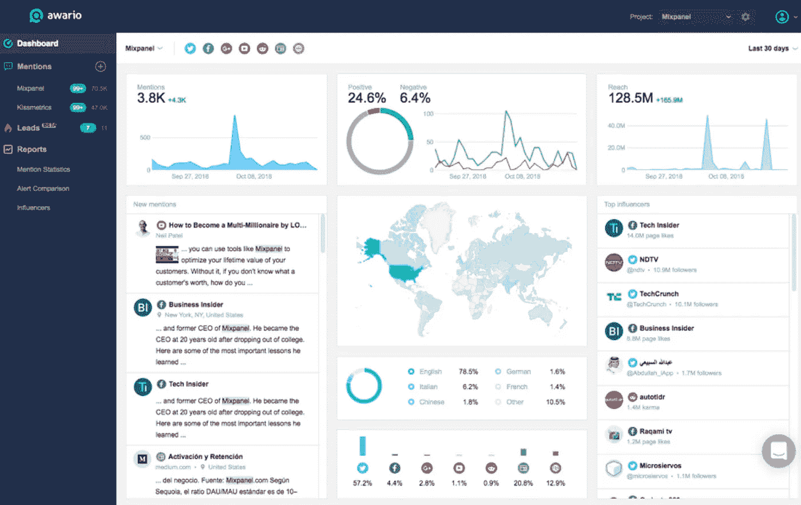

A low-cost social listening dashboard that can be used by marketers.

我们早就知道，twitter 可以用来聚合对人们谈论内容的理解。在许多方面，我们可以获得无与伦比的洞察力，如品牌认知、流行词汇、积极或消极态度以及各种基于感觉的总结。在我的上一份工作中，我使用了一个社交媒体监听仪表板。我能够查询主题，并从某种意义上获得一个“刮刀”来收集网络上的书面内容。我当时并不知道，但这是我第一次涉足非结构化“大数据”背后的挑战。

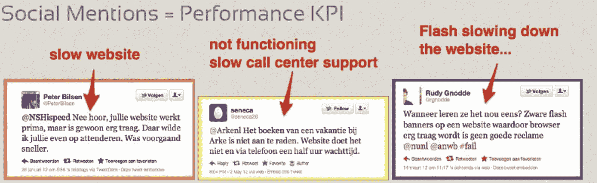

How can I get the summaries of these mentions without reading through each tweet myself? What if all the mentions are not in english? (Source: [http://bit.ly/2LIErFq](http://bit.ly/2LIErFq))

虽然我能够从“野生”中收集想法，但将这些想法总结成意义比我预期的有更多的细微差别。我想制作一个人们在比文字云所能提供的更高层次上所写的思想的浓缩版本。今天，社交倾听平台可以帮助我们理解内容是积极的还是消极的，以及内容可能表达的情感。但是，我还是要看内容，把表达的想法和标签化的情绪联系起来。

通过学习数据科学技能，我明白了我们如何用基本代码解决这些问题。我现在拥有的数据科学工具可以处理数据中的噪音，但不能为我阅读和总结。很长一段时间，我确信有比通过文字云更好的方式来总结内容。然而，经过大量的搜索，我开始接受单词云是非常好的——就目前而言。

收集我自己的推文。

我使用了[提供的收集推文和分析社会情绪](/selenium-tweepy-to-scrap-tweets-from-tweeter-and-analysing-sentiments-1804db3478ac)的教程，来看看为什么云这个词最终会起作用，尽管它感觉被高估了，以及为什么更好的东西很难找到。我将使用关于最近优步 IPO 的零散推文作为数据集的例子。我的问题是，我如何想象几天前围绕优步 IPO 的对话摘要？

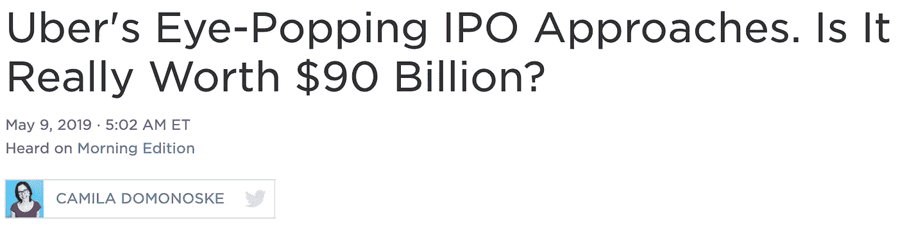

A piece on NPR. (Source: [https://n.pr/2YuWIrk](https://n.pr/2YuWIrk))

```
At this point, follow the code provided by: [Amardeep Chauhan](https://towardsdatascience.com/@amardeepchauhan) in his post [Scraping Tweets And Analyzing Social Sentiment](/selenium-tweepy-to-scrap-tweets-from-tweeter-and-analysing-sentiments-1804db3478ac). 
```

我收集了推文，清理了文本，将他们的情绪符号化，然后将推文分成积极和消极两个情绪组。鉴于要在使用 Tweepy 和 Selenium 之间进行选择，我决定使用 Tweepy 来收集 1057 条推文。Selenium 是我更熟悉的工具，但是如果不登录 Twitter，我的指针永远无法到达我的抓取起点。

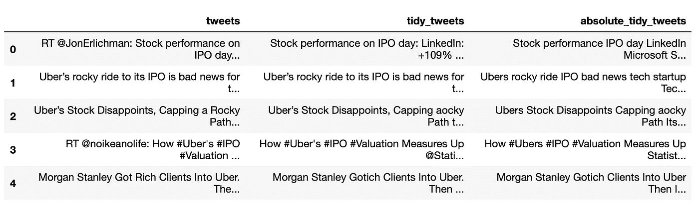

这既是可视化的一课，也是后续教程的一课。似乎有两行代码需要将情感放入数据框中的一个“列”或系列中，而我正在使用的教程中没有:

```
def fetch_sentiment_using_textblob(text):
    sentiment = []
    for i in text: 
        analysis = TextBlob(i)
        # set sentiment 
        if analysis.sentiment.polarity >= 0:
            sentiment.append('positive')
        else: 
            sentiment.append('negative')
    return sentimentCode above by: [Amardeep Chauhan](https://towardsdatascience.com/@amardeepchauhan)**tweet_list = tweets_df['absolute_tidy_tweets'].tolist()****tweets_df['sentiment']= fetch_sentiment_using_textblob(tweet_list)**
```

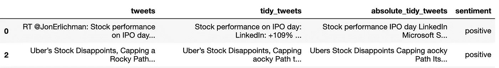

**询问我的分类工具是否有效。**

在这个阶段，我停下来想，我用来分离情感的算法有用吗？例如，如果我只获取正面推文的列表，并使用不同的分类方法获得正面组的总情绪得分，我会看到正面推文组中有一些负面情绪。

{ '正':108，'中性':189，'负':89}

```
sid = SentimentIntensityAnalyzer()
sentiment_summary = dict()
# for readme in readmes:
#     sentences = nltk.tokenize.sent_tokenize(readme)
#     for sentence in sentences:
#         sentiment_score = sid.polarity_scores(sentence)messages = pos_list
summary = {"positive":0,"neutral":0,"negative":0}
for x in messages: 
    ss = sid.polarity_scores(x)
    if ss["compound"] == 0.0: 
        summary["neutral"] +=1
    elif ss["compound"] > 0.0:
        summary["positive"] +=1
    else:
        summary["negative"] +=1
print(summary)Code above by: [Thomas Barrasso](https://itnext.io/@tbarrasso)
```

我也可以比较给我正面和负面分类的算法。在这种情况下，我查看了:a .单词包(简单矢量化)，B. TF-IDF(词频-逆文档频率)。单词包(简单矢量化)产生 0.7745 的 F1 分数，而 TF-IDF 产生 0.79227 的 F1 分数。差不太多！关于 F1 分数意味着什么的更多信息，请看 [Koo Ping Shung](https://towardsdatascience.com/@koolanalytics) 的[这篇文章](/accuracy-precision-recall-or-f1-331fb37c5cb9)。

```
from sklearn.naive_bayes import GaussianNB
from sklearn.model_selection import train_test_split
from sklearn.metrics import f1_score
def naive_model(X_train, X_test, y_train, y_test):
    naive_classifier = GaussianNB()
    naive_classifier.fit(X_train.toarray(), y_train)# predictions over test set
    predictions = naive_classifier.predict(X_test.toarray())

    # calculating f1 score
    print(f'F1 Score - {f1_score(y_test, predictions)}')X_train, X_test, y_train, y_test = train_test_split(bow_word_feature, target_variable, test_size=0.3, random_state=870)
naive_model(X_train, X_test, y_train, y_test)X_train, X_test, y_train, y_test = train_test_split(tfidf_word_feature, target_variable, test_size=0.3, random_state=870)
naive_model(X_train, X_test, y_train, y_test)Code above by [Amardeep Chauhan](https://towardsdatascience.com/@amardeepchauhan)
```

**分享发现。**

所以现在我问我如何与非技术观众分享这些想法。我用柱状图看了一下最常用的词。

```
import matplotlib
import matplotlib.pyplot as plt
%matplotlib inlinex = list(dict(top_15_pos).keys())y = list(dict(top_15_pos).values())plt.barh(x,y, align='center', alpha=0.5)
plt.xlabel('Mentions')
plt.title('Top 15 words used in positive Uber IPO tweets')
```

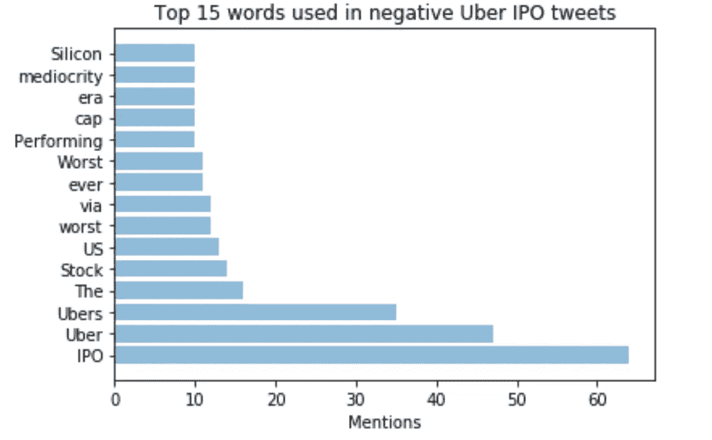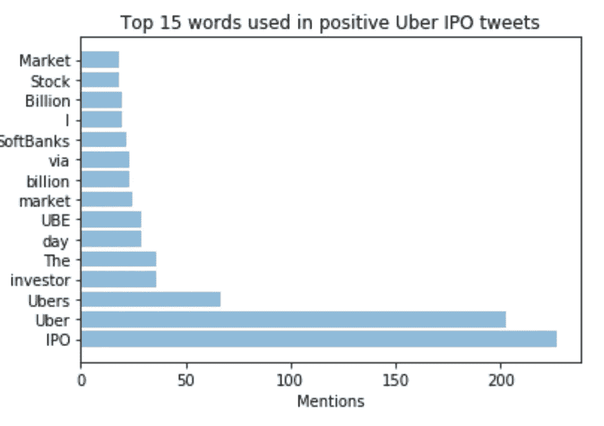

那么更复杂的东西呢？seaborn 库有很多选项，我迭代了很多我认为可能比单词云更直观的选项。然而，我的结论是，尽管有很多“看起来复杂”的可视化工具，但它们中的大多数并不比条形图或文字云更好地分享内容意义。

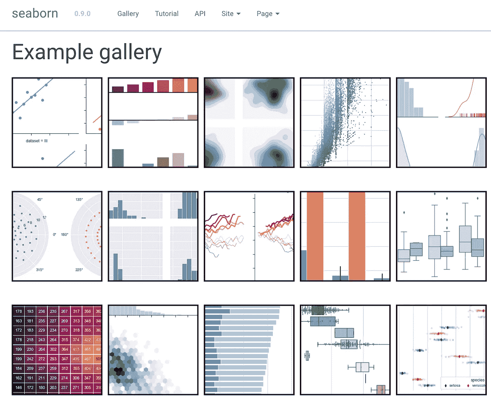

Different visualizations that the seaborn library can help produce.

这些图表实际上没有产生任何进一步的见解。我向我正在使用的情感分析教程的作者询问了他将使用的可视化类型。以下是他的回应:

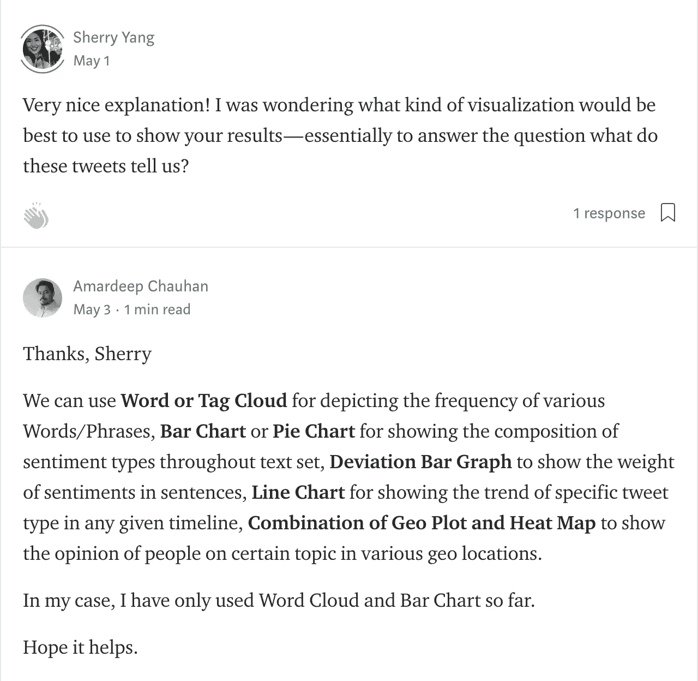

最终，我用这个[教程](https://pythonspot.com/matplotlib-bar-chart/)和下面的代码创建了两个单词云，分别是与积极情绪相关的和与消极情绪相关的。

```
all_words = ' '.join([text for text in pos_df['absolute_tidy_tweets']])
from wordcloud import WordCloud
wordcloud = WordCloud(width=800, height=500, random_state=21, max_font_size=110).generate(all_words)plt.figure(figsize=(10, 7))
plt.imshow(wordcloud, interpolation="bilinear")
plt.axis('off')
plt.show()
```

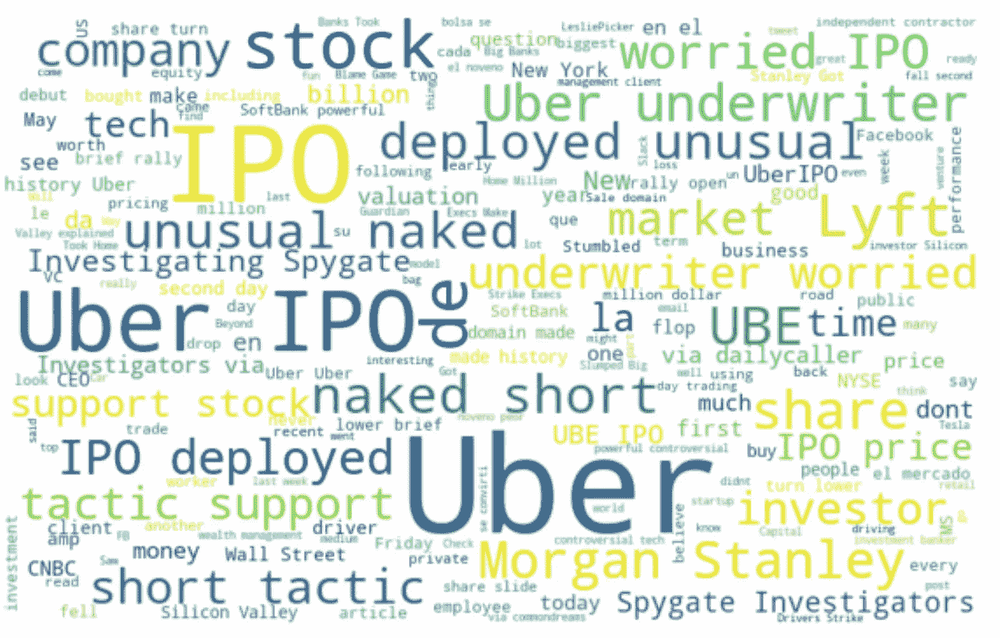

The words that occurred with a positive value for the text.

“云”这个词的有用之处在于，它确实开始成为一些术语超越其他术语的标尺。我也可以用云这个词来说明使用算法是多么有用。消极和积极的可视化中都有共同的词，表明相同的短语在新的上下文中可能意味着不同的事情，并且算法可以从整个短语中消耗信息。

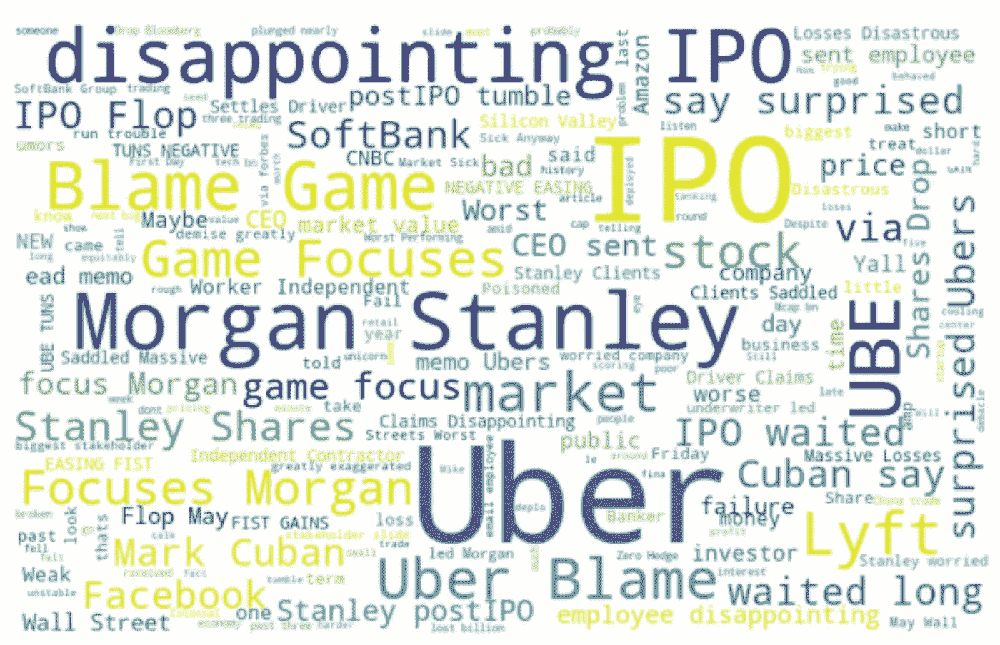

Words that occurred with the negative labeling of text.

但是说我不需要仅仅知道一些新闻是否被正面看待，我需要知道它意味着什么。我无法用更长的短语来总结所有的想法，就像你用文字云从会议记录中得到的笔记一样。我失去了这些短语所在的整个句子的上下文，只能把我自己的解释和外部研究带入这些单词簇。

最后，读一读像这样的文章可能会更有用，这样可以真正理解我们说话时的意思。然而，我确实想以这样一个想法来结束我的演讲:通过深度学习*，我们能够*到[总结整个想法](/text-summarization-using-deep-learning-6e379ed2e89c)，而不仅仅是单词统计。我的一个朋友深入研究了情绪分析的深度学习，我强烈推荐阅读这本书。挑战在于许多主流工具还没有提供这些功能，而且从各方面考虑，单词云也不是那么糟糕的选择。

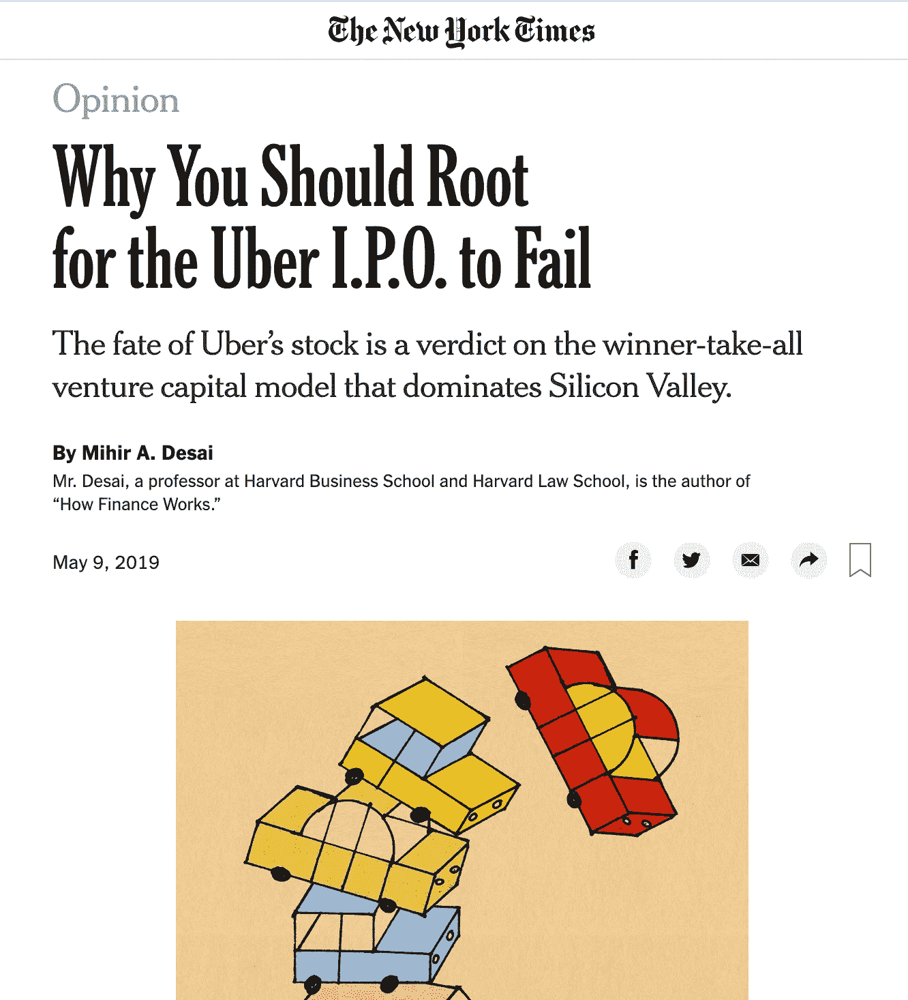

A piece from the New York Times. (Source: [https://nyti.ms/2W1w63j](https://nyti.ms/2W1w63j))