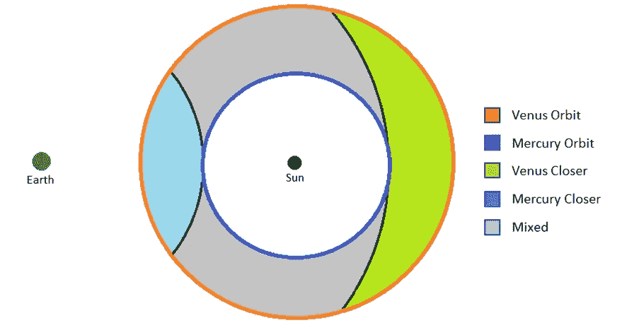
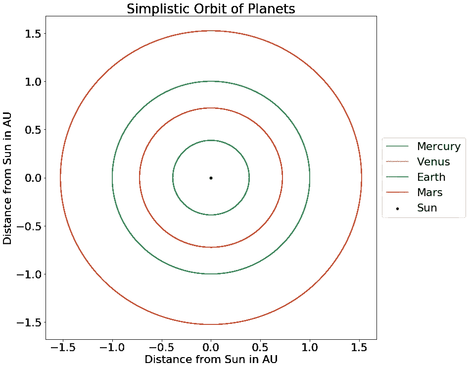

# 挑战传统是数据科学家的一项关键技能

> 原文：<https://towardsdatascience.com/challenging-convention-is-a-key-skill-of-a-data-scientist-a694ce6ff3d7?source=collection_archive---------8----------------------->

如果你看过数据科学中一些更具突破性的部分。让你“惊叹”的部分，比如能够在自己的[游戏](https://www.forbes.com/sites/samshead/2019/01/25/deepmind-ai-beats-professional-human-starcraft-ii-players/#ce76e207cec2)中击败职业选手，数[大群](https://www.analyticsvidhya.com/blog/2019/02/building-crowd-counting-model-python/)人或者检测[癌症](https://medium.springboard.com/how-data-science-enables-early-cancer-diagnosis-6221ae841ae3)。仔细想想，所有这些都是巨大的成就。这些任务中的每一项都需要 100 个小时的练习，对于一台机器来说，能够复制它，更重要的是能够容易地复制，这是令人惊讶的。

但是还有其他的东西在起作用，那就是挑战公认信念的能力。十年前，如果你说机器学习可以做一些它现在能做的事情，人们可能不会相信，这种批判的眼光可能是数据科学家的一个关键资源，也可能说明一个事实，即我们经常遭受比我们意识到的更多的[虚幻真理效应](https://en.wikipedia.org/wiki/Illusory_truth_effect)。这种效应会阻碍机器学习领域的进步。

# 什么是虚幻的真实效果？

这是一种效果，如果你从足够多的来源听到足够多的东西，你会天生相信它。通常这是没有真正质疑的。不相信我？试试这个问题。

# 什么星球离地球近的时间最多？

听起来很简单，我打赌你的第一个想法是金星。但是如果你仔细想想，你为什么会这么想呢？这是因为我们被告知金星比我们离太阳更近，我们已经跳跃性地认为它一定离我们最近。

这个问题受到虚幻的真理效应的影响，因为如果你在网上搜索，你会发现许多文章说金星在大多数情况下或大多数时间最接近地球。

事实上，自从我在 2019 年 3 月 15 日左右写了这篇文章以来，你会发现许多这些链接现在都变低了，因为人们已经发表了许多[文章](https://www.livescience.com/65002-closest-planet-earth.html)来纠正这种信念，但如果你向下扫描搜索结果，你会发现许多这些旧的信念链接。对每个人都好，但对我的论点不好！但几个月前它还是有效的，所以请原谅我。

# 哪个应该更近？

我首先想到的也是金星。但是当你在任何时间点考虑它时，最近的距离取决于每个行星在其轨道上的位置。会有火星、水星或金星比其他任何一个都更靠近地球的时候。但是，如果我们在考虑哪一个离地球更近的时间最长，那么我们会更多地考虑统计数据，希望得到一段时间内的平均值。

我的第一个思想实验是考虑这些轨道。

Orbital Distance Thought Experiment (Credit: Author)

看上面的图，如果我们想到每个行星相对于地球画出的圆(我没有包括偏心率，因为这比我的大脑内部能容纳的数学还要多)。我们从地球画一个半径，接触水星最近和最远的半径。这些区域代表金星总是更近(蓝色)和水星总是更近(绿色)的区域，以及一个灰色区域，其中任何一个都可能更近，但可能平均起来相同。这给了我一种直觉，因为绿色的面积比蓝色的大，所以金星在大多数时候可能不会比水星更近。

但是作为一名数据科学家(或普通科学家)，你需要事实来证明一些事情。所以我转向模拟。

# 基本模拟

我自己算出来的方法是做一个“信封背面”的计算。我取了每个行星的半长轴(我忽略了偏心率)和它们以天为单位的轨道周期。我用 Python(在 Jupyer 的笔记本里)把这个编程到一个简单的太阳系里，把它们排好，让它们运行 100 年。

Simulation of planet orbits assuming no eccentricity.

然后我计算了每个时间点离地球的距离，并计算了中间距离。我有:

*   火星:1.826 天文单位
*   金星:1.231 天文单位
*   水银:1.073 金

(一个天文单位代表[天文单位](https://en.wikipedia.org/wiki/Astronomical_unit)，因为涉及的距离如此之大，他们使用地球到太阳的平均距离。

我选择中值的原因是平均值可能会受到异常值的影响，中值表示一半数据低于该值，一半数据高于该值的值。因此，它在这里工作得很好，因为如果水星有 50%的数据点低于其他两颗行星，它必须比其他两颗行星花更多的时间靠近地球。

我还绘制了一个[经验累积密度函数](https://chemicalstatistician.wordpress.com/2013/06/24/exploratory-data-analysis-conceptual-foundations-of-empirical-cumulative-distribution-functions/)，并绘制了一条 50%的线，与上面的值相匹配。

Empirical Cumulative Density Functions for distances between earth and Mercury, Venus and Mars.

这种距离排序大致符合 [Wolfram Alpha](https://www.wolframalpha.com/input/?i=planets+ranked+by+distance+from+the+earth) 的答案(记得我的模型不包括偏心轨道，有人做了更复杂的东西[这里](https://www.quora.com/Which-planet-spends-the-greatest-share-of-time-closest-to-Earth-Venus-Mars-or-Mercury))。这似乎很违背直觉，但是如果你想到轨道，水星离太阳很近，所以不能移动很远(最多是它的轨道半径加上地球的)，而其他的有更大的范围。如果你想要这些距离的漂亮图形，那么大众机械师有一个[在这里](https://www.popularmechanics.com/space/solar-system/a26839314/closest-planet-to-earth-on-average/)。

我的外卖？不要总是把引用的事实当作真理，做你自己的测试来确认你相信它，你可能会惊讶于假数据是如何传播并成为事实而没有受到质疑或至少没有经过理智检查。通常这仅仅是因为被引用的次数足够多，以至于人们认为它一定是正确的。一点点研究通常可以表明某件事是否现实(基本上更像是笛卡尔的观点)。

这是伟大的数据科学。