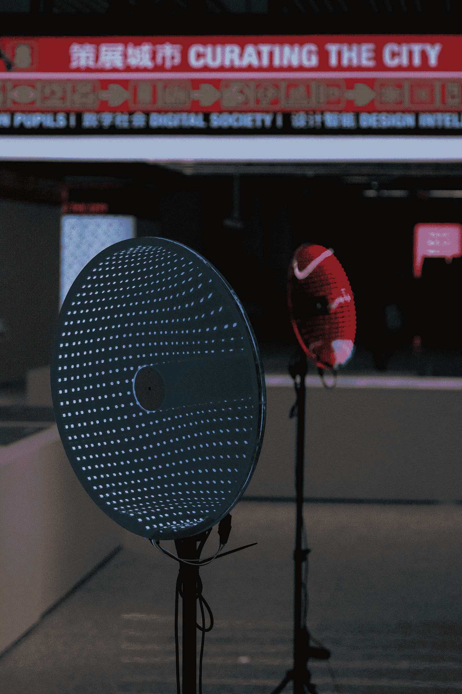

# 如果城市能够感知并回应我们的情绪会怎样？

> 原文：<https://towardsdatascience.com/challenging-emotion-ai-technologies-at-the-worlds-most-attended-architecture-exhibition-in-86b63ea41af0?source=collection_archive---------27----------------------->

## 2019 年深圳双年展上的情感城市装置探索了 e **运动感应人工智能的环境潜力，以感知人类的情绪状态，并通过光和运动表达人工移情**

The Emoting City. Photo Credit:[©](https://fsymbols.com/copyright/)Dalia Tondo (Shared with permission of Shenzhen Biennale)

# 如果城市获得了感知能力并引发人类情感会怎样？

这个项目设想了一个未来的场景，城市变成了一台情感机器。一种由能够看到、感觉到甚至重新配置自身与人类情感相关的功能的元素创造的机器。纵观历史，情商将人类与机器区分开来。虽然人类有一种天生的能力来发现微妙的社会线索并相应地修改行为，但机器系统是确定性的，对人类的感觉漠不关心；通过编程来客观、限制或控制人类行为，从而导致对其使用的怀疑。

“The Emoting City ‘’ conceptual diagram depicting applications and components across 3 layers: artificial, environmental, and human

这种系统的普遍存在有助于在世界范围内新发现的经济和社会效率。然而，常规和消费的强加效应也使人们疏远了他们与生俱来的行为。如果建成的环境能够“看到”和“感觉到”情感，从而唤起新形式的真实的城市景观、欲望和游戏，会怎么样？

基于情感的计算机视觉和人工智能技术的进步将很快使这成为现实。“情感城市”体现了这些技术的物理形式，以展示一个替代的未来，人类与人工智能的交互超越了监视系统和社交机器人的拟人化设计，走向透明的界面，这有助于实现新水平的交互性和自我洞察力。

由一个反应性建筑组件的网络组成，最终的装置将居住者面部表情的情绪解释为新的环境因素。然后，个人情绪通过变换颜色和形式来表现，作为一系列心理状态的必然结果，作为强化或干预。

Layered (transparency and reflection) smart mirror in use. Self-empathy via facial tracking and color change. Infinity mirror effect is achieved through the superposition of two mirrors, whereby one-way film is applied to the front mirror, which creates a series of smaller and smaller reflections which recede to infinity

在元尺度上，算法从个体表达数据中计算出一段时间内的群体情绪指数。最终，用户体验是个人关注的焦点，也是社区建设和景观的焦点。它鼓励游客之间的有意合作，以引发新的反应和城市的情况。

Distributed Cyberception network. [A] Local server. [B] Communication between program instances [C] data dashboard and visualization

“情感城市”位于活跃的福田火车站内，为大型公共空间赋予了一种移情作用，并展示了连接人类思维与城市的建筑的潜力。促进城市的情感感知*眼睛，*该项目倡导负责任地使用机器视觉来庆祝居民的真实愿望，并减轻无处不在的技术的疏远效应。

The Emoting City. Photo Credit:[©](https://fsymbols.com/copyright/)Prospekt (Shared with permission of Shenzhen Biennale)

**C R E D I T S**

激情城市(2019)深圳城市/建筑双年展(UABB)“城市之眼”部分

由[章杰](http://www.jiezhang.com)，塞杰尔·维贾伊·帕特尔，[拉菲·恰克里安](https://www.instagram.com/raffiitch/)

合作者:雷纳塔·莱默斯·莫莱斯、阿尔汉·艾哈迈德、安德烈·巴卢塔、尼基莱什·莫汉

特别感谢:[迪拜设计创新学院](http://www.didi.ae)