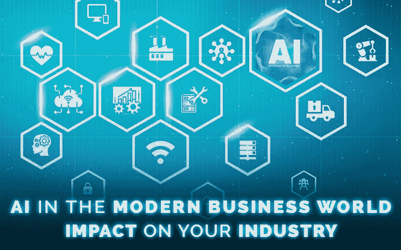
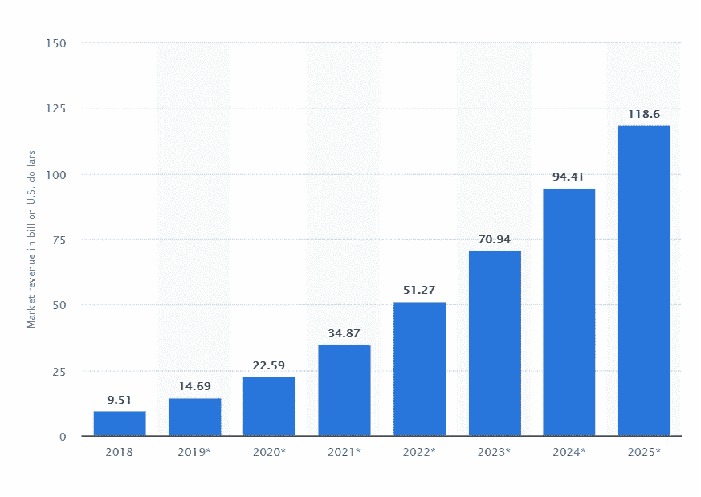

# 21 世纪人工智能革命改变了商业动态

> 原文：<https://towardsdatascience.com/changing-business-dynamics-due-to-ai-revolution-in-the-21st-century-661dae501098?source=collection_archive---------37----------------------->

商业生态系统每天都在随着新技术的引入和发展而不断发展。几乎每个企业都在投资新技术，努力在拥挤的商业环境中保持竞争力..

人工智能(AI)已被证明是技术竞赛中一个有前途的竞争者，并正在帮助企业改善业务流程。

# ***AI 市场收入增长(2018–2025)***

Source: [Statista](https://www.statista.com/statistics/607716/worldwide-artificial-intelligence-market-revenues/) [*The global AI market is expected to cross $118 billion in revenues by 2025.]*

基于人工智能的工具和解决方案的出现正在以前所未有的方式改变着每个领域和行业。在这篇博客中，我们来看看 AI 对博客周围各大行业的影响。

1.  **网络安全&网络基础设施**

[69%](https://www.forbes.com/sites/gilpress/2019/08/28/ai-stats-news-69-of-it-executives-say-they-cannot-respond-to-cybersecurity-threats-without-ai/#3fa758d451dd) 的 IT 高管承认，没有人工智能，他们无法应对网络安全威胁。

人工智能正在提高网络安全分析师的效率。使用人工智能工具和技术，网络安全专家可以自动化威胁检测过程，并全天候分析网络漏洞。

AI 可以使用高级推理，并可以从过去的事件中学习，以改善现代企业内部的网络基础设施。在未来几年，越来越多的公司将开始使用人工智能进行网络监控和对漏洞和黑客的早期响应，从而改变整个网络安全格局。

**2。物流**

整个物流行业都在受益于人工智能技术在提高运输运营效率方面的优势。从智能物流管理系统到智能仓储解决方案。人工智能正越来越多地被物流公司融入到传统的商业运营中。

在客运方面，人工智能也在帮助组织提高服务客户和推动创新的效率。

人工智能进入交通领域的一个最好的例子是自动驾驶汽车和汽车。从优步到谷歌，以及许多其他公司，每个人都在努力完善可以在实际道路上使用的智能驾驶自动化系统。据说，一旦技术成熟到一定程度，智能驾驶会减少道路上的事故。

人工智能还将在未来优化道路交通流量和公共交通时间表。

**3。制造**

由于人工智能(AI)，自动化正在成为制造业的现实。未来，工厂将会在智能网络上运行，由机器人完成大部分危险任务。这不仅会提高生产单位的生产率，还会减少因人工干预而发生事故的机会。

在未来，人工智能驱动的协作机器人的概念将彻底改造我们所知的制造业。机器人将与人类一起工作，提高安全标准，同时提高工厂的利润。事实上，一项研究显示，合作机器人市场将很快超过 10 亿美元。

**4。医疗保健**

由于其数据管理和分析能力，人工智能在提高向患者提供医疗保健的质量方面具有惊人的潜力。ML 可以帮助护理人员发现大群体中的异常和模式，提高准备状态。

人工智能在医疗保健领域的最大影响是数据分析能力。最常见的情况是，医疗保健机构拥有大量与患者相关的医疗保健数据。人工智能可用于从存储的医疗保健数据中获取意义，以找出模式并提高诊断和治疗的质量。

IBM 等公司已经在使用其智能系统 Watson 来创建智能诊断系统，该系统可以推荐潜在的行动方案和治疗计划。

**5。施工**

建筑行业可以从人工智能中受益匪浅。最重要的使用案例与使用智能分析改进工作流程和最大限度地减少材料浪费有关。使用人工智能，可以分析建筑和施工模型，以识别漏洞并有效地降低施工成本。

**6。高级护理**

除了普通医疗保健，人工智能(AI)也在改善老年人和护理过程。基于人工智能的工具可以用于持续监控老年人的健康状况，并在紧急情况下自动发出红色警报。作为一种充分证明、零错误的技术，人工智能可以取代容易出现差异的过时技术。

未来，我们将看到智能人工智能助手的引入，可以添加到他们的家中和高级护理中心，以提供更好的护理。

**7。零售&电子商务**

在不久的将来，零售和电子商务领域作为一个行业有着惊人的增长潜力。随着基于人工智能的工具和技术的引入，这些细分市场正在改善购物体验。一些最大的电子商务和零售公司越来越多地利用人工智能和机器学习来提供个性化的购物建议。

基于人工智能的算法正在改变电子商务网站为其潜在和现有客户服务的方式。同样，零售商店越来越多地寻找在商店内添加基于人工智能的解决方案的方法，以更好的方式取悦和满足他们的客户。

人工智能驱动的聊天机器人还被零售部门用于客户服务运营，增强了受害客户的互动和满意度。

**8。商业智能**

可能，人工智能最早的用例之一是在商业智能领域。成长中的企业已经开始利用海量数据来制定跨部门的数据驱动型决策。从人力资源到生产，从销售到营销，每个人都在使用人工智能商业智能解决方案来改善业务运营。

在未来几年，商业智能将进一步发展，以帮助组织在客户服务、产品开发和有针对性的营销方面变得更好，这一切都要归功于人工智能革命。

**9。城市规划与管理**

人工智能(AI)在城市规划、发展和管理中的应用将提高整个城市基础设施发展的效率。人工智能可以用来收集和分析有用的见解，这将有助于管理员了解居民希望从城市的设施，公共交通，公用事业等方面得到什么。

**10。银行&金融**

银行和金融部门正在非常有效地使用人工智能(AI ),这一趋势在不久的将来将继续发展。基于人工智能的聊天机器人将在该领域普遍出现，以解决客户查询，甚至分析市场，提供个性化的投资建议。

由于人工智能可以非常容易和快速地分析大量数据，银行和投资业务可以从该技术中受益匪浅。根据行业估计，在未来 5 年内，人工智能将管理很大一部分财富。

算法交易也与时俱进。人工智能将提高自动化交易的准确性。此外，银行可以使用人工智能来评估贷款申请，并简化审批流程。对于保险业来说，人工智能也将通过指导用户根据他们的生活方式，收入和未来的财务义务购买哪些计划和产品来改善客户体验。

11。教育

学习领域也将受益于人工智能的力量。人工智能将有助于改进课程，并帮助教师根据每个学生的兴趣和潜力创建个性化的学习计划和课程。

此外，基于人工智能的工具可以通过跟踪学生的表现模式并自行建议纠正未来的行动来改善学习、准备和能力分析。

**12。时尚**

人工智能技术对时尚产业有很多潜在的影响。首先，人工智能可以通过分析过去的数据来预测未来的时尚趋势。基于人工智能的购物助手也是一个巨大的潜在用例，可以帮助时尚人士和时尚品牌改善客户体验。

除此之外，AI 肯定有潜力通过自动化从制造到库存管理、物流管理和有针对性的营销活动的几个过程来协助新产品线的生产。

**13。供应链管理**

供应链管理也是核心领域之一，人工智能将带来积极的突破。人工智能不仅会改善一般流程，还会帮助预测未来的任务和情况，这将有助于降低风险和降低供应链管理的成本。

在供应链生态系统中，数据驱动的决策将减少因人为偏差而导致的错误。从长远来看，这将改善几个业务部门的整个供应链运作。

**遗言**

人工智能正在改变我们多年来熟知的传统行业。在未来十年，我们将看到人工智能驱动的工具成为我们日常生活中至关重要的一部分。公司也将最大限度地利用人工智能，变得更加以客户为中心，实现他们的商业目标。

目前，从零售到电子商务，医疗保健到教育，几乎每个领域都需要人工智能驱动的工具。一家人工智能开发公司可以通过设计和部署由人工智能驱动的面向未来的工具来帮助几家企业提高利润。为了让企业在未来几年蓬勃发展，他们需要对人工智能技术进行战略性投资，并找到一家有能力的[人工智能开发公司](https://www.azilen.com/services/artificial-intelligence/)作为他们的长期颠覆合作伙伴。