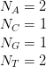

# 遗传序列的混沌博弈表示

> 原文：<https://towardsdatascience.com/chaos-game-representation-of-a-genetic-sequence-4681f1a67e14?source=collection_archive---------14----------------------->

> 这是我关于生物信息学领域的第二篇文章，我们将一个基因序列呈现为一个混沌游戏表示图。通过这一系列的文章，我希望我能让更多的人对生物信息学感兴趣。

混沌游戏表示是一个序列的图形表示。这是一种将长的一维序列(在我们的例子中是基因序列)转换成图形形式的方法。这是一种新的整体方法，提供了一个 DNA 序列的视觉图像，与传统的核苷酸线性排列完全不同。CGR 可以识别核苷酸序列中的模式，这些模式是使用分形结构技术，通过将 DNA 序列视为由 A、T、C 和 g 四个单元组成的字符串，从一类基因的数据库中获得的

这种模式识别依赖于视觉识别。它是非随机输入在迭代函数系统中的应用。该方法最初是针对 DNA 序列提出的，现在正被用于任何任意符号。CGR 展示了基因组的显著模式特征。由于模式对基因组来说是独特的，这可以用来识别基因组片段或检测水平基因转移。此外，CGR 模式的定量分析可用于序列比较，用 CGR 进行无比对和基于比对的序列比较都是可能的。

这就是科学介绍，现在让我们从基础开始。核苷酸是一种分子，当它们结合在一起时，构成了核酸 RNA 和 DNA 的单个结构单元。我们有四种不同的核苷酸。腺嘌呤(A)、胸腺嘧啶(T)、胞嘧啶(C)、鸟嘌呤(G)。为了配合化学反应，这里有一些化学公式:

Our respective actors in this article, adenine, thymine, guanine and cytosine.

在我们的例子中，我们将分析生物序列，更具体地说，DNA 序列。生物序列被定义为:

由于我们将分析 DNA，我们的序列将被定义为:

为了开始绘制我们的混沌游戏表示，我们必须先计算我们的 k-mers。什么是 k-mers？术语 k-mer(或 x-mer，其中 x 实际上可以是任何选择的辅音)通常指核酸或氨基酸序列的特定 n-元组或 n-gram，其可用于识别生物分子如 DNA(用于基因预测)或蛋白质中的某些区域。这样的 k-mer 串可以用于寻找感兴趣的区域，或者使用给出许多可能的 k-mer 组合(或者具有重复的排列)的离散概率分布的 k-mer 统计。特定的短 k-聚体被称为寡聚物或简称“寡聚物”。为了简单地解释这一点，让我们看一个简短的序列

所以如果我们计算 1 聚体的数量，那只是核苷酸出现的数量。因此，在我们的示例中，出现的情况是:

在我们写算法之前，让我们看一下 Genbank 和 FASTA 文件格式。Genbank 是所有公开可用的 DNA 序列的注释集合，这些文件以 FASTA 格式编写。FASTA 格式包含一个标题和 DNA 序列。因此，我们将分析 *NC_012920* 文件，这是智人线粒体，你可以通过搜索 Genbank 数据库或从[这里](http://ge.tt/3q9IIOQ/v/0?c)获得该文件。在我们开始分析序列之前，让我们写一些代码来读取文件。

Reading the FASTA file.

这是最基本的东西，我们读取文件，把新的线连接起来，这样我们就形成了一个大的基因串。现在我们需要计算 k-mers 在序列中的出现次数。我们来写一个方法 *count_kmers* :

Counting k-mers.

在我们的例子中，序列参数是数据，k 是一个整数。你可能已经注意到我们从字典中删除了一个 N。我们正在分析的序列也包含一个 N，这个 N 可以是 A、C、G 或 T 中的任何一个，这取决于概率。因为序列中只有一个 N，所以我们忽略它。

现在我们已经得到了 k-mer，我们需要计算 k-mer 出现的概率。如果你记得你的概率和统计课，这应该是一个简单的问题。如果我们定义

作为基因结构中的一个子序列，出现的概率

是

在哪里

是序列的长度

是 k-mer 的长度

是 k-mer 出现的次数。

现在让我们写一些 Python 代码来计算这个。

Calculating the probabilities.

现在混沌游戏的基本表现已经完成。现在让我们解释什么是 CGR。CGR 是序列的广义尺度无关马尔可夫概率表，寡聚体表可以从 CGR 图像推导出来。CGR 通过以下程序生成:

CGR pseudo code.

我们试图编写的程序将创建一个图像，显示给定序列中所有 k-mers(长度为 k 的寡核苷酸)的丰度。例如，对于四聚体(k=4)，得到的图像将由以下组成

方框，每个代表一个低聚物。寡聚物名称和丰度写在这些方框内，丰度也用方框颜色显示，从白色(无)到黑色(高频率)。这个 k-mer 表也称为 FCGR(从混沌游戏表示中提取的频率矩阵)。

A k-mer table example for CGR.

如果你问自己为什么 4 的 4 次方，这是概率和统计的基础。如果我们有一个长度为 4 的 k-mer，每个点有四个可能的值(A，C，G，T)，那么我们有

可能的组合。基本上，我们在做一个二维数组。我们可以用下面的公式来计算它的大小

在哪里

是 k-mer 的长度。现在我们需要计算低聚物的位置。寡聚体的位置可以递归定位如下:

对于低聚物中的每个字母，一个盒子被细分为四个象限，其中 A 是左上，T 是右下，G 是右上，C 是左下。因此，低聚物 ACGT 是在

*   A =左上象限
*   C =上象限内的左下方
*   G =上方象限内的右上
*   T =上述象限内的右下方

How the quadrants work when representing a gene structure.

现在让我们写一些代码。现在我们可以使用递归，但我们不会这样做，因为我们可以用数学方法计算元素的位置。

Calculating CGR array.

该方法采用两个参数，第一个是 k-mer 概率的字典，第二个是 k-mer 长度。首先，我们使用上面的公式计算数组大小，然后初始化 maxx、maxy、posx 和 posy 变量。然后我们遍历所有的键，对于每个键，我们计算 k-mer 在表中的位置。

现在让我们把所有东西放在一起，运行程序。

我们最终的结果是两张图片:

CGR representation of 3-mers of the NC_012920 sequence.

CGR representation of 4-mers of the NC_012920 sequence.

## 参考

1.  H.乔尔·杰弗里，“基因结构的混沌游戏表示”，收录于*核酸研究，第 18 卷，第 8 号*，1990 年，第 2163–2170 页。
2.  混沌游戏表现。在线:[http://www . lifen science . com/bio informatics/chaos-game-representation](http://www.lifenscience.com/bioinformatics/chaos-game-representation)
3.  K-mer。在线:【http://en.wikipedia.org/wiki/K-mer 
4.  CGR G 语言项目。在线:[http://www.g-language.org/wiki/cgr](http://www.g-language.org/wiki/cgr)
5.  Wolfram Mathematica 中的 CGR 表示。在线:[https://community.wolfram.com/groups/-/m/t/920422](https://community.wolfram.com/groups/-/m/t/920422)