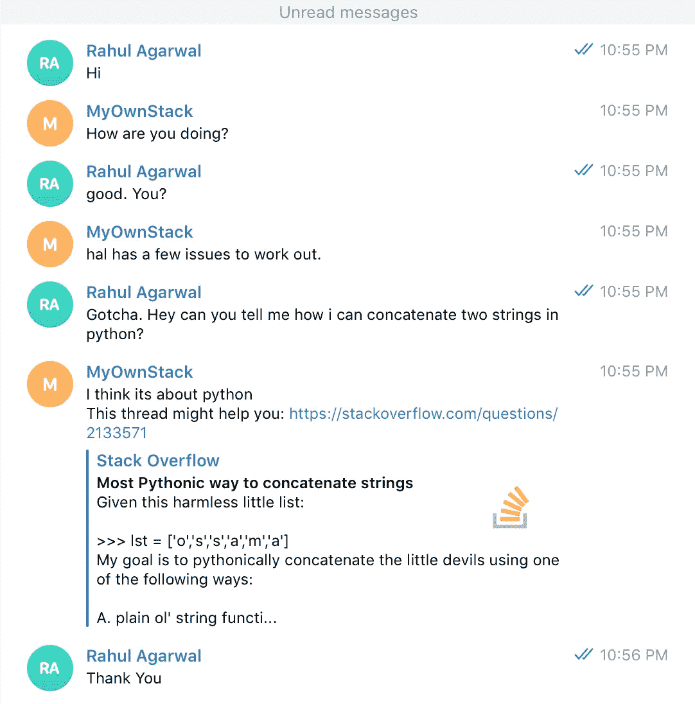
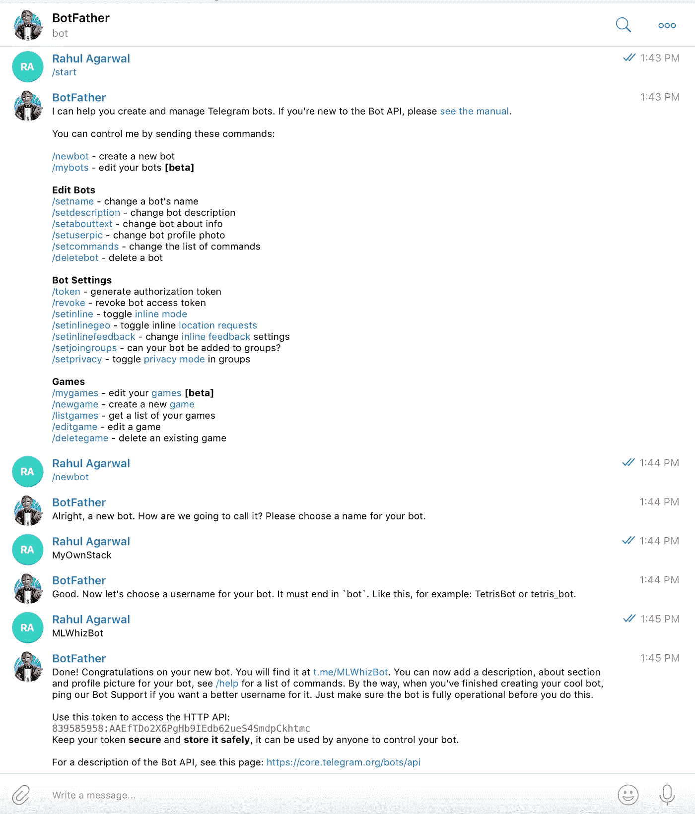
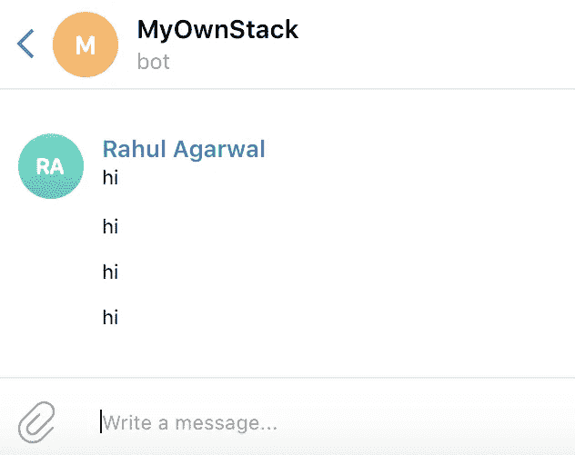
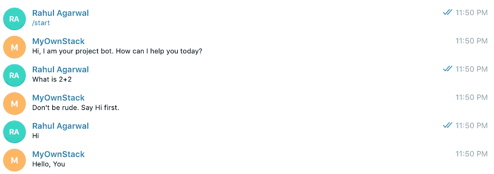
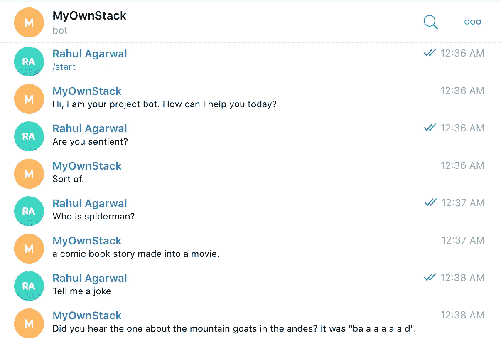
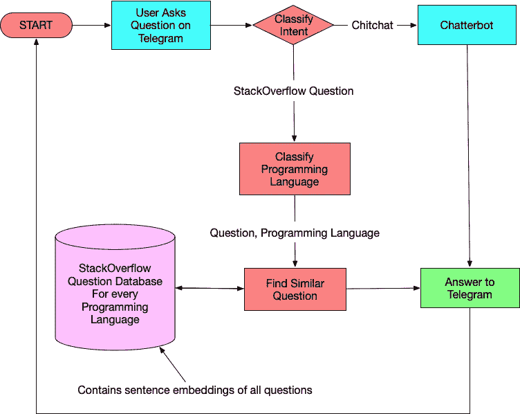
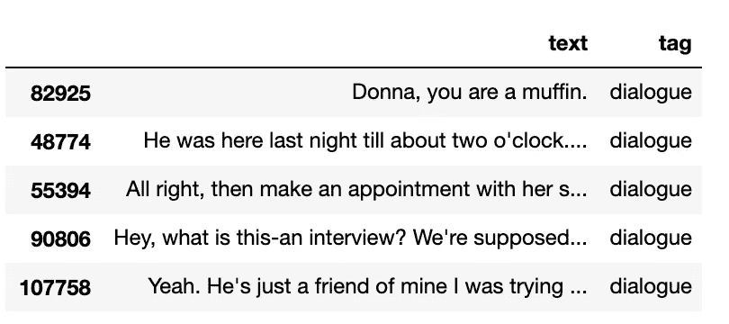
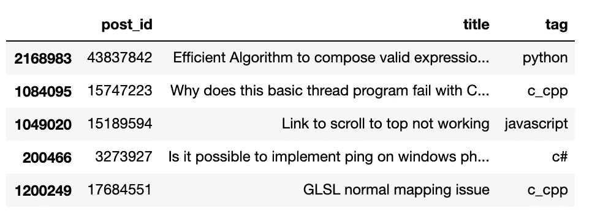

# 聊天机器人没有你想象的那么难制造

> 原文：<https://towardsdatascience.com/chatbots-arent-as-difficult-to-make-as-you-think-f7f90255b993?source=collection_archive---------12----------------------->

## [NLP 学习系列](https://towardsdatascience.com/tagged/nlp-learning-series)

## 达斯·维德的聊天机器人指南

聊天机器人。聊天机器人。到处都是聊天机器人。

每个网站都必须执行。每个数据科学家都必须了解它们。每当我们谈论人工智能的时候；聊天机器人必须讨论。

*但他们会威胁到这个领域的新手。甚至在我们开始着手解决问题之前，我们就已经纠结于许多问题了。*

它们很难创造吗？在使用这些技术之前，我应该了解哪些技术？

最后，我们最终沮丧地阅读了网上那么多的帖子，却一事无成。


Photo by [Katarzyna Pe](https://unsplash.com/@kasiape?utm_source=medium&utm_medium=referral) on [Unsplash](https://unsplash.com?utm_source=medium&utm_medium=referral)

*我向你保证，这不会是“那种帖子”。*

我将尝试从我在 [**高级机器学习专业化**的](https://coursera.pxf.io/yRPoZB) [**自然语言处理**](https://coursera.pxf.io/yRPoZB) 课程中的一个项目中提取一些知识。

所以在我开始之前，让我先说不要被围绕聊天机器人的炒作和谜团吓倒。他们使用了我们大多数人都已经知道的非常简单的自然语言处理技术。

如果你不知道，欢迎你来看看我的[](https://towardsdatascience.com/tagged/nlp-learning-series)**NLP 学习系列，在这里我用[](https://mlwhiz.com/blog/2019/02/08/deeplearning_nlp_conventional_methods/)**[**深度学习**](https://mlwhiz.com/blog/2019/03/09/deeplearning_architectures_text_classification/) 和 [**迁移学习**](https://mlwhiz.com/blog/2019/03/30/transfer_learning_text_classification/) 的方法详细地讲解了文本分类的问题。****

****另外，如果你对在工作中使用的定制深度学习工作站或服务器感兴趣，Exxact Corporation 有一系列基于人工智能的解决方案，起价为 3700 美元，带有几个英伟达 RTX 30 系列 GPU，3 年保修和深度学习软件堆栈。****

# ****聊天机器人的简短介绍****

****因此，我们可以从逻辑上将聊天机器人分为以下两类。****

*   ******基于数据库/常见问题解答的** —我们有一个带有一些问题和答案的数据库，我们希望用户可以使用自然语言查询数据库。这就是你在大多数银行网站上找到的那种回答常见问题的聊天机器人。****
*   ******基于聊天的** —模拟与用户的对话。这些聊天机器人给聊天机器人带来了乐趣。我们可以使用 Seq-2-Seq 模型和编码器-解码器架构来创建这样的机器人。****

# ****StackOverflow 聊天机器人****

****我们将创建一个**对话聊天机器人**，它将能够:****

*   ******回答编程相关问题**(使用 StackOverflow 数据集)****
*   ******闲聊**并就所有与编程无关的问题进行模拟对话****

****一旦你将它安装并运行，我们最终的聊天机器人应该是这样的。****

********

****The Final Chatbot we will create****

****好像挺好玩的。****

****我们将借助 Telegram 和 Chatterbot 等资源来构建我们的聊天机器人。因此，在我们开始之前，我应该让您开始使用这两个工具。****

# ****1.电报:****

****来自 [**网站**](https://telegram.org/faq#q-what-is-telegram-what-do-i-do-here) :****

> *****Telegram 是一款专注于速度和安全的消息应用，它超级快速、简单且免费。您可以同时在所有设备上使用 Telegram 您的信息可以在任意数量的手机、平板电脑或电脑之间无缝同步。*****

****对于我们来说， ***Telegram 为我们提供了一个创建聊天机器人 UI*** 的简单方法。它为我们提供了一个访问令牌，我们将使用它来连接到 Telegram 应用程序后端并运行我们的 chatbot 逻辑。****

****自然，我们需要一个窗口，在那里我们可以向聊天机器人写问题，这是通过电报提供的。此外，telegram 通过与我们的聊天机器人逻辑进行通信来为聊天机器人提供动力。以上截图仅取自 telegram app。****

# ****设置电报:****

****如果你还不明白它是如何工作的，也不要担心；在我们前进的过程中，我会试着给出一步一步的指示。****

*   ****第一步: [**在笔记本电脑上下载安装**](https://macos.telegram.org/) 电报 App。****
*   ****第二步:在 Chrome 中打开这个 [**链接**](https://telegram.me/BotFather) ，随后在你的 Telegram 应用中打开，与僵尸父亲对话。****
*   ****第三步:以上步骤将带你到一个名为 Botfather 的聊天机器人，它可以帮助你创建一个新的机器人。 ***盗梦空间有人吗？*** 大概会是这个样子。****
*   ****a)使用命令“/newbot”设置一个新的机器人****
*   ****b)为您的机器人创建一个名称。****
*   ****c)为你的机器人创建一个用户名。****

********

****Inception!!!****

*   ****步骤 4:您将获得一个 bot 的访问令牌。**在安全的地方复制令牌。******
*   ****第五步:点击“t.me/MLWhizbot”链接，在新窗口中打开与聊天机器人的聊天。****

****现在，如果你试图与聊天机器人交流，你不会得到任何答案。这就是它应该的样子，因为我们还没有写任何逻辑。****

********

****Unresponsive…. Not Cool****

****但这一点也不好玩。是吗？让我们用 python 变变魔术，让它反应灵敏。****

# ****让我们的电报聊天机器人响应****

****创建一个文件`main.py`并将下面的代码放入其中。不要担心，这里的大部分代码是样板代码，让我们的聊天机器人使用访问令牌与电报通信。****

****我们只需要担心实现类`SimpleDialogueManager`。这个类包含一个名为`generate_answer`的函数，我们将在这里编写我们的机器人逻辑。****

****Simple main.py code****

****现在，您可以在终端窗口中运行文件`main.py`来使您的 bot 做出响应。****

```
**$ python main.py**
```

********

****A very Naive Chatbot****

****很好。它遵循简单的逻辑。但好消息是我们的机器人现在做了一些事情。****

****如果你到了这里，稍微祝贺一下自己吧。我们在这里取得的成就是不平凡的。****

****另外，看看我们运行`main.py`文件的终端窗口。每当用户提问时，我们会得到下面的那种字典，其中包含唯一的聊天 ID、聊天文本、用户信息等。我们以后可以根据需要使用它。****

```
**Update content: {'update_id': 484689748, 'message': {'message_id': 115, 'from': {'id': 844474950, 'is_bot': False, 'first_name': 'Rahul', 'last_name': 'Agarwal', 'language_code': 'en'}, 'chat': {'id': 844474950, 'first_name': 'Rahul', 'last_name': 'Agarwal', 'type': 'private'}, 'date': 1555266010, 'text': 'What is 2+2'}}**
```

****到目前为止，我们所做的都是一些设置和工程方面的工作。****

****现在，如果我们能在`main.py`中的`generate_answer`函数中编写一些合理的数据科学逻辑，我们应该有一个像样的聊天机器人。****

# ****2.说话机器人计算机程序****

****从文档中:****

> *****ChatterBot 是一个 Python 库，可以很容易地对用户的输入生成自动响应。ChatterBot 使用一系列机器学习算法来产生不同类型的反应。这使得开发人员可以轻松创建聊天机器人，并自动与用户对话。*****

****很简单。这是一个黑盒系统，可以为我们的聊天机器人提供聊天类型问题的回答。****

****最棒的是，它很容易与我们当前的流程集成。****

****我们也可以训练一个 SeqtoSeq 模型来做同样的事情。也许我会在以后的文章中这样做。我跑题了。****

****所以，让我们安装它:****

```
**$ pip install chatterbot**
```

****并将 main.py 中的`SimpleDialogueManager`类更改为以下内容。我们可以有一个机器人，它可以与用户交谈并回答随机查询。****

```
**class SimpleDialogueManager(object):
    """
    This is a simple dialogue manager to test the telegram bot.
    The main part of our bot will be written here.
    """
    def __init__(self):
        from chatterbot import ChatBot
        from chatterbot.trainers import ChatterBotCorpusTrainer
        chatbot = ChatBot('MLWhizChatterbot')
        trainer = ChatterBotCorpusTrainer(chatbot)
        trainer.train('chatterbot.corpus.english')
        self.chitchat_bot = chatbot **def generate_answer(self, question): 
        response = self.chitchat_bot.get_response(question)
        return response****
```

****`init`中的代码使用 chatterbot 实例化一个聊天机器人，并在 [**提供的英语语料库**](https://github.com/gunthercox/chatterbot-corpus/tree/master/chatterbot_corpus/data/english) 数据上训练它。****

****数据很小，但是你也可以在你的数据集上训练它。就看 [**文档**](https://chatterbot.readthedocs.io/en/stable/training.html) 。然后，我们可以在`generate_answer`函数中使用 Chatterbot 聊天机器人给出我们的响应。****

********

****我必须说，不要太“巴阿阿阿阿阿阿阿”了。****

# ****创建我们的 StackOverflow 聊天机器人****

****好了，我们终于到了可以做自己喜欢的事情的阶段。使用数据科学推动我们的应用/聊天机器人。****

****让我们从创建一个我们下一步要做的粗略架构开始。****

********

****The Architecture of our StackOverflow Chatbot****

****我们需要创建两个分类器，并将它们保存为`.pkl`文件。****

1.  ******意图分类器**:该分类器将预测一个问题是否是堆栈溢出问题。如果不是堆栈溢出问题，我们让 Chatterbot 来处理。****
2.  ******编程语言(标签)分类器**:如果问题是堆栈溢出问题，该分类器将预测问题属于哪种语言。我们这样做是为了只在我们的数据库中搜索那些语言问题。****

****为了简单起见，我们将创建简单的 TFIDF 模型。我们需要保存这些 TFIDF 矢量器。****

****我们还需要存储每个问题的单词向量，以便稍后进行相似度计算。****

****让我们一步一步地经历这个过程。您可以在我的 [**项目资源库**](https://github.com/MLWhiz/data_science_blogs/tree/master/chatbot) 中的这个 [**jupyter 笔记本**](https://github.com/MLWhiz/data_science_blogs/blob/master/chatbot/Model%20Creation.ipynb) 中获取完整代码。****

## ****第一步。读取和可视化数据****

```
**dialogues = pd.read_csv("data/dialogues.tsv",sep="\t")
posts = pd.read_csv("data/tagged_posts.tsv",sep="\t")dialogues.head()**
```

********

****Dialogues Data****

```
**posts.head()**
```

********

****StackOverflow Posts data****

```
**print("Num Posts:",len(posts))
print("Num Dialogues:",len(dialogues))**
```

****`*Num Posts: 2171575
Num Dialogues: 218609*`****

## ****步骤 2:为意图分类器创建训练数据—聊天/堆栈流问题****

****为此，我们将创建一个带有逻辑回归的 TFIDF 模型。如果你想了解 TFIDF 型号，你可以在这里阅读[。](https://mlwhiz.com/blog/2019/02/08/deeplearning_nlp_conventional_methods/)****

****我们也可以使用一种深度学习模型或迁移学习方法来做到这一点，但由于这篇文章的主要目标是启动并运行聊天机器人，而不是太担心准确性，我们只使用基于 TFIDF 的模型。****

```
**texts  =  list(dialogues[:200000].text.values) + list(posts[:200000].title.values)
labels =  ['dialogue']*200000 + ['stackoverflow']*200000
data = pd.DataFrame({'text':texts,'target':labels})def text_prepare(text):
    """Performs tokenization and simple preprocessing."""

    replace_by_space_re = re.compile('[/(){}\[\]\|@,;]')
    bad_symbols_re = re.compile('[^0-9a-z #+_]')
    stopwords_set = set(stopwords.words('english')) text = text.lower()
    text = replace_by_space_re.sub(' ', text)
    text = bad_symbols_re.sub('', text)
    text = ' '.join([x for x in text.split() if x and x not in stopwords_set]) return text.strip()# Doing some data cleaning
data['text'] = data['text'].apply(lambda x : text_prepare(x))X_train, X_test, y_train, y_test = train_test_split(data['text'],data['target'],test_size = .1 , random_state=0)print('Train size = {}, test size = {}'.format(len(X_train), len(X_test)))**
```

****`*Train size = 360000, test size = 40000*`****

## ****第三步。创建意图分类器****

****这里，我们创建一个 TFIDF 矢量器来创建要素，并训练一个逻辑回归模型来创建 intent_classifier。请注意我们是如何将 TFIDF 矢量器保存到`resources/tfidf.pkl`并将 intent_classifier 保存到`resources/intent_clf.pkl`的。****

****一旦我们要为最终的聊天机器人编写`SimpleDialogueManager`类，我们将需要这些文件。****

```
**# We will keep our models and vectorizers in this folder
!mkdir resourcesdef tfidf_features(X_train, X_test, vectorizer_path):
    """Performs TF-IDF transformation and dumps the model."""
    tfv = TfidfVectorizer(dtype=np.float32, min_df=3,  max_features=None, 
            strip_accents='unicode', analyzer='word',token_pattern=r'\w{1,}',
            ngram_range=(1, 3), use_idf=1,smooth_idf=1,sublinear_tf=1,
            stop_words = 'english')

    X_train = tfv.fit_transform(X_train)
    X_test = tfv.transform(X_test)

    pickle.dump(tfv,vectorizer_path)
    return X_train, X_testX_train_tfidf, X_test_tfidf = tfidf_features(X_train, X_test, open("resources/tfidf.pkl",'wb'))intent_recognizer = LogisticRegression(C=10,random_state=0)
intent_recognizer.fit(X_train_tfidf,y_train)
pickle.dump(intent_recognizer, open("resources/intent_clf.pkl" , 'wb'))# Check test accuracy.
y_test_pred = intent_recognizer.predict(X_test_tfidf)
test_accuracy = accuracy_score(y_test, y_test_pred)
print('Test accuracy = {}'.format(test_accuracy))**
```

****`*Test accuracy = 0.989825*`****

****意图分类器有相当好的 98%的测试准确率。TFIDF 没那么差。****

## ****步骤 4:创建编程语言分类器****

****让我们首先为编程语言分类器创建数据，然后使用 TFIDF 特性训练一个逻辑回归模型。我们将这个标签分类器保存在位置`resources/tag_clf.pkl`。****

****我们做这一步主要是因为我们不想对整个问题数据库进行相似性计算，而只是根据语言标签对问题子集进行相似性计算。****

```
**# creating the data for Programming Language classifier 
X = posts['title'].values
y = posts['tag'].valuesX_train, X_test, y_train, y_test = train_test_split(X, y, test_size=0.2, random_state=0)
print('Train size = {}, test size = {}'.format(len(X_train), len(X_test)))**
```

****`*Train size = 1737260, test size = 434315*`****

```
**vectorizer = pickle.load(open("resources/tfidf.pkl", 'rb'))
X_train_tfidf, X_test_tfidf = vectorizer.transform(X_train), vectorizer.transform(X_test)
tag_classifier = OneVsRestClassifier(LogisticRegression(C=5,random_state=0))
tag_classifier.fit(X_train_tfidf,y_train)
pickle.dump(tag_classifier, open("resources/tag_clf.pkl", 'wb'))# Check test accuracy.
y_test_pred = tag_classifier.predict(X_test_tfidf)
test_accuracy = accuracy_score(y_test, y_test_pred)
print('Test accuracy = {}'.format(test_accuracy))**
```

****`*Test accuracy = 0.8043816124241622*`****

****又不赖。****

## ****步骤 5:存储问题数据库嵌入****

****人们可以使用来自 Google 的 [**预训练词向量**](https://code.google.com/archive/p/word2vec/) 或者通过使用他们的数据训练他们的嵌入来获得更好的结果。****

****因为准确度和精确度不是这篇文章的主要目标，我们将使用预训练向量。****

```
**# Load Google's pre-trained Word2Vec model.
model = gensim.models.KeyedVectors.load_word2vec_format('GoogleNews-vectors-negative300.bin', binary=True)**
```

****我们希望将每个问题转换为一个嵌入并存储它们，这样我们就不用每次都计算整个数据集的嵌入。****

****本质上，每当用户提出堆栈溢出问题时，我们都希望使用某种距离相似性度量来获得最相似的问题。****

```
**def **question_to_vec**(question, embeddings, dim=300):
    """
        question: a string
        embeddings: dict where the key is a word and a value is its' embedding
        dim: size of the representation result: vector representation for the question
    """
    word_tokens = question.split(" ")
    question_len = len(word_tokens)
    question_mat = np.zeros((question_len,dim), dtype = np.float32)

    for idx, word in enumerate(word_tokens):
        if word in embeddings:
            question_mat[idx,:] = embeddings[word]

    # remove zero-rows which stand for OOV words       
    question_mat = question_mat[~np.all(question_mat == 0, axis = 1)]

    # Compute the mean of each word along the sentence
    if question_mat.shape[0] > 0:
        vec = np.array(np.mean(question_mat, axis = 0), dtype = np.float32).reshape((1,dim))
    else:
        vec = np.zeros((1,dim), dtype = np.float32)

    return veccounts_by_tag = posts.groupby(by=['tag'])["tag"].count().reset_index(name = 'count').sort_values(['count'], ascending = False)
counts_by_tag = list(zip(counts_by_tag['tag'],counts_by_tag['count']))
print(counts_by_tag)**
```

****`*[('c#', 394451), ('java', 383456), ('javascript', 375867), ('php', 321752), ('c_cpp', 281300), ('python', 208607), ('ruby', 99930), ('r', 36359), ('vb', 35044), ('swift', 34809)]*`****

****我们将嵌入保存在一个名为`resources/embeddings_folder`的文件夹中。****

****该文件夹将包含每个标记的. pkl 文件。例如，其中一个文件将是`python.pkl`。****

```
**! mkdir resources/embeddings_folderfor tag, count in counts_by_tag:
    tag_posts = posts[posts['tag'] == tag]
    tag_post_ids = tag_posts['post_id'].values
    tag_vectors = np.zeros((count, 300), dtype=np.float32)
    for i, title in enumerate(tag_posts['title']):
        tag_vectors[i, :] = question_to_vec(title, model, 300)
    # Dump post ids and vectors to a file.
    filename = 'resources/embeddings_folder/'+ tag + '.pkl'
    pickle.dump((tag_post_ids, tag_vectors), open(filename, 'wb'))**
```

****我们现在已经接近尾声了。我们需要有一个函数来获取数据集中最相似问题的 *post id* ，因为我们知道问题和问题的编程语言。这是:****

```
**def **get_similar_question**(question,tag):
    # get the path where all question embeddings are kept and load the post_ids and post_embeddings
    embeddings_path = 'resources/embeddings_folder/' + tag + ".pkl"
    post_ids, post_embeddings = pickle.load(open(embeddings_path, 'rb'))
    # Get the embeddings for the question
    question_vec = question_to_vec(question, model, 300)
    # find index of most similar post
    best_post_index = pairwise_distances_argmin(question_vec,
                                                post_embeddings)
    # return best post id
    return post_ids[best_post_index]get_similar_question("how to use list comprehension in python?",'python')**
```

****`*array([5947137])*`****

****我们可以使用这个帖子 ID，在[**https://stackoverflow.com/questions/5947137**](https://stackoverflow.com/questions/5947137)找到这个问题****

****相似性检查器建议的问题有实际的文本:“我如何使用列表理解来扩展 python 中的列表？[重复]"****

****还不错，但是如果我们训练我们的嵌入或者使用 [**starspace**](https://github.com/facebookresearch/StarSpace) 嵌入，我们可以做得更好。****

# ****组装拼图— SimpleDialogueManager 类****

****最后，我们到达了整个练习的终点。现在，我们必须在我们的`SimpleDialogueManager`类中安装拼图的所有部分。这是代码。****

****仔细阅读评论，了解各个部分是如何组合在一起，构建一个完整的逻辑的。只看初始化和 generate_answer 函数。****

****点击获取整个`[**main.py**](https://github.com/MLWhiz/data_science_blogs/blob/master/chatbot/main.py)`的代码供你使用和查看。只需使用运行整个`main.py`****

```
**$ python main.py**
```

****如果我们的机器人能够访问所有的资源，我们将让它启动并运行。耶！****

********

****同样，这里是 GitHub [**库**](https://github.com/MLWhiz/data_science_blogs/tree/master/chatbot) 的链接****

# ****可能性真是无穷无尽****

****这只是一个小的演示项目，演示你可以用聊天机器人做什么。一旦你认识到后台只是 python，你可以做更多的事情。****

*   ****一个想法是在所有服务器上运行聊天机器人脚本，我必须直接从 telegram 运行系统命令。我们可以使用`os.system`来运行任何系统命令。再见宋承宪。****
*   ****你可以通过使用简单的基于关键字的意图让聊天机器人完成一些日常任务。这只是简单的逻辑。了解天气、板球比分或者新上映的电影。不管什么能让你开心。****
*   ****或者尝试在你的网站中集成基于电报的聊天机器人。参见[中的 **livechatbot** 中的](https://livechatbot.net/#)****
*   ****或者试着从中获得乐趣。****

********

# ****结论****

****在这里，我们学习了如何创建一个简单的聊天机器人。它工作正常。我们可以通过提高分类器准确性、处理边缘情况、使其响应更快、使用更好的相似性度量/嵌入，或者添加更多逻辑来处理更多用例，来对当前的聊天机器人进行大量改进。****

*******但事实不变。聊天机器人中的人工智能只是简单的人类逻辑，而不是魔法。*******

****在这篇文章中，我密切关注了这个 [**课程**](https://coursera.pxf.io/yRPoZB) 中的一个项目来创建这个聊天机器人。****

****如果你有困惑，一定要看看这个课程，或者在评论中告诉我你的问题。我一定会尽力帮忙。****

****在 [**媒体**](https://medium.com/@rahul_agarwal) 关注我，或者订阅我的 [**博客**](https://mlwhiz.com/) 了解我接下来的帖子。****

****再见！！****