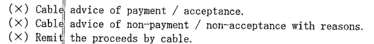
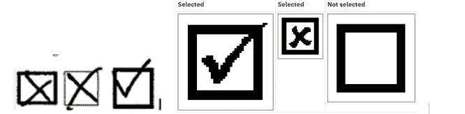
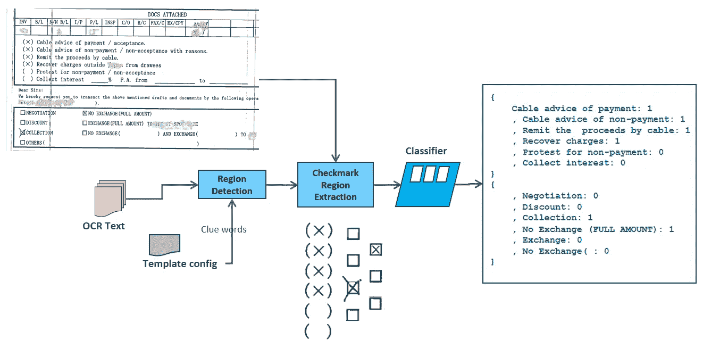

# 复选标记状态识别将使 NLP 项目更上一层楼！

> 原文：<https://towardsdatascience.com/check-mark-state-recognition-will-take-nlp-projects-to-the-next-level-668a1013408f?source=collection_archive---------10----------------------->

## 从扫描图像中检测复选标记状态并对其进行进一步分析可以为 NLP 项目添加有意义的功能


[Pixabay](https://pixabay.com/illustrations/check-hook-check-mark-presentation-3694934/)

在许多商业交易中，纸质文档仍然被用作主要的数据交换。

**例如，**

*   需要回答客观类型问题的纸质问卷或调查，
*   保险索赔文件
*   国际贸易融资或银行文件，其中承运人携带进口商/出口商的文件，这些文件使用扫描仪进一步数字化为图像或 PDF 文件。

扫描的图像要么按原样加载，要么使用 **OCR(光学字符识别)**技术进行转换，以获得文本内容。然而，像表格、复选框、徽标、单选按钮和手写文本这样的 HTML 元素在 OCR 转换中会*丢失*。

捕捉这些元素有一些有用的应用，并且有一种方法可以捕捉它们。

有许多**光学标记识别** (OMR)工具，开源的和付费的都可以提取这些元素。但是，这些工具需要在表单或模板中定义一个要捕获的区域。

当然，这是设计时的更改，也就是说，如果模板或文档结构发生了更改(这是很可能的)，那么模板更改从设计阶段到生产的传播可能会非常漫长和令人沮丧。

我们最近在我们的项目中遇到了类似的问题，这篇文章讨论了所采取的方法和技术细节。

## 使用深度学习从图像中进行“复选标记状态识别”

**先说一些基础知识，**

*   以图像形式存储的文档—许多应用程序以图像形式生成或存储交易文档或 pdf
*   复选标记字段是机器可读表单上的一个元素
*   通常为矩形或圆角矩形，通常称为“复选框”
*   做了一个记号(一个勾/记号，一个 X，一个大点，涂上墨水等)。)—它需要被捕获
*   OCR 引擎可以捕获字符/文本，但不能捕获特殊区域，如复选框、表格等。



**Check-mark states can be in any form but not limited to**

## **解决方案亮点**

*   支持输入的图像类型: *jpeg、tiff*
*   它使用 OCR 线索词实时提取复选标记，例如“收集兴趣”是上图中与之相对的复选框的线索词
*   提取分两步进行:**检测和识别**
*   混合使用 OCR、图像处理和机器学习技术
*   json 配置—定义模板和复选标记列表，以及每个模板中每个复选框的线索词和图像区域像素
*   模板布局分析、图像预处理是填充配置文件的先决条件
*   在分类模型中捕获复选标记的状态— *复选(1)、未复选(0)、噪声/无法读取(-1)*
*   准确率高达 **94%***

下面是一个示例配置文件。它为客户列出了一个模板，模板中有两个复选框以及线索词和像素(宽度和高度)来捕捉图像区域。

```
{"templates": [ { "templateID": "1", "templateName": "Customer_NAME_ABCD", "templateCode": "TEMPLATE_ABCD", "cb_size": [-100, 60], "keywords": [
      { "keywordID": "1", "entity": "Cable advice for NP", "code": "CABLEADVICENP", "keyword": "Cable advice of non-payment", "clue_string": "Cable advice of non-payment", "pixels": [-75,-20] }, { "keywordID": "2", "entity": "Recover Charges", "code": "RECOVERYCHARGES", "keyword": "Recover Charges", "clue_string": "Recover Charges", "pixels": [-75,-20] },….
```

## **解决方案图**



Solution

## **详情**

复选标记提取在以下步骤中执行:

**第一步。模型构建**

导入用于深度学习的 Keras python 库和相关 python 包

```
from keras.models import Sequentialfrom keras.layers import Conv2Dfrom keras.layers import MaxPooling2Dfrom keras.layers import Flattenfrom keras.layers import Densefrom keras.callbacks import ModelCheckpointfrom keras.callbacks import TensorBoardfrom keras.preprocessing.image import ImageDataGeneratorimport osimport fnmatchimport numpy as npimport timefrom keras.preprocessing import imagefrom keras.models import load_modelimport matplotlib.pyplot as plt
```

定义模型—创建序列并添加层

```
# Initializing the CNNclassifier = Sequential()# Step 1 — Convolutionclassifier.add(Conv2D(32, (3, 3), input_shape = (60, 100, 3), activation = ‘relu’))# Step 2 — Poolingclassifier.add(MaxPooling2D(pool_size = (2, 2)))# Adding a second convolutional layerclassifier.add(Conv2D(32, (3, 3), activation = ‘relu’))classifier.add(MaxPooling2D(pool_size = (2, 2)))# Step 3 — Flatteningclassifier.add(Flatten())# Step 4 — Full connectionclassifier.add(Dense(units = 128, activation = ‘relu’))classifier.add(Dense(units = 3, activation = ‘softmax’))
```

编译模型—指定损失函数和优化器

```
# Compiling the CNNclassifier.compile(optimizer = ‘adam’, loss = ‘categorical_crossentropy’, metrics = [‘accuracy’])modelcheckpoint = ModelCheckpoint(‘./models/checkbox_model.hdf5’, monitor=’val_acc’, verbose=0, save_best_only=True, save_weights_only=False, mode=’auto’, period=1)tbcheckpoint = TensorBoard(log_dir=’./logs’, histogram_freq=0, batch_size=32, write_graph=True, write_grads=False, write_images=False, embeddings_freq=0, embeddings_layer_names=None, embeddings_metadata=None)
```

拟合模型—使用图像数据执行模型

```
# Part 2 — Execute the model using image datatrain_datagen = ImageDataGenerator(rescale = 1./255, shear_range = 0.2, zoom_range = 0.2, horizontal_flip = True)test_datagen = ImageDataGenerator(rescale = 1./255)training_set = train_datagen.flow_from_directory(‘cbimagestrn’, target_size = (60, 100), batch_size = 32, class_mode = categorical’)test_set = test_datagen.flow_from_directory(‘cbimagestst’, target_size = (60, 100), batch_size = 32, class_mode = 'categorical')# Part 3 — Model trainingclassifier.fit_generator(training_set, steps_per_epoch = 1000,epochs = 50, validation_data = test_set, validation_steps = 500,callbacks=[modelcheckpoint, tbcheckpoint])…
```

进行预测—使用模型根据新数据或测试数据生成预测

```
# Part 4 — Model accuracy testing (Making new predictions)# use test data / images to predict [obvious and trivial code is eliminated]…result = model.predict_proba(test_image_arr)…# from the result, we can know how many files are mis-classified or not
```

**第二步。检测**

系统检测可能包含复选标记的矩形区域。

在这种方法中，来自 OCR 的线索词用于定位像素坐标，以识别要捕捉的块/区域

如果现有模板发生变化或新模板被添加到系统中，唯一需要的变化是在配置文件中

**第三步。识别和分类**

检测到这些区域后，将对该区域的图像进行裁剪，以将其识别为复选标记对象。

使用机器学习模型将裁剪后的图像分类为*已检查、未检查、噪声*

> 图像处理= CNN from Tensorflow，分类器:optimizer = 'adam '，loss = ' categorical _ crossentropy '

*在基线数据集上

## **结论**

使用表单或模板结构的应用程序(其中使用 OCR 技术来捕获文本)可以从捕获复选标记状态中受益，从而丰富数据并减少分析时间。

如果在任何商业交易中表单变化的速度是中等到高，那么 OCR 和深度学习技术的结合，如上所述，可以帮助您变得更加敏捷。

*感谢阅读。任何意见和建议——请分享。*

**参考文献:**

[1] [Keras 文档](https://keras.io/getting-started/sequential-model-guide/)