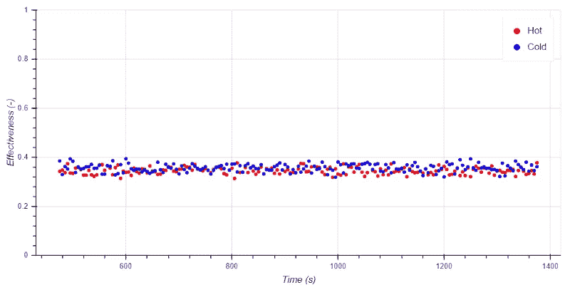

# 检查自动化数据分析的错误

> 原文：<https://towardsdatascience.com/checking-automated-data-analysis-for-errors-a97a22a35ad7?source=collection_archive---------20----------------------->

## 自动化数据分析时，如何手动和自动检查错误


这是教你如何编写自动分析科学数据的程序的系列文章的第四篇。[首先](https://medium.com/@petergrant_81989/automating-scientific-data-analysis-part-1-c9979cd0817e)介绍了概念和动机，然后规划了高级步骤。[第二个](https://medium.com/@petergrant_81989/automating-scientific-data-analysis-part-2-12331b46003)教你如何构建数据集，使自动化数据分析成为可能，并自动识别每个测试的条件。[的第三篇](https://medium.com/@petergrant_81989/automating-analysis-of-scientific-data-sets-84f5027d6d26)文章讨论了创建一个 for 循环，自动对每个测试结果执行计算并保存结果。这第四篇文章可能会涵盖整个过程中最重要的部分:检查数据和分析结果中的错误，以避免它们影响最终结果。

# 检查测试和分析结果的质量

也许反对数据分析自动化的最强有力的论据是可靠性。一个无意识地执行计算和分析的计算机算法不会识别出表现不佳的测试或分析中的错误，这些疏忽将导致最终项目结果中的错误。这不仅仅是人们害怕新的做事方式，这是一种合理的担忧。在实验室测试的情况下尤其如此；实验室测试并不总是按计划进行，有时需要在数据分析过程中识别这些错误。

幸运的是，可以在程序中添加错误检查方法。这些技术中的一些，即打印中间输出和绘制所有数据，需要手动数据检查，尽管仍然比完全手动数据分析少得多的人力。其他的，即创建一个自动化的数据检查算法，允许程序自己进行错误检查，大大减少了数据检查的时间需求。结合计算机程序的自然可重复性，这些方法可以使数据分析过程比手动计算更可靠，同时也明显更快。

以下部分将描述 Python 程序中数据质量检查的三种方法。

## 打印中间输出

打印中间输出类似于显示所有计算。这是一个好的实践，因为它既方便了程序创建时的调试，又允许其他人检查结果并建立对自动化数据分析程序的信心。因为许多人不想直接查看 Python 代码，所以他们不能像使用 Excel 电子表格那样检查公式。这使得提供尽可能多的中间输出变得尤为重要，这样人们就可以自己检查计算结果。

打印中间输出的基本前提是以类似于 Excel 的格式显示尽可能多的计算步骤。通过让其他人更容易理解，这有助于检查代码的结果。然后，他们可以轻松地执行自己的计算，并将结果与 Python 输出进行比较。这通常通过以下两个步骤来完成。

1.在数据框中显示尽可能多的计算细节。外部变量或列表可能是必要的，但应谨慎使用。将所有数据和计算包含在一个数据框中，便于其他人理解和检查计算。

2.将每次测试的数据框打印到唯一的。csv 文件。

在数据框中呈现计算细节的某些方面变得很自然。大多数计算将在数据框上执行，结果将作为直接结果存储在数据框中。其他方面需要额外付出一点努力。例如，常数更自然地被用作独立变量，但是在数据框中为它们添加一列允许其他人在只检查输出表的同时检查这些常数。

保存新的。csv 文件是一种非常有用的方法，可以确保保存整个项目中的所有计算，而不是在分析新测试的结果时覆盖旧的计算。这通常通过以下方式完成:1)在分析每个测试时创建一个新文件夹，以存储该测试的结果；2)使用动态文件名将结果保存到. csv 文件中，该文件名会发生变化，以表示当前正在分析的测试的条件。使用下面的代码可以实现这两个目标。请注意，示例代码使用了第 2 部分中显示的技术来跟踪测试的条件。

```
Flow_Hot = Find_Between(filename, ‘_FlowHot=’, ‘_FlowCold)Flow_Cold = Find_Between(filename, ‘_FlowCold=’, ‘_TemperatureHot’)Temp_Hot = Find_Between(filename, ‘_TemperatureHot=’, ‘_TemperatureCold’)Temp_Cold = Find_Between(filename, ‘_TemperatureCold=’, ‘.csv’)Folder = r’C:\Users\JSmith\DataAnalysis\Data\Flow_Hot=’ + Flow_Hot + ‘Flow_Cold=’ + Flow_Cold + ‘Temp_Hot’ = Temp_Hot + ‘Temp_Cold=’ + Temp_Coldif not os.path.exists(Folder):os.makedirs(Folder)#CalculationsData.to_csv(Folder + ‘\Flow_Hot=’ + Flow_Hot + ‘Flow_Cold=’ + Flow_Cold + ‘Temp_Hot=’ + Temp_Hot + ‘Temp_Cold=’ + Temp_Cold + ‘.csv’, index = False)
```

将前面的代码分成五个步骤，它:

1.使用第 2 部分中的技术来识别当前正在分析的数据集的名义条件。在本章的上下文中，这确保了程序拥有创建文件夹和文件名称所需的信息，并且结果以有序的方式存储，便于以后理解。

2.使用步骤 1 中读取的条件创建一个名为 Folder 的变量。文件夹的路径对于此测试是唯一的，并在文件名中使用测试条件。

3.检查是否已经有与该名称匹配的文件夹，如果没有，则创建一个。

4.第四步是对数据执行所有计算。为了简化讨论，并把重点放在打印中间输出上，计算用上面的一个注释来表示。

5.分析完成后，此步骤将数据帧写入新的。csv 文件。的。csv 文件位于新文件夹内，包含标称测试条件，并且本身包含标称测试条件。这种严格的命名结构确保了在以后需要时可以很容易地找到正确的数据集。

## 使用图检查结果

检查测试数据质量和相关数据分析性能的一种简便方法是通过绘图。自动化数据分析程序的优势在于，它们可以为数百个测试快速创建图表，减少了单独生成图表所需的人工劳动。这使得用户可以快速浏览图，并快速确保数据质量。

为每个测试自动生成和保存图的过程现在是读者可以做的事情。一般流程是使用在 [**自动化科学数据分析第 2 部分**](/automating-scientific-data-analysis-part-2-a26bd749fa8d) 和**自动化科学数据集分析**中描述的技术来创建一个程序，该程序循环通过所有数据集，执行所需的计算，生成所需的图，并保存结果。这些技术已经讨论过了。

这里的关键概念是绘制足够的数据集特征，以便能够快速、直观地检查以确保测试正确进行。回到第 2 部分描述的热交换器示例，这意味着保存的图必须允许用户快速确定:

1.测试热端和冷端流量与测试计划中要求的标称测试条件非常匹配，

2.测试热端和冷端入口水温符合测试计划中要求的标称测试条件，

3.所有参数都足够稳定，以确保质量、稳态运行，

4.用于确定试验稳态周期的过滤器选择了数据集的正确部分，以及

5.最终稳态有效性值是稳定且合理的。

这个目标可以用三个情节来完成。

图 1 给出了一个示例图，显示了通过热交换器两侧的水流量。为了这个例子，假设这个测试的标称流速条件在装置的两侧都是 3.5 加仑/分钟。在图 13 中，两种流速都在 3.4 至 3.6 加仑/分钟之间。这是少量的变化，在测试中的预期变化范围内，因此与标称测试条件非常匹配。图 1 显示第一个条件得到满足。不令人满意的操作示例包括两侧的平均流速为 3.2 加仑/分钟，或分散范围为 3.0 至 4.0 加仑/分钟。

图 1 还显示流量满足条件三。虽然数据中有少量分散，但正如预期的那样，长期趋势非常稳定，大约在 3.5 加仑/分钟左右。例如，如果在回到设定流速之前，流速暂时降至 3.0 加仑/分钟，则认为测试不令人满意。


Figure 1: Flow Rate Data from an Example Data Set

图 2 用于温度数据的相同目的。示例数据假设热端入口温度为 100.4°F，冷端入口温度为 50°F。与流量数据一样，如果记录的入口温度接近这些标称条件，且在试验的稳态部分没有显著变化，则认为试验有效。这两个条件都满足，因此该图表明记录的温度满足条件二和条件三。


Figure 2: Temperature Data from an Example Test

图 3 显示了热交换器的计算效率图。根据第 2 部分中显示的技术，该数据集经过过滤，仅显示阀门切换到测试流量后的数据。该数据明显围绕 0.34 的效率等级波动，存在一些变化。这种变化是意料之中的，因为温度和流速数据都有一些变化。最初的几个数据点清楚地表明，当过滤器第一次应用时，该装置处于过渡期，但是只有几个，所以对计算的平均效率的影响是最小的。除了这些开始点之外，所呈现的效果是相当稳定的。该图证实了该数据集满足条件四和条件五。



Figure 3: Effectiveness Data from an Example Test

有了这三个图，用户只需主动参与几秒钟，就能确保测试正确执行，数据有效。在自动数据分析程序中包含创建和保存所需图的部分是确保数据集质量的非常有效和高效的方法。

## 自动数据检查器

检查测试中数据质量的最详细和自动化的方法是创建一个自动化的数据检查器。这是一个脚本，它检查测量数据以确定记录了什么，将其与标称测试条件进行比较，确定它们是否可接受，并向用户报告不可接受的结果。这对于用户来说是有利的，因为它限制了需要手动检查的图的数量。具有数百个测试的项目可以很容易地产生数千个图，减少需要审查的数量可以节省大量的时间、繁琐和项目预算。

以下代码提供了如何完成此过程的示例。假设程序已经有了一个名为“Temp”的数据帧来临时存储关于可疑结果的信息，还有一个名为“SuspiciousTests”的数据帧来存储完整的列表。

```
if abs(Temperature_Hot — np.mean(Data[‘Hot Inlet Temperature (deg F)’])) > Threshold_Difference_Temperature:Temp.loc[0, ‘Filename’] = filenameTemp.loc[0, ‘Test Parameters’] = ‘H’ + str(Flow_Hot) + ‘-C’ + 
    str(Flow_Cold) + ‘-T’ +str(Temperature_Hot)Temp.loc[0, ‘Code’] = ‘Temperature_HotInlet_Avg’Temp.loc[0, ‘Value’] = np.mean(Data[‘Hot Inlet Temperature (deg
    F)’])SuspiciousTests = SuspiciousTests.append(Temp)SuspiciousTests.to_csv(r'C:\Users\JSmith\DataAnalysis\Suspicious 
    Tests.csv', index = False)
```

该代码的工作方式如下。

1.首先，它将标称热端入口温度 Temperature_Hot 与测得的平均热端入口温度进行比较。如果差值大于用变量 Threshold _ Difference _ Temperature 设置的预定值，则确定测试有问题。

2.如果测试有问题，它会记录测试的参数。这些参数包括文件名、标称测试条件、代表未满足测试条件的代码以及该条件的测量值。这些条目都被添加到可疑测试数据框中。

3.程序处理完所有数据后，可疑测试会打印到一个. csv 文件中，并记录下哪些测试似乎不令人满意。

该示例显示了单次检查，将平均热端入口温度与测试的标称条件进行比较。一个完整的程序将包括对其他测试参数的检查，以及对标准偏差的检查，以确保所有参数都是稳定的。

通常，在创建自动数据检查算法时，最好记住以下准则:

*   它应该检查所有标称测试条件，以确保它们在平均值和标准偏差方面都是足够的，
*   它应该检查任何过滤器的结果，以确保它们捕捉到正确的数据范围，
*   它应检查最终计算的输出，以确保其在预期范围内，并确保测试提供了可靠的信号，以及
*   在被信任之前，需要对它进行彻底的检查，以确保它识别出有问题的测试，而不是足够的测试。

# 后续步骤

到目前为止，文章中提供的内容已经教会了您如何为自动化构建数据集，自动打开和分析所有文件，以及检查数据集的错误。下一步是以一种允许你自然发展回归的方式存储这些结果。这将在我的下一篇文章中讨论。