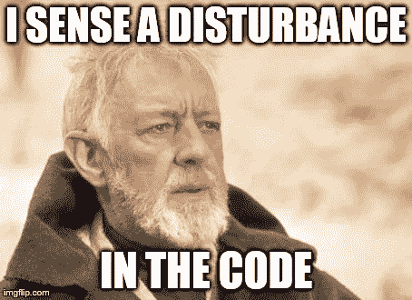
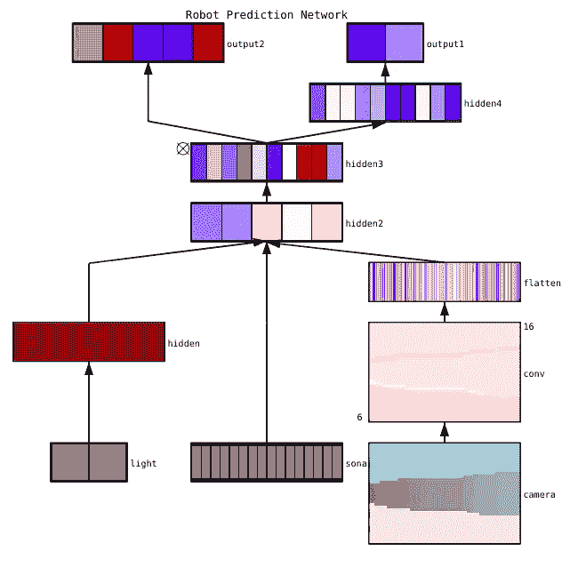
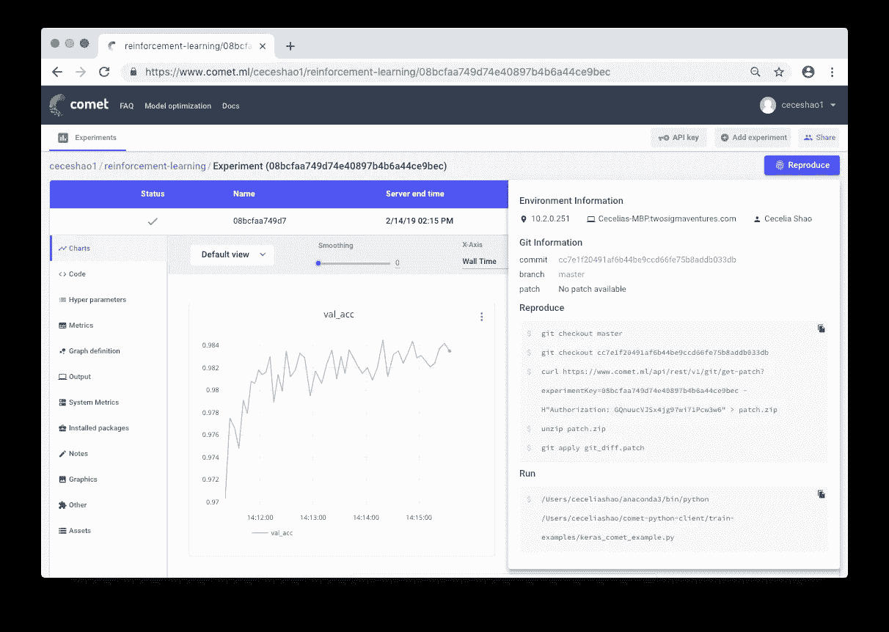

# 调试神经网络的清单

> 原文：<https://towardsdatascience.com/checklist-for-debugging-neural-networks-d8b2a9434f21?source=collection_archive---------2----------------------->

## 您可以采取切实可行的步骤来识别和解决机器学习模型的训练、泛化和优化问题

Photo by [Glenn Carstens-Peters](https://unsplash.com/photos/RLw-UC03Gwc?utm_source=unsplash&utm_medium=referral&utm_content=creditCopyText) on [Unsplash](https://unsplash.com/search/photos/list?utm_source=unsplash&utm_medium=referral&utm_content=creditCopyText)

众所周知，机器学习代码很难调试，因为寻找错误的代价很高。即使对于简单的[前馈神经网络](https://cs.stanford.edu/people/eroberts/courses/soco/projects/neural-networks/Architecture/feedforward.html)，你也经常不得不围绕网络架构、权重初始化和网络优化做出几个决定——所有这些都可能导致你的机器学习代码中潜在的错误。

正如 Chase Roberts 在一篇关于“[如何对机器学习代码](https://medium.com/@keeper6928/how-to-unit-test-machine-learning-code-57cf6fd81765)进行单元测试”的优秀文章中所写的那样，他的挫折源于常见的陷阱，比如:

1.  代码不会崩溃，不会引发异常，甚至不会变慢。
2.  网络仍在训练，损失仍会下降。
3.  几个小时后，这些值收敛，但结果很差

那么，对此应该做些什么呢？

本文将提供一个框架来帮助您调试您的神经网络:

1.  **开始简单**
2.  **确认你的损失**
3.  **检查中间输出和连接**
4.  **诊断参数**
5.  **跟踪你的工作**

请随意跳到特定部分或通读下面的内容！请注意:我们不涉及数据预处理或具体的模型算法选择。网上有很多关于这些主题的资源(例如，查看[‘选择正确的机器学习算法’](https://hackernoon.com/choosing-the-right-machine-learning-algorithm-68126944ce1f))。

# 1.从简单开始

具有带正则化和学习率调度器的复杂架构的神经网络将比简单网络更难调试。我们在第一点上有点欺骗，因为它与调试你已经建立的网络并不真正相关，但它仍然是一个重要的建议！

从简单开始:

*   首先构建一个更简单的模型
*   在单个数据点上训练您的模型

## **先建立一个更简单的模型**

首先，构建一个只有一个隐藏层的小型网络，并验证一切都正常工作。然后逐渐增加模型的复杂性，同时检查模型结构的每个方面(附加层、参数等)..)在继续前进之前起作用。

## 在单个数据点上训练您的模型

作为快速的健全性检查，您可以使用一两个训练数据点来确认您的模型是否能够过度拟合。神经网络应该立即以 100%的训练精度和与你的模型随机猜测相称的验证精度过度拟合。如果你的模型不能适应这些数据点，那么要么它太小，要么有一个错误。

即使你已经验证了你的模型是有效的，在继续之前尝试训练一个(或几个)时期。

# 2.确认你的损失

模型的损失是评估模型性能的主要方式，也是模型评估以设置重要参数的内容，因此您需要确保:

*   损失适合于任务(对于多分类问题使用类别交叉熵损失，或者使用焦点损失来解决类别不平衡)
*   你的[损失函数](https://blog.algorithmia.com/introduction-to-loss-functions/)正在正确的尺度上被测量。如果您在网络中使用了一种以上的损失类型，如 MSE、对抗性、L1、[特征损失](https://arxiv.org/pdf/1603.08155.pdf)，那么请确保所有损失都被适当地缩放到相同的数量级

注意你最初的损失也很重要。如果你的模型是通过随机猜测开始的，检查初始损失是否接近你的预期损失。在[的斯坦福 CS231n 课程作业](http://cs231n.github.io/neural-networks-3/#baby)中，安德烈·卡帕西提出了以下建议:

> 寻找正确的机会表现损失。当你用小参数初始化时，确保你得到了你期望的损失。最好先单独检查数据丢失(所以把正则化强度设置为零)。例如，对于具有 Softmax 分类器的 CIFAR-10，我们预计初始损失为 2.302，因为我们预计每个类别的扩散概率为 0.1(因为有 10 个类别)，Softmax 损失是正确类别的负对数概率，因此:-ln(0.1) = 2.302。

对于一个二进制的例子，你可以简单地为你的每个类做一个相似的计算。假设您的数据中有 20%为 0，80%为 1，那么您的预期初始损耗将为 0.2 ln(0.5)0.8 ln(0.5)= 0.693147。如果您的初始损失远大于 1，这可能表明您的神经网络权重没有正确平衡(即，您的初始化很差)或您的数据没有标准化。

# 3.检查中间输出和连接

若要侦错类神经网路，瞭解类神经网路内部的动态、个别中间层所扮演的角色，以及各层之间的连接方式，通常会很有用。您可能会在以下方面遇到错误:

*   梯度更新的表达式不正确
*   未应用权重更新
*   消失或爆炸渐变

如果您的梯度值为零，这可能意味着优化器中的学习率太小，或者您遇到了上面的错误#1，梯度更新的表达式不正确。

除了查看梯度更新的绝对值之外，确保监控每个层匹配的激活、权重和更新的幅度。例如，参数(权重和偏差)[的更新幅度应该是 1-e3](https://cs231n.github.io/neural-networks-3/#summary) 。

有一种现象称为“死亡 ReLU”或“消失梯度问题”,其中 ReLU 神经元在学习了其权重的大的负偏差项后将输出零。这些神经元再也不会在任何数据点激活。

您可以通过使用数值方法近似梯度，使用梯度检查来检查这些错误。如果它接近计算的梯度，则反向传播被正确地执行。要实现渐变检查，请查看 CS231 [这里](http://cs231n.github.io/neural-networks-3/#gradcheck)和[这里](http://cs231n.github.io/optimization-1/#gradcompute)以及吴恩达[关于该主题的具体课程](https://www.youtube.com/watch?v=P6EtCVrvYPU)中的这些伟大资源。

[Faizan Shaikh](https://www.linkedin.com/in/faizankshaikh/) 讲述了可视化神经网络的三种主要方法:

*   **初步方法** —简单的方法，向我们展示一个训练好的模型的整体结构。这些方法包括打印出神经网络各层的形状或过滤器以及每层中的参数。
*   **基于激活的方法** —在这些方法中，我们破译单个神经元或一组神经元的激活，以获得它们正在做什么的直觉
*   **基于梯度的方法—** 这些方法倾向于在训练模型(包括显著性图和类别激活图)时操纵由正向和反向传递形成的梯度。

有许多有用的工具用于可视化各个层的激活和连接，如 [ConX](https://conx.readthedocs.io/en/latest/Getting%20Started%20with%20conx.html#What-is-ConX?) 和 [Tensorboard](https://www.tensorflow.org/guide/tensorboard_histograms) 。

A sample dynamic, rendered visualization made with [ConX](https://conx.readthedocs.io/en/latest/README.html)

> 处理图像数据？Erik Rippel 在[“使用 Keras 和 Cats 可视化部分卷积神经网络”](https://hackernoon.com/visualizing-parts-of-convolutional-neural-networks-using-keras-and-cats-5cc01b214e59)上发表了一篇精彩多彩的文章

# **4。诊断参数**

神经网络有大量相互影响的参数，使得优化变得困难。请注意，这是一个活跃的研究领域，所以下面的建议只是一个起点。

*   **批量**(技术上称为小批量)—您希望批量足够大，以获得准确的误差梯度估计，但又足够小，以使小批量随机梯度下降(SGD)可以调整您的网络。小批量将导致学习过程以训练过程中的噪音为代价快速收敛，并且*可能*导致优化困难。论文[‘关于深度学习的大批量训练:泛化差距和尖锐极小’](https://arxiv.org/abs/1609.04836)描述了如何:

> 在实践中已经观察到，当使用较大批量时，模型的质量会下降，这通过其概括能力来衡量。我们调查了大批量模式中这种泛化能力下降的原因，并提供了支持以下观点的数字证据:l **大批量方法倾向于收敛到训练和测试函数的尖锐极小值，众所周知，尖锐极小值导致较差的泛化能力**。相比之下，小批量方法始终收敛于平坦极小值，我们的实验支持一个普遍持有的观点，即这是由于梯度估计中的固有噪声。

*   **学习率**—学习率太低会导致收敛缓慢或陷入局部最小值的风险，而学习率太大会导致优化发散，因为你有跳过损失函数更深但更窄部分的风险。考虑纳入学习率计划，以随着培训的进展降低学习率。CS231n 课程有很大一部分是关于[实现退火学习率的不同技术](http://cs231n.github.io/neural-networks-3/)。

> Keras、Tensorflow、PyTorch、MXNet 等机器学习框架现在都有关于使用学习率调度器/decay 的文档或示例:
> 
> https://keras.io/callbacks/#learningratescheduler
> 
> tensor flow—[https://www . tensor flow . org/API _ docs/python/TF/train/exponential _ decay](https://www.tensorflow.org/api_docs/python/tf/train/exponential_decay)
> 
> py torch—[https://py torch . org/docs/stable/_ modules/torch/optim/lr _ scheduler . html](https://pytorch.org/docs/stable/_modules/torch/optim/lr_scheduler.html)
> 
> MXNet—[https://MXNet . incubator . Apache . org/versions/master/tutorials/gluon/learning _ rate _ schedules . html](https://mxnet.incubator.apache.org/versions/master/tutorials/gluon/learning_rate_schedules.html)

*   **梯度剪辑** —这将在反向传播过程中以最大值或最大范数剪辑参数的梯度。有助于解决您在上述步骤 3 中可能遇到的任何爆炸渐变
*   **批量标准化**—批量标准化用于标准化每一层的输入，以对抗内部协变量偏移问题。*如果您同时使用 Dropout 和 Batch Norma，请务必阅读以下关于 Dropout 的要点。*

> 这篇文章来自[di shank Bansal](https://towardsdatascience.com/@theshank)'[tensor flow 中批处理规范的缺陷和训练网络的健全性检查](/pitfalls-of-batch-norm-in-tensorflow-and-sanity-checks-for-training-networks-e86c207548c8)'，是批处理规范化常见错误的重要资源。

*   **随机梯度下降(SGD)** —有几种风格的 SGD 使用动量、自适应学习率和内斯特罗夫更新，在训练性能和泛化能力方面没有明显的赢家(参见 Sebastian Ruder 的精彩文章[‘梯度下降优化算法概述’](http://ruder.io/optimizing-gradient-descent/)和这个有趣的实验’[SGD>亚当](https://shaoanlu.wordpress.com/2017/05/29/sgd-all-which-one-is-the-best-optimizer-dogs-vs-cats-toy-experiment/)？))一个推荐的起点是具有内斯特罗夫动量的亚当或普通新币。
*   **正则化**-正则化对于构建概化模型至关重要，因为它会增加模型复杂性或极端参数值的损失。它显著降低了模型的方差，而没有显著增加其偏差。如[cs 231n 课程](http://cs231n.github.io/neural-networks-3/#ratio)所述:

> 通常情况下，损失函数是数据损失和正则化损失之和(例如，L2 权重罚)。需要注意的一个危险是，正则化损失可能会超过数据损失，在这种情况下，梯度将主要来自正则化项(通常具有简单得多的梯度表达式)。这可以掩盖数据丢失梯度的不正确实现。

要对此进行审核，您应该关闭正则化并独立检查您的数据丢失梯度。

*   **辍学**——辍学是另一种规范你的人际网络以防止过度适应的方法。在训练时，仅通过以某个概率 p(超参数)保持神经元活动来实现退出，否则将其设置为零。结果，网络必须在每个训练批次中使用不同的参数子集，这减少了特定参数的变化相对于其他参数变得占优势。
*   这里重要的一点是:如果你同时使用丢弃和批处理规范化(批处理规范),要注意这些操作的顺序，甚至是同时使用它们。这仍然是一个活跃的研究领域，但你可以看到最新的讨论:

> [**From Stackoverflow 用户**](https://stackoverflow.com/questions/39691902/ordering-of-batch-normalization-and-dropout)`MiloMinderBinder`:“Dropout 是指完全阻断某些神经元的信息，以确保神经元不协同适应。因此，批处理规范化必须在丢失之后进行，否则您将通过规范化统计传递信息。”
> 
> [**From arXiv**](https://arxiv.org/abs/1801.05134) : *通过方差移位理解丢失和批量归一化之间的不协调(* [李翔](https://arxiv.org/search/cs?searchtype=author&query=Li%2C+X)，[硕辰](https://arxiv.org/search/cs?searchtype=author&query=Chen%2C+S)，[胡小林](https://arxiv.org/search/cs?searchtype=author&query=Hu%2C+X)，[杨坚](https://arxiv.org/search/cs?searchtype=author&query=Yang%2C+J))——“理论上，我们发现当我们将那个网络的状态从训练转移到测试时，丢失会使特定神经单元的方差发生移位。然而，在测试阶段，BN 将保持其从整个学习过程中积累的统计方差。方差不一致性(我们称此方案为“方差移位”)导致推理中不稳定的数值行为，当在 BN 之前应用丢失时，最终导致更多的错误预测

# 5.跟踪您的工作

人们很容易忽视记录实验的重要性，直到你忘记了你使用的学习率或班级权重。有了更好的跟踪，你可以很容易地回顾和重现以前的实验，以减少重复工作(也就是遇到同样的错误)。

然而，手动记录信息可能很难做到，也很难扩展到多个实验。**像**[**comet . ml**](http://bit.ly/2J6dxWA)**这样的工具可以帮助自动跟踪数据集、代码变更、实验历史和生产模型**(这包括关于您的模型的关键信息，如超参数、模型性能指标和环境细节)。

您的神经网络可能对数据、参数甚至包版本的微小变化非常敏感，从而导致模型性能下降。跟踪您的工作是开始标准化您的环境和建模工作流的第一步。

Check out model performance metrics and retrieve the code used to train the model from within [Comet.ml](http://bit.ly/2J6dxWA). There’s an example of Comet’s automatic experiment tracking [here](https://www.youtube.com/watch?v=xaybRkapeNE&t=5s).

# 快速回顾

我们希望这篇文章为调试你的神经网络提供一个坚实的起点。为了总结要点，您应该:

1.  **从简单开始—** 首先构建一个更简单的模型，通过训练几个数据点进行测试
2.  确认你的损失——检查你是否使用了正确的损失，并回顾你的初始损失
3.  **检查中间输出和连接—** 使用梯度检查和可视化来检查您的层是否正确连接，以及您的梯度是否按预期更新
4.  **诊断参数** —从 SGD 到学习率，识别正确的组合(或找出错误的组合)😅
5.  **跟踪你的工作**——作为基线，跟踪你的实验过程和关键的建模工件

# *觉得这个帖子有用？觉得它少了点什么？请在下面评论您的反馈和问题！👩🏻‍🎓*

> [关注黑客新闻](https://news.ycombinator.com/item?id=19392173)上的讨论！