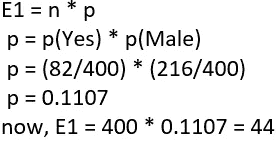

# 机器学习中特征选择的卡方检验

> 原文：<https://towardsdatascience.com/chi-square-test-for-feature-selection-in-machine-learning-206b1f0b8223?source=collection_archive---------0----------------------->

## 特征选择在机器学习中一直起着关键作用

image by [Vladislav Babienko](https://unsplash.com/@garri)

我们总是想知道卡方检验在机器学习中的什么地方有用，以及这个检验有什么不同。特征选择是机器学习中的一个重要问题，在机器学习中，我们将有几个特征，并且必须选择最佳特征来建立模型。卡方检验通过检验特征之间的关系来帮助您解决特征选择中的问题。在这篇文章中，我将引导通过

a.卡方分布。

b.特征选择的卡方检验

c.使用 Python 进行卡方检验

# 卡方分布

如果随机变量ꭓ可以写成标准正态变量的平方和，则它遵循卡方分布。

Z1, Z2.. are standard normal variables

## 自由度:

自由度是指逻辑上独立的值的最大数量，这些值可以自由变化。简而言之，它可以定义为观测值的总数减去施加在观测值上的独立约束的数量。

在上图中，我们可以看到不同自由度的卡方分布。我们还可以观察到，随着自由度的增加，卡方分布接近正态分布。

# 特征选择的卡方检验

卡方检验在统计学中用于检验两个事件的独立性。给定两个变量的数据，我们可以得到观察计数 O 和期望计数 E。卡方测量期望计数 E 和观察计数 O 如何相互偏离。

让我们考虑一个场景，其中我们需要确定独立类别特征(预测器)和从属类别特征(响应)之间的关系。在特征选择中，我们的目标是选择高度依赖于响应的特征。

当两个特征独立时，观察计数接近预期计数，因此我们将具有较小的卡方值。所以高卡方值表明独立性假设是不正确的。简而言之，卡方值越高，特征越依赖于响应，并且可以被选择用于模型训练。

卡方检验的步骤及示例:

考虑一个数据集，我们必须确定客户离开银行的原因，让我们对两个变量进行卡方检验。客户的*性别，值为男性/女性作为预测值， ***退出*** 描述客户是否离开银行，值为是/否作为响应。在这个测试中，我们将检查*性别和 Exited* 之间是否有任何关系。*

*执行卡方检验的步骤:*

1.  *定义假设。*
2.  *建立一个应急表。*
3.  *求期望值。*
4.  *计算卡方统计量。*
5.  *接受或拒绝零假设。*

## *1.定义假设*

*零假设(H0):两个变量是独立的。*

*替代假设(H1):两个变量不是独立的。*

## *2.相依表*

*显示一个变量在行中的分布和另一个变量在列中的分布的表格。它用于研究两个变量之间的关系。*

**

*Contingency table for observed values*

*列联表的自由度给定为(r-1) * (c-1)，其中 r，c 是行和列。这里 df =(2–1)*(2–1)= 1。*

*在上表中，我们已经算出了所有的观察值，我们的下一步是找到期望值，获得卡方值并检查关系。*

## *3.求期望值*

*基于两个变量独立的零假设。我们可以说如果 A，B 是两个独立的事件*

**

*让我们来计算第一个细胞的期望值，这是那些男性，并从银行退出。*

**

*The calculation for the expected value*

*类似地，我们计算 E2，E3，E4，得到如下结果。*

**

*Expected values*

## *4.计算卡方值*

*将观察值和计算出的期望值汇总成表格，并确定卡方值。*

****

*我们可以看到，通过使用卡方统计公式，卡方被计算为 2.22。*

## *5.接受或拒绝零假设*

*在α= 0.05 的 95%置信度下，我们将检查计算的卡方值落在接受或拒绝区域。*

*自由度=1(用列联表计算)且 alpha =0.05，卡方值为 3.84。*

*卡方值可通过[卡方表](https://web.ma.utexas.edu/users/davis/375/popecol/tables/chisq.html)确定。*

**卡方分布位于右侧，因为观察值和期望值之间的差异很大。**

**

*在上图中，我们可以看到卡方的范围从 0 到 inf，α的范围从 0 到 1，方向相反。如果卡方值落在误差区域(α从 0 到 0.05)，我们将拒绝零假设。*

*这里我们接受零假设，因为卡方值小于临界卡方值。*

**为了得出这两个变量是独立的结论，性别变量不能被选择用于训练模型。**

# *限制*

*卡方对表格单元格中的小频率很敏感。通常，当表的某个单元格中的期望值小于 5 时，卡方检验会导致结论错误。*

*注意:这里我们考虑的是大小为 400 的样本，对于更大的样本，结果可能会有所不同。*

# *使用 Python 进行卡方检验*

*下面是关于如何使用 python 执行卡方测试的代码。*

*你也可以在 GitHub 上找到同样的内容。*

> *到目前为止，我们已经了解了分类反应和分类预测，但如果我们有连续反应和分类预测呢？？？我们将使用方差分析。请查看我的文章 [ANOVA，了解机器学习](/anova-for-feature-selection-in-machine-learning-d9305e228476)中的特征选择。*
> 
> **如果你好奇想了解特征选择方法。下面是文章的深度。**
> 
> *【https://neptune.ai/blog/feature-selection-methods *

* [## 机器学习中特征选择的方差分析

### 方差分析在特征选择中的应用

towardsdatascience.com](/anova-for-feature-selection-in-machine-learning-d9305e228476) 

希望你喜欢！！！请对任何疑问或建议发表评论。*