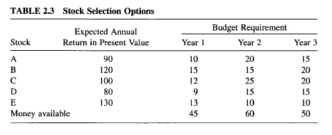
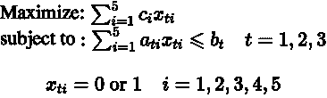
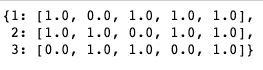
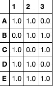

# 如何用 Python 选择股票投资

> 原文：<https://towardsdatascience.com/choose-stocks-to-invest-with-python-584892e3ad22?source=collection_archive---------10----------------------->

## 混合整数线性规划作为解决股票选择问题的替代工具

您计划在未来 3 年投资几只股票，每只股票的每一美元投资都有不同的预期回报和具体的投资金额，如下表所示(均以千美元计)。考虑到你每年投资购买股票的数量是有限的，你想决定每年投资哪些股票，以使总回报最大化。



# 当机器学习不是你的选择时

每个人都想用最少的投资获得最多的回报，但不是每个人都花时间去分析股票，因为这不是一件容易的事情。你决定利用你的数据科学技能来帮助你解决这个问题，但发现用机器学习技术来解决这个问题很有挑战性。为什么会这样呢？

虽然机器学习在从数据中学习和做出预测方面很棒，但它在做出最佳决策方面有局限性。但使用 Python MIP(混合整数线性规划)工具，可以轻松确定每年选择的股票。当您的问题涉及多个约束并允许许多可能的解决方案时，只有 MIP 有能力找到最佳解决方案。你可以在这里找到更多关于 MIP [的信息。这个博客将向你展示如何使用这个工具为你造福。](https://www.gurobi.com/machine-learning-and-mathematical-optimization/)


# 步骤 1:识别和定义参数、约束、变量和目标

*输入参数:*

*   库存数量(一)
*   每年每种股票的预算要求(a[t][i])
*   每年的预算需求(b[t])
*   每只股票的年回报率(c[i])

*决策变量:*是否每年选择一只股票 x[t][i]。这是一个二元变量，选择时 x[t][i] = 1，否则 x[t][i]=0

*约束:*每年所有投资股票的预算需求之和不能超过当年的预算需求

*目标:*投资总回报最大化



# 步骤 2:用 MIP 编程

## 在数组和矩阵中保存给定的信息

```
c = [90, 120, 100, 80, 130]
b = [45, 60, 50]
a = [[10, 15, 12, 9, 13],[20, 15, 25, 15, 10],[15, 20, 20, 15, 10]]T, I = range(len(b)),range(len(c))
```

安装 MIP

```
pip install mip==1.4.2 from mip.model import *
```

## 创建模型

```
m = Model(sense = MAXIMIZE,solver_name=CBC)
```

## 变量

用`add_var()`创建变量

创建一个包含 n 个二进制决策变量(n = 5)的变量向量，指示是否选择股票

```
x = [[m.add_var(name = names[i], var_type=BINARY) for i in I] for t in T]
```

将`*xsum()*`用于求和表达式

```
m.objective = maximize(xsum(c[i] * x[t][i] for i in I for t in T))
```

## 限制

增加每年可用资金的限制

```
for t in range(3):  
 m += xsum(a[t][i] * x[t][i] for i in I) <= b[t]
```

## 目标函数

`Optimize()`方法执行配方的优化。Optimize 方法返回搜索的状态(OptimizationStatus)。`OPTIMAL`如果搜索结束并找到最优解。

```
status = m.optimize() if status == OptimizationStatus.OPTIMAL:  
 print('optimal solution cost {} found'.format(m.objective_value)) 
```

## 优化结果

```
results = {}
for i in range(3):  
 results[i+1] = [m.vars[j].x for j in range(5*i,5*i+5)]
```



```
import pandas as pd result = pd.DataFrame(data = results, index = ['A','B','C','D','E'])
```



## 结果的解释

根据所获得的结果，这是您应该做的，以在每年预算的不同限制下最大化投资的总回报:

*   在第一年，投资股票 A、C、D 和 E
*   在第二年，投资股票 A、B 和 D
*   第三年，投资股票 B、C 和 E

## 关键要点

*   尽管股票 E 和 B 的投资回报率最高，但由于它们在当年的预算要求较高，因此并不总是被选中。(也就是说，第一年没有选择股票 B，因为与其他股票相比，它的预算要求最高)
*   一些股票在一年内没有被选择，不是因为它们的预算要求，而是因为它们的投资回报低(即，股票 A 在第 3 年没有被选择，即使预算要求相对较低)

# 结论

恭喜你！您了解了如何使用 MIP 为每一年选择股票以获得最佳价值回报。我希望你在选择你的股票和观察几行代码后的最佳结果时感到愉快。

在 [this Github repo](https://github.com/khuyentran1401/Data-science/blob/master/mathematical_programming/invest_stock/stock_invest.ipynb) 中，您可以随意使用本文的代码。

我喜欢写一些基本的数据科学概念，并尝试不同的算法和数据科学工具。你可以通过 [LinkedIn](https://www.linkedin.com/in/khuyen-tran-1401/) 和 [Twitter](https://twitter.com/KhuyenTran16) 与我联系。

如果你想查看我写的所有文章的代码，请点击这里。在 Medium 上关注我，了解我的最新数据科学文章，例如:

[](/how-to-build-a-matrix-module-from-scratch-a4f35ec28b56) [## 如何从头开始构建矩阵模块

### 如果您一直在为矩阵运算导入 Numpy，但不知道该模块是如何构建的，本文将展示…

towardsdatascience.com](/how-to-build-a-matrix-module-from-scratch-a4f35ec28b56) [](/step-by-step-tutorial-web-scraping-wikipedia-with-beautifulsoup-48d7f2dfa52d) [## 用美丽的声音抓取维基百科

### 关于如何使用 Beautiful Soup 的分步教程，这是一个用于 web 抓取的简单易用的 Python 库

towardsdatascience.com](/step-by-step-tutorial-web-scraping-wikipedia-with-beautifulsoup-48d7f2dfa52d) [](/find-common-words-in-article-with-python-module-newspaper-and-nltk-8c7d6c75733) [## 用 Python 模块 Newspaper 和 NLTK 查找文章中的常用词

### 使用 newspaper3k 和 NLTK 从报纸中提取信息和发现见解的分步指南

towardsdatascience.com](/find-common-words-in-article-with-python-module-newspaper-and-nltk-8c7d6c75733) [](https://medium.com/@khuyentran1476/comprehensive-numpy-tutorials-for-beginners-8b88696bd3a2) [## 为您的数据科学项目提供 Numpy 技巧

### 创建数组、矩阵、执行矩阵运算、解决线性代数问题和常见数据科学的技巧…

medium.com](https://medium.com/@khuyentran1476/comprehensive-numpy-tutorials-for-beginners-8b88696bd3a2) 

# 参考

[1]古罗比。检索自:[https://www . guro bi . com/machine-learning-and-mathematical-optimization/](https://www.gurobi.com/machine-learning-and-mathematical-optimization/)