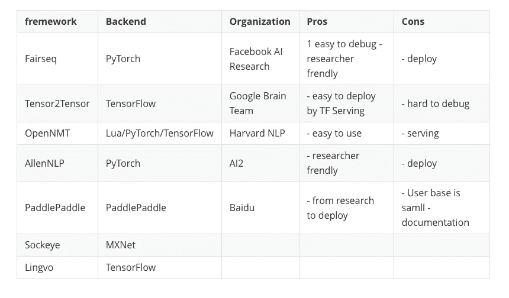
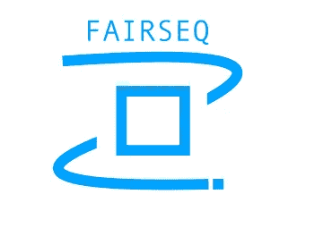
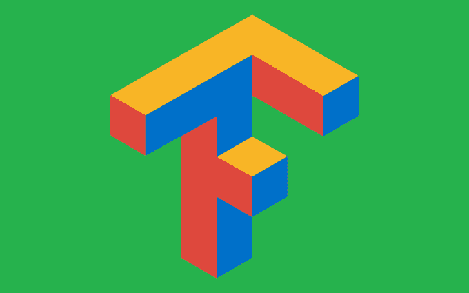
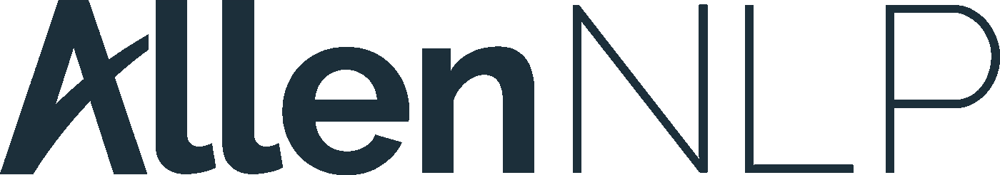

# 根据您的需求选择合适的转换器框架

> 原文：<https://towardsdatascience.com/choose-the-right-transformer-framework-for-you-b7c51737d45?source=collection_archive---------10----------------------->

## 比较不同的 Transformer 实现框架，选择最适合您自己需求的框架


Image credit: © Flynt — Bigstockphoto.com

# TL；速度三角形定位法(dead reckoning)

基于你对 PyTroch 或者 TensorFlow 的偏好，我推荐使用 Fairseq 或者 Tensor2Tensor。

如果你是一名研究人员，Fairseq 在定制方面足够灵活。但如果是做一些真实的应用，考虑部署的话，选择 Tensor2Tensor 会更好。



comparison of different frameworks

# 不同框架中的转换器

## [**fair seq**](https://github.com/pytorch/fairseq)



一个序列建模工具包，允许研究人员和开发人员为翻译、摘要、语言建模和其他文本生成任务训练自定义模型。

**变压器**(自我关注)网络:

*   [瓦斯瓦尼等人(2017):你需要的只是关注](https://arxiv.org/abs/1706.03762)
*   [奥特等人(2018):缩放神经机器翻译](https://github.com/pytorch/fairseq/blob/master/examples/scaling_nmt/README.md)
*   [Edunov 等人(2018):理解大规模回译](https://github.com/pytorch/fairseq/blob/master/examples/backtranslation/README.md)
*   **新** [Baevski 和 Auli (2018):神经语言建模的自适应输入表示](https://github.com/pytorch/fairseq/blob/master/examples/language_model/transformer_lm/README.md)
*   **新** [沈等(2019):多元机器翻译的混合模型:商业诀窍](https://github.com/pytorch/fairseq/blob/master/examples/translation_moe/README.md)

我们可以很容易地使用编码器和解码器。

```
class fairseq.models.transformer.TransformerModel(encoder, decoder)
```

来自[《注意力是你所需要的》(瓦斯瓦尼等人，2017)](https://arxiv.org/abs/1706.03762) 的变形金刚模型。


参数:

*   **编码器** ( [*变压器编码器*](https://fairseq.readthedocs.io/en/latest/models.html#fairseq.models.transformer.TransformerEncoder) ) —编码器
*   **解码器** ( [*变压器解码器*](https://fairseq.readthedocs.io/en/latest/models.html#fairseq.models.transformer.TransformerDecoder) ) —解码器

## [**张量 2 传感器**](https://github.com/tensorflow/tensor2tensor)



深度学习模型和数据集的库，旨在使深度学习更容易访问并加速 ML 研究。

您可以尝试使用不同的**变压器型号**和超参数来解决问题，如[论文](https://arxiv.org/abs/1812.02825)中所述:

*   标准变压器:`--model=transformer` `--hparams_set=transformer_tiny`
*   万能变压器:`--model=universal_transformer` `--hparams_set=universal_transformer_tiny`
*   `--model=universal_transformer`自适应万能变压器:`--hparams_set=adaptive_universal_transformer_tiny`

这里有一个[预排](https://github.com/tensorflow/tensor2tensor#walkthrough)来实现来自 [*的变压器模型注意的是你所需要的*](https://arxiv.org/abs/1706.03762) 关于 WMT 的数据。

## [**OpenNMT**](http://opennmt.net/)


一个开源(MIT)神经机器翻译系统。它旨在方便研究人员在翻译、摘要、图像转文本、形态学和许多其他领域尝试新的想法。

OpenNMT 在两种流行的深度学习框架中提供实现:

**OpenNMT-py**

得益于 PyTorch 易用性的可扩展快速实现。

*   [文档](http://opennmt.net/OpenNMT-py)
*   [预训练模型](http://opennmt.net/Models-py)

[**变压器**实现代码](https://github.com/OpenNMT/OpenNMT-py/blob/master/onmt/decoders/transformer.py)

**OpenNMT-tf**

依托 TensorFlow 生态系统的模块化稳定实施。

*   [文档](http://opennmt.net/OpenNMT-tf)
*   [预训练模型](http://opennmt.net/Models-tf)

[AllenNLP](https://github.com/allenai/allennlp)



基于 PyTorch 构建的 Apache 2.0 NLP 研究库，用于开发各种语言任务的最新深度学习模型。

AllenNLP 支持转换编码器，实现为`StackedSelfAttentionEncoder`

```
encoder = StackedSelfAttentionEncoder(
     input_dim=EN_EMBEDDING_DIM,
     hidden_dim=HIDDEN_DIM,
     projection_dim=128,
     feedforward_hidden_dim=128,
     num_layers=1,
     num_attention_heads=8)
```

推荐阅读:[使用 AllenNLP 构建 Seq2Seq 机器翻译模型](http://www.realworldnlpbook.com/blog/building-seq2seq-machine-translation-models-using-allennlp.html)

## [paddle paddle](https://github.com/PaddlePaddle/Paddle)


PaddlePaddle(并行分布式深度学习)是一个易用、高效、灵活、可扩展的深度学习平台，最初由百度科学家和工程师开发，目的是将深度学习应用于百度的许多产品。

《注意力就是你需要的全部》中变形金刚模型的实现:[英文](https://github.com/PaddlePaddle/models/tree/develop/PaddleNLP/neural_machine_translation/transformer)，[中文](http://paddlepaddle.org/documentation/models/en/1.3/fluid/PaddleNLP/neural_machine_translation/transformer/README_cn.html)

## [**Sockeye**](https://github.com/awslabs/sockeye)

基于 Apache MXNet 的侧重于神经机器翻译的序列到序列框架。

*   自关注变压器模型 [Vaswani 等人](https://arxiv.org/abs/1706.03762)17、[实现](https://github.com/awslabs/sockeye/blob/2f44099cd4f488bd8d348d74e9ae85095f72501e/sockeye/transformer.py)

## [Lingvo](https://github.com/tensorflow/lingvo)

Lingvo 是一个在 Tensorflow 中构建神经网络的框架，尤其是序列模型。

# 摘要

一个广泛使用的后端框架可以确保你的模型可以被很多人使用。如果框架背后有某种组织，那么这个框架很有可能会长期存在。所以我收集相关信息。

可能看到这篇文章的读者主要是研究人员和工程师。所以我把重点放在调试和部署的利弊上。


基于你对 PyTroch 或者 TensorFlow 的偏好，我推荐使用 Fairseq 或者 Tensor2Tensor。如果你是一名研究人员，Fairseq 在定制方面足够灵活。但如果是做一些真实的应用，考虑部署的话，选择 Tensor2Tensor 会更好。

> ***查看我的其他帖子*** [***中***](https://medium.com/@bramblexu) ***同*** [***一个分类查看***](https://bramblexu.com/posts/eb7bd472/) ***！
> GitHub:***[***bramble Xu***](https://github.com/BrambleXu) ***LinkedIn:***[***徐亮***](https://www.linkedin.com/in/xu-liang-99356891/) ***博客:***[***bramble Xu***](https://bramblexu.com)