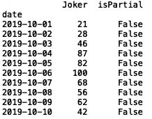
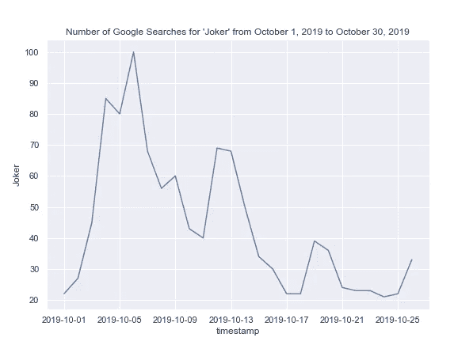
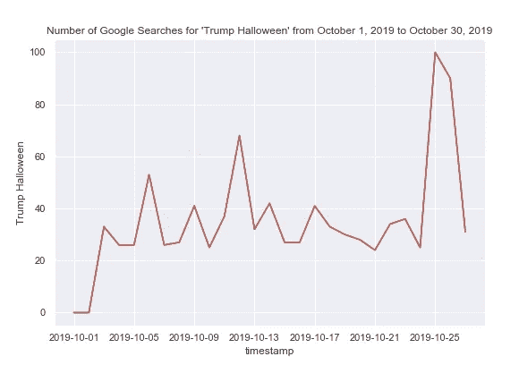
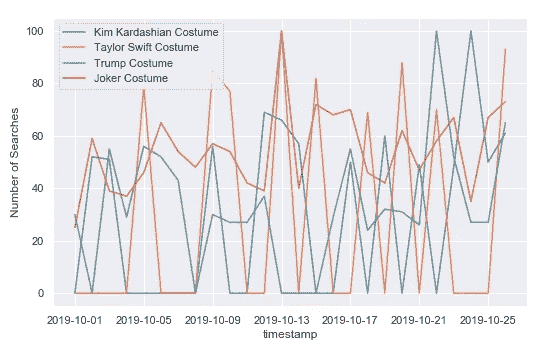
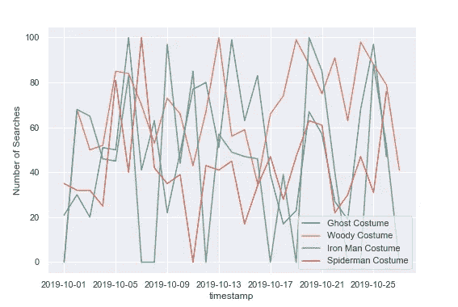
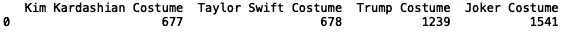

# 使用 Python 中的 Google Trends API 选择万圣节服装

> 原文：<https://towardsdatascience.com/choosing-a-halloween-costume-using-the-google-trends-api-in-python-a3206b78a2a2?source=collection_archive---------30----------------------->


Photo by [Pixabay](https://www.pexels.com/@pixabay) on [Pexels](https://www.pexels.com/photo/light-landscape-sky-sunset-35888/)

在本帖中，我们将使用开源 python 库 pytrends 来看看今年哪些万圣节服装最受欢迎。

要开始，请打开命令行并键入:

```
pip install pytrends
```

接下来从 pytrends 导入趋势请求模块:

```
from pytrends.request import TrendReq
```

接下来，我们定义一个 pytrends 实例并构建 pytrends 有效负载，其中我们指定了想要搜索的关键字、时间段和地区。让我们从 2019 年 10 月 1 日到 2019 年 10 月 30 日在纽约用“小丑”建立一个谷歌搜索的有效载荷:

```
pytrends = TrendReq(hl='en-US', tz=360)
pytrends.build_payload(['Joker'], cat=0, timeframe='2019–10–01 2019–10-30',  gprop='',geo='US-NY')
```

我们可以获取一个数据框架，它给出了一段时间内与我们的关键词相关的搜索次数:

```
df = pytrends.interest_over_time()
```

我们可以打印数据帧的前 10 行:

```
print(df.head(10))
```



我们也可以画出整个时间序列。首先，我们需要将日期列中的日期转换为日期时间值:

```
import pandas as pd 
df['timestamp'] = df.index
df['timestamp'] = pd.to_datetime(df['timestamp'])
```

接下来，让我们导入“seaborn”并绘制时间序列的线图:

```
import seaborn as sns
import matplotlib.pyplot as plt
sns.set()
sns.lineplot(df['timestamp'], df['Joker'])
plt.title("Number of Google Searches for 'Joker' from October 1, 2019 to October 30, 2019")
```



现在让我们看看另一个使用不同关键字搜索的时间序列图。让我们搜索“特朗普万圣节”:



我们还可以定义一个函数，允许我们比较许多关键字的搜索次数:

```
import seaborn as sns
import matplotlib.pyplot as plt
import pandas as pddef get_plot(key_words):
    pytrends = TrendReq(hl='en-US', tz=360)
    pytrends.build_payload([key_words], cat=0, timeframe='2019-10-01 2019-10-30',  gprop='',geo="US-NY")    
    df = pytrends.interest_over_time()  
    print(df.head(10))
    df['timestamp'] = df.index
    df['timestamp'] = pd.to_datetime(df['timestamp'])
    print(df.head())
    sns.set()
    ax = sns.lineplot(df['timestamp'], df[key_words], label = key_words)
    plt.ylabel("Number of Searchers")
    ax.legend()
    plt.show()
```

现在我们可以用许多不同的关键字调用这个函数。让我们坚持流行文化搜索:

```
get_plot("Kim Kardashian Costume")
get_plot("Taylor Swift Costume")
get_plot("Trump Costume")
get_plot("Joker Costume")
```



我们也可以尝试更传统的万圣节服装:

```
get_plot("Ghost Costume")
get_plot("Woody Costume")
get_plot("Iron Man Costume")
get_plot("Spiderman Costume")
```



为了对我们的结果做出决定，我们可以定义一个函数来返回给定关键字的搜索次数总和:

```
def get_sum(key_words):
    pytrends = TrendReq(hl='en-US', tz=360)
    pytrends.build_payload([key_words], cat=0, timeframe='2019-10-01 2019-10-30',  gprop='',geo="US-NY")    
    df = pytrends.interest_over_time()  
    print(df.head(10))
    df['timestamp'] = df.index
    df['timestamp'] = pd.to_datetime(df['timestamp'])
    print(df.head())
    return df[key_words].sum()
```

我们可以将结果存储在数据帧中并打印表格:

```
results = pd.DataFrame({"Kim Kardashian Costume":[get_sum("Kim Kardashian Costume")],"Taylor Swift Costume":[get_sum("Taylor Swift Costume"),
           "Trump Costume": [get_sum("Trump Costume")], "Joker Costume": [get_sum("Joker Costume")]})print(results)
```



看来赢家是小丑服装！你可以自己尝试更多的服装创意。这篇文章中的代码可以在 [GitHub](https://github.com/spierre91/medium_code) 上找到。我希望你喜欢！感谢阅读！