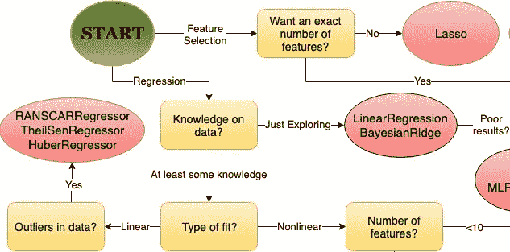
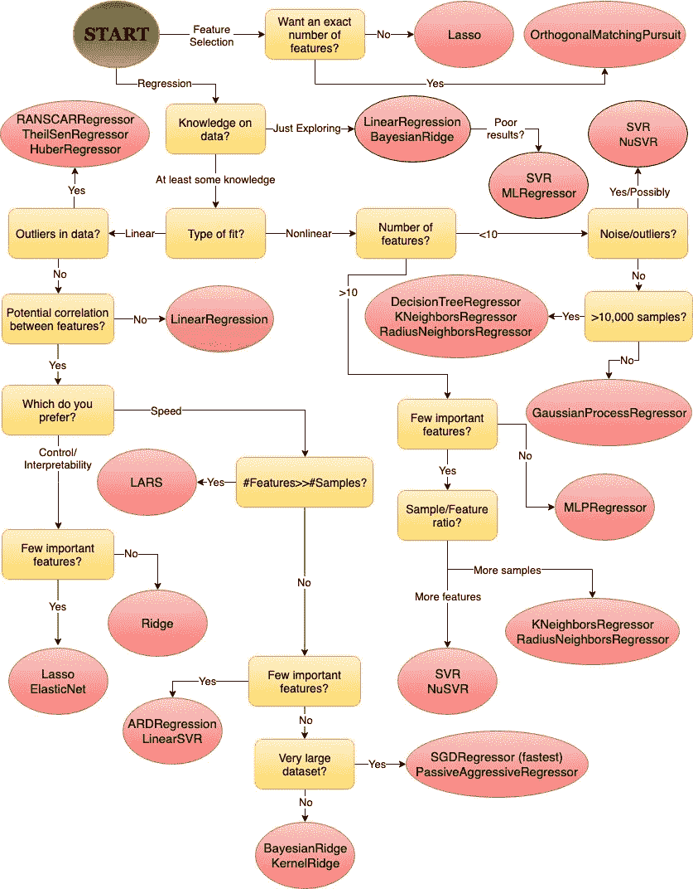

# 选择 Scikit-learn 线性回归算法

> 原文：<https://towardsdatascience.com/choosing-a-scikit-learn-linear-regression-algorithm-dd96b48105f5?source=collection_archive---------8----------------------->

## 各种 Scikit-learn 线性回归算法的简要概述，以及它们通常对哪些情况最有效。包括一个汇总表和流程图，可以快速决定适合您的数据的模型。

任何线性回归算法的目标都是根据一组给定的输入要素准确预测输出值。在 python 中，有许多不同的库可以创建模型来执行这项任务；其中 [Scikit-learn](https://scikit-learn.org/stable/index.html) 是最流行和最健壮的。Scikit-learn 有数百个类，您可以使用它们来解决各种各样的统计问题。仅在线性回归领域，就有几种不同的算法可供选择。虽然实现和比较许多不同的算法通常是最佳实践，但是通常甚至很难知道从哪里开始。

这就是为什么我决定在 Scikit 中遍历线性回归算法——在一个位置学习和编译我的所有发现。本文包括一个概述每种模型类型的表格，以及一个流程图，您可以使用它来帮助确定下一个回归任务的起点。

表格和流程图中的信息主要来自于 [Scikit-learn 文档](https://scikit-learn.org/stable/supervised_learning.html#supervised-learning)、StackOverflow 答案以及我自己的一些本地测试。

> 通过导航到模型行的左侧并单击类似下图的图标，您可以打开一个包含所有模型信息的弹出窗口:

> 下表 about_columns.csv 对每个列字段进行了说明
> 
> 建议在计算机上查看下表以了解完整功能。

以下流程图源自上表中汇编的信息。流程图的想法受到 Scikit-learn 的 [*选择正确的估计器*](https://scikit-learn.org/stable/tutorial/machine_learning_map/index.html) 的启发，但这里的一个对 Scikit-learn 提供的各种线性回归算法进行了更深入的研究。

虽然这些资源有望帮助您开始使用 Scikit-learn 的大量线性回归算法，但它们绝对不能取代测试和分析几种不同模型的有效性的重要性。

如果您对如何使用上述任何算法有任何意见，请联系并分享！另外，如果您认为这篇文章有帮助，请务必告诉我。如果是这样，我将把我对 Scikit-learn 的分类和聚类算法的笔记也编成故事！

来源:

 [## sci kit-learn:Python 中的机器学习— scikit-learn 0.21.2 文档

### 编辑描述

scikit-learn.org](https://scikit-learn.org/stable/index.html)  [## Python 中如何选择机器学习模型？⋆给一颗星星编码

### 我们已经尝试了上一篇文章中的第一个数据科学项目。你感到兴奋吗？是啊，我们应该！但是我们有…

www.codeastar.com](https://www.codeastar.com/choose-machine-learning-models-python/)  [## Python 和 R 语言中线性、脊和套索回归的综合初学者指南

### 我和我的一个朋友聊天，他碰巧是一家连锁超市的运营经理…

www.analyticsvidhya.com](https://www.analyticsvidhya.com/blog/2017/06/a-comprehensive-guide-for-linear-ridge-and-lasso-regression/)  [## ML 算法附录:被动攻击算法

### 被动积极算法是一系列在线学习算法(用于分类和回归)…

www.bonaccorso.eu](https://www.bonaccorso.eu/2017/10/06/ml-algorithms-addendum-passive-aggressive-algorithms/)  [## 决策树回归

### 决策节点和叶节点。决策节点(例如，Outlook)有两个或更多分支(例如，晴天、阴天和…

saedsayad.com](http://saedsayad.com/decision_tree_reg.htm) 

和各种堆栈溢出响应

你可以在这里找到我用来测试各种 Scikit-learn 线性回归算法的[的框架的 Jupyter 笔记本](https://github.com/qlanners/scikit-learn_disect/blob/master/all_model_tester.ipynb)。