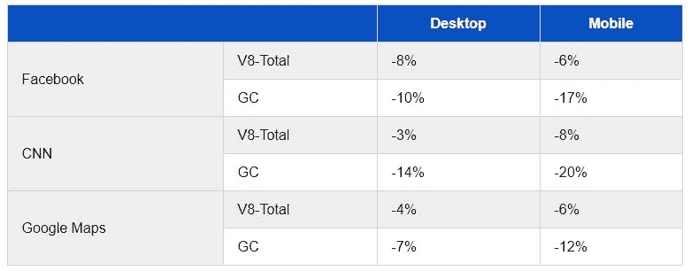

# Chrome V8 版本 8.0——V8——期待什么？

> 原文：<https://towardsdatascience.com/chrome-v8-version-8-0-v8-what-to-expect-11094d45411e?source=collection_archive---------11----------------------->

## 最受期待的 chrome 版本 V8 发布了期待已久的 v8.0，并将于 2 月份与 chrome 80 一起发布。


8.0 版本增加了一些新功能，如**可选链接、无效合并**、**更快的高阶内置功能**和**减少 40%的内存使用**由于指针压缩，这些功能和变化将**提高性能和代码生产率。**

让我们一个一个来看——

# 可选链接(？。)


Photo by [Wen Zhu](https://unsplash.com/@wenzhu645?utm_source=medium&utm_medium=referral) on [Unsplash](https://unsplash.com?utm_source=medium&utm_medium=referral)

当访问嵌套的对象属性时，我们需要手动检查属性是否存在，即它们是否为空(`null`或`undefined`)。

```
// Error prone-version, could throw.
const nameLength = db.user.name.length;TypeError: Cannot read property 'length' of undefined, if user is nullish
```

如果它们是 nullish，我们试图访问它，JavaScript 将抛出一个错误:`TypeError: Cannot read property 'property name' of undefined`。

在许多情况下，当一个对象被大量嵌套时，`if`条件或三元运算符检查会变得冗长，并且会产生所有真值而不仅仅是非空值的不良后果，如下所示

```
// Less error-prone, but harder to read.let nameLength;
if (db && db.user && db.user.name)
  nameLength = db.user.name.length;// ORnameLength =
  (db
    ? (db.user
      ? (db.user.name
        ? db.user.name.length
        : undefined)
      : undefined)
    : undefined);
```

可选链接(`?.`)帮助我们解决上述问题。

它帮助我们编写更少的代码，并获得一个健壮的属性访问链，易于阅读和检查中间值是否为空。如果是，那么整个表达式的计算结果为`undefined`。

```
const nameLength = db?.user?.name?.length;
```

我们可以在以下三种形式中使用可选链接。

1.  `object?.property` —用于访问静态属性，如上所述。
2.  `object?.[expression]` —用于访问动态属性或数组项

```
const array = null;
array?.[0]; // => undefined
```

3.`object?.([arg1, [arg2, ...]])` —执行一个对象方法

```
const object = null;
object?.method('Some value'); // => undefined
```

如果您需要，可以将这些形式组合起来创建一个长的可选链:

```
const value = object.maybeUndefinedProp?.maybeNull()?.[propName];
```

# 无效合并(？？)


Nullish coalescing (??)

这是一个新的短路操作符，用来处理默认值。

目前，默认值有时用逻辑`||`处理 falsy 值，用`&&`操作符处理 truthy 值，如下例所示。

```
function test(props) {
  const res = props.isTrue || true; 
  // return true if props.isTrue is set to false also, 
  // whereas the required result should be the value of props.isTrue
 }
```

使用 nullish 合并运算符，当`a`为 nullish ( `null`或`undefined`)时，`a ?? b`计算为`b`，否则计算为`a`。

所以在上面的例子中—

```
function test(props) {
  const res = props.isTrue ?? true;
  // return true only when props.isTrue is nullish or true
  // In case of false it evalutes to false
}
```

nullish 合并操作符和可选的链接是相伴的特性，可以很好地协同工作。可以进一步修改该示例，以处理没有传入`props`参数的情况。

```
function test(props) {
  const enable = props?.isTrue ?? true;
  // …
}
```

# 更快的高阶内置

要理解上面的性能优化，就要了解 V8 的涡扇。所以我们赶紧来看看是什么。

涡扇是一个 JIT 编译器架构师，作为 V8 中的多层翻译和优化管道，翻译和优化代码，以逐步降低形式，直到生成更高质量的机器代码。它用了一个概念叫做 [***【节点之海】***](https://darksi.de/d.sea-of-nodes/) ***。***

```
const charCodeAt = Function.prototype.apply.bind(String.prototype.charCodeAt);// before
charCodeAt(string, 8); // a lot slower
string.charCodeAt(8); // a lot faster// After optimization - same performance
charCodeAt(string, 8);
string.charCodeAt(8);
```

到目前为止，对`charCodeAt`的调用对于涡扇来说是完全不透明的，这导致了对用户定义函数的通用调用的生成。

有了这个新的变化，我们现在能够识别内置`String.prototype.charCodeAt`函数的调用，并因此能够触发所有的进一步优化，以改善对内置的调用，这导致了与直接使用内置相同的性能。

# 指针压缩

令人敬畏的 V8 团队在检查堆时发现，标记值(代表指针或小整数)占据了堆的大部分！

通过进一步检查，他们发现标记值与系统指针一样大:对于 32 位体系结构，它们是 32 位宽，而在 64 位体系结构中是 64 位。然后，当比较 32 位版本和 64 位版本时，我们为每个标记值使用了两倍的堆内存。

因此，为了解决上述问题，他们只将唯一的低位存储到堆中，然后使用它们来生成 64 位架构的高位，从而节省了宝贵的内存资源。

上述解决方案提高了 V8 和垃圾收集器在真实网站上的性能！



Some of the result shared by V8 Team

因此，我们可以期待 v8 版本的整体速度提升和一些很酷的 javascript 特性。

阅读更多关于 v8 的信息—[https://v8.dev/docs](https://v8.dev/docs)

## 如果你喜欢这篇文章，请随意分享并帮助他人找到它！

如果您想加入我的电子邮件列表，请考虑在此输入您的电子邮件地址 和**关注我的** [**媒体**](https://medium.com/@ideepak.jsd) **阅读更多关于 javascript 和**[**github**](https://github.com/dg92)**的文章，查看我的疯狂代码**。如果有什么不清楚或者你想指出什么，请在下面评论。

你可能也会喜欢我的其他文章

1.  [Javascript 新特性—第 1 部分](https://itnext.io/javascript-new-features-part-1-f1a4360466)
2.  [使用 JavaScript API 的人脸检测— face-api.js](/face-recognition-using-javascript-api-face-api-js-75af10bc3dee)
3.  [除 Console.log()以外的 8 个控制台 API 函数](https://levelup.gitconnected.com/8-console-api-functions-other-than-console-log-81cc6b7164b)

**谢谢！**