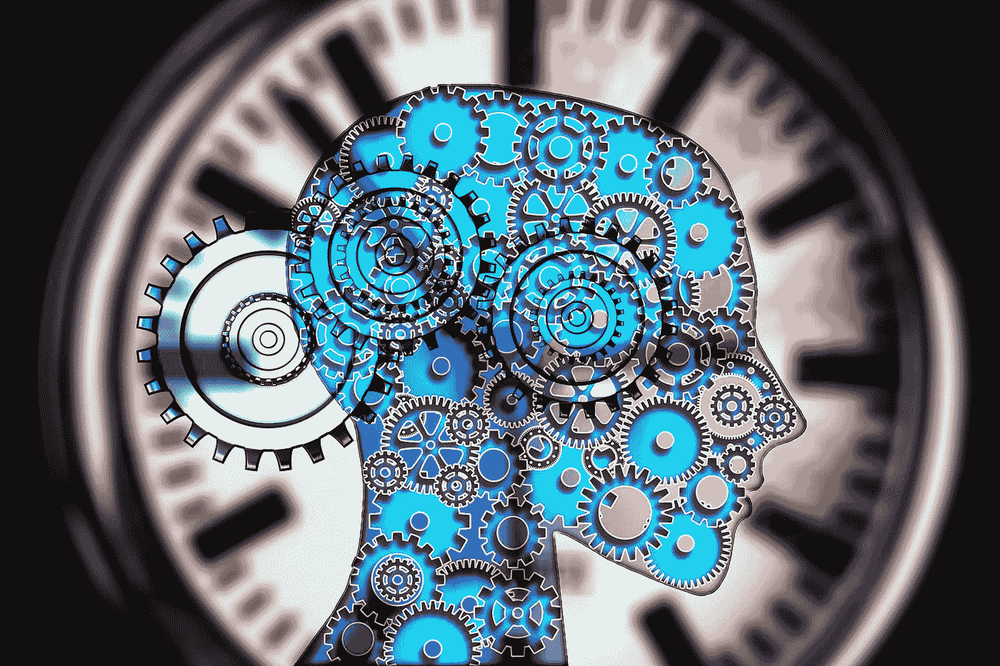
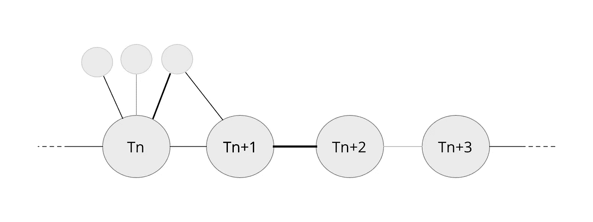

# 年代表示法

> 原文：<https://towardsdatascience.com/chronological-representation-d2c4b93c6da9?source=collection_archive---------23----------------------->

## *神经网络怎么会有时序记忆？*

了解事件发生的时间顺序对于了解因果关系、制定计划、同步社会活动以及许多其他原因至关重要。然而，对于神经科学家来说，理解时间在大脑中是如何表示的，以及人工智能研究人员来说，让代理能够在不断变化的环境中工作，仍然是一个巨大的挑战。

通常认知科学家与物理学家不同，对待时间与对待空间完全不同。神经科学家已经发现了许多负责昼夜节律、心跳、脑电波和其他周期性生物“时钟”的机制，以及毫秒级计时器。然而，人工智能主体的事件记忆的产生和存储以及时间的表示仍然是一个未解决的问题。

大多数人工智能算法基本上将时间序列视为每 *X* 秒拍摄的环境快照，而事件则存储为输入的直接副本或一些中间表示。在许多情况下，这种策略工作得很好，但它相当原始。最近的一项工作将微分方程与神经网络相结合，以显著提高它们处理不同间隔采样的数据的能力。

另一方面，大脑中事件记忆的工作通常与海马体有关。虽然在海马体中产生的动物位置的空间表示已经很好理解，但是时间部分仍然是一个问题。我们可以确定的是:海马体在整个生命过程中保持着或多或少稳定的神经发生，其中的神经元可以迁移。只有这两种机制，加上所有神经元都喜欢生长的突触和希伯仑学习，可以提供一个灵活的解决方案。

想象一下下面的场景。你生成神经元的速度与兴奋程度或其他情绪状态成正比，这表明当前环境中包含了多少新的潜在有用信息。然后，每次神经元准备好了，就创建到整个大脑的活动表示以及先前生成的神经元的链接。

你最终会得到一串神经元，它们按时间顺序代表了代理人的所有经历以及它们之间的联系。直觉上，这类似于经验的区块链。下一步是什么？例如，您可以通过在睡眠期间丢弃包含最少量信息的时间步长来优化它，以提高链中的搜索速度。或者，您可以添加更多的机制来调节节点之间的连接强度，例如，如果两个节点创建之间的时间间隔更短，则连接会更强。

大脑是这样储存记忆的吗？我不知道，但我想海马体也有类似的功能。它与现有的关于时间记忆的研究兼容吗？我也这么认为

## 资源

*   —《神经常微分方程》，作者:Ricky T. Q. Chen，Yulia Rubanova，Jesse Bettencourt，David Duvenaud
*   [arxiv.org/1901.03559](https://arxiv.org/abs/1901.03559)——阿瑟·古兹、迈赫迪·米尔扎、凯罗尔·格雷戈、里沙卜·卡巴拉、塞巴斯蒂安·拉卡尼埃、瑟奥法纳·韦伯、大卫·拉波索、亚当·桑托罗、洛朗·奥尔索、汤姆·埃克尔斯、格雷格·韦恩、大卫·西尔弗、蒂莫西·利利卡普的《无模型规划的调查》
*   cshperspectives.cshlp.org/7/2/a021808.full——《位置细胞、网格细胞和记忆》，作者迈·布里特·莫泽、大卫·c·罗兰、爱德华·I·莫泽