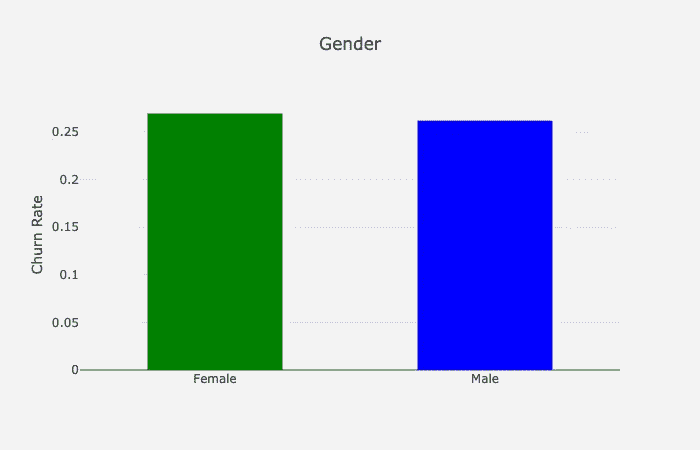

# 流失预测

> 原文：<https://towardsdatascience.com/churn-prediction-3a4a36c2129a?source=collection_archive---------2----------------------->


## [使用 Python 实现数据驱动的增长](https://towardsdatascience.com/tagged/data-driven-growth)

## 基于 XGBoost 二元分类的流失预测

这一系列文章旨在解释如何以一种简单的方式使用 Python，通过将预测方法应用于您的所有行动来推动您公司的发展。它将是编程、数据分析和机器学习的结合。

我将在以下九篇文章中讨论所有主题:

1- [了解你的衡量标准](/data-driven-growth-with-python-part-1-know-your-metrics-812781e66a5b?source=post_page---------------------------)

2- [客户细分](/data-driven-growth-with-python-part-2-customer-segmentation-5c019d150444?source=post_page---------------------------)

3- [客户终身价值预测](/data-driven-growth-with-python-part-3-customer-lifetime-value-prediction-6017802f2e0f?source=post_page---------------------------)

**4-流失预测**

[5-预测下一个购买日](/predicting-next-purchase-day-15fae5548027?source=post_page---------------------------)

[6-预测销售额](/predicting-sales-611cb5a252de?source=post_page---------------------------)

[7-市场反应模型](/market-response-models-baf9f9913298)

[8-隆起建模](/uplift-modeling-e38f96b1ef60)

[9- A/B 测试设计和执行](/a-b-testing-design-execution-6cf9e27c6559)

文章将有自己的代码片段，使您可以轻松地应用它们。如果你是编程的超级新手，你可以在这里很好地介绍一下 [Python](https://www.kaggle.com/learn/python?source=post_page---------------------------) 和 [Pandas](https://www.kaggle.com/learn/pandas?source=post_page---------------------------) (一个我们将在任何事情上使用的著名库)。但是仍然没有编码介绍，您可以学习概念，如何使用您的数据并开始从中产生价值:

> 有时候你得先跑，然后才能走——托尼·斯塔克

作为先决条件，确保你的电脑上安装了 J [upyter Notebook](https://jupyter.readthedocs.io/en/latest/install.html?source=post_page---------------------------) 和 P [ython](https://www.python.org/downloads/?source=post_page---------------------------) 。代码片段只能在 Jupyter 笔记本上运行。

好吧，我们开始吧。

# 第 4 部分:流失预测

在数据驱动增长系列的最后三节中，我们发现了[跟踪基本指标](/data-driven-growth-with-python-part-1-know-your-metrics-812781e66a5b)、[客户细分](/data-driven-growth-with-python-part-2-customer-segmentation-5c019d150444)，以及[以编程方式预测生命周期价值](/data-driven-growth-with-python-part-3-customer-lifetime-value-prediction-6017802f2e0f)。既然我们通过细分和终身价值预测了解我们的最佳客户，我们也应该努力留住他们。这使得留存率成为最重要的指标之一。

保留率是你的产品市场适合度的一个指标(PMF)。如果你的 PMF 不令人满意，你应该看到你的客户很快就会流失。提高保留率(即 PMF)的有力工具之一是客户流失预测。通过使用这种技术，你可以很容易地找出谁有可能在特定时期流失。在本文中，我们将使用一个电信数据集，并按照以下步骤开发一个客户流失预测模型:

*   探索性数据分析
*   特征工程
*   用逻辑回归研究特征如何影响记忆
*   用 XGBoost 构建分类模型

## 探索性数据分析

我们首先检查我们的数据看起来如何，并想象它如何与我们的标签交互(搅动与否？).让我们从导入数据开始，打印前十行:

```
df_data = pd.read_csv('churn_data.csv')
df_data.head(10)
```

输出:


查看所有列及其数据类型的更好方法是使用**。info()** 方法:


我们的数据似乎分为两类:

*   分类特征:性别、流媒体电视、支付方式等。
*   数字特征:任期，每月收费，总费用

现在，从分类开始，我们阐明所有特征，看看它们对识别客户是否会流失有多大帮助。

顺便提一下，在我们拥有的数据集中，流失列是带有*是/否*值的*字符串*。我们将它转换为整数，以便在我们的分析中更容易使用。

```
df_data.loc[df_data.Churn=='No','Churn'] = 0 
df_data.loc[df_data.Churn=='Yes','Churn'] = 1
```

**性别**

通过使用下面的代码块，我们可以很容易地看到每个值的流失率(1-保留率)的样子:

```
df_plot = df_data.groupby('gender').Churn.mean().reset_index()
plot_data = [
    go.Bar(
        x=df_plot['gender'],
        y=df_plot['Churn'],
        width = [0.5, 0.5],
        marker=dict(
        color=['green', 'blue'])
    )
]plot_layout = go.Layout(
        xaxis={"type": "category"},
        yaxis={"title": "Churn Rate"},
        title='Gender',
        plot_bgcolor  = 'rgb(243,243,243)',
        paper_bgcolor  = 'rgb(243,243,243)',
    )
fig = go.Figure(data=plot_data, layout=plot_layout)
pyoff.iplot(fig)
```

输出:



**Churn Rate by Gender**

流失率的性别细分:


女性客户比男性客户更容易流失，但这种差异很小(约 0.8%)。

**让我们对所有分类列重复这个过程。为了不重复我们对性别所做的，你可以在下面找到所有需要的代码:**

现在，我们来了解一下这些特性，这些特性显示了它们之间最显著的价值差异:

**互联网服务**


**Churn Rate by Internet Service**

该图表显示，使用光纤作为互联网服务的客户更有可能流失。我通常预计光纤客户流失会更少，因为他们使用更优质的服务。但这可能是由于高价格、竞争、客户服务和许多其他原因造成的。

**合同**


**Churn Rate by Contract**

不出所料，合同越短意味着流失率越高。

**技术支持**


**Churn Rate by Tech Support**

不使用技术支持的客户更有可能流失(相差约 25%)。

**付款方式**


自动支付使客户更有可能留在你的平台上(大约 30%的差异)。

**其他**

让我们在这里展示一些其他特性的图表以供参考:


**Churn Rate by Paperless Billing, Streaming Movies, Device Protection & Phone Service**

我们完成了分类特征。让我们看看数字特征是什么样的:

**任期**

要了解任期和平均流失率之间的趋势，让我们构建一个散点图:

```
df_plot = df_data.groupby('tenure').Churn.mean().reset_index()plot_data = [
    go.Scatter(
        x=df_plot['tenure'],
        y=df_plot['Churn'],
        mode='markers',
        name='Low',
        marker= dict(size= 7,
            line= dict(width=1),
            color= 'blue',
            opacity= 0.8
           ),
    )
]plot_layout = go.Layout(
        yaxis= {'title': "Churn Rate"},
        xaxis= {'title': "Tenure"},
        title='Tenure based Churn rate',
        plot_bgcolor  = "rgb(243,243,243)",
        paper_bgcolor  = "rgb(243,243,243)",
    )
fig = go.Figure(data=plot_data, layout=plot_layout)
pyoff.iplot(fig)
```


**Churn Rate by Tenure**

显而易见，任期越长意味着流失率越低。我们将对*月费用和总费用:*应用相同的方法

输出:


**Churn Rate by Monthly & Total Charges**

不幸的是，流失率和每月及总费用之间没有趋势。

## 特征工程

在本节中，我们将转换我们的原始特征，以从中提取更多信息。我们的策略如下:

1-使用聚类技术对数字列进行分组

2-将**标签编码器**应用于二进制分类特征

3-将 **get_dummies()** 应用于具有多个值的分类特征

**数值列**

正如我们从 EDA 部分了解到的，我们有三个数字列:

*   任期
*   每月费用
*   总费用

我们将应用以下步骤来创建组:

1.  用肘法确定适当的聚类数
2.  将 K-means 逻辑应用于所选列并更改命名
3.  观察集群的轮廓

让我们看看这在实践中是如何适用于*任期*的:

群集配置文件:


我们有 3 个集群，平均任期分别为 7.5 年、33.9 年和 63 年。

每个集群的流失率:


**Churn Rate by tenure clusters**

这是对每月费用和总费用进行同样处理后的效果:

*月费:*


**Monthly Charge Clusters profile**


**Churn Rate by monthly charge clusters**

*总费用:*


**Total Charge Clusters profile**


**Churn Rate by total charge clusters**

**分类列**

**标签编码器**通过简单地将整数分配给不同的值，将分类列转换为数字列。例如，**性别**列有两个值:*女性* & *男性*。标签编码器会将其转换为 1 和 0。

**get_dummies()** 方法通过分配 0&1 来从分类列中创建新列(您可以在我们的[上一篇文章](/data-driven-growth-with-python-part-3-customer-lifetime-value-prediction-6017802f2e0f)中找到准确的解释)

让我们在实践中看到这两者:

```
#import Label Encoder
from sklearn.preprocessing import LabelEncoder
le = LabelEncoder()
dummy_columns = [] #array for multiple value columnsfor column in df_data.columns:
    if df_data[column].dtype == object and column != 'customerID':
        if df_data[column].nunique() == 2:
            #apply Label Encoder for binary ones
            df_data[column] = le.fit_transform(df_data[column]) 
        else:
            dummy_columns.append(column)#apply get dummies for selected columns
df_data = pd.get_dummies(data = df_data,columns = dummy_columns)
```

查看所选列的数据外观:


如您所见，**性别** & **合作伙伴**列变成了数字列，并且我们为 **TenureCluster** 增加了三个新列。

是时候拟合一个逻辑回归模型并提取洞察力来做出更好的商业决策了。

## 逻辑回归

预测流失是一个二元分类问题。在一定时期内，客户要么流失，要么保留。作为一个稳健的模型，逻辑回归也提供了可解释的结果。正如我们之前所做的，让我们整理出构建逻辑回归模型的步骤:

1.  准备数据(模型的输入)
2.  拟合模型并查看模型摘要

摘要如下所示:


我们从这份报告中得到了两个重要的结果。当您准备客户流失预测模型时，您将面临以下问题:

1-哪些特征会让客户流失或保留？

2-最关键的是什么？我们应该关注什么？

对于第一个问题，您应该查看第 4 列(P>|z|)。如果绝对 **p 值**小于 0.05，这意味着该特征以统计显著的方式影响客户流失。例如:

*   老年人
*   互联网服务 _DSL
*   OnlineSecurity_NO

然后第二个问题。我们想降低流失率，应该从哪里着手？这个问题的科学版是；

> 如果我增加/减少一个单位，哪个特性会带来最好的 ROI？

这个问题可以通过查看 T21 专栏来回答。如果我们改变一个单位，指数系数会给出流失率的预期变化。如果我们应用下面的代码，我们将看到所有系数的转换版本:

```
np.exp(res.params)
```


例如，如果我们保持其他一切不变，每月费用的一个单位变化意味着搅动的几率提高了约 3.4%。从上表中，我们可以快速确定哪些功能更重要。

现在，构建分类模型的一切都准备好了。

## 基于 XGBoost 的二元分类模型

为了使 XGBoost 适合我们的数据，我们应该准备特征(X)和标签(y)集，并进行训练和测试分割。

```
#create feature set and labels
X = df_data.drop(['Churn','customerID'],axis=1)
y = df_data.Churn#train and test split
X_train, X_test, y_train, y_test = train_test_split(X, y, test_size=0.05, random_state=56)#building the model & printing the score
xgb_model = xgb.XGBClassifier(max_depth=5, learning_rate=0.08, objective= 'binary:logistic',n_jobs=-1).fit(X_train, y_train)print('Accuracy of XGB classifier on training set: {:.2f}'
       .format(xgb_model.score(X_train, y_train)))
print('Accuracy of XGB classifier on test set: {:.2f}'
       .format(xgb_model.score(X_test[X_train.columns], y_test)))
```

通过使用这个简单的模型，我们达到了 81%的准确率:


我们在数据集中的实际流失率是 26.5%(反映为模型性能的 73.5%)。这表明我们的模型是有用的。最好检查一下我们的分类模型，看看我们的模型到底在哪里失败了。

```
y_pred = xgb_model.predict(X_test)
print(classification_report(y_test, y_pred))
```


我们可以这样理解上面的报告，就好像我们的模型告诉我们，100 个客户会流失，其中 67 个会流失(精度 0.67)。实际上，大约有 220 名客户会流失(0.45 次召回)。特别是召回是这里的主要问题，我们可以通过以下方式提高模型的整体性能:

*   添加更多数据(对于这个例子，我们有大约 2k 行)
*   添加更多功能
*   更多功能工程
*   尝试其他模型
*   超参数调谐

接下来，让我们详细看看我们的模型是如何工作的。首先，我们想知道我们的模型确切地使用了数据集中的哪些特征。还有，哪些是最重要的？

为了解决这个问题，我们可以使用下面的代码:

```
from xgboost import plot_importance
fig, ax = plt.subplots(figsize=(10,8))
plot_importance(xgb_model, ax=ax)
```


**Features importance for XGBoost Model**

我们可以看到，与其他模型相比，我们的模型更重视总费用和月费用。

最后，使用该模型的最佳方式是为每个客户分配流失概率，创建细分市场，并在此基础上制定策略。要从我们的模型中获得流失概率，请使用下面的代码块:

```
df_data['proba'] = xgb_model.predict_proba(df_data[X_train.columns])[:,1]
```

我们的数据集最后看起来如下:


Churn Probabilities of the customers

现在，我们知道在我们的最佳细分市场中是否有可能流失客户(回想一下[第 2 部分](/data-driven-growth-with-python-part-2-customer-segmentation-5c019d150444)和[第 3 部分](/data-driven-growth-with-python-part-3-customer-lifetime-value-prediction-6017802f2e0f)，我们可以据此制定行动。在下一篇文章中，我们将重点预测客户的[下一个购买日。](/predicting-next-purchase-day-15fae5548027)

你可以在这里找到这部分[的 Jupyter 笔记本。](https://gist.github.com/karamanbk/56522d30345b8672a52c6846e971cb3c)

需要帮助来发展你的公司吗？点击此处与我预约免费课程[。](https://app.growthmentor.com/mentors/baris-karaman)