# 流失预测

> 原文：<https://towardsdatascience.com/churn-prediction-770d6cb582a5?source=collection_archive---------2----------------------->

## 了解如何为流失预测训练决策树模型。


Photo by [Mantas Hesthaven](https://unsplash.com/photos/_g1WdcKcV3w?utm_source=unsplash&utm_medium=referral&utm_content=creditCopyText) on [Unsplash](https://unsplash.com/search/photos/leaving?utm_source=unsplash&utm_medium=referral&utm_content=creditCopyText)

客户流失，也称为客户流失，发生在客户停止与公司做生意的时候。这些公司对确定这些客户的细分感兴趣，因为获得一个新客户的价格通常比留住老客户的价格高。例如，如果网飞知道有一部分客户有流失的风险，他们就可以主动用特别优惠吸引他们，而不是简单地失去他们。

在本帖中，我们将使用[电信客户流失数据集](https://www.kaggle.com/blastchar/telco-customer-churn)创建一个简单的客户流失预测模型。我们选择了一个决策树来模拟被搅动的顾客，[熊猫](https://pandas.pydata.org/)用于数据处理， [matplotlib](https://matplotlib.org/) 用于可视化。我们将使用 Python 来完成以上所有工作。
该代码可用于另一个数据集，稍加调整即可训练基线模型。我们还提供了一些参考资料，并给出了新功能和改进的想法。

你可以通过下载这个 [Jupyter 笔记本](https://romanorac.github.io/assets/notebooks/2019-01-25-churn-prediction.ipynb)来运行这段代码。

这里有几个你可能会感兴趣的链接:

```
- [Complete your Python analyses 10x faster with Mito](https://trymito.io/) [Product]- [Free skill tests for Data Scientists & ML Engineers](https://aigents.co/skills) [Test]- [All New Self-Driving Car Engineer Nanodegree](https://imp.i115008.net/c/2402645/1116216/11298)[Course]
```

*你愿意多看一些这样的文章吗？如果是这样，你可以点击上面的任何链接来支持我。其中一些是附属链接，但你不需要购买任何东西。*

# 数据预处理

我们使用 pandas 来读取数据集并对其进行预处理。电信数据集每行有一个客户，有许多列(特征)。不存在所有值都缺失或重复的行(现实世界的数据集很少出现这种情况)。有 11 个样本的*总费用*设置为“”，这似乎是数据中的错误。我们移除这些样本，并将类型设置为 numeric (float)。

```
df = pd.read_csv('data/WA_Fn-UseC_-Telco-Customer-Churn.csv')df = df.dropna(how=”all”) # remove samples with all missing values
df = df[~df.duplicated()] # remove duplicatestotal_charges_filter = df.TotalCharges == " "
df = df[~total_charges_filter]
df.TotalCharges = pd.to_numeric(df.TotalCharges)
```

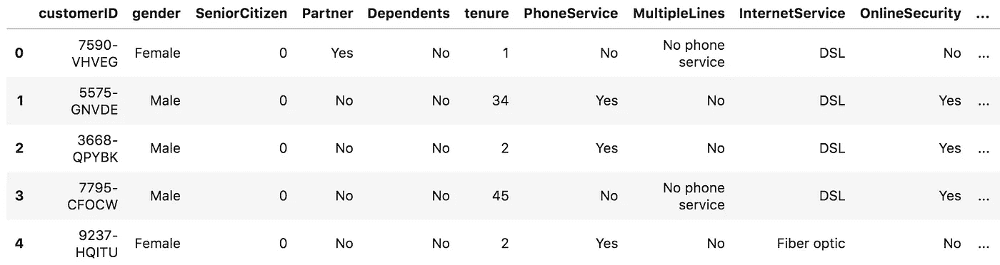

First few samples in Telco Customer Churn dataset

# 探索性数据分析

数据集中有两种类型的特征:分类特征(两个或多个值，没有任何顺序)和数值特征。大多数特性名称都是不言自明的，除了:

*   *合作伙伴*:客户是否有合作伙伴(是，否)，
*   *家属*:客户是否有家属(是，否)，
*   *在线备份*:客户是否有在线备份(是，否，无互联网服务)，
*   *任期*:客户在公司呆的月数，
*   *月费*:每月向客户收取的金额。
*   *总费用*:向客户收取的总费用。

数据集中有 7032 个客户，19 个特征没有 customerID(非信息)和流失列(目标变量)。大多数分类特征具有 4 个或更少的唯一值。

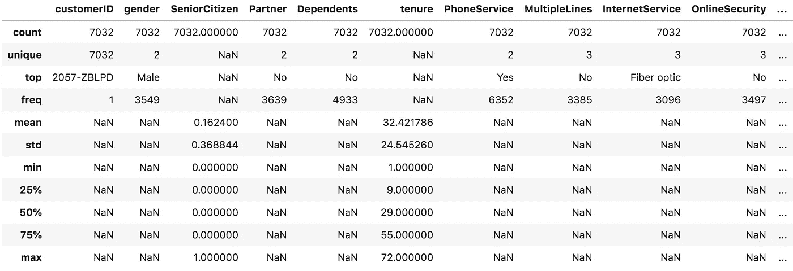

Dataset Summary

我们将特性合并到两个列表中，以便我们可以联合分析它们。

```
categorical_features = [
 “gender”,
 “SeniorCitizen”,
 “Partner”,
 “Dependents”,
 “PhoneService”,
 “MultipleLines”,
 “InternetService”,
 “OnlineSecurity”,
 “OnlineBackup”,
 “DeviceProtection”,
 “TechSupport”,
 “StreamingTV”,
 “StreamingMovies”,
 “Contract”,
 “PaperlessBilling”,
 “PaymentMethod”,
]
numerical_features = [“tenure”, “MonthlyCharges”, “TotalCharges”]
target = “Churn”
```

## 数字特征分布

数字汇总技术(平均值、标准偏差等。)不要告诉我们尖峰，分布的形状，很难观察到异常值。这就是我们使用直方图的原因。

```
df[numerical_features].describe()
```

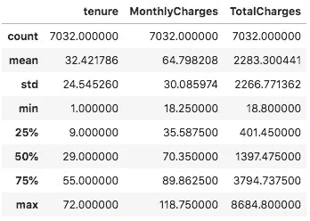

Summary of numerical features

乍一看，数据中没有任何异常值。没有数据点脱离分布或离平均值太远。为了确认这一点，我们需要计算[四分位间距(IQR)](https://www.purplemath.com/modules/boxwhisk3.htm) ，并显示每个数值特征的值在第一个和第三个四分位的 1.5 IQR 范围内。

我们可以将数字特征转换成有序区间。例如，保有权是数字，但我们通常不关心小的数字差异，而是将客户的保有权分为短期、中期和长期保有权。转换它的一个原因是为了减少噪音，通常小的波动只是噪音。

```
df[numerical_features].hist(bins=30, figsize=(10, 7))
```

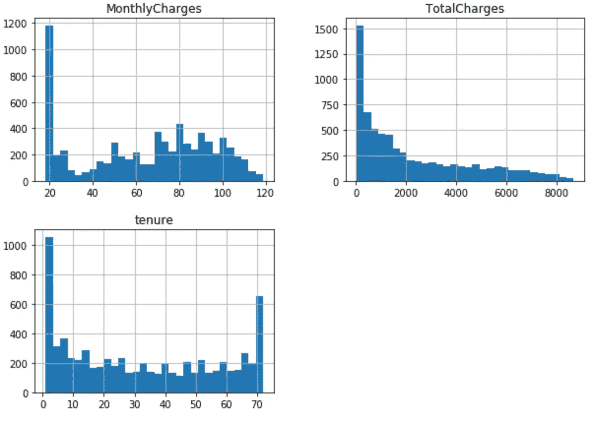

Histograms of numerical features

我们着眼于与目标变量相关的数字特征的分布。我们可以观察到，总费用和任期越大，流失的可能性就越小。

```
fig, ax = plt.subplots(1, 3, figsize=(14, 4))
df[df.Churn == "No"][numerical_features].hist(bins=30, color="blue", alpha=0.5, ax=ax)
df[df.Churn == "Yes"][numerical_features].hist(bins=30, color="red", alpha=0.5, ax=ax)
```

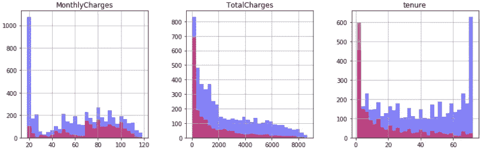

Numerical features in relation to the target variable

## 分类特征分布

为了分析分类特征，我们使用条形图。我们观察到，老年人和没有电话服务的客户在数据中较少出现。

```
ROWS, COLS = 4, 4
fig, ax = plt.subplots(ROWS, COLS, figsize=(18, 18))
row, col = 0, 0
for i, categorical_feature in enumerate(categorical_features):
    if col == COLS - 1:
        row += 1
    col = i % COLS
    df[categorical_feature].value_counts().plot('bar', ax=ax[row, col]).set_title(categorical_feature)
```

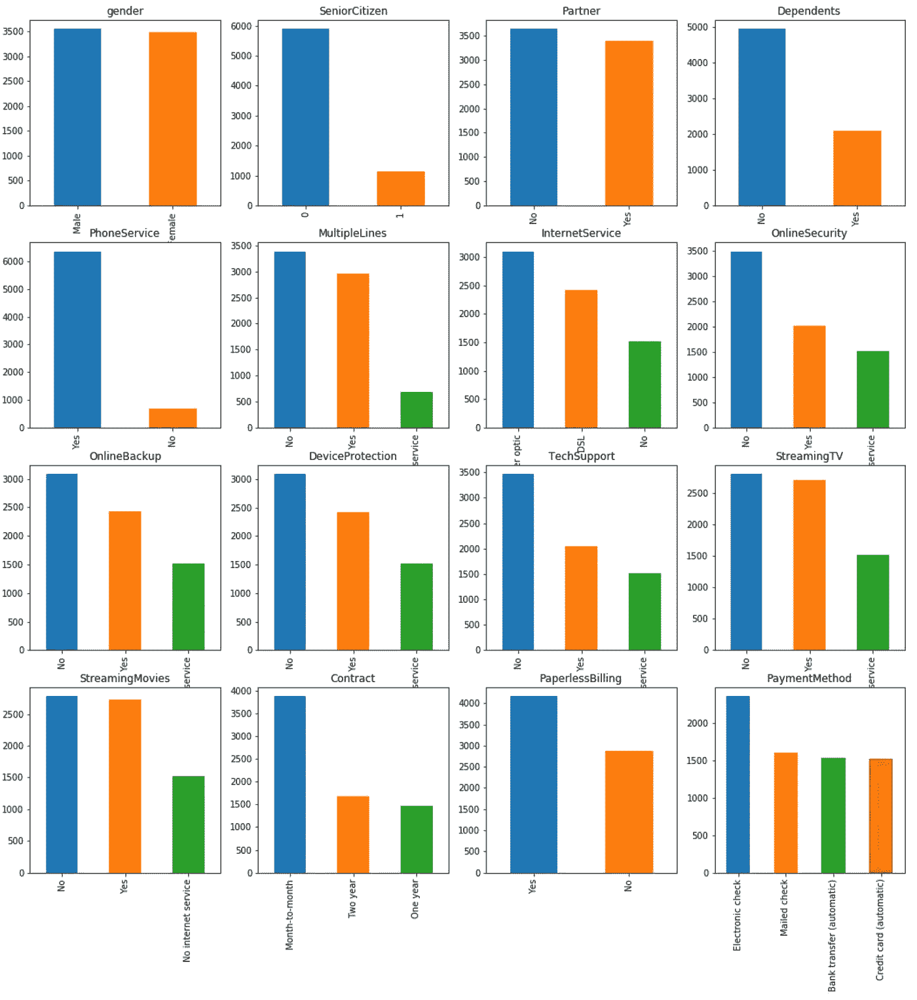

Distribution of categorical features

下一步是查看与目标变量相关的分类特征。我们这样做只是为了合同特征。月结合同的用户比长期合同的用户更容易流失。

```
feature = ‘Contract’
fig, ax = plt.subplots(1, 2, figsize=(14, 4))
df[df.Churn == “No”][feature].value_counts().plot(‘bar’, ax=ax[0]).set_title(‘not churned’)
df[df.Churn == “Yes”][feature].value_counts().plot(‘bar’, ax=ax[1]).set_title(‘churned’)
```

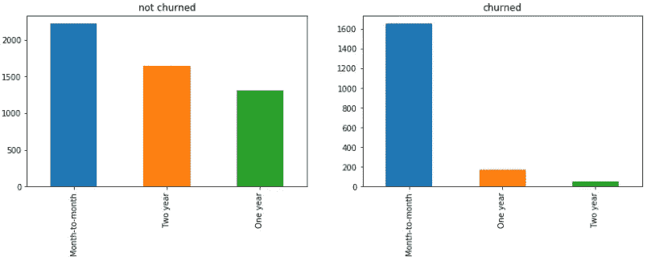

Contract feature in relation to the target variable

## 目标变量分布

目标变量分布表明，我们正在处理一个不平衡的问题，因为有更多的非搅动用户和搅动用户。该模型将实现高准确性，因为它将主要预测多数类——在我们的示例中没有流失的用户。

我们可以做一些事情来最小化不平衡数据集的影响:
-重新采样数据([不平衡-学习](https://imbalanced-learn.readthedocs.io/en/stable/))，
-收集更多的样本，
-使用精度和召回作为准确性度量。

```
df[target].value_counts().plot('bar').set_title('churned')
```

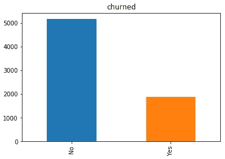

Target variable distribution

# 特征

电信数据集已经按 *customerID* 分组，因此很难添加新功能。在进行客户流失预测时，我们通常会得到一个数据集，每个客户会话(特定时间内的客户活动)都有一个条目。然后，我们可以添加如下功能:

*   买东西之前的会话次数，
*   每次会话的平均时间，
*   会话之间的时间差(频繁或不频繁的客户)，
*   仅是一个国家的客户。

有时，我们甚至有客户事件数据，这使我们能够找到与结果(流失)相关的客户行为模式。

## 编码功能

为了给客户流失建模准备数据集，我们需要将分类特征编码成数字。这意味着对*【是】**【否】*到 *0* 和 *1* 进行编码，以便算法可以处理数据。这个过程叫做 [onehot 编码](https://machinelearningmastery.com/why-one-hot-encode-data-in-machine-learning/)。

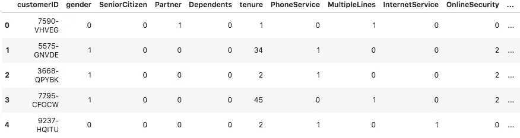

One hot encoded categorical features

# 分类者

我们使用 Python 中的机器学习库 sklearn 来创建分类器。
sk learn 方式是使用定义特征处理和分类器的管道。在我们的示例中，管道在输入中获取数据集，它预处理特征并训练分类器。
训练时，它接受相同的输入，并在输出中返回预测。

在流水线中，我们分别处理分类特征和数字特征。我们一次性对分类特征进行编码，并通过去除平均值和将它们缩放到单位方差来缩放数字特征。
我们选择决策树模型是因为它的可解释性，并将最大深度设置为 3(任意)。

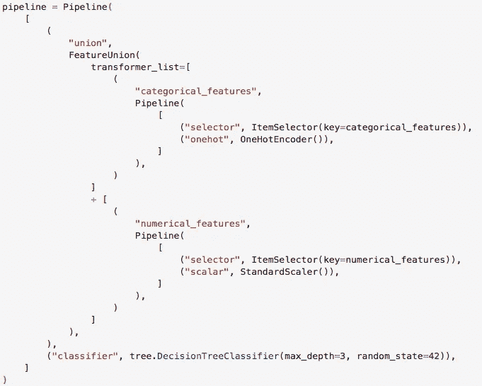

The pipeline takes a dataset in the input, it preprocesses features and trains the classifier

## 训练模型

我们将数据集分为训练(75%样本)和测试(25%样本)。
我们训练(拟合)管道并进行预测。使用 classification_report，我们用实际值和预测值计算精度和召回率。

```
from sklearn.model_selection import train_test_splitdf_train, df_test = train_test_split(df, test_size=0.25, random_state=42)pipeline.fit(df_train, df_train[target])
pred = pipeline.predict(df_test)
```

## 测试模型

通过*分类 _ 报告*我们用实际值和预测值计算精度和召回率。

对于类别 1(搅动的用户)，模型实现了 0.67 的精确度和 0.37 的召回率。Precision 告诉我们，我们的分类器正确预测了多少被搅动的用户。另一方面，回忆告诉我们它错过了多少用户。

通俗地说，这个分类器对于不稳定的用户来说不是很准确。

```
from sklearn.metrics import classification_reportprint(classification_report(df_test[target], pred))
```

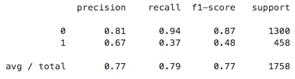

Classification report for the Decision Tree model

## 模型可解释性

决策树模型使用*合同*、*月费*、*互联网服务*、*总费用、*和*任期*特征来决定客户是否会流失。这些特征根据决策树中的划分标准很好地将流失的客户与其他客户区分开来。

每个客户样本遍历树，最终节点给出预测。
例如，如果*Contract _ 逐月*为:

*   等于 0，继续遍历具有真实分支的树，
*   等于 1，继续遍历带有错误分支的树，
*   未定义，它输出类 0。

这是一种很好的方法，可以看到模型是如何做出决策的，或者是否有任何不应该出现在模型中的特性。

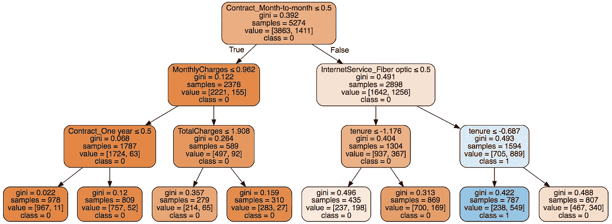

Interpretation of the Decision tree model

# 进一步阅读

1.  [处理客户流失预测中的类别不平衡](https://www.sciencedirect.com/science/article/pii/S0957417408002121) —我们如何更好地处理流失预测中的类别不平衡。
2.  [关于使用机器学习技术预测客户流失的调查](https://www.researchgate.net/publication/310757545_A_Survey_on_Customer_Churn_Prediction_using_Machine_Learning_Techniques)——本文回顾了研究人员用于流失预测的最流行的机器学习算法。
3.  [ka ggle 上的电信客户流失](https://www.kaggle.com/blastchar/telco-customer-churn)—ka ggle 上的流失分析。
4.  [WTTE-RNN 无黑客流失建模](https://ragulpr.github.io/2016/12/22/WTTE-RNN-Hackless-churn-modeling) —基于事件的流失预测。

# 在你走之前

在 [Twitter](https://twitter.com/romanorac) 上关注我，在那里我定期[发布关于数据科学和机器学习的](https://twitter.com/romanorac/status/1328952374447267843)消息。


Photo by [Courtney Hedger](https://unsplash.com/@cmhedger?utm_source=medium&utm_medium=referral) on [Unsplash](https://unsplash.com/?utm_source=medium&utm_medium=referral)