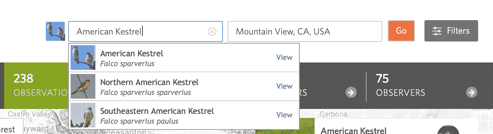
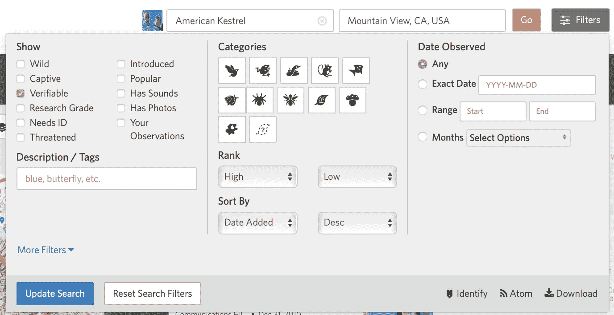
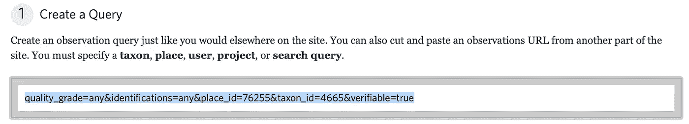
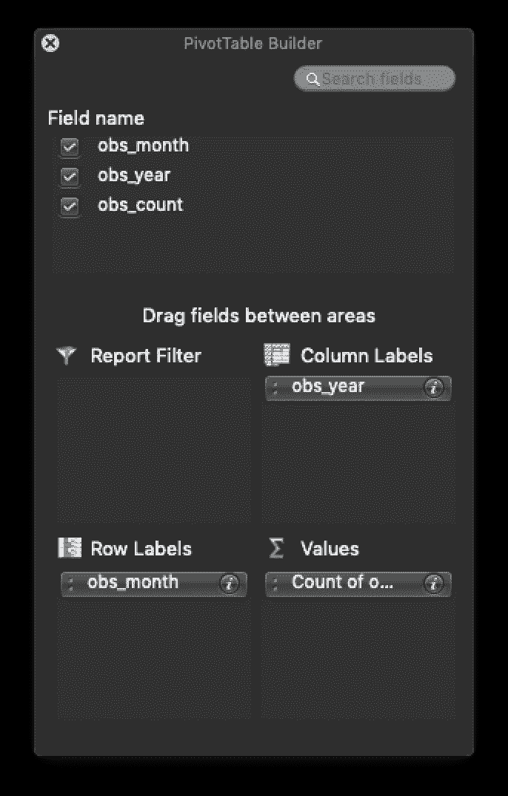
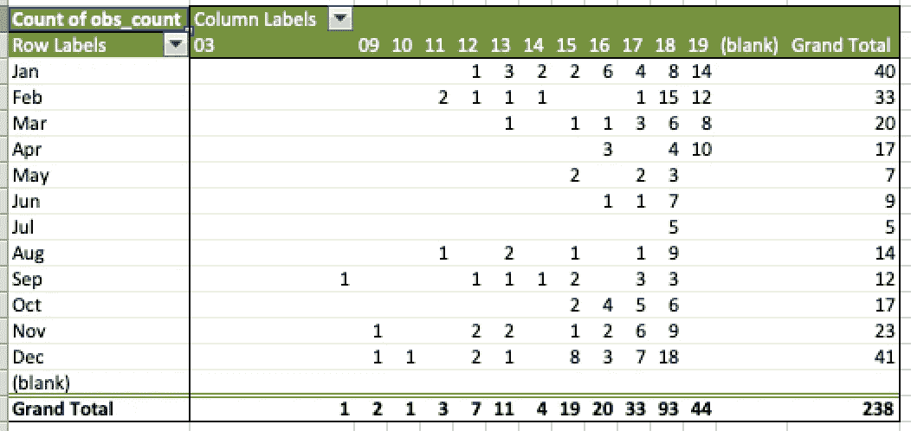

# 公民数据科学:不用编程分析自然

> 原文：<https://towardsdatascience.com/citizen-data-science-4d412827bda6?source=collection_archive---------22----------------------->

## 将 Excel 与 iNaturalist 和 eBird 一起使用


Steven Wright @stevenwright via Unsplash

我最近在加维兰学院给一个植物学班的学生做了一次非正式的演讲。最初的主题是自然摄影，但我也谈到了我用来创作我最近完成的摄影集《鸟类肖像:海岸线公园》的数据科学技术。

这本书的概念是试图亲自拍摄特定地区所有鸟类的照片，在这种情况下，在加利福尼亚州山景城的山景城公园的[海岸线，我后来扩展到包括帕洛阿尔托贝兰兹。为了列举在这一领域已经看到的物种，我求助于两个公民科学网站，T4 自然主义者网站和电子鸟类网站，这两个网站都有应用程序接口。请注意，虽然 eBird 是鸟类特有的，但 iNaturalist 也包含植物和其他动物的数据。](https://www.mountainview.gov/depts/cs/shoreline/default.asp)

未来的一组文章将涵盖我用来研究和创作这本书的不同技术和库，包括用于地图制作的[叶子](https://python-visualization.github.io/folium/)。这些也将引用包含我使用的 Python 代码的 GitHub 库。

# Sans 编程

对于一个以数据科学为生的人来说，所有这些都很好，比起 Excel 表格，他更喜欢熊猫的数据框架。然而，即使您不是程序员，您也可能会习惯使用 Microsoft Excel，它可以有效地用于使用 iNaturalist 和 eBird 数据进行一些调查。

一点点创造性地剪切和粘贴 URL 可以在不需要学习 Python 或 r 的情况下使用这些有价值的数据。毕竟，这是我为了弄清楚一些 API 是如何工作的，或者在它们不像宣传的那样工作时复制它们而做的。

# 方法

植物学课上的一名学生提交了一份关于 Muhlenbergia rigens(俗称鹿草)的报告。虽然它是一种迷人的植物，但我将把对 *Muhlenbergia rigens* 的分析作为练习，而是考虑我最喜欢的鸟类之一，美国红隼( *Falco sparverius* )。


American Kestrel (*Falco sparverius*), photo by author

为了说明这种技术，我们将搜索美国红隼对自然主义者的观察。我将详细介绍这些步骤，以便清楚地说明如何推广到其他应用程序。

首先进入非自然语言学家主页[这里](https://www.inaturalist.org/home)，点击左上角的放大镜。在搜索框中输入“American Kestrel”即可进入该页面:

https://www.inaturalist.org/observations?place_id=any&taxon _ id = 4665

我们可以看到有 13269 个观察值(到目前为止)。你也可以从这里看到，他们对*隼鸟*使用的分类单元号是 4665。因为我对当地的目击事件感兴趣，所以我还在 location 字段中填入了“Mountain View，CA，USA ”,将我们的结果限制为 238 次观察。



iNaturalist helpfully shows possible choices

接下来，点击**过滤器**，然后点击**下载**。



Lots of filtering options here

这将引导您进入一个新页面，其中有大量选项可供您选择最终导出的 CSV(逗号分隔值)文件。这个页面的关键部分是这样的:



通过将框中的查询片段附加到以下内容:

```
https://www.inaturalist.org/observations?
```

您将获得下载的完整 URL。更改“创建查询”窗格中的选项将会更改 URL 片段。我点击了“名胜古迹”，把区域限制在山景城；我们只得到 238 个观察值。从查询中，我们看到 76255 是山景城的 place_id。

完成过滤后，向下滚动到步骤 4，然后单击“创建导出”。如果观察次数很少，它将很快完成。滚动回顶部，在“导出完成”上方点击“下载”按钮。在 Mac 电脑上，这将进入您的下载文件夹，名称类似“observations-53038.csv”，您现在可以用 Excel 打开它。

当您有喜欢的搜索查询时，请在笔记中保存完整的 URL，以便快速、可重复地访问数据，这始终是数据科学的一个重要部分。

# 开始分析！

默认下载中有 36 列，浏览它们会立即给我们一些数据分析的思路。例如，我们可以使用纬度和经度列在地图上绘制观察结果，或者使用自然语言处理检查描述列——等等，这是 Excel，不是 Jupyter Python 笔记本，所以这些列不容易使用。

如果我们打算在野外找到一只美洲红隼，知道它是季节性的还是全年性的将会非常有用。有帮助的一栏是“观察到的”，它看起来是 MM/DD/YY 格式。使用 Excel 的“数据透视表”功能，我们可以按月汇总观察计数，以找到一年中寻找它的最佳时间。

这不是关于数据透视表的教程，所以我们将遵循 StackOverflow 帖子[ [1](https://stackoverflow.com/questions/15838543/excel-count-number-of-occurences-by-month/15838994#15838994) ]。

1.  在“observed_on”列后添加三列:obs_month、obs_year 和 obs_count
2.  对 obs_month 使用公式=TEXT(C2，“MMM”)，对 obs_year 使用公式=TEXT(C2，“YYYY”)，对 obs_count 使用数字 1，并填写所有观察值(如果复制和粘贴，请注意智能引号！)
3.  选择三个新列并创建一个数据透视表(在 Mac 版本的 Excel 上，单击*数据*选项卡找到它)。
4.  将 obs_year 拖到列标签下，将 obs_month 拖到行标签下，将 obs_count 字段拖到值下，如下所示。



这将创建一个如下所示的数据透视表:



回答什么时候能看到美洲红隼的问题，兴趣一栏是最右边的一栏；我们看到冬季月份是它最常被报道的时候(尽管不一定是它最丰富的时候)。最下面一行也很有趣，可能是因为非自然主义者手机应用程序越来越受欢迎。

# eBird

尽管本文使用了非自然的例子，但是 eBird 的大部分数据都可以通过查看 API 参考资料来获得。

例如，此 URL:

```
[https://ebird.org/ws2.0/ref/hotspot/geo?lat=37.4407&lng=-122.0936&fmt=csv&dist=6](https://ebird.org/ws2.0/ref/hotspot/geo?lat=37.4407&lng=-122.0936&fmt=json&dist=6)
```

将下载山景城海岸线公园 6 公里范围内观鸟热点的 CSV 数据。通过通读 API 文档[这里](https://documenter.getpostman.com/view/664302/S1ENwy59?version=latest)，您可以构建其他有用的查询 URL。

# 结论

虽然这篇文章只是触及了公民科学数据宝库的皮毛，但它表明即使没有编程，也有可能获得有用的见解。

当然，我也希望它能激励你们中的一些人超越 Excel，学习 Python 或 R 之类的编程语言来帮助自动化分析任务。我在下面提供了一些文章链接，以帮助你快速启动你的努力。

# 参考

1.  [Excel:按月统计出现次数](https://stackoverflow.com/questions/15838543/excel-count-number-of-occurences-by-month/15838994#15838994)，Matthew Lock 和 Stepan1010，StackOverflow。
2.  [美国自然主义者 API 参考](https://www.inaturalist.org/pages/api+reference)，加州科学院和国家地理学会
3.  [eBird API 2.0 参考](https://documenter.getpostman.com/view/664302/S1ENwy59?version=latest)，康奈尔鸟类学实验室
4.  [当 Excel 不够用的时候](/when-excel-isnt-enough-using-python-to-clean-your-data-automate-excel-and-much-more-a154c6bf9b49)，[安德烈斯·沃拉基斯](https://medium.com/u/809979f1c824?source=post_page-----4d412827bda6--------------------------------)
5.  [Python Excel 教程:权威指南](https://hackernoon.com/python-excel-tutorial-the-definitive-guide-934ee6dd15b0)， [Karlijn Willems](https://medium.com/u/b9a4f6da81ed?source=post_page-----4d412827bda6--------------------------------)
6.  [用熊猫重塑你的数据的七个干净步骤或者我如何在 Excel 失败的地方使用 Python](/seven-clean-steps-to-reshape-your-data-with-pandas-or-how-i-use-python-where-excel-fails-62061f86ef9c)， [Tich Mangono](https://medium.com/u/f10b55ebee0f?source=post_page-----4d412827bda6--------------------------------)
7.  [美国红隼观察](https://www.inaturalist.org/observations/20735222)，约翰·赫尔利