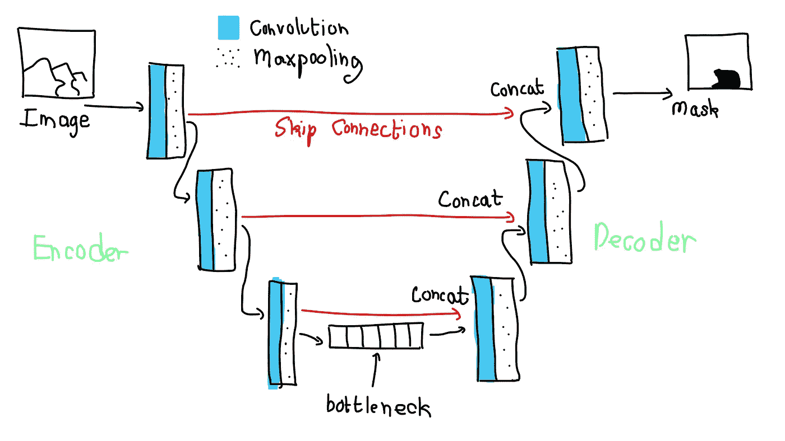
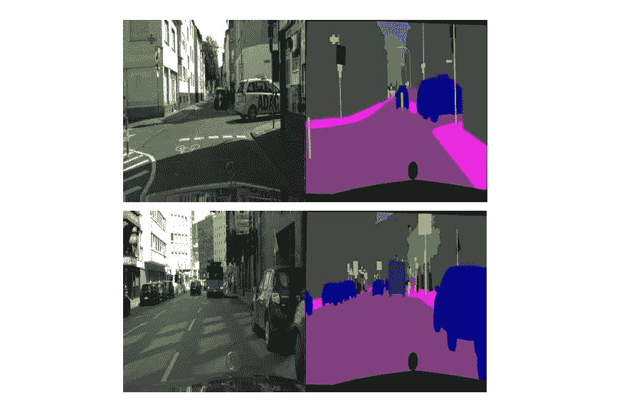
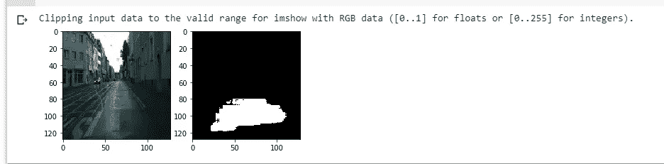

# 基于 TensorFlow 2.0 的城市景观图像分割

> 原文：<https://towardsdatascience.com/cityscape-segmentation-with-tensorflow-2-0-b320b6605cbf?source=collection_archive---------7----------------------->

## 🤖[深度学习](https://equipintelligence.medium.com/list/deep-learning-techniques-methods-and-how-tos-01015cf5f917)

## 基于 UNet 架构的图像分割。

Photo by [Andrea Cau](https://unsplash.com/@andreacau?utm_source=medium&utm_medium=referral) on [Unsplash](https://unsplash.com?utm_source=medium&utm_medium=referral)

图像分割是在各种计算机视觉应用中使用的检测技术。我们实际上“分割”了图像中我们感兴趣的部分。在这个故事中，我们将为[语义分割](https://www.analyticsvidhya.com/blog/2019/02/tutorial-semantic-segmentation-google-deeplab/)创建一个 [UNet](https://arxiv.org/abs/1505.04597) 模型(不要与实例分割混淆😕 ).

你可以在这里查看这个故事的实现-->

 [## 城市景观 _ 图像 _ 分割

colab.research.google.com](https://colab.research.google.com/drive/1i-7Vn_9hGdOvMjkYNedK5nsonNizhe0o#scrollTo=l8WavclxY7ec&forceEdit=true&sandboxMode=true) 

# UNet 的架构怎么样？

😴 Implementing Faster RCNN from scratch! ( For me at least… )

如果您使用 TensorFlow Keras 或 PyTorch，实现 UNet 可能会更容易一些。简单来说，

> UNet 具有编码器-解码器类型的结构。编码器接收图像，对图像执行各种卷积和最大池操作，并构建图像的潜在表示。现在，解码器获取这种表示，并对图像进行上采样(在跳过连接的帮助下)，最终为我们提供分段掩码。

UNet 与卷积自动编码器的不同之处在于它有**跳跃连接😎**。跳过连接顾名思义(*也许；-)* )为解码器保存空间信息。通常，编码器将图像分解成高维张量(如形状*【8，8，256】*)。这可能会导致一些重要功能的丢失。当我们把图像输入编码器时。在每次最大池操作(在编码器中)之后，我们存储操作的结果。现在，当我们在解码器中执行转置卷积时，我们将之前的输出(来自解码器)和之前存储在编码器部分的相应张量连接起来。解码器接收原始图像的一些元数据来构造遮罩。

A **creepy** 👽 drawing of a UNet!

在 Keras，我们有`Con2D`、`Con2DTranspose`、`MaxPooling2D`和`UpSampling2D`层，让您的生活更轻松。但是我们将使用原始的 TensorFlow 2.0 APIs 来创建模型。

> 也许这个模型被命名为“UNet ”,是因为使用跳跃连接得到了一些 U 形。让我们把这留给发明家吧！😅

# 讨论数据

我们的数据集来自于 [Kaggle](https://www.kaggle.com/) 上 [DanB](https://www.kaggle.com/dansbecker) 的[城市景观图像对](https://www.kaggle.com/dansbecker/cityscapes-image-pairs)。这些图像看起来像，

Sample images from the dataset.

右边部分是遮罩，左边部分是实际图像。我们将使用 Pillow 用`ImageOps`分割这些图像。

数据集具有不同类别的多个掩膜，它们具有各自的颜色。为了简单起见，我们只尝试分割图像中的“道路”。请注意，道路的 RGB 颜色为(128，63，126)。我们的模型将输出一个二进制掩码，只包含 1 和 0。我们的输入图像将是(128，128，3)形状的图像，目标将是(128，128，1)形状的遮罩。因此，RGB 值为(128，63，126)的像素在目标蒙版中将具有值 1。所有其他像素将保持值 0。

# 准备行动！

我们将为四个操作定义方法:

1.  `conv2d_down`:常规卷积和泄漏 ReLU 激活。
2.  `maxpool_down`:有效填充的最大池操作。
3.  `conv2d_up`:对图像进行上采样的转置卷积。
4.  `maxpool_up`:像`UpSampling2D` Keras 图层一样对输入进行上采样。

Snippet 1

我们将使用 [Glorot 统一初始化器](https://www.tensorflow.org/api_docs/python/tf/keras/initializers/GlorotUniform)为我们的 UNet 创建一些权重，

Snippet 2

我们现在准备组装最终模型。

# 制作 UNet 模型

用我们之前创建的所有操作组装 UNet 模型。

Snippet 3

注意到`tf.concat()`操作了吗？这是我们实际连接上一层(解码器)和跳过连接(编码器)输出的地方。

`model()`接收输入，将其通过 UNet，并返回 sigmoid 激活的输出。🆒

# 培训和优化

我们使用 [Adam optimizer](https://www.tensorflow.org/api_docs/python/tf/keras/optimizers/Adam) 和[二元交叉熵](https://www.tensorflow.org/api_docs/python/tf/keras/losses/BinaryCrossentropy)损失函数来优化我们的模型(还记得最后一层的 sigmoid 激活吗？).

Snippet 4

我们现在准备训练模型。我们将为我们在数据集中创建的每个批处理调用`train()`方法。

Snippet 5

您将找到一个代码单元来为笔记本中的图像生成遮罩。经过 25 个时期的训练，结果😂是来验证数据集的。

The Results!

# 还有呢！

# 仅此而已！

希望这很有趣。机器学习快乐！