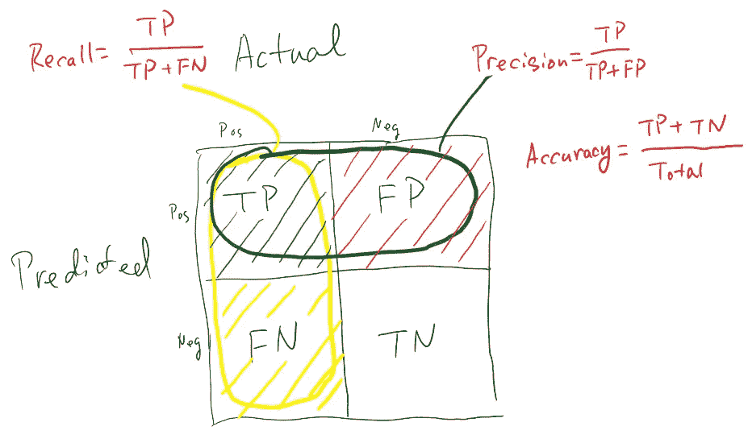
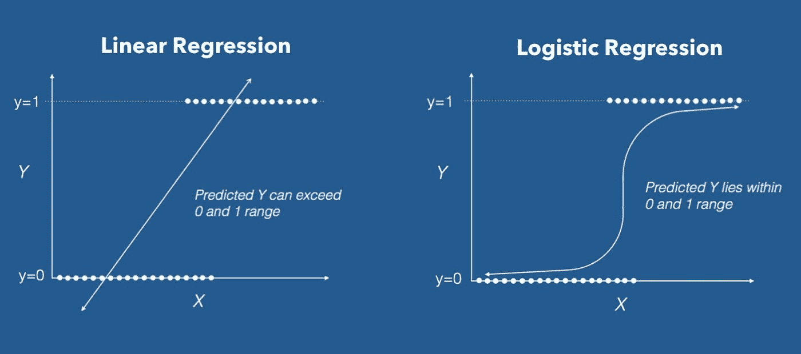
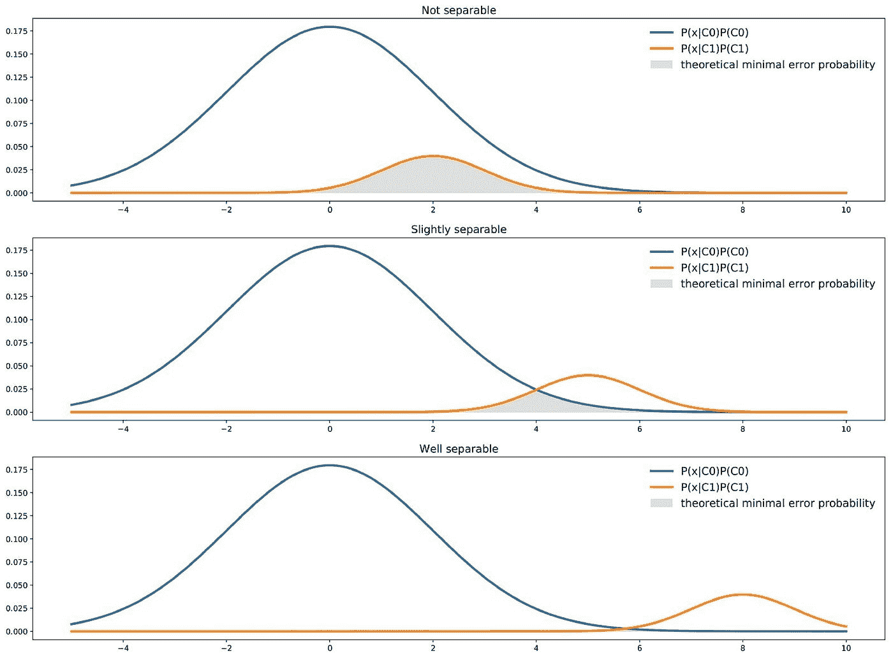
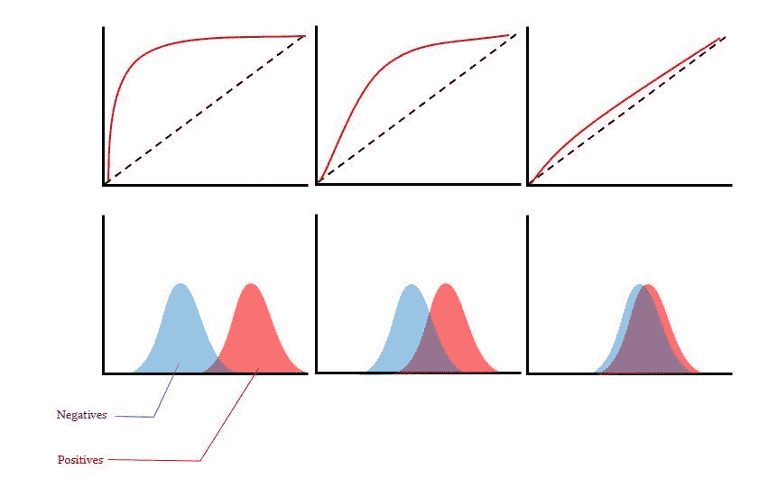
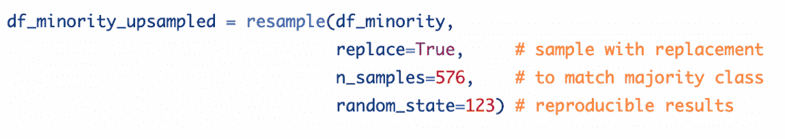
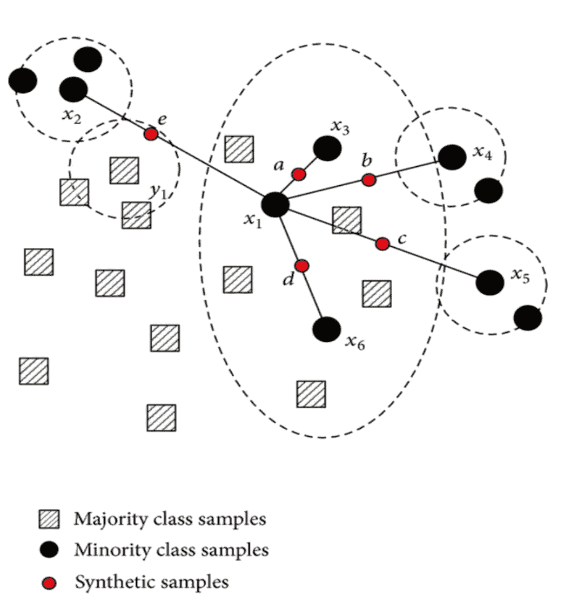

# 阶层失衡:令人头疼的分类问题

> 原文：<https://towardsdatascience.com/class-imbalance-a-classification-headache-1939297ff4a4?source=collection_archive---------7----------------------->

# 什么是阶层失衡？

如果你有机会解决分类问题，那么很可能你已经面临了不平衡的类的问题。正如在《沃利在哪里》(或《沃尔多》，取决于你来自哪里)中，我们过去常常努力寻找我们的红白朋友，阶级不平衡通常会让我们更难识别(并因此分类)少数民族阶级。

这发生在具有不成比例的观察比例的数据集中。换句话说，在二进制分类问题中，一个类中的元素很多，而另一个类中的元素很少。但这也可能发生在多分类问题中，当绝大多数的观察值聚集在一个类别中，或者我们有一个类别与其他类别相比代表性很低。

不平衡问题没有正式定义，所以没有“官方门槛”说我们在有效处理阶级不平衡，但 1 比 10 的比例通常是不平衡的，足以受益于使用平衡技术。

# 为什么这是一个问题？

大多数机器学习算法都假设数据是均匀分布的。因此，当我们有一个类别不平衡时，机器学习分类器往往更偏向于多数类别，导致少数类别的错误分类。

# 准确性悖论

准确性悖论是指在对不平衡类别进行分类时，使用混淆矩阵的准确性作为预测建模的度量。

让我们以下面的例子来更好地说明这一点:假设您正在处理一个二元分类问题，并且您的模型得分为 90%的准确性。这听起来很棒，但是当你深入一点时，你会发现 90%的数据属于一个类。这意味着你只能很好地预测大多数人。因此，在这种情况下，精确度和召回率更好衡量。让我们稍微回忆一下所有这些指标及其来源:

Google Images

在这种情况下，另一个有趣的指标是 ROC 曲线:

Baptiste Rocca, [Handling imbalanced datasets in machine learning](/handling-imbalanced-datasets-in-machine-learning-7a0e84220f28) (2019), Towards Data Science

此指标显示召回率和真阴性率或特异性(真阴性+假阴性/真条件阳性)之间的关系。这里的理想点是当我们的回忆为 1，特异性也为 1 时，因为在这种情况下，我们将预测所有正值为正，所有负值为负，但在实践中这通常很难，我们将尝试使用分类算法的阈值来最大化 ROC 下的区域。同样在一个多分类问题中，我们会有尽可能多的曲线。

# 关于可分性

我们首先要记住，在线性回归中，我们试图使用最小二乘法拟合直线，而在逻辑回归等分类算法中，我们没有相同的“残差”概念，因此它不能使用最小二乘法，也不能计算 R2。相反，逻辑回归使用一种叫做“最大似然”的东西:

Google Images

在上图中，我们可以注意到预测变量 X 在 y=0 和 y=1 之间有一些重叠。这是两个稍微可分的类的简单例子。有些情况下，类会重叠更多，而有些情况下，类根本不会重叠:

Baptiste Rocca, [Handling imbalanced datasets in machine learning](/handling-imbalanced-datasets-in-machine-learning-7a0e84220f28) (2019), Towards Data Science

将此与理论最小误差概率联系起来，最佳可能分类器将为每个点 X 选择两个类别中最可能的类别，并且对于给定点 X，最佳理论误差概率由这两个类别中可能性较小的类别给出。如上例所示，对于具有一个特征和两个类别的分类器，理论上的最小错误概率由两条曲线最小值下的面积给出。如果我们的预测变量可以很好地分离，并且我们在类之间没有任何重叠，那么这两个类的分离程度足以补偿这种不平衡。下图显示了良好或不良可分性对 ROC 曲线的影响:

Google Images

但是当我们没有很好的类间可分性，并且确实存在类不平衡的时候，我们能做什么呢？

# 应对不平衡数据的技术

如果我们不能收集更多的数据，或者我们的类天生不平衡，这里有一些技术可以用来提高我们的分类性能。

# 1.向上采样少数类

上采样是从少数类中随机复制观察值的简单过程。您可以从 *sklearn.utils (* 中导入*重采样*模块，也可以从 *imblearn.under_sampling* 中导入 *RandomUnderSampler* 模块，将少数类的观察结果分离到一个新的数据帧中，并运行以下代码:

Elite Data Science, [How to Handle Imbalanced Classes in Machine Learning](https://elitedatascience.com/imbalanced-classes) (2017)

# 2.下采样多数类

类似于前面的技术，但在这种情况下，删除随机观察。

Elite Data Science, [How to Handle Imbalanced Classes in Machine Learning](https://elitedatascience.com/imbalanced-classes) (2017)

这个例子的负面影响是，如果我们只有很少的观测值，我们将会减少我们的数据集，并可能影响我们的预测能力。

# 3.生成合成样本

合成样本是从原始数据样本中人工生成的。生成合成数据最常用的算法是 SMOTE 和 ADASYN。第一种方法基于该点与其最近邻点之间的距离创建新样本。SMOTE 计算决策边界附近少数样本的距离，并生成新样本。让我们看一个 SMOTE 如何工作的例子:

Source: Google Images

ADASYN 和 SMOTE 之间的关键区别在于，前者使用密度分布作为标准，通过自适应地改变不同少数样本的权重以补偿偏斜分布，来自动决定必须为每个少数样本生成的合成样本的数量。后者为每个原始少数样本生成相同数量的合成样本。

# 4.更改绩效指标

如前所述，当我们处理不平衡的数据时，准确性不是正确的衡量标准。相反，我们可以使用例如回忆、精确度或 ROC 曲线。

# 5.尝试不同的算法

一些算法如支持向量机和基于树的算法更适合处理不平衡的类。前者允许我们使用参数 class_weight='balanced '来惩罚少数类的错误，惩罚的数量与它的代表性成比例。同时，决策树通常在不平衡数据集上表现良好，因为它们的层次结构允许它们从两个类中学习信号。

如果你喜欢这篇文章，别忘了关注我，如果你想直接在你的邮箱里收到我的最新文章，就订阅我的时事通讯:)

感谢阅读！

*特别感谢以下灵感来源:*

【https://en.wikipedia.org/wiki/Accuracy_paradox 

*https://towards data science . com/handling-unbalanced-datasets-in-machine-learning-7a0e 84220 f 28*

*https://www.datascience.com/blog/imbalanced-data*

*https://elitedatascience.com/imbalanced-classes*

*https://www . datascience central . com/profiles/blogs/handling-unbalanced-dataset-in-supervised-learning-use-family*