# 面向 CNNs 的类模型可视化

> 原文：<https://towardsdatascience.com/class-model-visualization-for-cnns-e49be906680d?source=collection_archive---------22----------------------->

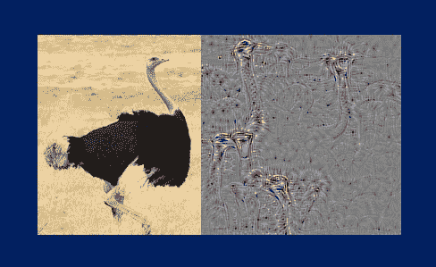

本文将涉及类模型可视化，这在本文的第 2 节中有描述。类模型可视化是一种用于使用训练分类 CNN 来创建表示该 CNN 的特定类的图像的技术。“鸟”的类模型最大程度地激活对应于“鸟”类的 CNN 输出神经元。

下面是本文中的图 1，显示了 12 个不同类的示例类模型:

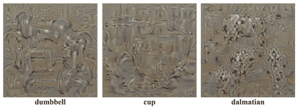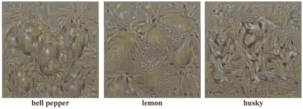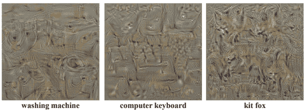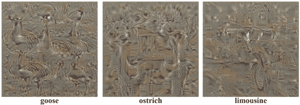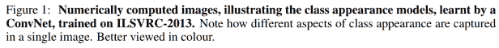

## **注**

Simonyan 等人介绍类模型的论文还介绍了用于创建显著性图的反向传播。显著性图将在[本帖](https://glassboxmedicine.com/2019/06/21/cnn-heat-maps-saliency-backpropagation/)中单独讨论。

# **类模型的表达**

一个阶级模式是一个形象 *I* 产生一个高分 *Sc(I)* 当馈入一个已经训练有素的 CNN。类模型 *I* 由以下表达式总结:

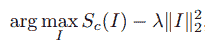

在这里，我们对图像 *I* 进行 [arg max](https://en.wikipedia.org/wiki/Arg_max) ，这意味着我们试图找到特定的图像 *I* (类模型)，使得表达式的第二段，

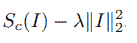

最大化。

表达式的第二部分就是 CNN 对该图像的原始类评分 *Sc(I)* ，后面是一个 L2 正则化项【这里的正则化回顾】。

换句话说，这个表达是另一种说法，即类模型是使类得分最大化的图像 *I* 。

**为什么包括 L2 正则化项？**

L2 正则化项鼓励所学习的图像不包含极值。回想一下 [L2 正则化试图使所有值的大小都较小(但不一定为零)，而 L1 正则化试图使尽可能多的值为零](https://glassboxmedicine.com/2019/06/08/regularization-for-neural-networks-with-framingham-case-study/)。可以使用不同类型的正则化创建类模型。

存储库[pytorch-CNN-visualizations](https://github.com/utkuozbulak/pytorch-cnn-visualizations)提供了以下正则化对类模型外观的影响示例:

首先，这里有一个 gif 展示了在没有任何正则化的情况下学习“flamingo”类的类模型的过程:

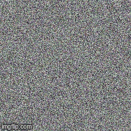

我们可以看到结果图像包括许多明亮的颜色(高值)。

接下来，这里有一个 gif 展示了学习 L2 正则化的“火烈鸟”类模型的过程:

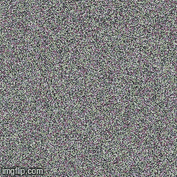

这一个包括更多的灰色值，和更少的高值，正如我们应用 L2 正则化所期望的。

最后，这里有一个 gif，展示了用 L1 正则化学习“flamingo”类模型的过程:

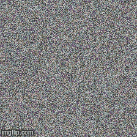

我们可以看到，这个类模型包括许多黑色(零)值，正如我们在应用 L1 正则化时所期望的那样。

没有“唯一正确的方法”来规范班级模型。类模型的全部意义在于向好奇的人提供 CNN 对类的理解。L2 正规化是一个很好的选择，但你也可以探索其他形式的正规化。

**为什么最大化分数而不是概率？**

回想一下，美国有线电视新闻网(CNN)的分类产生原始的类别分数 *Sc* ，然后使用 softmax 层将这些分数[转换成概率 *Pc* :](https://glassboxmedicine.com/2019/05/26/classification-sigmoid-vs-softmax/)

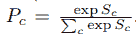

在类模型方法中，我们试图最大化未标准化的类分数 *Sc* ，而不是类概率 *Pc* 。这是因为有两种方法可以最大化类别概率 *Pc* :

1.  我们可以最大化感兴趣的类的原始分数
2.  我们可以最小化其他课程的原始分数

我们不想以做(2)结束，因为如果我们做(2)将不会清楚如何解释产生的图像。因此，我们忽略 softmax 层，直接最大化感兴趣类别的原始分数 *Sc* 。

**创建班级模型的步骤**

我们可以通过以下步骤学习图像 *I* 来为类别“bird”产生高分:

1.  训练一个分类 CNN。
2.  创建随机的以零为中心的图像(假设分类 CNN 是在以零为中心的图像数据上训练的。)
3.  重复以下步骤:(a)在图像上做一个[正向传递](https://glassboxmedicine.com/2019/01/17/introduction-to-neural-networks/)，计算当前类别分数；(b)使用[反向传播算法](https://glassboxmedicine.com/2019/01/17/introduction-to-neural-networks/)找到“鸟”神经元输出(分数)相对于图像像素的梯度；(c)对图像进行小的更新，以便在下一次向前传递时产生更高的“鸟”分数。

这是梯度上升，其中我们对图像进行更新以最大化得分(与梯度下降相反，在梯度下降中，我们试图进行更新以最小化得分。)

我们可以为 CNN 接受训练的每个班级制作班级模型可视化。我们训练 CNN 一次，然后对每一个可能的类别选择重复步骤(2)和(3)。

**代号**

下面是类模型的 Pytorch 实现:[py torch-CNN-visualizations/src/generate _ class _ specific _ samples . py](https://github.com/utkuozbulak/pytorch-cnn-visualizations/blob/master/src/generate_class_specific_samples.py)。下面的 gif 来自存储库，显示了从随机初始化的图像开始学习目标类“Spider”的类模型的过程:

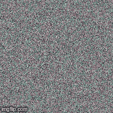

**结论**

班级模型可以帮助我们理解 CNN 认为某个班级“看起来像什么”它们是深入了解我们训练有素的 CNN 从每堂课中学到了什么的有用工具。

**附加参考文献**

*   原始研究论文: [Simonyan K，Vedaldi A，Zisserman A .深入卷积网络内部:可视化图像分类模型和显著图。arXiv 预印本 arXiv:1312.6034。2013 年 12 月 20 日。](https://arxiv.org/abs/1312.6034) *被 1479*引用
*   [费-，，杨威。斯坦福 CS 231n 讲座 12:可视化和理解](http://cs231n.stanford.edu/slides/2017/cs231n_2017_lecture12.pdf)(幻灯片 21–24)

**特色图片**

特色图像显示了 VGG16 CNN 的“鸵鸟”类的鸵鸟和类模型图像，并根据以下 GitHub 库中的图像进行了修改:[saketd 403/visualizing-Image-Classification-Models-and-studential-Maps](https://github.com/saketd403/Visualising-Image-Classification-Models-and-Saliency-Maps)

*原载于 2019 年 7 月 13 日 http://glassboxmedicine.com**的* [*。*](https://glassboxmedicine.com/2019/07/13/class-model-visualization-for-cnns/)