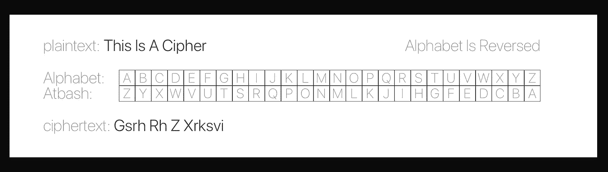
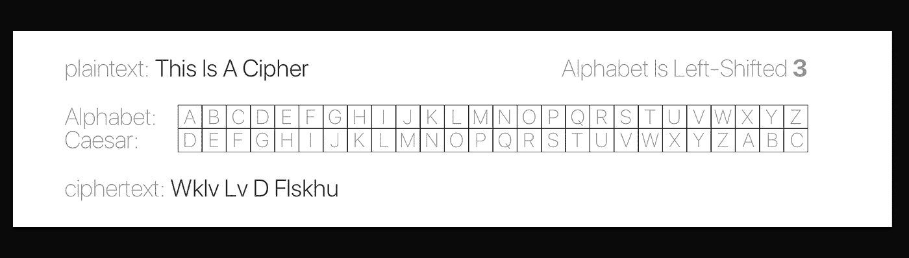
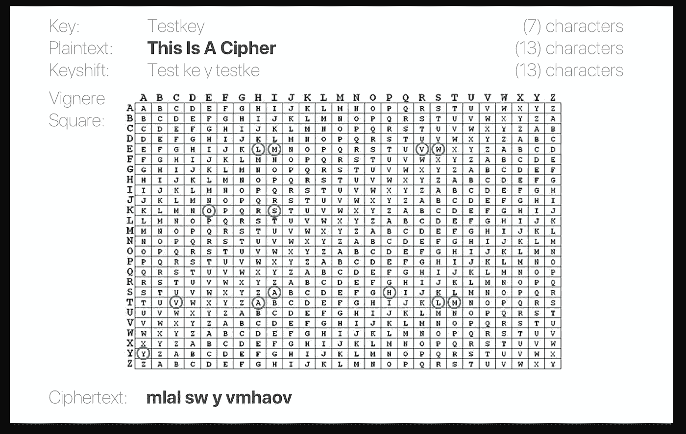
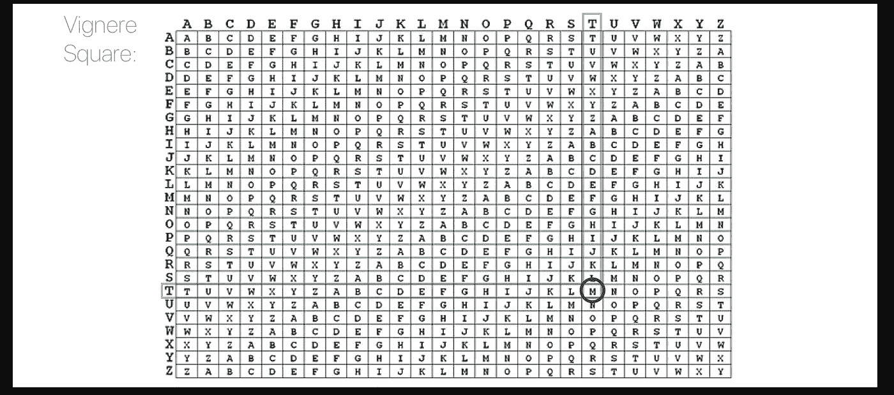

# 经典密码系统

> 原文：<https://towardsdatascience.com/classic-cryptography-systems-89e7b2fb1611?source=collection_archive---------12----------------------->

## 三种基本密码的直观介绍

Published On [https://www.setzeus.com/](https://www.setzeus.com/)

书面交流在我们历史的每一个实例中都可以找到——可以追溯到我们作为一个物种的早期。在我们发现农业和永久定居点之前，游牧部落在原始语言结构中留下了著名的胜利和艰难的故事，被称为[原始文字(s](https://en.wikipedia.org/wiki/Proto-writing) )。然而，一旦我们开始安顿下来，书面交流的效用就正确地发展了。以前，游牧部落最害怕的*自然界以食肉动物&形式出现的大灾难性气候事件；然而，**后结算，*其他* *部落*** 把这个衣钵当成了最大的威胁。*

*早期定居点之间的互动推动了外交的诞生，而外交又推动了交流和语言的发展。具体来说，这导致了保密和加密的必要性。社区如何保护他们最信任的秘密，或者信任携带他们最信任的秘密的信使，而不冒所述秘密落入坏人之手的风险？*

****输入密码术****

# *密码学的构建模块:密码*

*可以说，密码是密码学的基本组成部分——它们当然是有记录以来最早的加密实现。用花哨的密码术语来说，密码就是一系列的步骤，将被称为*明文*的原始信息扰乱(*加密*)成被称为*密文*的合成信息。*

*历史上记载的最早的密码非常原始，通常用手或简单的机械装置加密。为了更深入地理解密码背后的目标和原则，我们将介绍三种具有历史意义的简单手动加密密码:*

1.  *[阿特巴什密码——公元前早期，单字母替换](http://rumkin.com/tools/cipher/atbash.php)*
2.  *[凯撒密码——公元前 100 年，单表移位](http://practicalcryptography.com/ciphers/caesar-cipher/)*
3.  *[维格纳密码— 1553，密钥&密钥流](https://en.wikipedia.org/wiki/Vigen%C3%A8re_cipher)*

*虽然这些早期的例子提供了大量的学习机会并突出了关键点，但它们远远落后于现代的同类。功能强大、众所周知的密码构成了通信安全的基石，例如，互联网上普遍使用的著名 AES(高级加密标准),它是 Rinjdael 密码的惊人实现。事实上，现代密码是如此安全*，以至于它们需要近乎无限的计算能力来破解暴力破解(相比之下，我们将讨论的脆弱密码可以通过最小的努力手动破解)。**

## **替代密码— Atbash**

**我们旅程的第一站与犹太宗教有着千丝万缕的联系。追溯到古代以色列，**阿特巴什密码**是一种简单的*单字母密码* *替代密码*用于加密希伯来字母。据说，Yirmeyahu (Jeremiah)的书通过使用 Atbash 加密了几个词。**

**作为第一个密码，它提供了接近零的安全性，因为它遵循一个非常简单的替换方法。在密码中，替换就像它听起来的那样:取一个字母(或字符)，根据某种加密协议(规则)替换它。在 Atbash 中，字母表的第一个字母被替换为最后一个字母，第二个字母被替换为倒数第二个字母，依此类推；本质上，字母表是颠倒的。就是这样。这就是我们的第一个密码的加密方法——让我们看一个 26 个英文字母的例子:**

****

**Published On [https://www.setzeus.com/](https://www.setzeus.com/)**

**希望上面的例子是直截了当的。从左到右和从上到下阅读上图，我们从一个明文消息(“这是一个密码”)开始。然后我们用 Atbash 协议(反向字母表)加密它，最终得到一个密文(“Gsrh Rh Z Xrksvi”)。出于许多原因，这是一个非常不安全的密码。最大的原因是一旦它坏了，它对*所有的*消息都坏了。每条消息没有必要的区别，没有 ***键。*****

## **移位密码—凯撒**

**虽然几乎可以肯定，统治机构使用密码系统在历史上并不是第一次，但著名的罗马帝国却以秘密通信闻名。众所周知，朱利叶斯·凯撒的统治使用最早的加密形式之一向前线的将军们传递秘密信息。**

**凯撒密码突出了另一个简单的加密协议。这一次，罗马人简单地将字母表中的每个字符左移三个字符，然后用新制定的字母表替换明文中的字符，从而对明文进行加密。下面是一个例子:**

****

**Published On [https://www.setzeus.com/](https://www.setzeus.com/)**

**很明显，这个特殊的密码依赖于系统本身的保密性。一旦“黑客”发现所有的信息都是用完全相同的移位 3 加密的，所有以前、现在和将来的信息都会被破解。这一次，数字 3 是一个典型的 ***键。*** 人们开始意识到，用静态(单个)密钥维护加密系统肯定会失败，所以问题变成了:我们如何设计一个有多个或动态密钥的加密系统？**

## **密钥和密钥流— Vigenere 密码**

**历史告诉我们，大约在 1553 年，一个叫 Giovan Attista Bellaso 的人发表了上述问题的答案。发表在他的书 *La cifra del。签名。Giovan Battista Bella，*Vigenere 密码是第一个使用带有*动态*(变化)密钥的加密系统的密码。Vigenere 密码利用程序员常用的一种除法——模数学，在手动加密明文时要复杂得多。在下面的例子中，我们将再次加密相同的明文消息(“这是一个密码”)，但是，我们还将分配一个密钥—单词“Testkey”:**

****

**Published On [https://www.setzeus.com/](https://www.setzeus.com/)**

**花点时间来处理上面的图片——它显然比 Atbash & Caesar 的例子复杂得多。首先，注意操作要求我们计算完整的明文密钥，也称为 ***keyshift。*** 我们的明文消息度量了 **13** 个字符，我们选择的密钥度量了 **7** 个字符:*Vigenere 密码需要一个覆盖我们明文消息整个长度的全长密钥。***

**为了得到这个全长密钥，一个 keyshift，我们简单地将明文密钥中的字符数除以我们选择的密钥中的字符数，使用模数学，我们得到 1 模 6(6 的余数)。这意味着我们的 keyshift 是我们的密钥及其最初的 7 个字符，加上我们密钥的前 6 个字符，总共 13 个字符:“Testkeytestke。”**

**接下来，为了加密我们的明文的第一个字符(“T”)，我们首先在**顶行**中找到我们的明文的字符，然后在**左列中找到伴随的 key shift(“T”)字符。**最后，我们的加密字符就是上面方块中的合成字符。下面是仅关于这第一个字符的示例:**

****

**Published On [https://www.setzeus.com/](https://www.setzeus.com/)**

**带有“T”密钥的加密“T”字符产生密码字符“M”，它遵循第一幅图像中描述的完整密文。**

**与它的祖先相比，Vigenere 密码被认为是进化的一步，获得了异常强大的声誉。直到大约 300 年后，第一批密码分析家才能够解码或破解密码。虽然比它的前辈更难破解，但 Vigenere 密码真正的皇冠上的宝石是它引入了动态加密密钥。相比之下，Atbash 或 Caesar 密码依赖于系统的*保密性*，而 Vigenere 密码依赖于密钥的*保密性。***

## **最后**

**最后一句话中描述的概念是现代密码学的一个关键原则。被称为克霍夫原理，用重述的术语来说，它声称:**

> **一个密码系统应该是安全的，即使*除了密钥之外，关于这个系统的一切都是公开的。***

**20 世纪以来，密码学的领域、方法和应用 ***爆炸式增长。*** 虽然以前的经典密码学方法延用了笔、纸&等真正初级的机械辅助手段，20 世纪引进了复杂的机器，&机电机器，最终计算机成为更复杂的加密手段。**

**密码学中的这些里程碑式的转折点之一源于英格玛转子机的引入。由于它在二战中具有改变游戏规则的意义，它的迷人角色(尤其是艾伦·图灵)，以及它伴随的加密系统，英格玛值得深入研究——这正是我们接下来要参观的。**

*****来源*****

**[数论简介](https://amzn.to/31y8nqD)**

**[数学基础](https://amzn.to/2H3rb9E)**

**[现代密码学介绍](https://amzn.to/2Z0rE2p)**