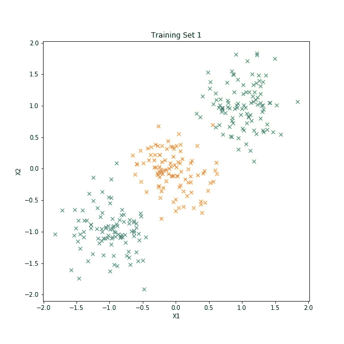
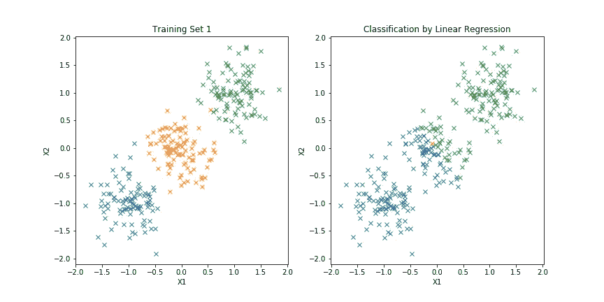
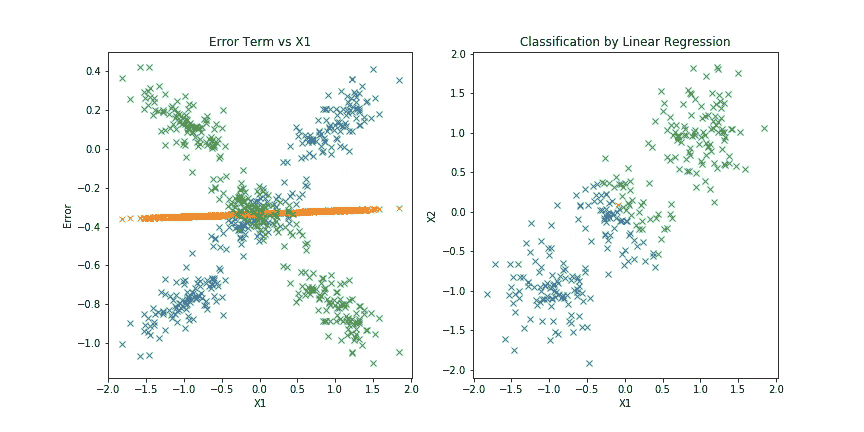
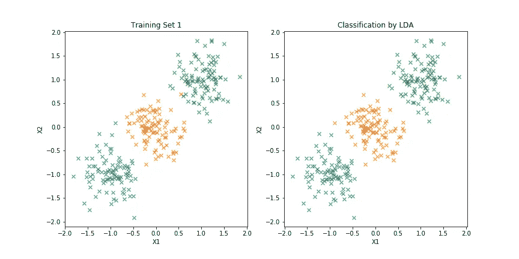

# 分类:线性方法(第一部分)

> 原文：<https://towardsdatascience.com/classification-a-linear-approach-part-1-b080c13992dd?source=collection_archive---------10----------------------->

*通过线性方法分类* —这到底是什么意思？

*分类* —使用决策边界将输入空间划分为一组标记区域的行为。或者，剥离术语，将事物分成相同类型的类的行为。

*线性方法—* 使用直线对数据集进行分区。从直观上来说，这对于描述分区(“如果它落在线类的一侧，则为 A，如果它落在边类上，则为 B”)和执行切割来说都是最容易的。

给你一把刀，你会怎么把蛋糕切成两半？很明显，有很多方法可以进行切割，但是你上一次(故意)不从中间直接切是什么时候？这种想法是一系列模型的基础，这些模型使用这种原理来分割你的蛋糕(数据集)，并帮助你理解每个切片的特征，并帮助你将新的蛋糕分配给现有的切片，嗯，我认为这个比喻太过了。

体验了监督学习技术之后(参见[监督学习的构建模块](/building-blocks-of-supervised-learning-cebab32c15ac)，本文的目标是带你沿着**线性模型**在**分类**中发展的激励因素的道路走下去。你可以称之为时间线。

当然，数学理论是至关重要的，但走出数学严谨压倒一切的学术泡沫，为什么*总是获胜——特别是对于那些希望在现实世界问题上取得进展的人。*

我为什么关心这个技术？为什么我需要高质量的数据？为什么我不能用这个模型？为什么这种模式会失败？你明白了，我们开始吧。

**#0 —问题定义**

正式介绍，一个典型的分类问题需要一组输入变量， *X=(X1，X2，…)* 和一个分类输出变量， *Y* 。同样，这个问题属于**监督学习**问题的子集。因此，单个观察值可以由一组值 *(x1，x2，y)* 组成，看起来像是 *(1.25，-0.5，绿色)。*

*打响指*

Figure 1 — Our First Bivariate Training Set!

图 1 显示了我们的第一个蛋糕！生成的数据集由两个连续变量 *X1* 和 *X2* ( *p=2)、*和一个输出变量 *Y* 组成，该变量取集合{蓝、橙、绿} *(K=3)中的值。*由于输出可能有三种颜色，我们检查哪种线性模型可以为我们的数据集提供最佳的三向切割。

这些数据是为了说明模型问题而模拟的，这意味着它们不是真实数据。

**尝试#1 —线性回归**

Figure 2 — Real dataset (left), Linear Regression fitted dataset (right)

图 2 中右边的图显示了从我们的数据集中给定 *(X1，X2)* 的线性回归模型(通过最小二乘法拟合)预测的类。第一想法？垃圾。

回归将我们知道是橙色的极少数观察结果分类到橙色类别中。为什么？

在我们诊断之前，我们推迟这种方法的基本原理[这里](/building-blocks-of-supervised-learning-cebab32c15ac)并且强调线性回归的一个非常友好的例子[这里](/linear-regression-in-real-life-4a78d7159f16)。

分类环境中的线性建模包括回归，然后进行转换以返回分类输出，从而产生**决策边界**。实际上，这个模型并没有多少让诊断变得简单的东西。唯一移动的部分是我们对回归系数的选择和我们的决策边界(我们从连续回归输出到颜色的转换)。

回想一下上面的第一个资源，线性回归旨在对**回归函数**建模，给出所有可用信息的 *Y* 的期望值。我们在这里不证明这一点，但是对于分类问题，这在数学上等价于给定所有可用信息的情况下，特定输出 *Y* 在某个类别 *k* 中的概率， *X* 。这就是所谓的**后验概率**，并在第一次提到的资源中的贝叶斯上下文中进行了讨论。因此，决策边界由两个类别具有相同后验概率的区域来定义。直觉上，观察结果被分类到概率最高的区域——这似乎是合理的。

这就让我们来看看回归系数的选择。因为这些都是经过优化的，所以必须仔细检查优化技术。我们知道，优化系数相当于最小化我们的损失函数，即残差平方和。让我们画出这个损失函数的输出，我们称之为**误差**。

Figure 3 — Error function (left), Linear Regression fitted dataset (right)

图 3(左)显示了相对于 *X1* 绘制的每个观察值( *X1、*X2)的评估误差函数。每个观察值都有一个绿色、橙色和蓝色的十字，误差最小的十字的颜色就是为回归选择的类别。

对于大多数观察，我们可以看到，将其分类到橙色类别是次优的。也就是说，沿着 x 轴从左到右，很少最接近 x 轴的点是橙色的。事实上，这种情况只会发生一次。

正确的情节是为了透视；当您从左至右遍历两个图中的 x 轴时，误差函数明显由蓝色类别的 *X1 < -* 0.25 最小化，由绿色类别的 *X1 > 0.5* 最小化。在两者之间，蓝色和绿色阶级之间的区别并不明显。因此，该区域中 m，nkimiobservations 的输出是两者的集合。*等等！*通过查看数据集图，我们知道这正是大多数 Orange 类所在的区域。橙色类别中的观察结果几乎总是被错误地分类为蓝色或绿色类别。哎呀！

原来，对于 2 个以上的类( *K > 2)* 线性回归挣扎到*见*所有类。这被称为**屏蔽**并导致严重的错误分类。我们显然需要一个更好的模型。

**尝试#2 —线性判别分析(LDA)**

Figure 4 — Real dataset (left), LDA fitted dataset (right)

线性判别分析(LDA)是我们第一次尝试的直接改进。图 4 显示了我们的训练集上 LDA 模型的输出。我们不再展示掩蔽，错误分类的数量已经大大减少。太好了…但是实际上什么是 LDA 呢？

> 区别性的特征或特性。

一般来说，判别分析是一种多类分类技术，它假设每一类的数据都来自一个表现出非常特殊的空间行为的家族(称为**分布**)。其统计特性(如均值和方差)是分布的显著特征，然后用于评估哪个类对于任何观察值来说是有条件地最可能的。

LDA 是这种技术的一个特例，它假设来自每个类的观测值来自具有跨类的*公共协方差矩阵*的个体*高斯分布*。

解释这个问题的一种方法是在一个封闭的盒子里考虑三个不同颜色的物体。虽然你不能窥视盒子，但盒子上有许多小孔，可以显示三种颜色中的一种。你的工作是识别盒子内每种颜色的边界，从而了解每个物体的大小和形状。翻译上一段，LDA 假设盒子里的每一个物体都是一个球体(或者椭球体— *高斯分布*)，大小相同(*公共协方差矩阵*)。

这些统计特性通常是假设的高斯分布的参数，然后将其插入下面的**线性判别函数**。

Equation 1 — Linear Discriminant Functions

这是这项技术所需的唯一数学函数。它的推导来自两个类别的**后验概率**的比较，以及随后基于最高评估的分类(也可见于**朴素贝叶斯**分类器)。

拟合模型的过程包括使用给定的数据集估计参数。为了评估每个类别的线性判别函数，需要计算以下估计值，

1.  类别**样本平均值** —每个类别的平均值 *(X1，X2)* ，直观地，这给出了每个类别的中心位置的指示(称为**质心**)。
2.  类别**先验概率** —给定类别 *k* 中的观察数量除以观察总数，即数据集中每个类别的简单比例。这是一个天真的猜测，在没有数据知识的情况下，我们有多大可能得到一个观察结果。
3.  样本**协方差矩阵** —对整个样本展开程度的估计度量。这实际上是每个类别的平均分布。

生成 LDA 预测剩下的工作就是将上述估计值插入线性判别函数，并为给定的一组输入选择最大化函数的类。

**扩展—二次判别分析(QDA)**

在我们的对象隐喻中，如果我们放弃每个对象都是一个大小相等的椭球体的假设，会怎么样呢？也就是说，如果我们放松对共同协方差和高斯数据的假设会怎么样。很明显，我们的判别函数会不同，但如何不同呢？

保留椭圆体物体假设，但允许尺寸差异，我们被引导到 LDA 的扩展，称为**二次判别分析(QDA)** 。所得的 QDA 判别函数在 *X、*中是二次的

Equation 2 — Quadratic Discriminant Functions

该过程与 LDA 一样，我们需要以下估计值，

1.  类别**样本平均值** —每个类别的平均值 *(X1，X2)* ，直观地，这给出了每个类别的中心位置的指示(称为**质心**)。
2.  类别**先验概率** —给定类别 *k* 中的观察数量除以观察总数，即数据集中每个类别的简单比例。这是一个天真的猜测，在没有数据知识的情况下，我们有多大可能得到一个观察结果。
3.  类别样本**协方差矩阵** —对每个类别如何展开*的估计度量。*

请注意，LDA 场景中只有 3 处发生了变化。事实上，LDA 可以被认为是 QDA 的一个特例，其中每个类别的协方差矩阵都是相同的。

图 5 显示了 LDA 和 QDA 在更复杂的数据集上的性能。

Figure 5 — Real dataset (left), LDA fitted model (centre), QDA fitted model (right)

两个模型之间的边界差异类似于绘制直线边界线(LDA)和曲线边界线(QDA)的差异。显然，训练集 2 中点的分布变化比我们以前看到的更大。QDA 的灵活性足以比 LDA 更有效地捕捉这种传播，并且可以通过 Orange 类上的表现来观察。

所以我们应该一直用 QDA，对吗？嗯，也许吧。虽然 QDA 是首选，但当类别数量增加时，我们需要估计的参数数量也会增加。边际模型改进真的值得增加计算复杂度吗？对于像我们在这里看到的“小数据”问题，答案是肯定的，但是对于更大的一组类，答案就不清楚了。

总而言之，在第 1 部分中，我们有:

*   发现了能够对数据集进行分组/切片的问题。
*   为一个 3 类示例开发了一个**线性回归**分类器，该分类器会受到屏蔽。
*   发现 **LDA** 对于表现良好的高斯数据集是一个非常强大的工具。
*   扩展到 **QDA** 中，对于表现不太好的数据集，这是一个稍微灵活但更昂贵的方法。

感谢评论和反馈！