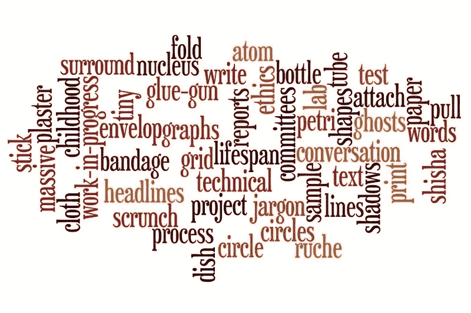
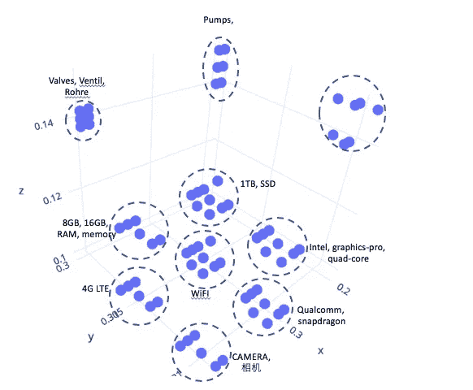
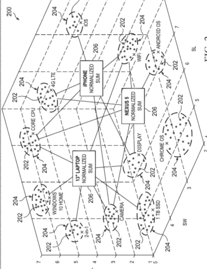

# 非时序数据的分类算法

> 原文：<https://towardsdatascience.com/classification-algorithm-for-non-time-series-data-359e84e604d8?source=collection_archive---------20----------------------->

“识别”的关键问题之一，无论是自然语言处理(NLP)——语音/文本还是像拼图一样从碎片中解决图像难题，都是理解单词或数据碎片以及上下文。单个的单词或片段没有任何意义，把它们绑在一起就有了上下文的概念。

现在数据本身有一些模式，大致分为时序或时间序列数据和非时间序列数据，非时间序列数据很大程度上是非时序或任意的。文本报告、文档和期刊、小说和经典作品的情感分析遵循时间序列模式，在这种意义上，单词本身遵循由语法和语言词典支配的优先顺序。股票价格预测问题也是如此，它有以前时间段预测和社会经济条件的先例。

然而，非顺序数据不遵循模式，单词或信息片段的出现不遵循先例，但可以共同给出上下文的含义。数据可能不是也不会是任何标准语言词典或图像库的一部分，但可能是一些特定的约定语言或行业规范，但它们将共同传达分类上下文(ML 术语中的标签)。

这种分析为不遵循任何标准语法教条或单词优先规则的语音或文本内容和/或消息提供了一种方法。将它扩展到图像是值得一试的，不在本文讨论范围之内。

在分析和预测的情况下，有很大的空间整合来自非结构化数据的数据湖的组织数据，这些数据来自各种来源，如供应商信息、区域销售、供应商、服务提供商、各种产品、原材料和服务的支出信息。通过为每条数据提供有意义的嵌入或向量表示，或通过如下所述将每条数据视为独立变量，组织和总结不同的信息并最终将它们关联起来，即。标记，预定义的业务指标，如价格趋势、区域业务表现、各种细分类别的支出、供应商等。，就有可能获得对商业各个方面的重要见解。

在一些使用案例中，例如药物评论分析和分类，其中药物反馈是来自患者身体状况参数和患者反应的收集，本解决方案允许研究人员和分析师分析和评定特定药物的功效。

该解决方案还可以用于其他用例中的产品评估，并可以从不同的产品属性(如定价、细分、评论、反馈和其他参数)来评估产品。例如，葡萄酒质量可以从不同的参数集进行评估，而不仅仅是单一的评级考虑。

## 整理碎片

这里要解决的第一个问题是，意义完全相同或上下文相似的单词或数据点需要聚集在一起，以便它们在以后评估时具有相同的效果。因为它们是不相关的，所以需要相对于给定的上下文以某种方式进行排列或放置。例如，缩写和拼写错误的单词、多语言内容、传达相似思想或意思的图像表示需要被提供相似的相关数学表示。

对于这一步，我们使用 word2vec 算法方法(glove 是另一种值得评估的方法)。这种聚类的最终结果是，我们在 n 维空间中获得相似单词或数据点的聚类。在给定的上下文中，这些词或数据点的集群中的每一个都可以被认为与相同集群中的其他数据点同义。对于 NLP 的具体情况，skip-gram 模型能够比 cbow 更好地对数据点进行聚类。

还有其他算法，尤其是文本算法，可以做到这一点。(单词距离算法，如 Hamming、Euclidean distance 和其他单词距离算法在识别同义词和缩写时都失败得很惨)。

单词嵌入算法为每个单词或数据点生成一个矢量表示，我们在这个过程中为每个数据点生成一个数据字典和一个矢量表示。

在应用一些降维技术(如 t-sne)后，数据聚类将出现在三维空间中，如下图所示。这只是为了表示和理解的目的。

## 整合各个部分

**的第二步**是**巩固**嵌入内容，学习嵌入内容的要点，并将其与标签匹配。这里，我们将嵌入的合并输出馈送到完全连接的激活层，并最终馈送到输出层，这是典型的神经网络架构。输出将用于训练，以评估交叉熵损失&的准确性。

现在，解决方案的关键是我们**整合**嵌入的方式。RNN 及其变体可以很好地处理时序数据。如前所述，这里事件的发生是任意的。

一种选择是使用 CNN 并对单词嵌入的 n 元语法进行卷积。但是主要的挑战是优先权。当数据与一组独立变量、完全不相关的属性相关时，CNN 的拥护者最终会提出对 N 个独立变量进行卷积。

一种简单的合并方法以及正确有效的方法是获取规范中单词嵌入的摘要(非顺序数据)并将该摘要馈送给完全连接的层。

让我们以笔记本电脑规格为例。

联想 V330 15" **CPU** : **英特尔酷睿 i5**–7200 u。 **GPU** : **英特尔高清显卡** 620。**显示屏** : 15.6 寸、**全高清** (1920 x 1080)、TN。**内存** : 8 GB。

考虑到该数据点中的每个输入都是一个单词(1-gram 模型),并且每个单词都会增加笔记本电脑的规格。如果我们把这个规范分成空格分隔的单词，我们得到大约。20-25 个单词，每个单词都有一个附加的嵌入表示。

这里的想法提出取这些训练嵌入的归一化总和(摘要),并将该摘要馈送到完全连接的神经网络。

(CNN 主要用于图像处理，例如，在扫描面部图片时，我们在顶部获得头部，然后是前额、眼睛、鼻子、耳朵、嘴、下巴等。这里，为了训练各种图像，无论是人脸、汽车还是其他候选图片，在像素的出现上是有先例的，尽管图像可能有 n 种变化。这仍然是连续的。将 CNN 应用于所讨论的问题是一种矫枉过正，因为所有的数学计算，解决方案仍然可以归结为一个简单的数学总结，增加了训练 filers、kernel & steps 的开销，此外，单词的输入维度是可变的，即。，我们不能期望像图像一样的 64*64 dimn，而是会根据数据点中的文字而变化)

## 提取摘要

现在来做些数学。让我们考虑每个单词的 500 维向量嵌入。对于上述规范(数据点)中的大约 20 个字，输入将是 20×500 维的输入矩阵。归一化后的总和将减少到 1x500。该矢量规范将主要倾向于输出标签。

单词嵌入的总和 x / sqrt(sum(square(x)))

## 与上下文关联(标签)

此外，将这个向量规格馈送到完全连接的 2 层密集 NN，其中一个隐藏层和一个表示标签数量的输出层，给出了对非时间序列数据进行分类的良好模型。

The output classified

因此，我们在这里看到一个学习算法被执行的过程，包括:

*   从应用程序接收文本数据。
*   通过单词矢量化模型处理文本数据以生成 n 维形状的向量空间，其中文本数据中的每个唯一单词被分配向量空间中的对应向量表示，其中向量空间包括文本数据中同义的唯一单词的向量表示的聚类。
*   基于向量空间中的向量表示确定归一化总和，其中归一化总和表示文本数据或文档的全维度；和
*   通过简单的 2 层密集神经网络，基于总和，向应用提供文本数据的上下文含义。

## **结论**

总之，许多分类问题，其中需要从一组独立变量中推断出一组离散变量，可以通过以下方法解决，这些方法可以总结为 3 个简单的步骤。

*   为每个变量提供一个向量表示，这里的变量可以是一个单词、一个图像图标或任何其他原子数据点，并使用矢量化技术，根据业务上下文在 n 维空间中排列/连接所有数据点。skip-gram、cbow 和其他类似算法可以方便地导出每个数据点的合理嵌入。
*   使用上述标准化总结技术总结嵌入(合并)。归一化平均值是另一种技术，在某些情况下也可能更合适。
*   将摘要与预定义的标签相关联，并使用简单的 2 层密集神经网络来训练机器学习模型。标签可以是业务指示符，或者在对象识别的情况下是图像名称，根据分类的上下文进行标记。