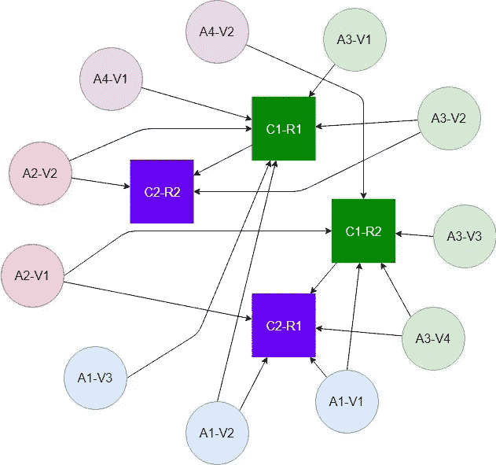
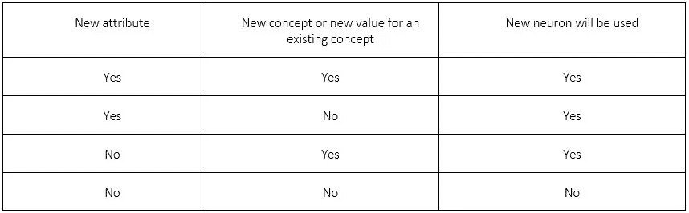
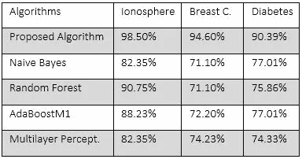
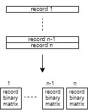
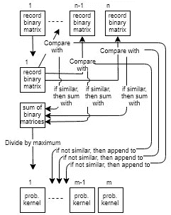
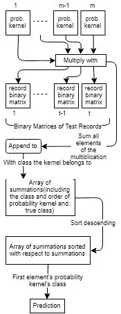
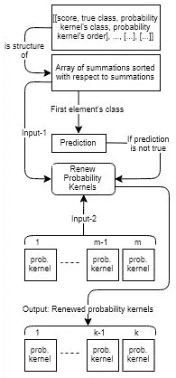

# 使用概率模式的分类算法

> 原文：<https://towardsdatascience.com/classification-algorithm-using-probability-patterns-bfc489821c5?source=collection_archive---------17----------------------->

## 分类算法使用概率核(模式)，该概率核是通过对图像滤波核的结构应用二进制矩阵方法而创建的。

> 对人工智能和人脑感兴趣的人，你们好。根据我的错觉，我模拟了人类大脑中的神经元。根据这个模型，我创建了一个分类算法。这种算法非常有效，而且是独一无二的。我用 Python 实现了这个算法，你可以看到下面给出的测试结果。我也分享了 GitHub 中的代码，并在这里添加了链接。
> 
> 为了理解所有的概念，我建议你在开始之前阅读一些主题。如果你已经有了这些方面的知识，那就继续读下去吧。
> 
> 必要的先前知识:
> 
> [图像过滤](https://www.mathworks.com/help/images/what-is-image-filtering-in-the-spatial-domain.html)，[神经元](http://www.brainfacts.org/Brain-Anatomy-and-Function/Anatomy/2012/The-Neuron)，矩阵(这个我就不加链接了，你到处都能找到关于矩阵的信息)
> 
> 值得一提的是:
> 
> 机器学习中的分类，决策树，朴素贝叶斯分类器，AdaBoost，随机森林，神经网络

## [1。算法代码](https://github.com/evrimozmermer/Classification-Using-Binary-Matrix-Approach)的 GitHub 链接。

## [2。算法代码 GitHub 链接(改进版)](https://github.com/evrimozmermer/Classification-Algorithm-Using-Binary-Matrix-Approach-Improved-and-GUI-is-Added)

## 摘要

本文主要研究图像处理中滤波算法的结构。该新算法基于输入数据的二进制矩阵来创建子聚类，这些子聚类在稍后的分类中用作过滤器。这些子聚类被称为概率核。所开发的算法使用不同的数据集进行测试，并显示出不同的准确率，这取决于数据集的多样性和用于矩阵比较的匹配值。使用糖尿病数据集、乳腺癌数据集和电离层数据集来比较所开发的算法和诸如朴素贝叶斯、AdaBoost、随机森林和多层感知器之类的已知算法的性能。关于准确率的测试结果证实了所提出算法的优势。

如果你想直接跳到算法，请转到“算法一般是如何工作的？”

# 算法是做什么的？

所提出的算法通过训练数据来创建模型(概率核),以预测测试数据的类别。

# 算法的哲学是什么？

该算法是由人类大脑如何工作的感觉创建的。下面提到了人脑如何工作的假设。

确定性方法认为，如果宇宙中的所有信息都是已知的，那么未来的情况就可以完全预测出来。该算法也采用这种方法。

# 大脑如何工作的假设:

Figure-1 Neurons and Their Connections

属性:

*   A1，A2，…指属性。
*   V1，V2，…指相关属性的值。

概念:

*   C1，C2，…指的是概念。
*   R1，R2，……指概念的结果。
*   例如:C1:天气预报 R1:多雨，C1:天气预报，R2:晴朗

连接:

连接显示了哪些属性是每个概念的条件。联系大多是在属性和概念之间。但是它们也可以在概念之间。一些概念可以作为其他概念的属性。在这种情况下，概念将是属性，概念的结果将是该属性的值。

*   C1-R1: A1-V1，A2-V1，A3-V3/A3-V4，A4-V2
*   C1-R2: A1-V2/ A1-V3，A2-V2，A3-V1/A3-V2，A4-V1
*   C2-R1: A1-V1/ A1-V2，A2-V1，A3-V4，C1-R2
*   C2-R2:A1-无，A2-V2，A3-V2，C1-R1

规则:

*   一个概念类型有确定的属性。概念的不同结果不能有不同的属性。正如我们在上面的例子中看到的，C1 概念有 A1、A2、A3 和 A4 属性。
*   可能缺少概念的属性信息。正如我们在上面的例子中看到的，C2-R2 没有关于属性 A1 的信息。
*   一个概念可以有相同属性的不同值。
*   正如上面在“连接”标题中所解释的，概念的行为可能类似于另一个概念的属性。

结论:

理论中的每个元素和属性都被假设为人脑中的一个神经元。每个连接指的是神经元之间的一个轴突。

大脑学习新概念的过程假设如下:

*   一个概念的条件被分配给未使用的神经元。如果这个概念的条件是已知的，那么这个条件就不会分配给一个新的神经元。
*   在将条件分配给神经元之后，将要学习的概念被分配给一个新的、未使用的神经元。
*   在所有赋值完成后，具有学习值的相关条件被连接到学习过程中的概念。
*   学习新概念。

使用新神经元的条件:新神经元的使用由“或”门决定。

使用新神经元的条件:新神经元的使用由“或”门决定:

Table-1: Conditions of Employing New Neuron

废除的概念和属性:

概念和属性的废弃指的是重新设置使用过的神经元。这种废除不是人为的。该过程是自动执行的。

当一个人用属性表学习一个概念时，属性表可能是错的。为了去除错误的属性，这个人需要重复几次真正的属性和所属的概念。由此，被记录为属性的错误属性属于概念，不会有任何电信号经过。人脑会重置不传递任何电信号的神经元。

这也与人脑中遗忘概念和属性有关。如果没有使用具有属性或概念的神经元，则重置该神经元。

# 算法一般是如何工作的？

1.算法将单行记录转换为二维矩阵。

2.算法将创建的二维矩阵相互比较。

2.1.只有属于同一类的矩阵才能相互比较。

3.根据比较结果，算法合并相似矩阵。

3.1.合并后的矩阵在算法中将表现得像一个过滤核心。在算法中，合并矩阵被称为概率核。

3.2.在矩阵合并过程完成后，创建的概率核用于测试。

4.在测试过程中，每个测试记录也被转换成图像，并与由训练矩阵生成的概率核进行比较。

5.在测试过程的最后，我们得到一组测试结果。只有错误分类记录的测试结果被存储用于训练校正。

6.从存储的测试结果中确定导致错误分类的概率核。

7.在误导性概率核从概率核列表中移除之后，我们返回到过程 4。

7.1.这个过程一直持续到我们不再有概率核。

7.2.然后，记录该过程中给出最佳精度结果的步骤。

8.再次创建上面确定的步骤中的概率核。

9.上面创建的最佳准确率概率核被保存为预测模型。

# 算法具体是如何工作的？

## 算法将单行记录转换为二维矩阵。

该算法采用二维矩阵作为输入。这些二维矩阵是二元矩阵。下面逐步解释了转换过程:

1.将记录中的每个值映射到不会导致大矩阵的范围。例如，记录中的最大值应为 100。

2.创建具有维度的零矩阵:行-记录中的最大值，列-记录中的列数。

3.选择一条记录，取第一列(C)的顺序和该列(V)中的值。将 1 放入索引中的矩阵:行—我们取的值(V)，列—我们取的列的顺序。

4.继续上述过程，直到映射完记录中的所有值。

## 算法将创建的二维矩阵相互比较。

1.创建一个比较函数。

2.在比较函数中，你需要 2 个输入。输入是将被比较的矩阵。

3.在比较函数中，将输入矩阵相乘。

4.在比较函数中，对乘法创建的新矩阵求和。

5.在比较函数中，将求和创建的新矩阵除以第一个输入矩阵中 1 的数量。结果将介于 0 和 1 之间。1 表示“最相似”，0 表示“一点都不相似”。

## 根据比较结果，算法合并相似矩阵。

1.取相似的矩阵，对它们求和。

2.将所有相似矩阵相加得到的新矩阵除以同一矩阵中的最大值。

## 在测试过程中，每个测试记录也被转换成图像，并与由训练矩阵生成的概率核进行比较。

通过合并过程，我们创建了概率核。现在，让我们将它们与测试记录进行比较。该过程如下所示:

1.将测试矩阵与每个概率核相乘。

2.将上面乘法运算创建的新矩阵中的所有值相加。这将是匹配结果。

3.将匹配结果和概率核的类别添加到列表中。

4.根据匹配结果对列表进行降序排序。

5.以上面提到的排序列表(SL)中的第一个元素的类为例。

6.取的类是算法分类的结果。

## 在测试过程的最后，我们得到一组测试结果。只有错误分类记录的测试结果被存储用于训练校正。

1.存储错误分类的测试结果的匹配结果和来自 SL 的概率核顺序。

## 从存储的测试结果中确定导致错误分类的概率核。

1.确定在排序列表(SL)中给出真实类别的概率核(TPK)的索引。

2.从概率核列表中移除 SL 中给出比 TPK 更高匹配结果的所有概率核。

在从概率核列表中移除误导性概率核之后，我们返回到过程 4。继续这个过程，直到不再有概率核。然后，监控测试结果，并找到给出最佳准确度结果的步骤。这个步骤就是你需要停止消除概率核的步骤。

# 实验:

对于其他算法性能，使用工具 [Weka 3.7](https://www.cs.waikato.ac.nz/ml/weka/) 。

## 二手电脑的特点:

CPU:英特尔酷睿 i7–6700 HQ 2.6 GHz(6M 高速缓存，最高 3.5 GHz)

内存:16 GB DDR4

## 用于新算法的编程语言:

[巨蟒](https://www.python.org/)

## Python 中使用的模块:

[熊猫](http://www.numpy.org/)、 [PIL](https://pillow.readthedocs.io/en/stable/) 、[熊猫](https://pandas.pydata.org/)

## 用于实验的数据集:

[糖尿病数据集](https://archive.ics.uci.edu/ml/machine-learning-databases/diabetes/):训练集 500 条记录，测试集 276 条记录

[乳腺癌(原始)数据集](https://archive.ics.uci.edu/ml/datasets/breast+cancer+wisconsin+(original)):训练集 465 条记录，测试集 233 条记录

[电离层数据集](https://archive.ics.uci.edu/ml/datasets/ionosphere):训练集 234 条记录，测试集 116 条记录

实验结果如下所示:

Table-2:Experiment Results

## 算法的表格和图形:

Table-3: Image Conversion

Table-4: Creation of Probability Kernels

Table-5: Prediction and Test Process

Table-6: Elimination Process of Probability Kernels