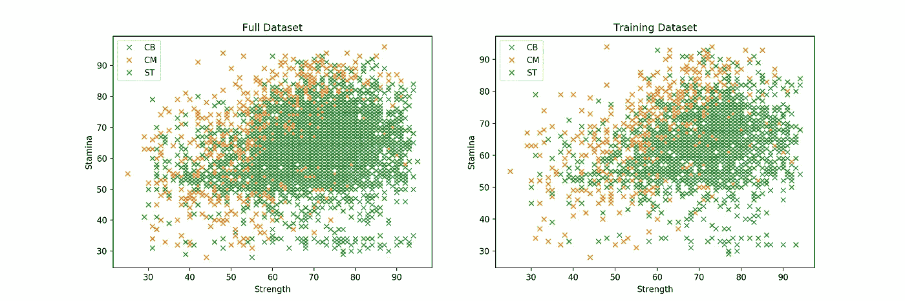
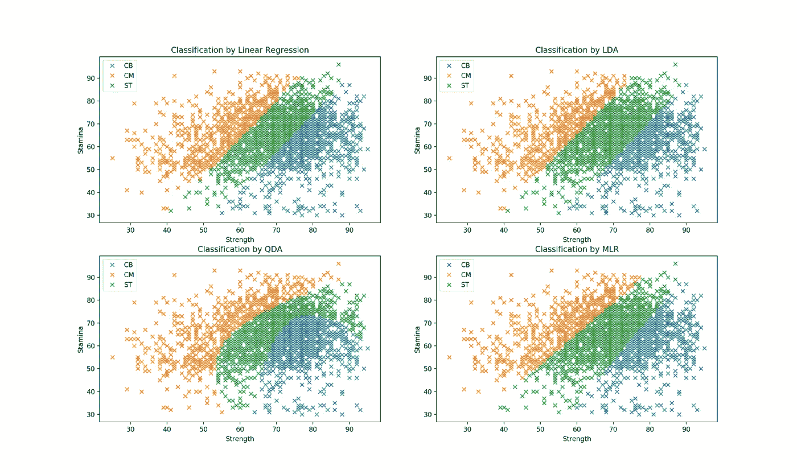
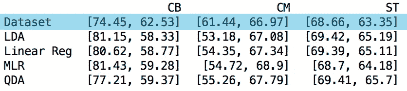
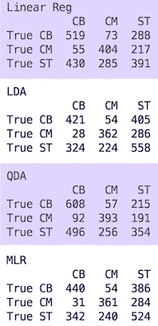
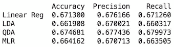

# 分类:足球运动员位置预测(下)

> 原文：<https://towardsdatascience.com/classification-football-player-position-prediction-part-2-f5cc15163f8d?source=collection_archive---------19----------------------->

## *根据身体属性创建模型预测比赛位置。*

Photo by [Izuddin Helmi Adnan](https://unsplash.com/photos/K5ChxJaheKI?utm_source=unsplash&utm_medium=referral&utm_content=creditCopyText)

足球是数百万人的一种生活方式。国际足联在 2006 年进行的最近一次大规模调查统计了 2.65 亿男女球员，这个数字自 2000 年以来一直以平均每年 1.5%的速度增长(此处[为](https://www.fifa.com/mm/document/fifafacts/bcoffsurv/emaga_9384_10704.pdf))。对许多人来说，操场足球曾经是/现在是一种主食。从操场到球场，比赛位置的选择通常是试图模仿你最喜欢的职业球员，找出你喜欢的位置，或者简单地跟随你的教练所说的。

> 为什么没有一个量化的、更聪明的方法来做这个决定呢？通过调查职业选手的属性可以了解到什么？我们能利用物理属性使合适的位置显而易见吗？

**目标:**创建一个模型，根据身体属性推荐一个打法位置。

该任务通过第 1 部分中介绍的线性技术符合分类框架。即**线性回归**、**线性判别分析** (LDA)和**二次判别分析** (QDA)和*new* **多项 Logistic 回归** (MLR)。

我喜欢通过例子来学习，所以虽然这在技术上是第 2 部分，但我鼓励你使用第 1 部分作为所提到的技术的参考，而不是严格的先驱。这篇文章是供好奇者阅读的。写东西很有趣，写代码也很有趣，所以尽情享受吧！

**#0 —多项逻辑回归分类**

在开始之前，我们先介绍最后使用的技术。多项逻辑回归分类器**(MLR)。**

**MLR 是**逻辑回归**的多类扩展，它通过使用基本逻辑函数估计概率来模拟输入变量和二元输出变量之间的关系。我们来分析一下。**

***“…模拟输入变量和二进制输出变量之间的关系…”*—这是一项常见任务。一个例子是将通过/失败的结果与学习/睡眠/锻炼的时间联系起来。这种类型的问题和我们在[第一部](/classification-a-linear-approach-part-1-b080c13992dd?source=friends_link&sk=1f86896f7c8606a3c831f6cadee1c365)中看到的没有什么不同。**

***“…通过估计概率…”—*这是半新的。统计理论告诉我们，我们的输出变量的最佳估计是给定所有信息的期望值(**回归函数**)。对于二进制(0/1)输出，该期望简化为一个概率(后验概率**)。线性回归、LDA 和 QDA 不严格地利用这一特性来区分类别，但是这些方法都没有强调概率估计。相反，概率估计是逻辑回归的核心。****

*****“…使用其底层逻辑功能。”—* 这绝对是新的。**逻辑函数**使得估算概率更加容易！*如何？*在典型的二进制分类问题中，我们期望我们的输出是 0 或 1。我们通过估计一个概率(在 0 和 1 之间)然后选择一个阈值，任何超过这个阈值的估计都被声明为 1，否则为 0。预测这种概率是一个困难的问题，部分原因是取值范围有限(0 到 1)。因此，逻辑函数被用来将我们的概率转换成**对数概率**。至关重要的是，这意味着我们从试图预测 0 到 1 之间的数字，到预测范围不受限制(从负无穷大到正无穷大)的数字！*为什么这有帮助？*我们现在可以将我们的扩充输出变量建模为输入的线性组合，即使用线性回归形式，并在预测时反转转换以返回概率。整洁！****

******# 1——赛前准备******

****将我们的问题形式化为一个统计友好的目标，我们寻求解决一个多分类监督学习问题。为此，我们需要数据，并特别要求我们的数据集提供:****

1.  ****反映物理属性的一组连续变量。****
2.  ****分类输出变量，玩家位置。****

****我们希望对职业选手的数据集进行分析。当然，身体素质会因为位置的不同而有所提高，但是我们仍然应该能够找到一个“理想”的模板。这里的假设是，美国业余选手和职业选手是有联系的。****

****我现在要做一个飞跃，选择使用 FIFA19 视频游戏数据集(在这里找到)。这里的假设是 FIFA19 数据集是现实生活的一个公平代理。我认为如果这不是真的，这个游戏就不会像现在这样受欢迎。除了利用 EA 的数据收集、聚合和分析(这里讨论的[是基于现实世界的性能)，直接的好处是数据集为每个属性提供一个值。这极大地简化了分析，但确实需要以同样的方式计算任何新的观察值。](https://datamakespossible.westerndigital.com/meet-data-master-ea-sports-fifa/)****

******#2 —幻灯片处理数据集******

****在我们开始模型预测之前，让我们澄清一些事情:****

1.  *****输入变量* —“力量”和“耐力”都取 0 到 100 之间的值。****
2.  *****类别输出变量* —“位置”采用代表 3 个关键外场位置的值{“CB”:中后卫，“CM”:中场，“ST”:前锋}。****
3.  *****训练数据集(图 1 右侧)* —完整数据集的随机选择子集，将用于训练我们的分类器。为每种分类方法引入的所有辅助变量将使用训练集进行估计，所有预测将在测试集上进行。我们的分析使用 50/50 的分割，即整个数据集的 50%将用作训练集，其余 50%用作测试集。****

********

****Figure 1 — Full & Training Dataset Coloured by Position {CB, CM, ST}****

****目测图 1 中的完整数据集，每个类似乎没有任何清晰的界限。然而，我们确实观察到中后卫的数据分布最小，而中场球员的数据分布最大。****

****在数据集的分区上训练模型的一个潜在问题是引入意外偏差。因此，我们希望测试集看起来与训练集相似——事实也确实如此。每个位置的玩家数量也相对平衡，如下图 2 中的条形图所示。****

********

****Figure 2 — Test Dataset Scatterplot & Position Distribution****

******#3 —模型预测******

****直入主题，图 3 显示了线性回归、LDA、QDA 和 MLR 的决策界限。虽然测试数据集是模糊的，因为没有明显的类，但所有四种方法都预测不相交(非重叠)的类。*问题:我们能开发一个预测重叠类的分类器吗？*****

********

****Figure 2 — Decision Boundaries for each Classification Method****

****QDA 模式的灵活性显而易见。不依赖于恒定方差假设显著地改变了从 LDA 到 QDA 的分类预测边界。*问题:QDA 边界不同，但更好吗？*****

****所有四个型号在中场球员的分类区域方面是一致的，在前锋类别方面有明显的区别。问题:前锋真的在力量和耐力上处于中间位置吗？****

****让我们用一些数字来进行目测。表 1 显示了一些关于预测类的描述性统计数据。每个方法旁边是每个类的**质心**。在这种情况下，质心代表由该方法预测的每个位置类别中运动员的平均力量和耐力对。我们并不期望与数据集平均值完全匹配，而是寻找偏离真实数据集平均值的模型平均值。这不是一个包罗万象的评估标准，但它确实提供了一个粗略的衡量方法，来衡量一种方法识别每个类的不同属性值的能力，更有趣的是，它还提供了哪些类很难被捕获。****

********

****Table 1 — Class mean pairs (Strength,Stamina) for the test dataset (blue) & 4 techniques****

****从该表中，我们得出以下与数据集平均值相比较的观察结果(括号中是它们相对于图 2 的空间解释):****

1.  ****所有四种模型确定的中后卫平均更强壮，耐力更差(蓝色区域太靠右下方)。****
2.  ****所有四个模型确定的中场球员平均较弱(橙色区域太偏左)。****
3.  ****前锋的特点是所有方法都能很好地捕捉到的(绿色区域在空间上大约是右边)。根据数据集，前锋的平均力量和耐力实际上介于中后卫和中场球员的平均水平之间。****

****但这与我们的目测不符！首先，尽管橙色区域在每个模型图中视觉上是一致的，但橙色的中场位置类似乎没有正确表示真实的数据集。其次，该表表明，尽管在每个模型图中覆盖了非常不同的区域，但绿色前锋位置类确实代表了真实数据集的平均特征。****

****是时候深入研究正式的模型诊断了。****

******#4 —预测性能******

****可以通过评估不同的分类率来评估模型预测。我们通过一个**混淆矩阵**来做到这一点。表 2 显示了每个分类器的混淆矩阵。测试数据集中的每个观察值只在表中 9 个可能位置之一计数一次。如果我们知道一个特定的球员确实是中后卫，并且通过我们的分类器被归类为中后卫，我们在“真正的 CB”行和“CB”列标记一个计数。****

****读取线性回归分类器的第一行，在测试数据集中的 880 名中后卫中，519 名被识别为中后卫，73 名被错误地分类为中场球员，还有 288 名被错误地分类为前锋。****

********

****Table 2— Absolute Confusion matrix for each technique****

****我们从混淆矩阵中提取的第一个指标是每个分类器正确的频率，即测试数据集中有多少真正的*中后卫、中场球员和前锋被正确识别。这被称为模型的**精度**。*****

*****线性回归= 1244/2662 = 46.0%*****

*****LDA = 1341/2662 = 50.4%*****

*****QDA =1355/2662 = 50.9%*****

*****MLR = 1325/2662 = 49.8%*****

****虽然所有模型的表现都比随机猜测要好(33%的正确率)，但在 50%左右，没有一个模型能给我们留下特别深刻的印象。QDA 无疑是最准确的模型，但是我们仍然对每个模型如何逐类预测知之甚少。****

****因此，下一个要检查的指标是每个模型的**精度**。当一个模型预测一个特定的球员是中后卫或中场球员或前锋时，它有多准确？****

*****线性回归= 50.5% (CB: 52.9% CM: 56.6%，ST: 41.9%)*****

*****LDA = 51.0% (CB: 54.5%，CM: 57.0%，ST: 41.5%)*****

*****QDA = 51.3% (CB: 53.1%，CM: 57.4%，ST: 43.4%)*****

*****劳动生产率= 51.1% (CB: 54.2%，CM: 57.4%，ST: 41.7%)*****

****同样，QDA 再次成为平均最精确的模型，与其他模型的不同之处在于对前锋的精确度更高。还要注意的是，所有的模型对于射手类来说精度都很差。****

****我们关注的最后一个指标是**召回**。回忆是*真实比例*中后卫/中场球员/前锋的正确认定。准确性代表模型正确捕获的事实的总体比例，但回忆识别在逐类水平上正确捕获事实的弱点。****

*****线性回归= 51.4% (CB: 59.0%，CM: 59.8%，ST: 35.4%)*****

*****LDA = 50.6% (CB: 47.8%，CM: 53.6%，ST: 50.5%)*****

*****QDA =53.1% (CB: 69.1%，CM: 58.1%，ST: 32.0%)*****

*****MLR = 50.3% (CB: 50.0%，CM: 53.4%，ST: 47.4%)*****

****令人印象深刻的是，69.1%的真正中后卫被 QDA 分类器正确识别。然而，这是以落后于 32%的前锋识别为代价的。我们在线性回归中看到类似的模式，而 LDA 和 MLR 在所有位置上显示出一致的回忆。****

****QDA 的表现是这次测试中最极端的。我们早些时候质疑过 QDA 的灵活边界是否提供了更好的预测，如果我们更喜欢捕捉真正的中后卫而不是其他级别，QDA 将是我们检查的每个指标的突出赢家。在这种情况下，我们没有职业偏好，虽然平均 QDA 召回率是最高的，但我们可以看到该模型实际上很难识别真正的罢工者(32%)。考虑到这一点，除了 MLR、LDA 和 QDA 之间在精度和准确度上的微小差异之外，选择 MLR 或 LDA 作为这里的最佳模型同样是合理的。****

****准确度、精确度和回忆一起使用是强有力的指标——它们揭示了模型捕捉真相的程度和可变性。****

******# 5——力量、耐力、& …？******

****在任何情况下，大约 50%的得分是不够的。我们能通过加入更多的输入变量来改善这些平淡无奇的结果吗？考虑下面的模型，****

1.  *****输入变量* —力量、耐力、加速度、平衡、反应、冲刺速度、跳跃。每个取 0 到 100 之间的值。****
2.  *****类别输出变量* —位置:取代表 3 个关键外场位置的值{'CB ':中后卫，' CM ':中场，' ST ':前锋}。****

********

****Table 3— Absolute Confusion matrix for each technique****

********

****Table 4 — Accuracy, Precision & Recall****

****我们最初的输出保持不变，但是我们现在有了更多的特征供我们的模型学习。表 3 中的混淆矩阵显示了改进(在主对角线上有更多的数字)。我们的三个指标准确度、精确度和召回率都提高到了 66%-67%左右。****

****QDA 仍然是表现最好的模型，但四个模型的准确度、精确度和召回率之间的边际差异甚至更小(表 4)。****

****我们看到，只有两个输入变量，QDA 的回忆分解是差的前锋类。随着输入变量的增加，不同类别之间的回忆更加一致——*CB:68.1%，CM: 71.5%，ST: 64.4%。*****

******#6 —风险值(模型考虑)******

****给定 FIFA19 数据集，我们开发了 4 个模型来根据身体特征对足球运动员的位置进行分类。我们用 QDA 找到了最精确的模型。在测试数据集中，67.5%的玩家在他们的正确位置上被识别，并且模型预测在 67.7%的时候是正确的。****

****我们的 VAR 时刻到了。****

****回想一下，QDA 和 LDA 对基础数据集都有严格的分布假设(高斯生成分布),我们还没有验证这些假设是否成立。如果不这样做，我们必须谨慎地宣布最终的模型是最好的。我们知道我们的模型需要高斯数据，但实际上，我们的数据分布很少为人所知。这推动了**正态性测试**(此处)的发展，旨在验证一个给定的数据集是否可以被高斯分布很好地建模。只有到那时，我们才能给需要这种假设的统计模型开绿灯。****

****考虑到这一点以及我们目前缺乏正态性测试，我们宣布 MLR 为我们分析的匹配获胜者。只要给定 7 个物理属性，我们的模型就可以对玩家的位置做出大约 3 分之 2 的正确预测！*这根本不需要在数据集上手动定义任何规则或限制。*****

******# 7——赛后结论******

1.  *****假设* —一般来说，MLR 被认为比 LDA/QDA 更安全、更稳健，依赖于更少的假设。然而，在我们知道数据集满足这些假设的情况下，我们可以更有信心应用 LDA 或 QDA。我们已经看到两者给出了非常相似的结果。虽然我们认为 MLR 在这里是最合适的，但这绝对不是所有分析都适用的情况，每个数据集都有自己的特点。****
2.  *****线性与非线性决策边界* —线性决策边界由逻辑回归和 LDA 生成，因此当真正的决策边界是线性时，这两种方法往往表现良好。或者，QDA 提供非线性的二次决策边界。因此，当决策边界是适度非线性时，期望 QDA 给出更好的结果。****
3.  *****垃圾输入，垃圾输出* —我们模型的性能取决于我们提供给它们的数据。更多的数据通常意味着更好的性能。“更多”可能意味着额外的观察或额外的输入变量数据。仅仅通过加入更多的物理信息，我们就将模型的性能提高了近 20%!****

****扩展:有没有更好地处理重叠类的方法？哪些物理属性最重要？我们能扩大班级的数量以容纳更多的职位吗？****

****代号:[https://github.com/93tilinfinity/Medium-Classification](https://github.com/93tilinfinity/Medium-Classification)****