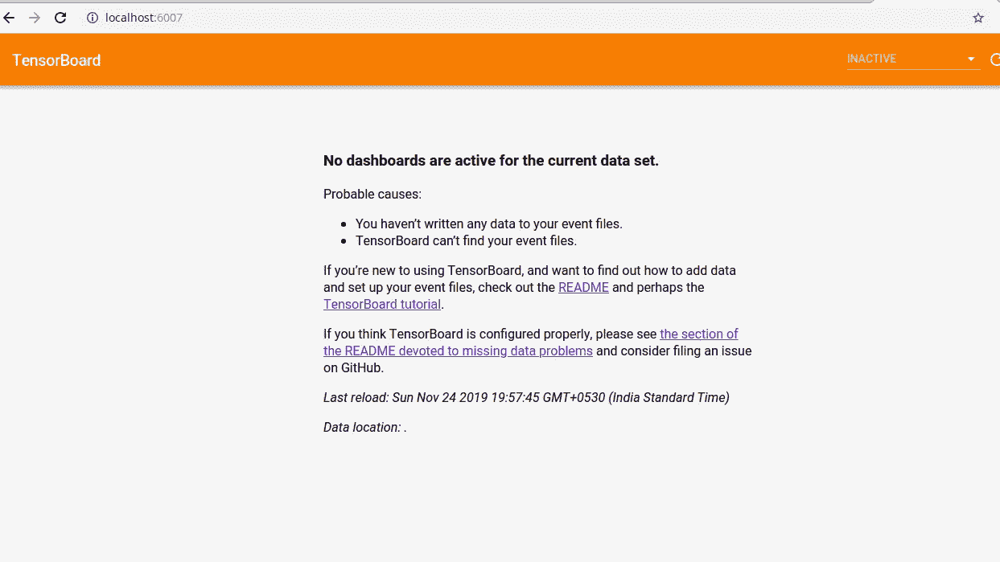
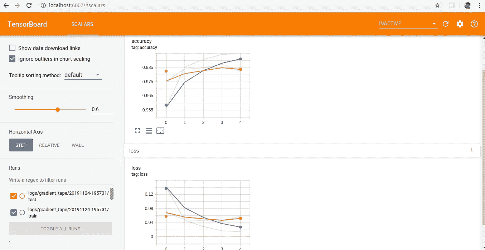

# Tensorflow 2.0 中的分类模型构建和跟踪

> 原文：<https://towardsdatascience.com/classification-model-building-and-tracking-in-tensorflow-2-0-398f5fca8fcf?source=collection_archive---------24----------------------->


上个月发布了 Tensorflow 2，通过紧密集成高级 keras、清除冗余 API、将急切执行保留为默认、移除全局和使用函数而不是会话，使模型开发和部署更加容易。

在本文中，我们将使用 Tensorflow 2.0 为 MNIST 数据集构建一个 CNN 分类器，并使用 Tensorboard 跟踪模型性能，同时牢记所有最佳实践。

第一步是安装 Tensorflow 2.0。建议的方法是安装在虚拟环境或 docker 中。要通过虚拟环境安装，你可以按照这个[链接](https://medium.com/@sambit9238/python-development-environment-set-up-with-virtual-environment-be26b1e96188.)。

现在我们将文章分成两部分:

1.  CNN 模型大楼。
2.  用张量板跟踪模型。

# CNN 模型构建

首先，我们需要导入所需的库。

```
from tensorflow.keras import Modelfrom tensorflow.keras.layers import Dense, Flatten, Conv2Dimport tensorflow as tf
```

> 确保您已经安装了 numpy 版本 1.16.4，否则会出现如下用户警告:
> 
> FutureWarning:不赞成将(type，1)或“1type”作为类型的同义词进行传递。在 numpy 的未来版本中，它将被理解为(type，(1，))/ '(1，)type '。NP _ resource = NP . dtype((" resource "，np.ubyte，1)) s

现在，我们将从 tf.keras API 中获取可用的 [mnist 手写数字数据集。](https://www.tensorflow.org/api_docs/python/tf/keras/datasets)训练集和测试集分别有 6 万幅和 1 万幅图像。每张图片都是尺寸为 28*28 的黑白图片。然后，我们将样本从整数转换为浮点数，以提供给模型。

```
mnist = tf.keras.datasets.mnist(x_train, y_train), (x_test, y_test) = mnist.load_data()x_train, x_test = x_train / 255.0, x_test / 255.0print(x_train.shape)
#  (60000, 28, 28)
```

因为我们要将输入馈送给 CNN，所以输入形状必须是特定的格式。对于 Tensorflow，格式应为(批次、高度、宽度、通道)。因此，我们将添加一个新的轴来格式化 CNN 的输入。

```
# Add a channels dimension
x_train = x_train[..., tf.newaxis]
x_test = x_test[..., tf.newaxis]print(x_train.shape)
# (60000, 28, 28, 1)
```

然后我们将使用 tf.data API 对数据集进行洗牌和批处理。这是一个非常方便的 API，可以设计到生产模型的输入数据管道。对于洗牌，我们将使用。来自 tf.data.Dataset API 的 shuffle()。它通过用`buffer_size`元素填充一个缓冲区来随机打乱所提供的数据集的元素，然后从这个缓冲区中随机抽取元素，用新元素替换所选的元素。考虑到机器的内存限制，我们使用了大小为 10000 的缓冲区。

```
#tf.data to batch and shuffle the datasettrain_ds = tf.data.Dataset.from_tensor_slices((x_train,y_train))\
                                        .shuffle(10000).batch(32)test_ds =  tf.data.Dataset.from_tensor_slices((x_test,y_test))\
                                        .batch(32)print(train_ds.element_spec)#(TensorSpec(shape=(None, 28, 28, 1), dtype=tf.float64, name=None), TensorSpec(shape=(None,), dtype=tf.uint8, name=None))
```

因为我们是以 32 为一批，所以最后一批将少于 32 个元素，如果你愿意，可以通过将`drop_remainder=True`传递给。批处理()

现在我们有了数据，是时候定义模型架构了。为此，我们将使用 Keras [模型子类 API](https://www.tensorflow.org/guide/keras#model_subclassing) 。另一种方法是使用 keras functional API，尽管子类化 API 更适合生产。

```
class MyModel(Model):
        def __init__(self):
                super(MyModel, self).__init__()
                self.conv1 = tf.keras.layers.Conv2D(32, 3, padding='same', activation='relu')
                self.pool = tf.keras.layers.MaxPooling2D(pool_size=(2, 2), strides=2, padding='same')
                self.flatten = tf.keras.layers.Flatten()
                self.d1 = tf.keras.layers.Dense(256, activation='relu')
                self.d2 = tf.keras.layers.Dense(128, activation='relu')
                self.d3 = tf.keras.layers.Dense(10, activation='softmax') def call(self, x):
                x = self.conv1(x)
                x = self.pool(x)
                x = self.flatten(x)
                x = self.d1(x)
                x = self.d2(x)
                x = self.d3(x)
                return x
```

现在，我们需要一个优化器和损失函数来训练模型。

```
# optimizer and loss function to train
loss_object = tf.keras.losses.SparseCategoricalCrossentropy()
optimizer = tf.keras.optimizers.Adam()
```

> 因为我们将标签作为整数提供，所以我们将使用稀疏分类交叉熵作为损失函数。

我们还将在每个时期后跟踪训练和测试数据的损失和准确性。

```
# metrics to measure the loss and the accuracy of the modeltrain_loss = tf.keras.metrics.Mean(name='train_loss')
train_accuracy = tf.keras.metrics.SparseCategoricalAccuracy(
                            name='train_accuracy')test_loss = tf.keras.metrics.Mean(name='test_loss')
test_accuracy = tf.keras.metrics.SparseCategoricalAccuracy(
                            name='test_accuracy')
```

现在，我们需要定义训练和测试方法来开始模型构建。

```
@tf.function
def train_step(model, optimizer, images, labels):
         with tf.GradientTape() as tape:
                  predictions = model(images)
                  loss = loss_object(labels, predictions)
         gradients = tape.gradient(loss, model.trainable_variables)
         optimizer.apply_gradients(zip(gradients,                   model.trainable_variables))
         train_loss(loss)
         train_accuracy(labels, predictions)@tf.function
def test_step(model, images, labels):
         predictions = model(images)
         t_loss = loss_object(labels, predictions)
         test_loss(t_loss)
         test_accuracy(labels, predictions)
```

在上面的代码中，有很多来自 Tensorflow 1 次的不同内容。

首先关于 tf.function，

> 在 TensorFlow 2.0 中，默认情况下会打开急切执行。用户界面直观而灵活(运行一次性操作更容易、更快)，但这会以牺牲性能和可部署性为代价。
> 
> `tf.function`构造一个 callable，它执行一个通过跟踪`func`中的张量流操作创建的张量流图(`[tf.Graph](https://www.tensorflow.org/api_docs/python/tf/Graph)`)。这允许 TensorFlow 运行时在由`func`定义的计算中应用优化和利用并行性。所以，建议用于生产。

第二件事是 tf。GradientTape()，

> 启用快速执行后，为了反向传播错误，您必须跟踪计算的梯度，然后将这些梯度应用到优化器。
> 
> 显然，Tensorflow 可以跟踪每个 tf.Variable 上的每个计算的每个梯度。然而，这可能是一个巨大的性能瓶颈。它们公开了一个渐变带，以便您可以控制代码的哪些区域需要渐变信息。

现在，我们必须实例化一个模型对象并输入数据来训练模型。我们必须跟踪测试数据的损失和准确性来评估模型。出于演示目的，我们在此仅使用了 5 个时期。

```
EPOCHS = 5# Create an instance of the model
model = MyModel()
for epoch in range(EPOCHS):
        for images, labels in train_ds:
                train_step(model, optimizer, images, labels) for test_images, test_labels in test_ds:
                test_step(model, test_images, test_labels) template = 'Epoch {}, Loss: {}, Accuracy: {}, Test Loss: {}, Test Accuracy: {}'
        print(template.format(epoch+1, train_loss.result(),
                              train_accuracy.result()*100,
                              test_loss.result(),
                              test_accuracy.result()*100))#output
Epoch 1, Loss: 0.14411139488220215, Accuracy: 95.71333312988281, Test Loss: 0.04969984292984009, Test Accuracy: 98.44999694824219
2019-11-24 18:54:43.808050: W tensorflow/core/framework/cpu_allocator_impl.cc:81] Allocation of 376320000 exceeds 10% of system memory.
Epoch 2, Loss: 0.04587719216942787, Accuracy: 98.59500122070312, Test Loss: 0.06183547526597977, Test Accuracy: 98.04000091552734
Epoch 3, Loss: 0.029635081067681313, Accuracy: 99.05333709716797, Test Loss: 0.04673100262880325, Test Accuracy: 98.54000091552734
Epoch 4, Loss: 0.020683910697698593, Accuracy: 99.32167053222656, Test Loss: 0.04771297425031662, Test Accuracy: 98.6199951171875
Epoch 5, Loss: 0.01358255185186863, Accuracy: 99.57833099365234, Test Loss: 0.05094970762729645, Test Accuracy: 98.58000183105469
```

如果我们看到 5 个时期，它得到了大约 98%以上的准确性。

# 用张量板跟踪模型

Tensorboard 是一个非常方便的图形可视化工具，可以实时跟踪模型训练进度。它可以用于多种用途，从检查模型架构到跟踪模型训练中超参数的行为。这里，我们将通过一个简短的例子来检查模型在训练时的准确性和损失。

我们需要首先启动一个 Tensorboard 实例来显示数据。

```
import datetime
from tensorboard import programtb = program.TensorBoard()
tb.configure(argv=[None, ‘ — logdir’, “.”])
url = tb.launch()
print(“tensorboard url: “, url)#tensorboard url:  [http://localhost:6007/](http://localhost:6006/)
```

现在可以在 [http://localhost:6007/](http://localhost:6006/) 查看 Tensorboard。如果你去那里，你会看到一个像这样的屏幕:



这是因为 Tensorboard 通过读取所提供位置的日志目录来显示数据。在 tb.configure 中，我们已经提供了当前的工作目录。所以它会创建一个日志目录，并写入要在 Tensorboard 上显示的数据。因此，我们将首先为培训和测试创建一个日志记录器

```
current_time = datetime.datetime.now().strftime("%Y%m%d-%H%M%S")
train_log_dir = 'logs/gradient_tape/' + current_time + '/train'
test_log_dir = 'logs/gradient_tape/' + current_time + '/test'
train_summary_writer = tf.summary.create_file_writer(train_log_dir)
test_summary_writer = tf.summary.create_file_writer(test_log_dir)
```

然后，我们必须将每个 epoch 结果写入训练和测试中，以使它们可视化。

```
for images, labels in train_ds:
        for images, labels in train_ds:
                train_step(model, optimizer, images, labels)
        with train_summary_writer.as_default():
                tf.summary.scalar('loss', train_loss.result(), step=epoch)
                tf.summary.scalar('accuracy', train_accuracy.result(), step=epoch) for test_images, test_labels in test_ds:
                test_step(model, test_images, test_labels)
        with test_summary_writer.as_default():
                tf.summary.scalar('loss', test_loss.result(), step=epoch)
                tf.summary.scalar('accuracy', test_accuracy.result(), step=epoch)
```

现在，当训练正在进行时，如果您想查看结果，只需访问 Tensorboard url，屏幕将如下所示:



在 Tensorboard 中可以看到许多关于模型的东西，这不是本文的一部分。

本文的代码可以在以下位置找到:

[](https://github.com/sambit9238/Deep-Learning/blob/master/mnist.py) [## sambit 9238/深度学习

### 此时您不能执行该操作。您已使用另一个标签页或窗口登录。您已在另一个选项卡中注销，或者…

github.com](https://github.com/sambit9238/Deep-Learning/blob/master/mnist.py) 

## 参考资料:

 [## 面向专家的 TensorFlow 2 快速入门| TensorFlow 核心

### 这是一个谷歌合作的笔记本文件。Python 程序直接在浏览器中运行——这是学习和研究的好方法

www.tensorflow.org](https://www.tensorflow.org/tutorials/quickstart/advanced) [](https://pgaleone.eu/tensorflow/tf.function/2019/03/21/dissecting-tf-function-part-1/) [## 分析 tf.function 以发现签名的优势和微妙之处——第 1 部分

### AutoGraph 是 Tensorflow 2.0 最激动人心的新特性之一:它允许转换 Python 语法的子集…

pgaleone.eu](https://pgaleone.eu/tensorflow/tf.function/2019/03/21/dissecting-tf-function-part-1/)