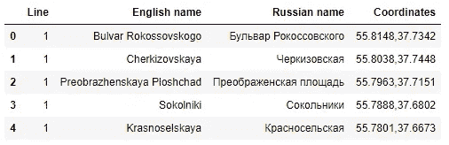
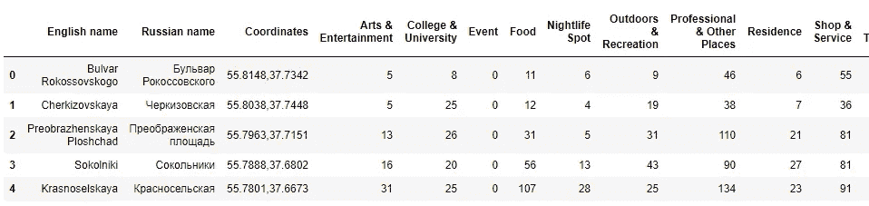
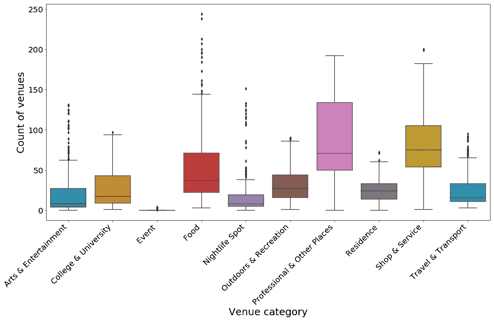
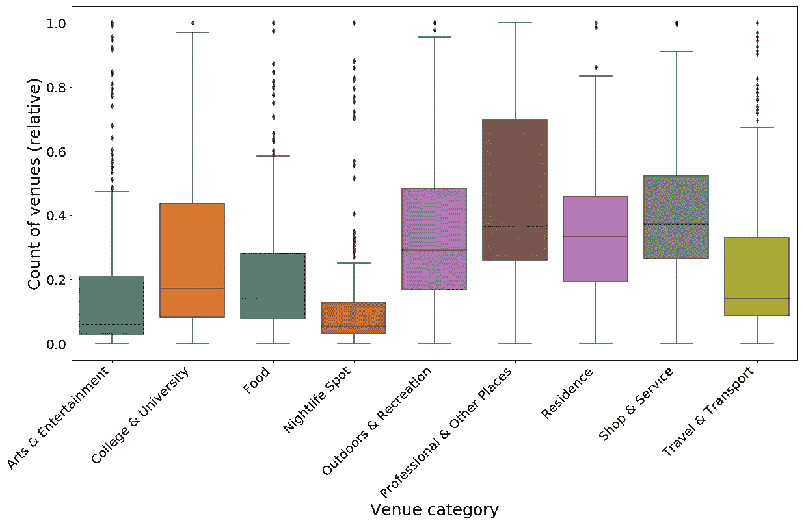
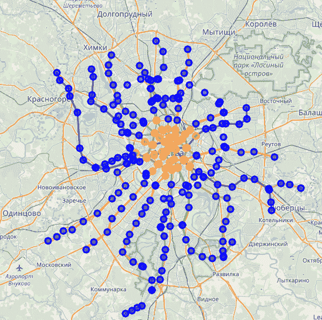
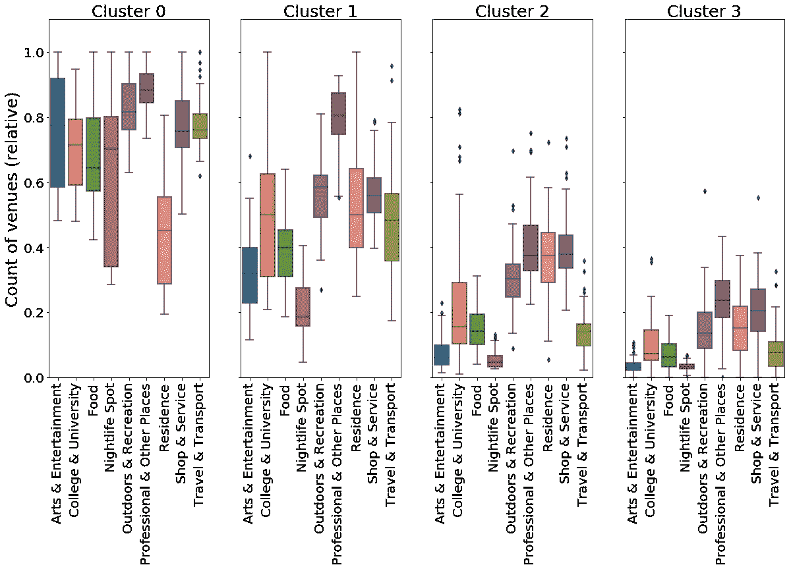
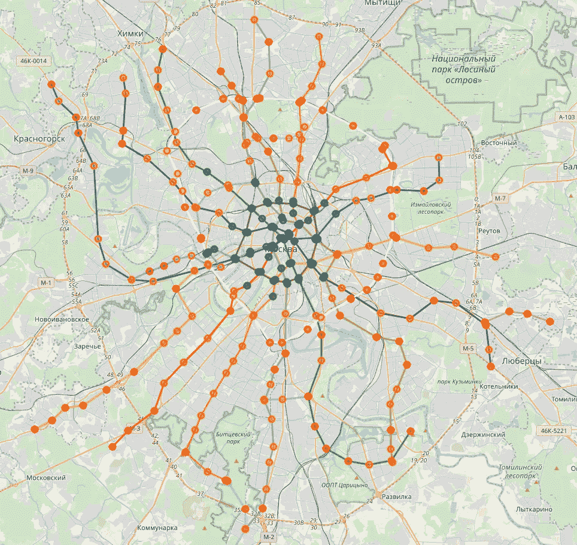
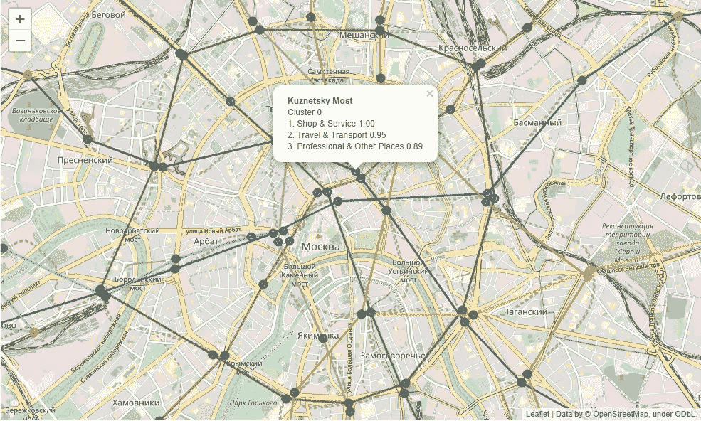

# 利用 Foursquare 数据对莫斯科地铁站进行分类

> 原文：<https://towardsdatascience.com/classification-of-moscow-metro-stations-using-foursquare-data-fb8aad3e0e4?source=collection_archive---------17----------------------->

*本帖是 Coursera* [*IBM 数据科学专业专精*](https://www.coursera.org/specializations/ibm-data-science-professional-certificate) *的压轴项目。完整的笔记本和数据在*[*Github*](https://github.com/theptyza/map_moscow_metro_foursquare)*上有。*

# 介绍

莫斯科地铁有 264 个车站，是世界上最大的公共交通系统之一。每天有超过 600 万人使用它。

对于这个项目，我们想看看地铁站周围的社区，并对它们进行分类。一些街区主要是住宅区，其他的周围有更多的商业区。离车站最近的场馆决定了人们使用它的原因和方式。例如，如果附近没有专业场所，居民可能会去其他地方工作。这造成了人们的日常迁移。

通过分析这些数据，我们可以根据站点的主要用途对其进行分类。这些数据有助于城市规划者确定人们最有可能去哪里工作和休闲，规划网络的进一步扩展和寻找新的发展空间。

# 数据

我们需要车站位置和离车站最近的场地的数据。

1.  站点列表及其地理坐标——从这个维基百科页面上刮下来的。



Stations data

2.Foursquare API 探索每个车站周围的场地类型。Foursquare 用更多的子类别概括了这些高层次的场馆类别。

*   艺术和娱乐(4d4b7104d754a06370d81259)
*   学院和大学(4d4b7105d754a06372d81259)
*   事件(4d4b7105d754a06373d81259)
*   食品(4d4b7105d754a06374d81259)
*   夜生活场所(4d4b7105d754a06376d81259)
*   户外和娱乐(4d4b7105d754a06377d81259)
*   专业和其他地方(4d4b7105d754a06375d81259)
*   住所(4e67e38e036454776db1fb3a)
*   商店和服务(4d4b7105d754a06378d81259)
*   旅行和运输(4d4b7105d754a06379d81259)

我们将查询每个站点周围 1000 米半径范围内每个类别的场馆数量。选择这个半径是因为 1000 米是一个合理的步行距离。

# 方法学

我们可以使用 [Foursquare explore API](https://developer.foursquare.com/docs/api/venues/explore) 和**类别 ID** 来查询特定半径内每个类别的场馆数量。响应包含指定坐标、半径和类别的 **totalResults** 值。样品要求(1000 米半径和类别专业&其他地方):

```
GET https://api.foursquare.com/v2/venues/explore?client_id={{client_id}}&client_secret={{client_secret}}&v={{v}}&ll=**55.7662,37.5692**&radius=**1000**&categoryId=  **4d4b7105d754a06375d81259**
```

回应:

```
{
    "meta": {
        "code": 200,
        "requestId": "5cfec0e31ed21914c1db7dd0"
    },
    "response": {
        "suggestedFilters": {
            "header": "Tap to show:",
            "filters": [
                {
                    "name": "Open now",
                    "key": "openNow"
                }
            ]
        },
        "headerLocation": "Presnensky",
        "headerFullLocation": "Presnensky, Moscow",
        "headerLocationGranularity": "neighborhood",
        "query": "professional",
 **"totalResults": 132,
<...>
}**
```

我们已经获得了每个站点的数据。完整的 csv 可在 [Github](https://github.com/theptyza/map_moscow_metro_foursquare/blob/master/stations_venues_1000.csv) 上获得。



Count of venues of each category in a 1000m radius for each station

## 探索性分析和基本清理

我们来看数据。例如，我们可以看到，Turgenevskaya 站拥有最多的专业和其他场所(192)，而 Belokamennaya 站则为 0。

让我们以箱线图的形式显示场馆的数量(显示平均数量、分布和异常值)。



Boxplots of number of venues in each category

我们可以看到，最常见的场所类别是食品、商店和服务以及专业和其他场所。事件只有很少的数据，所以我们将丢弃它。

## 数据准备

让我们使用[最小-最大比例](https://en.wikipedia.org/wiki/Feature_scaling#Rescaling_(min-max_normalization))来标准化数据(场馆数量从 0 到 1 的比例，其中 0 是一组中的最低值，1 是最高值)。这既规范了数据，同时也提供了一个易于解释的分数。缩放后的图表如下所示:



Boxplots of scaled number of venues in each category

## 使聚集

我们将使用 [k 均值聚类](https://en.wikipedia.org/wiki/K-means_clustering)。这些是不同组数的初步结果:

*   两个集群显示了住宅区/商业区的分界线
*   3 个集群增加了市区内的集群
*   4 聚类还识别具有非常少数量的场所的邻近区域
*   5 和更多的集群很难解释



Clustering with 2, 3 and 4 clusters.

最后，让我们选择 4 个集群(0 到 3)。让我们用箱线图来直观地展示集群的轮廓。



Clusters and their relative count of venues

并将它们绘制在地图上(在[https://theptyza.github.io/map_moscow_metro_foursquare/map/](https://theptyza.github.io/map_moscow_metro_foursquare/map/)可获得完整的交互式地图)。



Clusters map. Cluster 0 is Blue, 1 is Green, 2 is Yellow and 3 is Red.

对于每个电视台，我们将显示排名前 3 的场馆类别及其在该类别中的 0 到 1 分。



Sample showing scores in top 3 venue categories

# 结果

下面是我们如何通过查看场地得分来描述集群的特征:

*   第 0 组(蓝色)在所有场馆类别中得分一直很高。这是这个城市发展最多样化的地区
*   群组 1(绿色)在专业和其他地方得分最高。这是城市的商业区。
*   第 2 组(橙色)得分较低，在职业、居住和商店及服务方面得分最高。
*   集群 3(红色)的分数普遍较低。这些似乎是不发达地区。

在地图上绘制集群向我们展示了:

*   0 区是这座城市最古老的中心部分
*   集群 1 也在市中心。这些车站大多位于[环线](https://en.wikipedia.org/wiki/Koltsevaya_line)内或附近，交通便利。
*   集群 2 和集群 3 的地理分布并不明显。第 3 组区域倾向于在郊区，但是一些区域位于更中心的位置。

一些站点被归类为第 3 类，尽管它们更靠近中心，更容易接近。这可能是关闭和废弃工厂的“锈带”的遗产。最近开通的[莫斯科中央环线](https://en.wikipedia.org/wiki/Moscow_Central_Circle)的许多车站都属于这一类。这些都是商业和住宅开发的黄金区域。

# 讨论

公平地说，Foursquare 的数据并不包罗万象。数量最多的场馆是在食品和商店及服务类。数据没有考虑场地的大小(例如，大学建筑吸引的人比热狗摊多得多——每个人仍然是一个正方形的“场地”)。

# 结论

Foursquare 的数据有限，但可以提供一个城市发展的洞察力。这些数据可以与其他来源(如城市居民人数数据)结合起来，以提供更准确的结果。