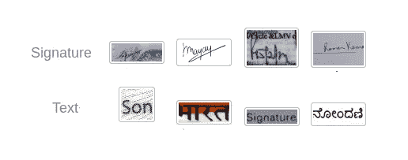
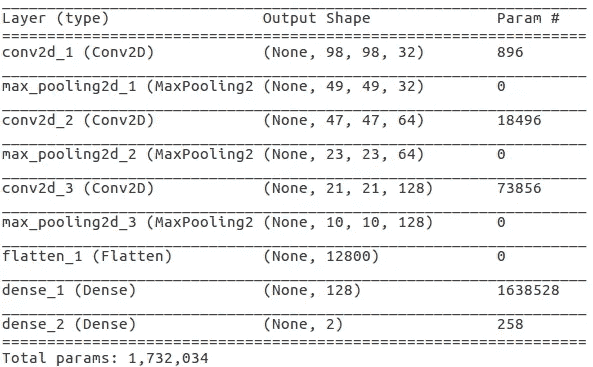
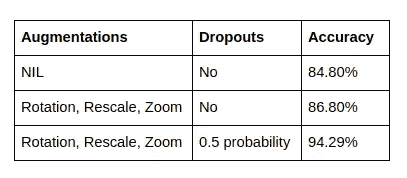
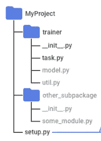

# 使用 CNN 对签名和文本图像进行分类，并在 Google Cloud ML 引擎上部署该模型

> 原文：<https://towardsdatascience.com/classification-of-signature-and-text-images-using-cnn-and-deploying-the-model-on-google-cloud-ml-30bf6f4e3207?source=collection_archive---------12----------------------->

众所周知，对于任何具有法律重要性的文件，无论是合同、货物还是简单的表格，签名都是重要的组成部分。签名提供了识别和确认。目前，从印刷文本数据中识别签名的模型还不可用。所以这里介绍的工作是关于签名和文本数据的分类。

使用 *TensorFlow* 的高级 API*Keras*构建分类模型，TensorFlow 是用于机器学习的开源库。该分类模型还可以帮助建立文档图像的签名检测模型。

# 数据准备

数据集是通过从文档中提取文本并从不同的文档中捕获签名样本而生成的。数据由两类组成:签名(类标签 0)和文本(类标签 1)。

文本图像的数据包含具有不同背景、高度、宽度和笔划粗细的独立单词的图像。文本的图像不限于一种独特的语言，还涉及多语言文本。该数据包含大约 2000 张不同的图像。

签名图像数据包含大约 1300 个不同背景、高度、宽度和笔画粗细的签名图像。

数据已经存储在谷歌云存储上。数据清理的初步步骤包括丢弃模糊的图像，并用适当的填充和边距重新排列文本。为了增加数据的大小，执行了一些运行时数据扩充，如旋转、重新缩放和缩放操作。数据集分为 70%用于训练，30%用于验证。除此之外，还有一个单独的看不见的数据集，在其上测试模型的准确性。



The sample of images in dataset

博客组织如下:

第一部分:独立的分类模型，可以在单独的系统上运行。

**第二部分**:通过在 GCP ML-Engine 上部署模型，使模型公开。

# 一.分类模式

深度卷积神经网络采用序列模型构建。有三个卷积图层以及一个完全连接的图层，后跟一个输出图层。CNN 参数，如最大池大小被设置为(2，2)，内核大小被设置为(3，3)。最初，过滤器的数量设置为 32。在随后的卷积层中，过滤器的数量加倍。

使用的激活函数是 ReLU，最后一层激活函数是 Sigmoid。添加一个丢弃概率为 0.5 的丢弃层。该模型的架构如下:

模型概要给出了每一层的详细情况以及每一层中的参数总数。模型总结如下:



Summary of the model

接下来，以准确性作为评价指标，以损失作为二元交叉熵，以优化器作为 adam 优化器，对模型进行编译。

由于训练数据大小有限，在 *ImageDataGenerator()* 函数的帮助下增加了运行时图像扩充。在训练数据集中添加了图像增强，如旋转、缩放和缩放。

为了预测模型对测试数据集的输出，使用了 predict 方法。然后使用 sklearn.metrics 从预测中计算精度、召回率和测试准确度。

添加图像增强和剔除图层后的最终测试准确率为 94.29%。签名图像的准确率为 96.55%，召回率为 97.22%。下表给出了通过添加增强层和下降层的结果升级。



Results of various experiments

# 二。在 Google Cloud ML 引擎上训练和部署模型


Cloud ML Engine 有助于大规模训练您的机器学习模型，在云端托管训练好的模型，并使用模型对新数据进行预测。

## 数据

通过拍摄不同语言和不同背景的签名图像和文本图像来准备数据。如前所述，对数据进行同样的预处理。有两个类，签名和文本。

## 包装模型

准备在 ML 引擎上部署的模型的包架构如下所示。



Project structure for ML Engine

## a) setup.py

setup.py 文件包含模型在 cloud ML 引擎上运行所需安装的依赖项和版本。云 ML 引擎内置 tensorflow 支持。需要安装所有其他要求。

## b)任务. py

task.py 文件是模型的入口点。它包含运行模型时需要解析的参数列表。它还调用模型和其他相关文件(如果有的话)。训练好的模型以. hdf5 格式保存。task.py 文件的代码如下所示:

**注意:**保存的模型为. hdf5 格式。为了部署模型，我们需要。模型的 pb 格式。为此，我们需要导出带有 TensorFlow 服务的模型。

## c)模型. py

model.py 包含要训练的实际模型。它将编译后的模型返回给调用函数。模型函数的代码如下所示。

## utils.py

这个文件包含数据预处理的代码。传递包含图像文件的目录的位置，并生成可以提供给模型的带标签的数据。数据保存在中。npy 文件，然后用于模型训练。

# 训练模型

**a)本地培训**

在本地机器上训练模型有两种方法:使用 python 命令和使用 gcloud 命令。

```
$ export JOB_DIR=/path/to/job/dir
$ export TRAIN_DIR=/path/to/training/data/dir   #either local or GCS#Train using pythonpython -m trainer.task \
 --train-dir=$TRAIN_DIR \
 --job-dir=$JOB_DIR#Train using gcloud command line tool$ gcloud ml-engine local train --module-name=trainer.task \
   --package-path=trainer/ \
   --train-dir=$TRAIN_DIR \
   --job-dir=$JOB_DIR
```

**b)向谷歌云提交作业**

在本地成功训练模型后，下一步是将作业提交给云 ml-engine。从您的教练包所在的目录运行下面给出的命令。

```
$ export BUCKET_NAME="your GCS bucket name"
$ export JOB_NAME="name of your job"
$ export OUTPUT_PATH=gs://$BUCKET_NAME/$JOB_NAME
$ export TRAIN_DATA=/path/to/dataset#gcloud command line$ gcloud ml-engine jobs submit training $JOB_NAME \
    --job-dir $OUTPUT_PATH \
    --runtime-version 1.10 \
    --module-name trainer.task \
    --package-path trainer/ \
    --region $REGION \
    -- \
    --train-dir $TRAIN_DATA \
    --verbosity DEBUG
```

可以从 Google cloud ML engine 的仪表盘上查看日志。在作业成功提交之后，您可以在 GCS bucket 的 OUTPUT_PATH 中找到一个文件夹导出。

# 部署模型

培训之后，是时候为生产部署模型了。第一步是将保存的模型从. hdf5 格式转换为。pb(张量流模型格式)。分步指南以及必要的代码和 shell 命令可以在[本](https://github.com/Krishna-Parekh/signClassify/blob/master/signature_model_deploy.ipynb)笔记本中找到。

## 步骤 1 →创建模型

创建模型的 gcloud 命令如下。

```
$ export MODEL_NAME=<Name of the model>
$ export MODEL_PATH=/gcs/path/to/the/model#CREATE MODEL
$ gcloud ml-engine models create $MODEL_NAME
```

## 步骤 2 →为您刚刚创建的模型创建版本

运行下面的命令来创建模型的版本 version_1。

```
$ gcloud ml-engine versions create "version_1" --model $MODEL_NAME \ --origin $MODEL_PATH \
--python-version 3.5 --runtime-version 1.10
```

## 步骤 3 →为预测模型服务

对模型的预测请求可以作为 test.json 发送。为此，您需要将图像转换成. json 格式的请求，如下所示。

在线预测可以在 gcloud 命令的帮助下完成。

```
$ gcloud ml-engine predict — model $MODEL_NAME — version version_3 — json-instances test_data.json
```

你可以在这里找到代码文件。希望这篇文章对你有所帮助，并为你提供了一些有意义的见解！非常欢迎您的宝贵反馈。快乐学习！！！

*原载于 2019 年 1 月 9 日*[*medium.com*](https://medium.com/searce/classification-of-signature-and-text-images-using-cnn-and-deploying-the-model-on-google-cloud-ml-73ec6c7f7e8)*。*