# 不平衡数据集的分类

> 原文：<https://towardsdatascience.com/classification-of-unbalanced-datasets-8576e9e366af?source=collection_archive---------5----------------------->

## 当数据集不平衡时，如何使用 sklearn 正确地进行分类分析，并改进其结果。


Photo by [Brett Jordan](https://unsplash.com/@brett_jordan?utm_source=medium&utm_medium=referral) on [Unsplash](https://unsplash.com?utm_source=medium&utm_medium=referral)

假设您有一个包含十几个特征的数据集，并且需要对每个观察值进行分类。可以是两类问题(你的输出不是 1 就是 0；对或错)或多类问题(可能有两个以上的选择)。然而，在这种情况下，有一个转折。数据不平衡。想想那些可能患有或可能没有癌症的病人(大多数可能不会)或延长信用额度的决定(大多数银行客户都获得了延期)。你的机器学习算法会对一个类“曝光过度”，对另一个类“曝光不足”。网上有很多关于这个问题的文章，采用了不同的方法。在这里，我将结合其中的一些来得到一个健壮的解决方案。

我们将从更直接的线性模型开始，然后添加一些调整，移动到提升树，最后到神经网络。

> 你可以从[这里](https://github.com/nastyh/Unbalanced-Dataset)下载数据集和练习册。

我们将遵循以下步骤:

*   加载数据和一些最需要的依赖项
*   做一些最简单的预处理
*   建立几个简单的模型，作为进一步尝试的基础
*   花些时间在特征工程上
*   运用各种方法来帮助我们处理不平衡的数据

## 装载和理解

在这个练习中，我们将使用来自 Kaggle 的[弗雷明汉心脏研究数据集](https://www.kaggle.com/amanajmera1/framingham-heart-study-dataset)。它提出了一个二元分类问题，其中我们需要预测变量“TenYearCHD”(零或一)的值，该值显示患者是否会患心脏病。

```
import pandas as pd
import numpy as np
import matplotlib.pyplot as plt
import scipy.stats as st
import seaborn as sns
import pandas_profiling
%matplotlib inlinedf = pd.read_csv(r'path to dataset')
```

让我们使初步的数据探索更方便一点。我最近看到了一篇由 Parul Pandey 撰写的[文章](/10-simple-hacks-to-speed-up-your-data-analysis-in-python-ec18c6396e6b)名为“用 Python 加速数据分析的 10 个简单技巧”,并安装了一个[剖析](https://github.com/pandas-profiling/pandas-profiling)包。

只需一个命令，它就能做一些非常方便的事情:

```
# looking at stats
pandas_profiling.ProfileReport(df)
```

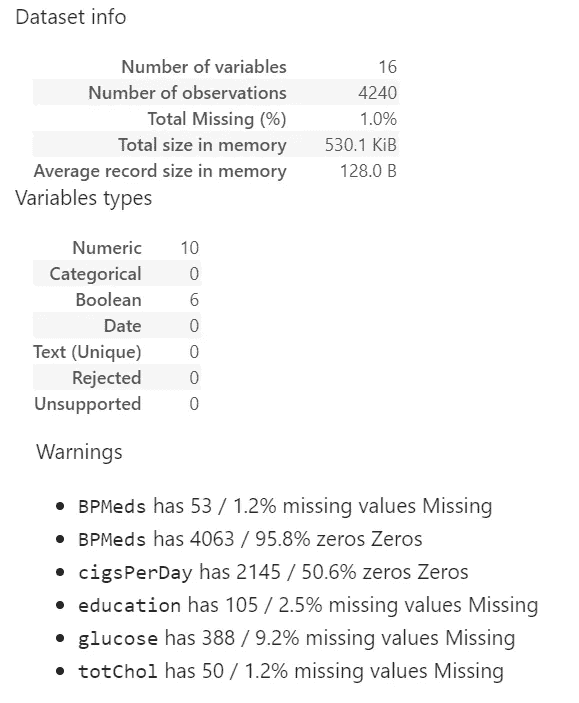

The summary output after using Profiling

如您所见，数据相当干净:我们在这里和那里有丢失的值，但是我们将很快处理它们。

下图中的特征之间的相关性也没有说太多:

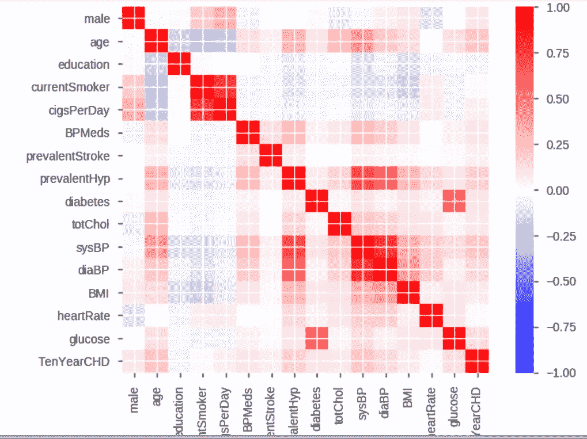

Pearson correlation from Profiling

*吸烟和舒张压/收缩压周围的两个红色矩形相当明显:通常吸烟和高血压是相关的*

大多数特性的名称都很好地解释了每个变量的含义，但有几个不太明显:

“教育”可以是:

1 —对于某些高中来说

2 —高中普通教育

3 —一些大学或职业学校

4 —学院

BPMeds 是一个二元变量，其中

0-表示患者不服用任何降压药

1-表示相反的意思

让我们手动检查目标变量:

```
df['TenYearCHD'].value_counts(normalize = True)
```

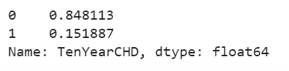

Only 15% of patients have been diagnosed with a decease

如果你是个视觉型的人:

```
sns.countplot(x='TenYearCHD',data=df)
```

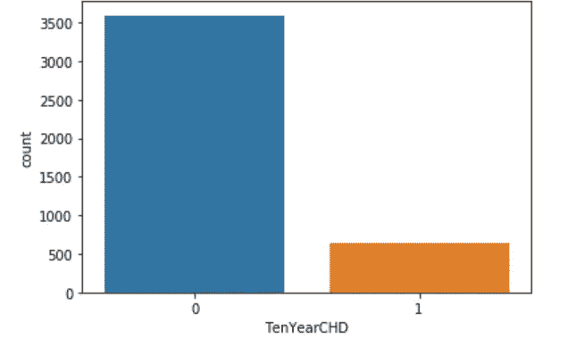

Same information but shown as a bar chart

这不是一个*严重*不平衡的集合，但可能会扭曲线性和非线性算法。

## 数据预处理

我能想到几个迫在眉睫的问题:

*   缺失值和 NaNs
*   “教育”列可能被视为序数，也可能不被视为序数
*   数据的规范化或标准化(通常属于这一部分，但我将在以后做，一旦我们开始构建一个需要规范化特征的模型)

“BPMeds”有一些缺失值，但是大约 96%的列为零(没有服用降压药)。所以，用零填充 NaNs 应该是公平的。

“葡萄糖”和“总胆固醇”都是连续变量，我们将使用平均列值来填充空单元格。

“身体质量指数”和“心率”似乎也能很好地适应平均值。

“吸烟日”需要一个两步走的方法。它有 29 个缺失值。你可能认为使用平均值就可以了。然而，“cigsPerDay”与另一个二元特征“currentSmoker”相关联。所以，你可以把一个不吸烟的人叫做 NaN，然后给这个人分配一些平均数量的香烟。我们希望避免这种情况。让我们看看如何做到这一点。

```
df['cigsPerDay'].value_counts(normalize = True).plot(kind="bar")
```

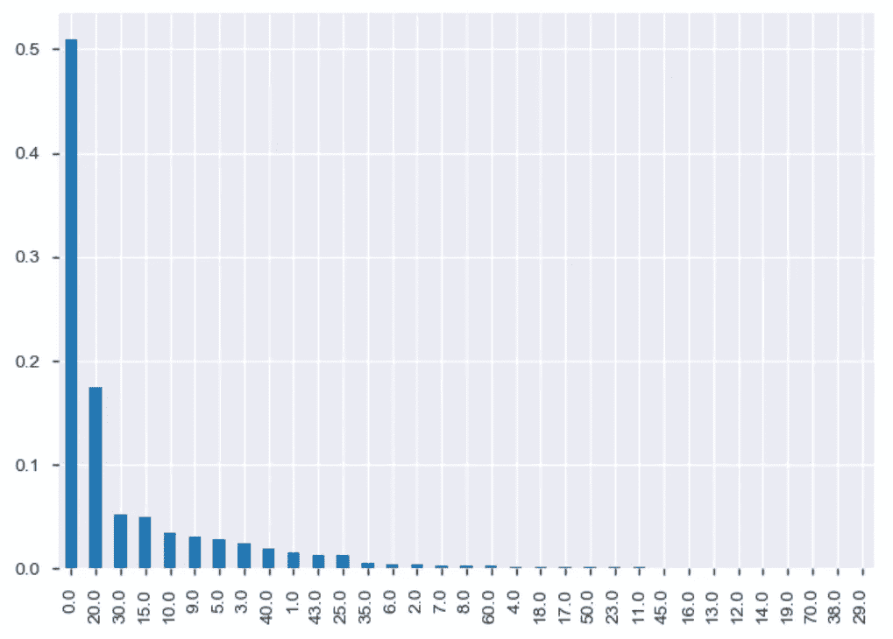

Distribution of the number of cigarettes smoked

大多数人不吸烟，我们不想给他们分配香烟。

```
df['cigsPerDay'][df['currentSmoker']==0].isna().sum()
```

该命令返回零，因此似乎我们没有针对任何非吸烟者的 NaNs。但是利用。mean()还是不好，因为它会偏向零。我们希望只对吸烟者应用 fillna()命令:

```
# creating a boolean array of smokers
smoke = (df['currentSmoker']==1)# applying mean to NaNs in cigsPerDay but using a set of smokers only
df.loc[smoke,'cigsPerDay'] = df.loc[smoke,'cigsPerDay'].fillna(df.loc[smoke,'cigsPerDay'].mean())
```

因此，现在吸烟的平均数量刚刚超过 18 支:

```
df['cigsPerDay'][df['currentSmoker']==1].mean()
```

如果我们决定走一条更简单的路，不排除不吸烟者，这个值将是 9 左右。

可以肯定的是，不吸烟的人不会被赋予任何价值:

```
df['cigsPerDay'][df['currentSmoker']==0].mean()
```

“教育”是一个有趣的话题。虽然它本身是一个分类变量*，*它已经为我们编码了，更高的教育水平对应着更大的数字。这里的一个潜在问题是，“大学”和“某所大学或职业学校”之间的“间隔”可能与“高中或 GED”和“某所大学或职业学校”之间的“间隔”不同然而，数字说的是相反的:四和三之间的距离与二和三之间的距离完全相同。你可以通过谷歌搜索[“逻辑回归中的序数值”](https://www.google.com/search?q=ordinal+variables+in+logistic+regression&rlz=1C1CHBF_enUS841US841&oq=ordinal+varables+in+&aqs=chrome.4.69i57j0l5.6763j0j7&sourceid=chrome&ie=UTF-8)或者浏览[这篇论文](https://www3.nd.edu/~rwilliam/stats3/OrdinalIndependent.pdf)来了解这个问题。现在让我们假设距离是相似的。也就是说，我们将去掉“教育”中的 NaNs，以便回归可以与列一起工作。

```
df['education'].value_counts(normalize = True).plot(kind="bar")
```

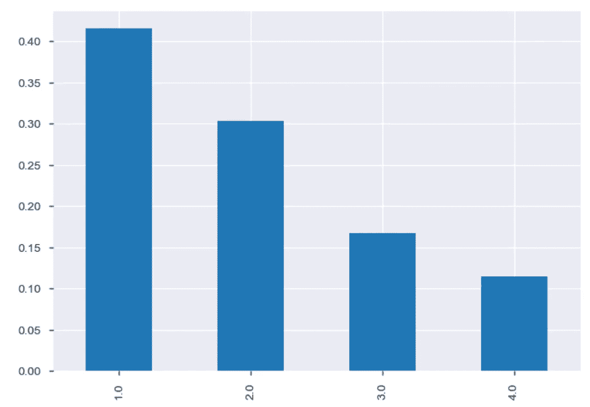

Breakdown of “education”

在这里用“1”代替 NaNs 似乎是公平的。

立刻做出所有该做的改变:

```
# Filling out missing values
df['BPMeds'].fillna(0, inplace = True)
df['glucose'].fillna(df.glucose.mean(), inplace = True)
df['totChol'].fillna(df.totChol.mean(), inplace = True)
df['education'].fillna(1, inplace = True)
df['BMI'].fillna(df.BMI.mean(), inplace = True)
df['heartRate'].fillna(df.heartRate.mean(), inplace = True)
```

让我们检查它是否通过:

```
df.isna().sum()
```

我们准备好了。

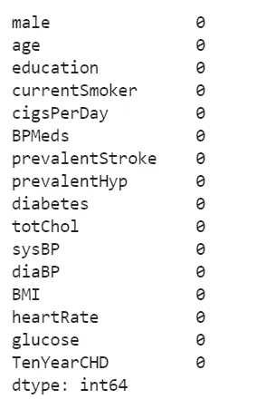

No NaNs left

## 基本型号

我们将从一个随机的森林开始，也将看看我们的功能的重要性指标。

不要忘记将特征与目标变量分开:

```
features = df.iloc[:,:-1]
result = df.iloc[:,-1]
```

模型本身在下面。

依赖关系优先:

```
import sklearn
from sklearn.model_selection import train_test_split
from sklearn.linear_model import LogisticRegression
from sklearn.metrics import classification_report
from sklearn.metrics import confusion_matrix
from sklearn.metrics import accuracy_score
from sklearn.metrics import roc_auc_score
from sklearn.preprocessing import StandardScaler
```

训练/测试分割:

```
X_train, X_test, y_train, y_test = train_test_split(features, result, test_size = 0.2, random_state = 14)
```

配件:

```
rf = RandomForestClassifier()
rf.fit(X_train, y_train)# Making predictions on unseen data
predictions_rf = rf.predict(X_test)
```

特征的重要性(有时，为了加快速度，您希望使用较少的特征构建模型):

```
# what features are the most important?
plt.plot(rf.feature_importances_)
plt.xticks(np.arange(X_train.shape[1]), X_train.columns.tolist(), rotation=90)
```

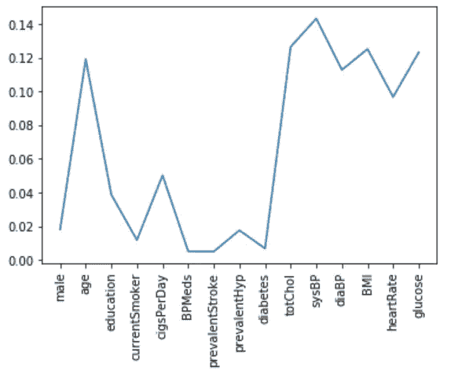

Some features are definitely more important

如果您希望它是一个列表:

```
# View a list of the features and their importance scores
list(zip(features, rf.feature_importances_))
```

评估模型:

```
print(classification_report(y_test, predictions_rf))
print(confusion_matrix(y_test, predictions_rf))# Under ROC curve
prob_rf = rf.predict_proba(X_test)
prob_rf = [p[1] for p in prob_rf]
print(roc_auc_score(y_test, prob_rf))
```

这里有两个结论:

*   84.90%的准确率几乎无法击败随机猜测。记住，84.81%的数据被标记为零。所以我们比猜测高出 0.09%。
*   此外，混淆矩阵显示了大量的假阴性:

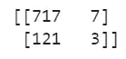

Lots of type II errors

我们希望避免这种情况，因为模型错误地指出患者没有问题，而实际上他或她有问题！我们将很快解决这个问题，但是现在，让我们只使用重要的特征来重建模型。

```
from sklearn.feature_selection import SelectFromModel
from sklearn.ensemble import RandomForestClassifier# Create a selector object that will use the random forest classifier to identify
# features that have an importance of more than 0.12
sfm = SelectFromModel(clf, threshold=0.12)# Train the selector
sfm.fit(X_train_std, y_train)feat_labels = list(features.columns.values) # creating a list with features' names
for feature_list_index in sfm.get_support(indices=True):
    print(feat_labels[feature_list_index])importances = clf.feature_importances_
std = np.std([tree.feature_importances_ for tree in clf.estimators_],
             axis=0)
indices = np.argsort(importances)[::-1]print("Feature ranking:")for f in range(X_train_std.shape[1]):
    print("%d. feature %d (%f)" % (f + 1, indices[f], importances[indices[f]]))# Plot the feature importances of the forest
plt.figure()
plt.title("Feature importances")
plt.bar(range(X_train_std.shape[1]), importances[indices],
       color="r", yerr=std[indices], align="center")
plt.xticks(range(X_train_std.shape[1]), indices)
plt.xlim([-1, X_train_std.shape[1]])
plt.show()# with only important features. Can check X_important_train.shape[1]
X_important_train = sfm.transform(X_train_std)
X_important_test = sfm.transform(X_test_std)clf_important = RandomForestClassifier(n_estimators=10000, random_state=0, n_jobs=-1)
clf_important.fit(X_important_train, y_train)predictions_y_4 = clf_important.predict(X_important_test)
print(classification_report(y_test, predictions_y_4))
print(confusion_matrix(y_test, predictions_y_4))
accuracy_score(y_test, predictions_y_4)
# Under ROC curve
prob_y_4 = clf_important.predict_proba(X_important_test)
prob_y_4 = [p[1] for p in prob_y_4]
print(roc_auc_score(y_test, prob_y_4))
```

我选择了重要性大于 0.12 的特性，并仅使用这些列重建了随机森林。结果非常相似，但我们能够节省一些计算能力。

## 逻辑回归

回归需要标准化的特征:

```
scaler = StandardScaler()
X_train_std = scaler.fit_transform(X_train)
X_test_std = scaler.fit_transform(X_test)
```

模型是:

```
logmodel = LogisticRegression(solver='liblinear')
logmodel.fit(X_train_std, y_train)
predictions_y_2 = logmodel.predict(X_test_std)
```

和评估结果:

```
print(classification_report(y_test, predictions_y_2))
print(confusion_matrix(y_test, predictions_y_2))# Under ROC curve
prob_y_2 = logmodel.predict_proba(X_test_std)
prob_y_2 = [p[1] for p in prob_y_2]
print(roc_auc_score(y_test, prob_y_2))
```

结果与 random forest 非常相似:

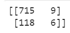

Just two fewer type II errors

它在假阴性上表现稍好。但这仍然不够。

LogisticRegression 有一个参数 *class_weight* ，这将有助于提高准确性。让我们看看:

```
logmodel = LogisticRegression(solver='liblinear', class_weight='balanced')
logmodel.fit(X_train_std, y_train)
predictions_y_3 = logmodel.predict(X_test_std) print(classification_report(y_test, predictions_y_3))
print(confusion_matrix(y_test, predictions_y_3))
accuracy_score(y_test, predictions_y_3)
# Under ROC curve
prob_y_3 = logmodel.predict_proba(X_test_std)
prob_y_3 = [p[1] for p in prob_y_3]
print(roc_auc_score(y_test, prob_y_3))
```

这实际上并没有什么帮助:我们减少了第二类错误的数量，但却牺牲了整体的准确性。看来我们需要转向一些不同的东西。

我们也可以手动实现 *class_weight* ，通过传递一个 0 和 1 值的分解，您可以使用 *value_counts:* 快速获得

```
df['TenYearCHD'].value_counts(normalize = True)weights = {0 : '0.848113', 1 : '0.151887'}
logmodel_auto = LogisticRegression(class_weight = weights, solver = 'liblinear')
logmodel_auto.fit(X_train_std, y_train)
predictions_std_auto = logmodel_auto.predict(X_test_std)print(classification_report(y_test, predictions_std_auto))
print(confusion_matrix(y_test, predictions_std_auto))
accuracy_score(y_test, predictions_std_auto)
# Under ROC curve
prob_y_4 = logmodel.predict_proba(X_test_std)
prob_y_4 = [p[1] for p in prob_y_4]
print(roc_auc_score(y_test, prob_y_4))
```

实际上，在第一类错误上做得很好:

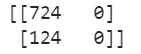

Passing weights manually removes all Type I errors

你可以尝试不同的组合。通过反复试验(或在 GridSearch 的帮助下)，您可以找到一个符合您目的的方法，例如:

```
weights = {0 : '0.09042', 1 : '0.90958'}
```

如果您决定使用 GridSearch 来寻找合适的权重，这是它的实现方式:

```
from sklearn.model_selection import GridSearchCV
weights = np.linspace(0.03, 0.97, 55)scaler = StandardScaler()
features_std = scaler.fit_transform(features)gsc = GridSearchCV(
    estimator=LogisticRegression(solver='liblinear'),
    param_grid={
        'class_weight': [{0: x, 1: 1.0-x} for x in weights]
    },
    scoring='roc_auc',
    cv=3
)
grid_result = gsc.fit(features_std, result)
```

在上面的代码中，我们测试了变量 TenYearCHD 从 3-97%崩溃到 97-3%崩溃的 0 和 1 的不同组合。 *GridSearchCV* 可以评估不同的评估者，它们是在现场选择和控制的*评分。*通常，您会使用类似于分类的精确度和回归的 R 平方，但在我们的情况下，精确度不会提供太多信息，所以我决定使用 AUC 曲线下的面积。此处描述了所有可用的评分参数[。](https://scikit-learn.org/stable/modules/model_evaluation.html#scoring-parameter)

然后我们可以打印出最佳参数，并将其传回模型:

```
print("Best parameters : %s" % grid_result.best_params_)# passing weights found above
rf_w = RandomForestClassifier(class_weight = {0:0.882962962962963, 1:0.11703703703703705})
rf_w.fit(X_train, y_train)print(classification_report(y_test, predictions_rf_w))
print(confusion_matrix(y_test, predictions_rf_w))
accuracy_score(y_test, predictions_rf_w)
```

或者到逻辑回归:

```
weights = {0 : '0.882962962962963', 1 : '0.11703703703703705'}
logmodel_auto_gridsearch = LogisticRegression(class_weight = weights, solver = 'liblinear')
logmodel_auto_gridsearch.fit(X_train_std, y_train)
predictions_std_auto_gridsearch = logmodel_auto_gridsearch.predict(X_test_std)print(classification_report(y_test, predictions_std_auto_gridsearch))
print(confusion_matrix(y_test, predictions_std_auto_gridsearch))
accuracy_score(y_test, predictions_std_auto_gridsearch)
# Under ROC curve
prob_y_3_gridsearch = logmodel_auto_gridsearch.predict_proba(X_test_std)
prob_y_3_gridsearch= [p[1] for p in prob_y_3_gridsearch]
print(roc_auc_score(y_test, prob_y_3_gridsearch))
```

## 专门解决不平衡的数据

最流行的方法之一是上(下)采样。你可能还记得，我们的数据集的问题是，在训练阶段，算法看到的负面(零)情况远远多于正面，这使得模型不太准确。下一个合乎逻辑的事情是在相同数量的正面(1)和负面(0)情况下训练模型。

```
from sklearn.utils import resampledf_minority = df[df.TenYearCHD==1]
df_majority = df[df.TenYearCHD==0]df['TenYearCHD'].value_counts()
```

在上面的代码中，我们将现有的数据集分成两部分:患心脏病的观察数据和其他数据。

```
# sample with replacement to match majority class and get #reproducible results
df_minority_upsampled = resample(df_minority, 
                                 replace=True,     
                                 n_samples=3596,    
                                 random_state=123)

# Display new class counts
df_upsampled.TenYearCHD.value_counts()
```

如您现在所见， *df_upsampled* 具有相同数量的零和一观察值。

现在，我们将对其进行标准化，并再次将其放入模型中:

```
# Train/test, normalize the new data set
features_upsampled = df_upsampled.iloc[:,:-1]
result_upsampled = df_upsampled.iloc[:,-1]X_train_upsampled, X_test_upsampled, y_train_upsampled, y_test_upsampled = train_test_split(features_upsampled, result_upsampled, test_size = 0.2, random_state = 14)X_train_std_upsampled = scaler.fit_transform(X_train_upsampled)
X_test_std_upsampled = scaler.fit_transform(X_test_upsampled)# new log model for upsampled data
logmodel_upsampled = LogisticRegression(solver='liblinear')
logmodel_upsampled.fit(X_train_std_upsampled, y_train_upsampled)
predictions_y_2_upsampled = logmodel_upsampled.predict(X_test_std_upsampled) print(classification_report(y_test_upsampled, predictions_y_2_upsampled))
print(confusion_matrix(y_test_upsampled, predictions_y_2_upsampled))
accuracy_score(y_test_upsampled, predictions_y_2_upsampled)
# Under ROC curve
prob_y_2_upsampled = logmodel_upsampled.predict_proba(X_test_std_upsampled)
prob_y_2_upsampled = [p[1] for p in prob_y_2_upsampled]
print(roc_auc_score(y_test_upsampled, prob_y_2_upsampled))
```

就我们而言，结果已经恶化。为什么这样我们将在下次探讨它。不过，通常会有帮助。

我们已经提到，在这种情况下，错误 II 比错误 I 更严重。另一种解决方法是移动阈值(现在设置为 0.5)。

```
logmodel_lowering = LogisticRegression(solver='liblinear')
logmodel_lowering.fit(X_train_std, y_train)from sklearn.preprocessing import binarize
for i in range(1,7):
    cm2=0
    predictions_y_2_lowering = logmodel_lowering.predict_proba(X_test_std)
    y_pred2_lowering=binarize(predictions_y_2_lowering,i/10)[:,1]
    cm2=confusion_matrix(y_test,y_pred2_lowering)
    print ('With',i/10,'threshold the Confusion Matrix is ','\n',cm2,'\n',
            'with',cm2[0,0]+cm2[1,1],'correct predictions and',cm2[1,0],'Type II errors( False Negatives)','\n\n',
          'Sensitivity: ',cm2[1,1]/(float(cm2[1,1]+cm2[1,0])),'Specificity: ',cm2[0,0]/(float(cm2[0,0]+cm2[0,1])),'\n\n\n')
```

我们在这里写了一个循环，从 10%的阈值到 70%的阈值，然后显示结果。为了这个练习，我在这里拟合基本的逻辑回归模型。

迄今为止，我们只取得了有限的进展。可能是时候转向 XGBoost 了——一个最 Kaggle 比赛的首选武器。

```
import xgboost as xgb
from sklearn.metrics import mean_squared_errorxg_reg = xgb.XGBRegressor(objective ='binary:logistic', colsample_bytree = 0.3, learning_rate = 0.05,
max_depth = 9, alpha = 10, n_estimators = 20)eval_set = [(X_test_std, y_test)]
xg_reg.fit(X_train_std, y_train, eval_metric="error", eval_set = eval_set, verbose = True)rmse = np.sqrt(mean_squared_error(y_test, prediction_y_5))
print("RMSE: %f" % (rmse))
```

与其他方法不同，XGBoost 可以在 fit 阶段报告和评估测试集的性能。我已经创建了 *eval_set，*将其传递给 fit 方法，并设置 *verbose = True* 以实时查看详细程度。

开箱即用，它返回的均方根误差(RMSE)为 0.3678。让我们努力降低它。为此，我们需要调整算法中传递的众多参数中的一些。你真的需要在[官方文档](https://xgboost.readthedocs.io/en/latest/parameter.html#)中阅读它们，因为这是实现你的模型的卓越性能的关键。今天，我将重点介绍三个可用参数。同样， *GridSearchCV* 会为我们做这件事。

我们将测试这些参数的各种输入:

*   *n_estimators* (定义要训练的森林的大小)
*   *max_depth* (基础学习者的最大树深度)
*   *learning_rate* (嗯，是学习率)

```
n_estimators = [10, 20, 30, 40, 50, 60]
max_depth = [2, 4, 5, 6, 7, 8]
learning_rate = [0.0001, 0.001, 0.01, 0.1, 0.2, 0.3]
param_grid = dict(max_depth = max_depth, n_estimators = n_estimators, learning_rate=learning_rate)
kfold = StratifiedKFold(n_splits = 10, shuffle = True, random_state = 10)
grid_search_xg = GridSearchCV(xg_reg, param_grid, scoring = 'roc_auc', n_jobs = -1, cv=kfold, verbose = 1)
result_gcv_xgb = grid_search_xg.fit(X_train_std, y_train)
```

我们在这里使用 *StratifiedKFold* 和 *GridSearchCV* 迭代参数进行交叉验证。您想要测试的参数越多，您的计算机运行的排列就越多，花费的时间就越多。如果你是在笔记本电脑上做，要小心。

该过程完成后，让我们看看最佳参数是什么:

```
print("Best: %f using %s" % (result_gcv_xgb.best_score_, result_gcv_xgb.best_params_))
means = result_gcv_xgb.cv_results_['mean_test_score']
stds = result_gcv_xgb.cv_results_['std_test_score']
params = result_gcv_xgb.cv_results_['params']
```

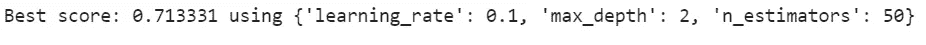

GridSearchCV found the optimal parameters

然后，您可以使用上面得到的内容重新运行模型:

```
# rebuild using best params
xg_reg = xgb.XGBRegressor(objective ='binary:logistic', colsample_bytree = 0.3, learning_rate = 0.1,
max_depth = 2, alpha = 10, n_estimators = 50)
eval_set = [(X_test_std, y_test)]
xg_reg.fit(X_train_std, y_train, eval_metric="error", eval_set = eval_set, verbose = False)
prediction_y_5 = xg_reg.predict(X_test_std)
rmse = np.sqrt(mean_squared_error(y_test, prediction_y_5))
print("RMSE: %f" % (rmse))
```

我们可以看到一个进步:RMSE 下降到 0.3384。

XGBoost 返回概率，而不是实际预测。不过，我们需要实际的预测来建立一个混淆矩阵。

```
prediction_y_5_01 = prediction_y_5
prediction_y_5_01[prediction_y_5 > 0.5] = 1
prediction_y_5_01[prediction_y_5 <= 0.5] = 0print(classification_report(y_test, prediction_y_5_01))
print(confusion_matrix(y_test, prediction_y_5_01))
accuracy_score(y_test, prediction_y_5_01)
```

我们已经尝试使用一些传统的和更具体的方法来建立一个准确的预测模型。根据数据的性质，它可能已经足以提高模型的性能。在文章的第二部分，我们将继续我们的旅程，构建一条学习曲线，几个模型的集合，最后使用 Keras 重新运行分析。