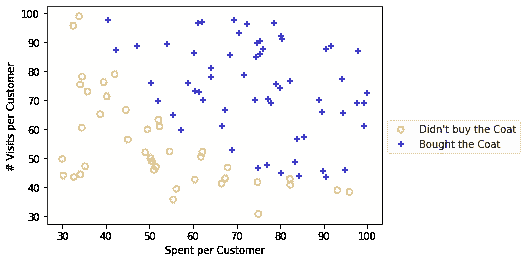
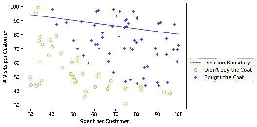
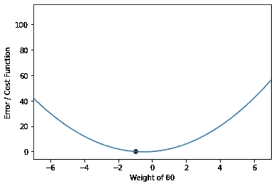
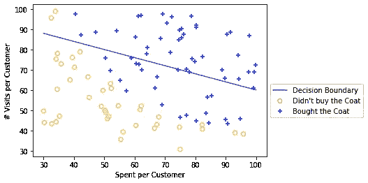
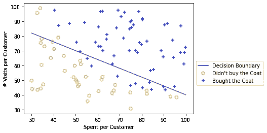
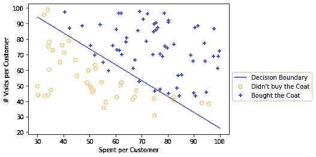
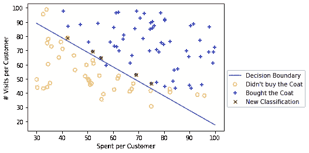
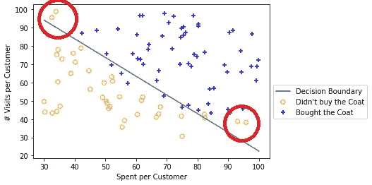
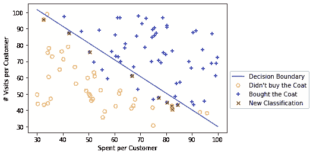
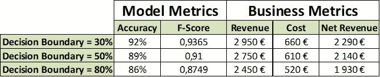

# 分类问题和探索决策边界

> 原文：<https://towardsdatascience.com/classification-problems-and-exploring-decision-boundaries-3317e03afcdb?source=collection_archive---------23----------------------->

Photo by [@soymeraki](https://unsplash.com/@soymeraki) (Unsplash)

**分类问题是组织可以利用数据科学的力量创造潜在竞争优势的主要业务问题之一**。**许多算法输出一个概率(0 到 1)，而不是一个硬的类别分类，因此必须根据业务问题开发一种“决策边界”,在沿着概率分布的某个地方设置决策边界之前，您需要考虑一些权衡。**

例如，对于欺诈检测，这可能是一个双重问题。您可能希望考虑更严格的决策界限，因为欺诈是一种相对罕见的情况，您不希望出现许多会直接影响业务的误报。也许您会将它们转发给欺诈分析师，并且您要标记的每笔交易都会让您的一名员工在 2 小时内忙碌起来—时间就是金钱—但另一方面，您也不想将决策界限设置得太严格，以免无法标记潜在的欺诈交易。

**你能想出一个商业问题，其中你可能有一个更软的决策边界，并且你不介意用你的模型“捕捉”一些误报吗？**

举个例子:对于在线营销活动，你可能想放松控制，因为误报的代价可能会被你从你没有以 50/50 决策边界为目标的客户那里带来的额外收入抵消(假设你的问题是平衡的)。

在这篇文章中，我的目标是:

*   将一个分类问题的训练可视化；
*   绘制决策边界；
*   可视化移动决策边界的效果；

关于我们将用于分类的模型，我们将查看逻辑回归，但是您可以直观地想到输出连续概率的其他分类算法的相同原理。在“数据成熟”的公司中，你不会期望在生产中应用许多逻辑回归，但你肯定会看到它们被用作衡量标准和基线模型，因为它们有几个优点:

*   易于掌握变量对决策过程的影响(对于可解释性是关键的保守行业是强制性的)；
*   比较快上手。
*   你可以很容易地评估你的分类问题的“线性度”。

**使用来自 Andrew 的机器学习课程的数据(**[**https://www . coursera . org/learn/Machine-Learning/home/welcome**](https://www.coursera.org/learn/machine-learning/home/welcome)**)**我将阐述另一个业务问题(不同于课程练习)，以便我们可以使用一个关于决策边界的实际示例。

假设你是一家以服装为中心的在线企业，你想向每位顾客发送一份促销活动，向他们提供独家优惠，将一件昂贵的外套降价 40%。

你联系的每个顾客将花费你 10€，大衣包括折扣在内要花费 50€。你想为你的全部客户群最大化这个优惠的利润，所以你对 100 个客户做一个实验，给他们发送折扣。

然后，你画出他们去年光顾你的商店的次数和累计花费(为了简单起见，假设这两个变量可以解释购买者的倾向)，并有以下数据，用“+”标记购买你提供的外套的人:

Visualizing the outcome for the Coat Offer

**在我们的样本中，60 名顾客购买了外套，40 名没有。计算我们的收入减去我们实验的营销成本:**

**(60 * 50€)-(100*10€) = 2000 €**

但如果我们只选择了购买外套的 60 名顾客，我们的收入可能会增加 2.400 €(多 20%)，因为我们避免了那些对我们的报价不感兴趣的顾客，从而节省了 400 欧元。

如果你想将这一优惠推广到所有顾客，你可能想为每位顾客节省 10 欧元。随着你的客户群越来越大，这个约束变得更加重要。

**现在，分类算法帮助我们划分这些点。如果我让你在这个图中画一条线来做选择，你可能已经有了可以区分这两类的东西。**

我们的分类算法将处理这两个类的分离，但让我们用参数 **θ ( θ0，θ1 和θ2)绘制一个**随机类。这些参数是通过我们的逻辑回归学习的参数(有时它们也被称为β0、β1 和β2，但它们表示完全相同的东西:每个变量的权重)——**如果需要，请查看 Andrew 的学习材料，了解关于这些参数含义的更多解释。**

好的，那么用下面的参数拟合一条随机线( **θ0 = -5，θ1 = 0.01，θ2 = 0.05)，称之为实验#1:**

Experiment #1 with an improper decision boundary

这真的不适合我们的数据。这个决策边界是什么——我们正在绘制的这条线？**这是我们将在 50%阈值内划分等级的界限**。

根据上面的拟合线，我们将考虑 19 位有超过 50%的可能性购买外套的顾客——线上的顾客——**——但如果我们只选择这些人，我们最终会避开许多对外套感兴趣的顾客。**

我们可以进一步改进我们的算法。只要看一下图表，你就会发现这并没有提供我们的类的最佳分离。从数学上来说，如果我们最小化代表这种分离的成本函数(在这种情况下，是二进制交叉熵)，这条线甚至不在最小值附近。

回想一下，梯度下降的目标是找到与下面类似的函数的最小值(仅使用一个 **θ):**

Cost function example with a single independent variable (θ0)

**我们的成本函数** **(把它想成是我们的误差或者我们对购买和不购买分类的错误程度)**应该慢慢下降到全局最小值(红点)——基本上是我们将要进行分类分离的误差(成本函数)的最小值。

**那么，当我们越来越接近最小值时，我们的决策界限会发生什么变化呢？**

看看下面的实验(突出显示改变了什么):

*   (θ0 =-5， **θ1 = 0.02，** **θ2 = 0.05** ):实验二
*   (θ0 =-5， **θ1 = 0.03，** **θ2 = 0.05** ):实验三

Experiment #2 — Decision Boundary

Experiment #3— Decision Boundary

仅仅通过稍微调整 **θ1，我们就越来越接近我们想要的(一个最好划分类别的线性表示)。**

通过优化我们的成本函数，我们找到了θ**s**的最终最优组合:

*   ( **θ0 = -25.16，θ1 = 0.2062，θ2 = 0.2015)-最佳权重**

这导致以下决策界限:

Optimal decision boundary (Minimizes the error)

**我们找到了最佳的 50/50 线性边界！** **但是..就业务问题而言，这是最佳决策边界吗？回想一下我们关于外套报价的问题，我们每个联系人的成本是 10€，每卖出一件外套的收入是 50€。**

你会用什么作为接触该客户的门槛？

你们中的许多人可能会回答，“任何高于 50%的数字”T31，直觉上这基本上是正确的 T32。如果我们考虑这个默认的概率阈值，我们会认为每一个获得大衣的概率超过 50%的顾客都会被选为我们的目标联系人。这样做会产生以下指标:

**模型指标:**

*   准确率 89%；
*   f1-0.91 分

**业务指标:**

*   联系 61 个客户，花费 610 €
*   其中 55 名顾客购买了 50€的外套，这意味着 2750 €的收入；
*   净收入 2140€；

当我们开始考虑另一个阈值(例如 30%)上的决策界限时，会发生什么？**也就是说，有超过 30%的购买概率的顾客会被考虑联系？**

**决策边界移动！**

New Boundary using a 30% threshold

红叉是 50%阈值中没有考虑的例子，现在在 30%阈值中考虑了。**我们的指标会发生什么变化？**

**模型度量:**

*   准确率 92%；
*   f1-得分为 0.9365

**业务指标:**

*   联系 66 个客户，花费 660 €
*   其中 59 名顾客购买了 50€的外套，这意味着 2950€的收入；
*   净收入 2290€；

等一下…我们有更高的准确性和更高的 F1 分数！为什么？因为当我们开发该算法时，我们没有针对准确性和 F1 分数进行优化，我们针对 log-loss 函数进行了**优化，该函数以相同的方式惩罚假阳性和假阴性情况。**

**你知道在日志丢失过程中什么会受到惩罚，从而提高我们的决策界限吗？这四个客户就在这里:**

Examples causing a higher decision boundary

如果我们移除这些示例并重新训练我们的算法，则检查决策边界:

New Decision Boundary without extreme examples

通过移除这四个异常情况，我们已经降低了决策边界**(这意味着没有这四个客户，我们不会惩罚他们的损失函数)。**

**需要记住的一件重要事情是:也许这些例子属于我们的训练样本，我们不应该删除它们。**想象这是你真正客户的行为，也许他们不应该被视为离群值。

该决定将仅取决于业务问题以及您在将该信息整合到模型上时所付出的努力——此外，您还可以通过尝试不同的算法或多项式特性来改进模型本身。

**回到我们所有客户的初始数据集，如果我们有一个更严格的决策边界，并且只联系概率超过 80%的客户，会发生什么？**

New Boundary using a 80% threshold

**模型指标:**

*   准确率 86%；
*   f1-得分为 0.8749

**业务指标:**

*   联系 52 个客户，费用为 520 €
*   这些顾客中有 49 人购买了 50€的外套，这意味着 2450€的收入；
*   净收入:1930€；

**三个门槛比较表:**

特别是对于这个问题，我们可以放宽我们的决策界限，将 30%的概率度量设置为阈值，这样**我们就可以最大化净收入——假设完整的客户群反映了这些客户的行为**。在这种情况下，即使模型度量被最大化，但这并不是所有问题的情况。

有趣的是，在评估模型时，一些指标可能会以决策边界无意义的方式使用(如 ROC-AUC ),因为这些指标评估的是连续变量，而不是二元目标。

结论:

*   决策边界可以被解释为业务度量；
*   在部署和讨论模型时，您应该检查结果的目的是什么，而不是按照标准假设 50%的决策边界；
*   当我们决定一个特定概率的阈值时，我们就离开了统计领域，进入了决策领域。大多数分类算法只输出概率，你对这些概率所做的更多的是与一个商业问题有关。

感谢您花时间阅读这篇文章！如果你有兴趣获得分析方面的培训，你可以访问我在 Udemy([*【https://www.udemy.com/user/ivo-bernardo/】*](https://www.udemy.com/user/ivo-bernardo/)*)上的页面，并在平台中查看我的课程或在 LinkedIn 上联系！(***)**