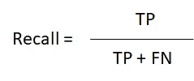

# 机器学习分类项目:寻找捐赠者

> 原文：<https://towardsdatascience.com/classification-project-finding-donors-853db66fbb8c?source=collection_archive---------3----------------------->


Picture from [Unsplash](https://unsplash.com/photos/npxXWgQ33ZQ)

# 介绍

在这个项目中，我们将使用许多不同的监督算法，使用从 1994 年美国人口普查中收集的数据来精确预测个人收入。

然后，我们将从初步结果中选择最佳候选算法，并进一步优化该算法以最佳地模拟数据。我们实现的目标是构建一个模型，准确预测个人收入是否超过 50，000 美元。

这种任务可能出现在非营利机构中，这些机构依靠捐赠生存。了解个人的收入可以帮助非营利组织更好地了解需要多少捐款，或者他们是否应该从一开始就伸出援手。根据我们之前的研究，我们发现最有可能向慈善机构捐款的人是那些年收入超过 5 万美元的人。

这个项目的数据集来源于 [UCI 机器学习库](https://archive.ics.uci.edu/ml/datasets/Census+Income)。该数据集由 Ron Kohavi 和 Barry Becker 捐赠，发表在文章*“提高朴素贝叶斯分类器的准确性:决策树混合”*中。你可以在网上找到罗恩·科哈维的文章。我们在这里研究的数据由对原始数据集的微小更改组成，比如删除`'fnlwgt'`特性和带有缺失或格式错误条目的记录。

# 数据

修改后的人口普查数据集由大约 32，000 个数据点组成，每个数据点有 13 个特征。该数据集是 Ron Kohavi 在论文*“提高朴素贝叶斯分类器的准确性:决策树混合”中发表的数据集的修改版本。你可以在网上找到这篇论文[，原始数据集存放在](https://www.aaai.org/Papers/KDD/1996/KDD96-033.pdf) [UCI](https://archive.ics.uci.edu/ml/datasets/Census+Income) 上。*

**特性**

*   `age`:年龄
*   `workclass`:工人阶级(私营、自营企业、自营企业、联邦政府、地方政府、州政府、无薪、从未工作)
*   `education_level`:教育水平(学士、部分大学、11 年级、HS-grad、Prof-school、Assoc-acdm、Assoc-voc、9 年级、7-8 年级、12 年级、硕士、1-4 年级、10 年级、博士、5-6 年级、学前班)
*   `education-num`:完成的教育年数
*   婚姻状况(已婚-同居-配偶、离婚、未婚、分居、丧偶、已婚-配偶缺席、已婚-配偶)
*   `occupation`:工作职业(技术支持、工艺维修、其他服务、销售、行政管理、专业教授、搬运工人、清洁工、机器操作员、行政文员、农业-渔业、运输-搬运、私人服务、保护服务、武装部队)
*   `relationship`:关系状态(妻子、亲生子女、丈夫、非家庭成员、其他亲属、未婚)
*   `race`:种族(白人、亚洲太平洋岛民、美洲印第安爱斯基摩人、其他人、黑人)
*   `sex`:性别(女，男)
*   `capital-gain`:货币资本收益
*   `capital-loss`:货币资金损失
*   `hours-per-week`:每周平均工作时间
*   `native-country`:本土国家(美国、柬埔寨、英国、波多黎各、加拿大、德国、美国外围地区(关岛-USVI 等)、印度、日本、希腊、中国、古巴、伊朗、洪都拉斯、菲律宾、意大利、波兰、牙买加、越南、墨西哥、葡萄牙、爱尔兰、法国、多米尼加共和国、老挝、厄瓜多尔、台湾、海地、哥伦比亚、匈牙利、危地马拉、尼加拉瓜、苏格兰、泰国、南斯拉夫、萨尔瓦多、特立尼达和多巴哥&多巴哥、秘鲁、香港、荷兰)

**目标变量**

*   `income`:收入阶层(< =50K，> 50K)

# 导入库并加载数据

我们将首先加载将要使用的 Python 库，以及人口普查数据。最后一列将是我们的目标变量，“收入”，其余的将是功能。

```
***# Import libraries necessary for this project***
import numpy as np
import pandas as pd
from time import time
from IPython.display import display 
***# Import supplementary visualization code visuals.py***
import visuals as vs

***# Pretty display for notebooks***
%matplotlib inline

***# Load the Census dataset***
data = pd.read_csv("census.csv")

***# Success - Display the first record***
display(data.head(n=1))
```


# 探索性数据分析

对数据集的初步研究将向我们展示每个群体中有多少人，以及他们中收入超过 50，000 美元的比例。

```
***# Total number of records***
n_records = data.shape[0]

***# Number of records where individual's income is more than $50,000***
n_greater_50k = data[data['income'] == '>50K'].shape[0]

***# Number of records where individual's income is at most $50,000***
n_at_most_50k = data[data['income'] == '<=50K'].shape[0]

***# Percentage of individuals whose income is more than $50,000***
greater_percent = (n_greater_50k / n_records) * 100

***# Print the results***
print("Total number of records: {}".format(n_records))
print("Individuals making more than $50,000: {}".format(n_greater_50k))
print("Individuals making at most $50,000: {}".format(n_at_most_50k))
print("Percentage of individuals making more than $50,000: {}%".format(greater_percent))
```


# 准备数据

数据必须经过预处理才能用于机器学习算法。这个预处理阶段包括数据的清理、格式化和重构。

对于此数据集，既没有空条目也没有无效条目，但是有一些必须调整的要素。这项任务将极大地改善我们模型的结果和预测能力。

**转换偏斜连续特征**


Figure by Author

如果未对范围进行归一化，则要素值的偏态分布可能会使算法表现不佳。

在我们的数据集中，此分布有两个特征:

*   资本收益
*   资本损失

```
***# Split the data into features and target label***
income_raw = data['income']
features_raw = data.drop('income', axis = 1)

***# Visualize skewed continuous features of original data***
vs.distribution(data)
```


对于这种类型的分布，对数据应用对数变换是非常典型的，因此异常值不会对机器学习模型的性能产生负面影响。

但是，我们应该小心对待 0 值，因为 log(0)是未定义的，所以我们将这些值转换为大于 0 的一个小数值，以成功应用对数。

```
***# Log-transform the skewed features***
skewed = ['capital-gain', 'capital-loss']
features_log_transformed = pd.DataFrame(data = features_raw)
features_log_transformed[skewed] = features_raw[skewed].apply(lambda x: np.log(x + 1))

***# Visualize the new log distributions***
vs.distribution(features_log_transformed, transformed = True)
```


**归一化数字特征**

建议对数字特征执行某种类型的缩放。这种缩放不会改变要素分布的形状，但可以确保在应用监督模型时平等对待每个要素。

```
***# Import sklearn.preprocessing.StandardScaler***
from sklearn.preprocessing import MinMaxScaler

***# Initialize a scaler, then apply it to the features***
scaler = MinMaxScaler() *# default=(0, 1)*
numerical = ['age', 'education-num', 'capital-gain', 'capital-loss', 'hours-per-week']

features_log_minmax_transform = pd.DataFrame(data = features_log_transformed)
features_log_minmax_transform[numerical] = scaler.fit_transform(features_log_transformed[numerical])

***# Show an example of a record with scaling applied***
display(features_log_minmax_transform.head(n = 5))
```


**预处理类别特征**

如果我们看一下前面的表格，我们可以看到有一些特征，如“职业”或“种族”，它们不是数字，而是类别。机器学习算法期望与数值一起工作，因此这些分类特征应该被转换。

最流行的分类转换之一叫做“一键编码”。在一次性编码中，为分类特征的每个可能类别创建一个“虚拟”变量。

为了更好地理解，请看下表:


此外，我们应该转换我们的目标变量“收入”。它只能取可能的值，“<=50K” and “> 50K”，所以我们将避免一次性编码，并将类别分别编码为 0 和 1。

```
features_log_minmax_transform.head(1)
```


```
***# One-hot encode the 'features_log_minmax_transform' data*** 
features_final = pd.get_dummies(features_log_minmax_transform)

***# Encode the 'income_raw' data to numerical values***
income = income_raw.map({'<=50K':0,'>50K':1})

***# Print the number of features after one-hot encoding***
encoded = list(features_final.columns)
print("**{}** total features after one-hot encoding.".format(len(encoded)))

***# See the encoded feature names***
print (encoded)
```


**混洗和分割数据**

当所有的分类变量被转换，所有的数字特征被标准化后，我们需要将数据分成训练集和测试集。我们将 80%的数据用于训练，20%用于测试，

```
***# Import train_test_split*** from sklearn.model_selection import train_test_split ***# Split the 'features' and 'income' data into training and testing sets*** 
X_train, X_test, y_train, y_test = train_test_split(features_final,                                                      income,                                                      test_size = 0.2,                                                      random_state = 0) ***# Show the results of the split*** 
print("Training set has **{}** samples.".format(X_train.shape[0])) print("Testing set has **{}** samples.".format(X_test.shape[0]))
```


# 模型性能评估

在这一部分中，我们将研究四种不同的算法，并确定最擅长建模和预测数据的算法。这些算法中的一个将是天真的预测器，它将作为性能的基线，另外三个将是受监督的学习器。

**指标和朴素预测器**

该项目的目标是正确识别每年收入超过 5 万美元的个人，因为他们是最有可能向慈善机构捐款的群体。因此，我们应该明智地选择我们的评估指标。

***注:评估指标提醒***

当对事件进行预测时，我们可以得到 4 种结果:真阳性、真阴性、假阳性和假阴性。所有这些都表示在下面的分类矩阵中:


Figure by Author

***准确度*** *衡量分类器做出正确预测的频率。它是正确预测的数量与预测总数(测试数据点的数量)的比率。*


Figure by Author

***精密*** *告诉我们被我们归类为某一类的事件的比例，实际上都是那个类。它是真阳性与所有阳性的比率。*


Figure by Author

***【回忆(敏感度)*** *告诉我们实际上属于某一类的事件有多大比例被我们归类为该类。它是真阳性与所有阳性的比率。*



Figure by Author

对于像我们这样分类分布有偏差的分类问题，准确性本身并不是一个合适的度量。反而精度和召回率更有代表性。

*这两个指标可以组合得到* ***F1 得分*** *，这是精度和召回得分的加权平均值(调和平均值)。这个分数的范围从 0 到 1，1 是可能的最佳 F1 分数(我们在处理比率时采用调和平均值)。*


Figure by Author

*此外，由于我们正在搜索愿意捐赠的个人，模型精确预测那些收入超过 5 万美元的个人的能力比模型回忆这些个人的能力更重要。我们可以使用 F-beta 分数作为同时考虑精确度和召回率的度量。*

*具体来说，对于β = 0.5，更重视精度。*

如果我们看一下“收入”变量的等级分布，很明显，年收入最多 5 万美元的人比年收入更多的人多得多。因此，我们可以做一个天真的预测，随机抽取一个人，预测他/她每年的收入不会超过 5 万美元。它被称为天真，因为我们没有考虑任何相关信息来证实这一说法。

这个天真的预测将作为一个基准来确定我们的模型是否表现良好。重要的是要注意，单独使用这种类型的预测是没有意义的，因为所有个体都将被归类为非供体。

**天真预测者的表现**

我们将运行以下代码来确定我们的朴素预测器性能:

```
***# Counting the ones as this is the naive case. Note that 'income' is the 'income_raw' data encoded to numerical values done in the data preprocessing step.***
TP = np.sum(income) ***# Specific to the naive case*** FP = income.count() - TP***# No predicted negatives in the naive case***
TN = 0 
FN = 0 

***# Calculate accuracy, precision and recall***
accuracy = TP / (TP + FP + TN + FN)
recall = TP / (TP + FN)
precision = TP / (TP + FP)

***# Calculate F-score using the formula above for beta = 0.5 and correct values for precision and recall.***
beta = 0.5
fscore = (1 + beta**2) * ((precision * recall) / ((beta**2) * precision + recall))

***# Print the results*** 
print("Naive Predictor: [Accuracy score: {:.4f}, F-score: {:.4f}]".format(accuracy, fscore))
```


# **监督学习模型**

考虑到我们数据的形状:

*   45222 个数据点
*   103 个特征

数据点的数量不是很大，但是有大量的特征，并且不是所有的监督算法都适合适当地处理数量。

scikit-learn 中的一些可用分类算法:

*   高斯朴素贝叶斯
*   决策树
*   集成方法(Bagging、AdaBoost、随机森林、梯度增强)
*   k-最近邻(近邻)
*   随机梯度下降分类器(SGDC)
*   支持向量机(SVM)
*   逻辑回归

考虑到他们的特点和我们的数据集，我们将选择以下三个:

**a)高斯朴素贝叶斯**

*   该模型的**优势**是:它是一个简单快速的分类器，只需对模型的超参数进行很小的调整就能提供良好的结果。此外，它不需要大量的数据来进行适当的训练。
*   该模型的**弱点**是:它具有很强的特征独立性假设。如果我们没有同时出现类别标签和某个属性值(例如，class =“nice”，shape =“sphere”)，那么基于频率的概率估计将为零，因此给定条件独立性假设，当所有概率相乘时，我们将得到零，这将影响后验概率估计。
*   该模型可以应用的一个可能的真实世界应用是文本学习。
*   它是一个很好的候选对象，因为它是一个高效的模型，可以处理许多特征(数据集包含 98 个特征)。

**b)随机森林**

*   该模型的**优势**是:它可以很好地处理二元特征，因为它是决策树的集合。它不期望线性特征。它适用于高维空间和大量的训练样本。
*   主要的**弱点**是在处理噪声数据时可能会过拟合。
*   该模型的一个可能的实际应用是预测股票市场价格。
*   它是一个很好的候选者，因为它通常是一个非常准确的分类器，并且能够很好地处理二元要素和高维数据集。

**c)支持向量机分类器**

*   该模型的**优势**是:它在没有线性可分数据和高维空间的情况下工作良好。
*   主要的**缺点**是训练效率可能相当低，因此不适合“工业规模”应用。
*   该模型可以应用的一个可能的真实世界应用是对患有和不患有常见疾病的人进行分类。
*   它是一个很好的候选者，因为它通常是一个非常准确的分类器，并且能够很好地处理二元要素和高维数据集。

**创建训练和预测管道**

为了正确评估每个模型的性能，我们将创建一个训练和预测管道，使我们能够使用各种大小的训练数据快速有效地训练模型，并对测试数据执行预测。

```
***# Import two metrics from sklearn - fbeta_score and accuracy_score*** def train_predict(learner, sample_size, X_train, y_train, X_test, y_test): 
    *'''*
 *inputs:*
 *- learner: the learning algorithm to be trained and predicted on*
 *- sample_size: the size of samples (number) to be drawn from training set*
 *- X_train: features training set*
 *- y_train: income training set*
 *- X_test: features testing set*
 *- y_test: income testing set*
 *'''*

    results = {}

 ***# Fit the learner to the training data*** 
    start = time() *# Get start time*
    learner = learner.fit(X_train[:sample_size], y_train[:sample_size])
    end = time() *# Get end time*

    ***# Calculate the training time***
    results['train_time'] = end - start 

   ** *# Get the predictions on the test set***
    start = time() ***# Get start time***
    predictions_test = learner.predict(X_test)
    predictions_train = learner.predict(X_train[:300])
    end = time() ***# Get end time***

    ***# Calculate the total prediction time***
    results['pred_time'] = end -start

 ***# Compute accuracy on the first 300 training samples*** 
    results['acc_train'] = accuracy_score(y_train[:300], predictions_train)

    ***# Compute accuracy on test set using accuracy_score()***
    results['acc_test'] = accuracy_score(y_test, predictions_test)

    ***# Compute F-score on the the first 300 training samples***
    results['f_train'] = fbeta_score(y_train[:300], predictions_train, beta=0.5)

    ***# Compute F-score on the test set which is y_test***
    results['f_test'] = fbeta_score(y_test, predictions_test, beta=0.5)

    ***# Success***
    print("{} trained on {} samples.".format(learner.__class__.__name__, sample_size))

    ***# Return the results***
    return results
```

# **初始模型评估**

```
***# Import the three supervised learning models from sklearn***
from sklearn.ensemble import RandomForestClassifier
from sklearn.naive_bayes import GaussianNB
from sklearn.svm import SVC

***# Initialize the three models***
random_state = 42

clf_A = RandomForestClassifier(random_state=random_state)
clf_B = GaussianNB()
clf_C = SVC(random_state=random_state)

***# Calculate the number of samples for 1%, 10%, and 100% of the training data***
samples_100 = len(y_train)
samples_10 = int(len(y_train)/10)
samples_1 = int(len(y_train)/100)
 ***# Collect results on the learners***
results = {}
for clf in [clf_A, clf_B, clf_C]:
    clf_name = clf.__class__.__name__
    results[clf_name] = {}
    for i, samples in enumerate([samples_1, samples_10,   samples_100]):
        results[clf_name][i] = \
        train_predict(clf, samples, X_train, y_train, X_test, y_test)

***# Run metrics visualization for the three supervised learning models chosen***
vs.evaluate(results, accuracy, fscore)
```


# 改善结果

最后，在本节中，我们将选择最佳模型用于我们的数据，然后，通过调整参数来提高模型的 F 值，在整个训练集(X_train 和 y_train)上对模型执行网格搜索优化。

**选择最佳模特**

根据评估结果，识别潜在捐赠者的最合适的模型是随机森林分类器，因为它产生与支持向量分类器相同的 F 分数，但时间要少得多。

这与我们对算法的了解是一致的，因为当处理高维数据集时，这是一个非常好的选择，换句话说，是具有大量特征的数据集。

因此，在评估的模型中，这是最有效的一个，也是最适合处理我们的数据集的。

**通俗地描述随机森林**

为了理解随机森林分类器，我们需要首先介绍决策树的概念。决策树是一种类似流程图的结构，其中每个内部节点代表对数据集属性的测试，每个品牌代表测试的结果，每个叶子代表一个类别标签。因此，算法将对数据进行测试，找出数据集的哪些特征与预测某个结果最相关，并相应地分离数据集。

下面是一个决策树的例子，用来决定你是否把你的车借给别人:


Figure by Author

随机森林是一种元估计器，它在数据集的各种子样本上拟合多个决策树分类器，并使用平均来提高模型的预测准确性，并通过防止模型变得过于复杂和无法对看不见的数据进行归纳来控制过度拟合。它随机选择一些特征，并在每个特征子集中训练每个决策树分类器。然后，它通过让每个决策树为正确的标签投票来做出预测。


Figure by Author

随机森林分类器因其使用简单、高效和良好的预测精度而在分类问题中得到广泛应用。

**模型调谐**

我们现在将使用 GridSearchCV 微调所选的模型。

```
***# Import the necessary libraries***
from sklearn.model_selection import GridSearchCV
from sklearn.metrics import make_scorer

***# Initialize the classifier***
clf = RandomForestClassifier(random_state = 42)

***# Create the parameters list*** 
parameters =  {
    'max_depth': [10,20,30,40],
    'max_features': [2, 3],
    'min_samples_leaf': [3, 4, 5],
    'min_samples_split': [8, 10, 12],
    'n_estimators': [50,100,150]}

***# Make an fbeta_score scoring object using make_scorer()***
scorer = make_scorer(fbeta_score, beta=0.5)

***# Perform grid search on the classifier*** 
grid_obj = GridSearchCV(estimator=clf, param_grid=parameters, scoring=scorer)

***# Fit the grid search object to the training data*** 
grid_fit = grid_obj.fit(X_train, y_train)

***# Get the estimator***
best_clf = grid_fit.best_estimator_

***# Make predictions using the unoptimized and model***
predictions = (clf.fit(X_train, y_train)).predict(X_test)
best_predictions = best_clf.predict(X_test)

***# Report the before-and-afterscores***
print("Unoptimized model\n------")
print("Accuracy score on testing data {:.4f}".format(accuracy_score(y_test, predictions)))
print("F-score on testing data: {:.4f}".format(fbeta_score(y_test, predictions, beta = 0.5)))
print("\nOptimized Model\n------")
print("Final accuracy score on the testing data: {:.4f}".format(accuracy_score(y_test, best_predictions)))
print("Final F-score on the testing data: {:.4f}".format(fbeta_score(y_test, best_predictions, beta = 0.5)))
```


# 最终模型评估

```
***# Show the best classifier hyperparameters***
best_clf
```


**观察结果**

*   优化后的模型对测试数据的准确率和 F 值分别为:84.8%和 71.38%。
*   这些分数比未优化模型的分数稍好，但是计算时间要长得多。
*   精度和 F 值的朴素预测器基准分别为 24.78%和 29.27%，比用训练模型获得的结果差得多。

***附加:特征重要性***

在像他这样的数据集上执行监督学习时，一个重要的任务是确定哪些特征提供了最强的预测能力。通过只关注少数关键特征和目标标签之间的关系，我们简化了对现象的理解，这通常是一件有用的事情。

在这个项目的例子中，这意味着我们希望确定少量的特征，这些特征最强有力地预测一个人的收入是最多 50，000 美元还是超过 50，000 美元。

凭直觉，在原始数据的 13 个可用特征中，我们可以推断出预测收入最重要的特征是:

1)年龄

2)教育

3)母国

4)职业

5)每周小时数

等级的顺序逻辑如下:

*   一个人的收入可能会随着时间的推移而增加，老年人往往比年轻人挣得更多。
*   此外，受过高等教育的人往往会获得收入更高的工作，这也是一个与本国密切相关的因素，因为通常情况下，来自经济实力较强国家的人往往有机会接受高等教育。
*   职业是一个需要考虑的重要因素，因为年收入会因行业和部门的不同而有很大差异。
*   最后，每周工作时间通常情况下，工作时间越长的人收入越高。

现在，我们将通过一个具有 *feature_importance_* 方法的模型来检查我们的逻辑的准确性:

```
***# Import Ada Boost Classifier***
from sklearn.ensemble import AdaBoostClassifier

***# Train the supervised model on the training*** 
model = AdaBoostClassifier().fit(X_train, y_train)

***# Extract the feature importances using .feature_importances****_* 
importances = model.feature_importances_

***# Plot***
vs.feature_plot(importances, X_train, y_train)
```


上一节中的观点部分正确，因为 AdaBoost 测试表明，年龄、每周工作时间和教育程度等特征与预测收入密切相关。然而，我们没有确定资本损失和资本收益。

**功能选择**

现在有理由提出以下问题:

*如果我们只使用数据中所有可用特征的一个子集，一个模型表现如何？*

由于需要训练的特征更少，因此期望训练和预测时间更少——以性能指标为代价。从上面的可视化中，我们看到前五个最重要的特征占数据中所有特征重要性的一半以上。这暗示我们可以尝试*减少特征空间*并简化模型学习所需的信息。

```
***# Import functionality for cloning a model***
from sklearn.base import clone
***# Reduce the feature space***
X_train_reduced = X_train[X_train.columns.values[(np.argsort(importances)[::-1])[:5]]]
X_test_reduced = X_test[X_test.columns.values[(np.argsort(importances)[::-1])[:5]]]

***# Train on the "best" model found from grid search earlier***
clf = (clone(best_clf)).fit(X_train_reduced, y_train)

***# Make new predictions***
reduced_predictions = clf.predict(X_test_reduced)

***# Report scores from the final model using both versions of data***
print("Final Model trained on full data\n------")
print("Accuracy on testing data: {:.4f}".format(accuracy_score(y_test, best_predictions)))
print("F-score on testing data: {:.4f}".format(fbeta_score(y_test, best_predictions, beta = 0.5)))
print("\nFinal Model trained on reduced data\n------")
print("Accuracy on testing data: {:.4f}".format(accuracy_score(y_test, reduced_predictions)))
print("F-score on testing data: {:.4f}".format(fbeta_score(y_test, reduced_predictions, beta = 0.5)))
```


**对特征选择效果的观察**

*   精简数据的精度和 f 值都低于原始数据集。特别是 f 分数 71.38%对 67.57%
*   考虑到在对默认模型、优化模型和精简数据集进行评估时获得的指标，最佳选择是使用带有完整数据集的默认模型版本，因为它在良好的训练时间内产生了准确性和 f 分数的良好组合。

# 结论

在整篇文章中，我们做了一个端到端的机器学习分类项目，我们了解并获得了关于分类模型的一些见解以及开发一个具有良好性能的分类模型的关键。

这是本系列中解释的第三个机器学习项目。如果你喜欢，看看之前的:

*   回归项目
*   朴素贝叶斯项目

敬请期待下一篇文章！这将是关于无监督学习的理论和概念的介绍。

*如果你喜欢这篇文章，那么你可以看看我关于数据科学和机器学习的其他文章* [*这里*](https://medium.com/@rromanss23) *。*

*如果你想了解更多关于机器学习、数据科学和人工智能的知识* ***请在 Medium*** *上关注我，敬请关注我的下一篇帖子！*