# 多标签与多类分类:Sigmoid 与 Softmax

> 原文：<https://towardsdatascience.com/classification-sigmoid-vs-softmax-2a3585ff740f?source=collection_archive---------14----------------------->

当设计一个执行分类任务的模型时(例如，对胸部 x 光检查中的疾病进行分类或对手写数字进行分类)，我们希望告诉我们的模型是允许选择多个答案(例如，肺炎和脓肿)还是只允许选择一个答案(例如，数字“8”)。)这篇文章将讨论我们如何通过对分类器的原始输出值应用 sigmoid 或 softmax 函数来实现这一目标。

**神经网络分类器**

分类有很多算法。在这篇文章中，我们主要关注神经网络分类器。不同种类的神经网络可以用于分类问题，包括[前馈神经网络](https://glassboxmedicine.com/2019/01/17/introduction-to-neural-networks/)和[卷积神经网络](https://glassboxmedicine.com/2019/05/05/how-computers-see-intro-to-convolutional-neural-networks/)。

**应用 Sigmoid 或 Softmax**

在神经网络分类器的最后，您将获得一个“原始输出值”的向量:例如[-0.5，1.2，-0.1，2.4]，如果您的神经网络有四个输出(例如，对应于胸部 x 射线模型中的肺炎、心脏肥大、结节和脓肿)。但是这些原始输出值意味着什么呢？

我们希望将这些原始值转换成一种可以理解的格式:概率。毕竟，告诉病人他们患糖尿病的风险是 91%比“2.4”(这看起来很武断)更有意义。)

我们使用 sigmoid 函数或 softmax 函数将分类器的原始输出值转换成概率。

下面是一个示例，我们使用 sigmoid 函数将前馈神经网络的原始输出值(蓝色)转换为概率(红色):

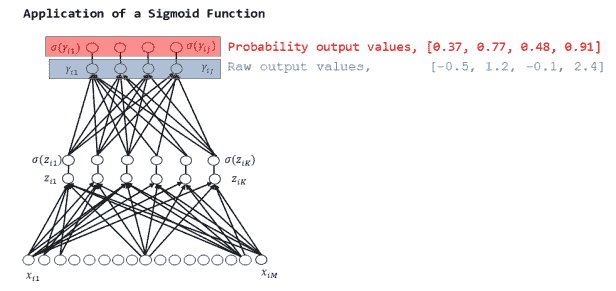

这里有一个例子，我们使用了一个 softmax 函数将这些相同的原始输出值(蓝色)转换成概率(红色):

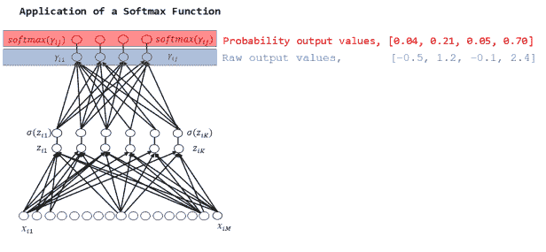

如您所见，sigmoid 和 softmax 函数产生不同的结果。

一个关键点是，由 sigmoid 产生的概率是独立的，并且*而不是*被约束为总和为 1:0.37+0.77+0.48+0.91 = 2.53。这是因为 sigmoid 分别查看每个原始输出值。

相反，softmax 的输出都是相互关联的。softmax 产生的概率总和总是设计为 1:0.04+0.21+0.05+0.70 = 1.00。因此，如果我们使用 softmax，为了增加一个类别的概率，至少一个其他类别的概率必须减少相等的量。

**乙状结肠示例:胸透和住院**

*胸部 x 光片:*一张胸部 x 光片可以同时显示许多不同的医疗状况。如果我们为胸部 x 射线建立一个分类器，我们希望该分类器能够指示存在多种情况。这是一张显示肺炎和脓肿的胸部 x 光图像，以及相应的标签，您会注意到其中有多个“1”:

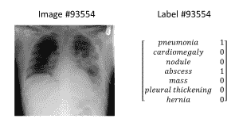

*入院:*给定一个病人的健康记录，我们可能想要预测这个病人将来是否会入院。我们可以把这个问题框架化为一个分类问题:根据病人未来的入院诊断(如果有的话)对他们过去的健康记录进行分类。)患者可能因多种疾病入院，因此可能有不止一个正确答案。

*图表:*下图是两个前馈神经网络，对应这两个分类问题。最后，将 sigmoid 函数应用于原始输出值，以获得最终概率，并允许多个正确答案，因为胸部 x 射线可能包含多种异常，并且患者可能因多种疾病而入院。

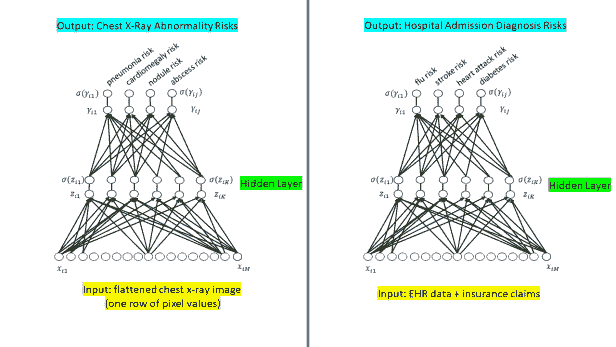

**Softmax 示例:手写数字和虹膜**

*手写数字:*如果我们正在对手写数字的图像进行分类(MNIST 数据集[)，我们希望通过使用 softmax 函数来强制分类器只为数字选择一个身份。毕竟，数字 8 的图片只是数字 8；它不能同时是数字 7。](https://en.wikipedia.org/wiki/MNIST_database)

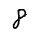

一个来自 MNIST 的“8”。从这里的[修改的图像](https://en.wikipedia.org/wiki/MNIST_database#/media/File:MnistExamples.png)

*虹膜:*[虹膜数据集](https://en.wikipedia.org/wiki/Iris_flower_data_set)是 1936 年推出的著名数据集。总共包括 150 个例子，分别来自三种不同的鸢尾(*鸢尾*、*海滨鸢尾*和*杂色鸢尾*)。数据集中的每个例子包括萼片长度、萼片宽度、花瓣长度和花瓣宽度的测量值。

以下是 Iris 数据集的摘录，显示了来自 *Iris setosa* 类的 9 个示例:

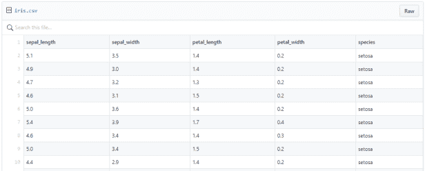

虽然数据集不包含任何图像，但这里的[是一张*云芝*](https://en.wikipedia.org/wiki/Iris_flower_data_set#/media/File:Iris_versicolor_3.jpg) 的照片，因为它很漂亮:

如果我们为 iris 数据集构建一个神经网络分类器，我们希望将 softmax 函数应用于原始输出，因为单个 Iris 示例一次只能是一个物种，预测一朵花同时是多个物种是没有意义的。

**关于数字“e”的旁注**

为了理解 sigmoid 和 softmax 函数，我们需要先介绍数字“e”。在这篇文章中，你需要知道的是 [e 是一个数学常数](https://en.wikipedia.org/wiki/E_(mathematical_constant))，大约等于 2.71828。

如果你想知道更多，这里有一些关于 e 的有趣事实:

*   e 的十进制表示永远存在，没有重复的数字块——类似于数字 pi。
*   e 出现在复利、赌博和某些概率分布的研究中。
*   这是 e 的一个公式:

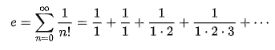

*   但是 e 并不只有一个公式，事实上，e 可以用几种不同的方法计算。参见[本页](https://www.intmath.com/exponential-logarithmic-functions/calculating-e.php)示例。
*   2004 年，谷歌的 IPO 申报金额为 2718281828 美元，即“10 亿美元”
*   这是维基百科中的[时间轴，记录了人类历史上已知的 e 的十进制位数，从 1690 年的 1 位数开始，一直到 1978 年的 116，000 位数:](https://en.wikipedia.org/wiki/E_(mathematical_constant)#Bernoulli_trials)

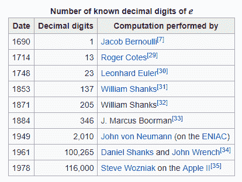

现在，回到乙状结肠和 softmax…

**Sigmoid =多标签分类问题=多个正确答案=非排他性输出(例如，胸部 x 光检查、住院)**

*   当我们为一个有多个正确答案的问题构建分类器时，我们将 sigmoid 函数独立应用于原始输出的每个元素。
*   sigmoid 函数看起来像这样(注意这里的数字 e):

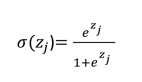

这里，sigma 符号σ表示 sigmoid 函数。表达式σ(zj)表示我们将 sigmoid 函数应用于数字 zj。(抱歉我在 WordPress 做不好下标；“zj”里的 j 应该是个下标。)“zj”表示单个原始输出值，例如-0.5。j 代表什么？它告诉我们正在使用哪个输出值。如果我们有四个输出值，则 j = 1、2、3 或 4。在上例中，我们的原始输出为[-0.5，1.2，-0.1，2.4]，我们得到 z1 = -0.5，z2 = 1.2，z3 = -0.1，z4 = 2.4

因此，

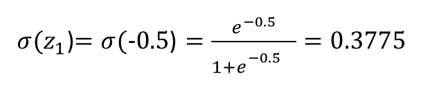

对于 z2、z3 和 z4 以此类推。

因为我们将 sigmoid 函数分别应用于每个原始输出值，这意味着我们的网络可以输出所有类别具有低概率(例如，“此胸部 x 光检查中没有异常”)，一个类别具有高概率但其他类别具有低概率(例如，“胸部 x 光检查中只有肺炎”)，或者多个或所有类别具有高概率(例如，“此胸部 x 光检查中有肺炎和脓肿。”)

这是一个 sigmoid 函数的图表:

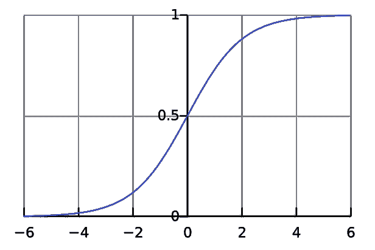

**Softmax =多类分类问题=只有一个正确答案=互斥输出(例如手写数字、虹膜)**

*   当我们为只有一个正确答案的问题构建分类器时，我们对原始输出应用 softmax。
*   应用 softmax 会在分母中考虑原始输出的所有元素，这意味着 softmax 函数产生的不同概率是相互关联的。
*   softmax 函数如下所示:

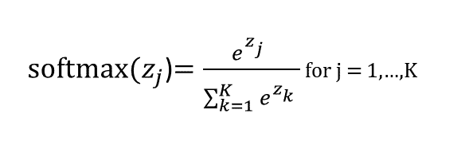

这类似于 sigmoid 函数，除了在分母中我们将原始输出中所有东西的 e^thing 相加。换句话说，在计算单个原始输出(例如 z1)的 softmax 值时，我们不能只考虑 z1:我们必须考虑分母中的 z1、z2、z3 和 z4，如下所示:

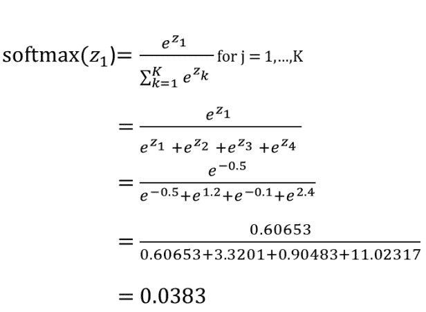

softmax 很酷，因为它确保我们所有输出概率的总和等于 1:

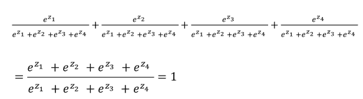

这意味着，如果我们正在对手写数字进行分类，并对原始输出应用 softmax，为了让网络增加特定示例被分类为“8”的概率，它需要降低该示例被分类为其他数字(0、1、2、3、4、5、6、7 和/或 9)的概率。

**多一个 sigmoid 和 softmax 计算示例**

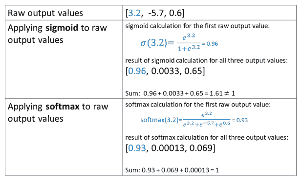

**总结**

*   如果您的模型的输出类不是互斥的，并且您可以同时选择其中的许多类，请对网络的原始输出使用 sigmoid 函数。
*   如果您的模型的输出类是互斥的，并且您只能选择一个，那么请对网络的原始输出使用 softmax 函数。

**关于特色图片**

[特色图片](https://commons.wikimedia.org/wiki/File:Carl_Bloch_-_In_a_Roman_Osteria_-_Google_Art_Project.jpg)是卡尔·布洛赫的一幅名为《在罗马露天剧场》的画 osteria 是一种提供简单食物和葡萄酒的意大利餐馆。我今天在网上偶然发现了这幅画，想了一会儿我如何能使它成为这篇文章的特色图片，因为我认为这是一幅有趣的画。我终于想到了这幅画和 sigmoids/softmaxes 之间的联系:一种视觉记忆术！

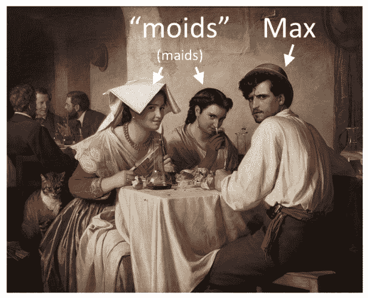

当你有多个合理的分类器输出时，使用一个“moid”(sigmoid——图片左边的两个“moid”/“maids”)。当你只有一个合理的分类器输出时，使用“max”(soft Max——我把右边皱眉的家伙命名为“Max”)。

结束了！

**参考文献**

*   [Scikit-学习多类和多标签算法](https://scikit-learn.org/stable/modules/multiclass.html)
*   [乙状结肠功能](https://en.wikipedia.org/wiki/Sigmoid_function)
*   [Softmax 功能](https://en.wikipedia.org/wiki/Softmax_function)

*原载于 2019 年 5 月 26 日*[*http://glassboxmedicine.com*](https://glassboxmedicine.com/2019/05/26/classification-sigmoid-vs-softmax/)*。*