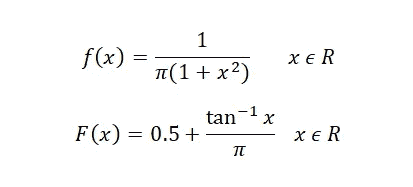
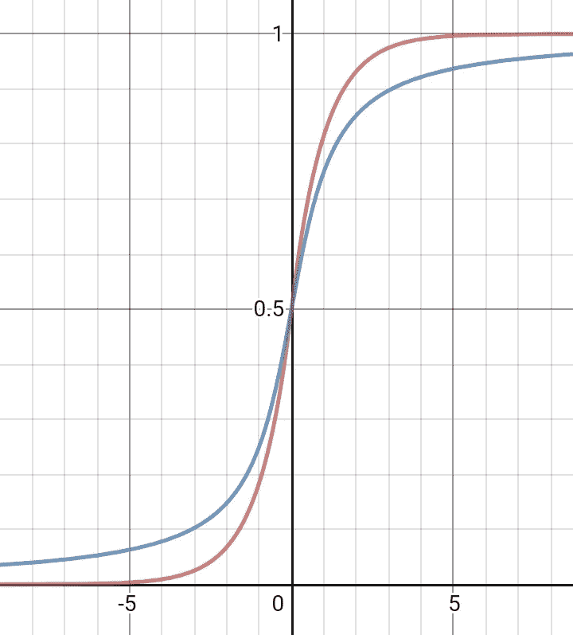

# 使用不同于 logit、probit 的链接函数进行分类[逻辑三部曲，第 3 部分]

> 原文：<https://towardsdatascience.com/classification-using-different-link-function-than-logit-probit-logistic-trilogy-part-3-df9922b1acf1?source=collection_archive---------17----------------------->

让我们学习一些新的东西。做一些新的、创新的事情总是好的。让我们更深入地研究逻辑分类器。实际上不是逻辑分类器，而是类似的东西。

我们使用过哪些不同的链接函数？Logit 链接、probit 链接和 less cloglog 链接。我们能自己想出其他链接功能吗？我们能创建自己的线性分类器吗？为了重新思考，我们需要一些提示，一些方向。让我给你一个。

> 所有这些上面提到的反向链接函数只不过是一些连续概率分布的 CDF。

逆 logit 环节是*标准物流配送*的 CDF。逆 probit 环节是*标准正态分布*的 CDF。逆 cloglog 链接是针对最小值的*广义 Gumbel 分布的 CDF。*

其中的共同点是相关的随机变量可以取整条实线上的任何值。这个特性非常非常重要。你能想出更多定义在整条实直线上的连续概率分布吗？目前我能想到的有**柯西分布**和**拉普拉斯分布**。**我的目标是在这两个分布的帮助下构建两个不同的二元分类器**。

**标准柯西分布**的 pdf f(x)和 cdf F(x)为:



**标准拉普拉斯分布**的相同量为:


其中 sgn(x)是这样的，如果 x 是负的，则 sgn(x)=-1，如果 x 是正的，则 sgn(x)=+1

两种分布都是关于 0 对称的。因此对于这两者， **F(0)=0.5** 和 **F(x)=1-F(-x)** 成立。两个 CDF 的图形类似于



**Red: Laplace distribution cdf. Blue: Cauchy distribution cdf**

> 看起来很像 sigmoid 函数，不是吗？我希望现在你能看到为什么这两个函数是 logit 分类器的潜在替代者。

由于我们的背景已经准备好，让我们投入分析。我们需要一个可以是 0 或 1 的响应变量 Y 和 p 个预测变量 X1，X2，…，Xp。假设观察总数为 N，并假设:

1.  Yi 是独立的，并且每个 Yi 遵循具有参数 **pi** 的伯努利分布
2.  预测因子 X1，X2，…Xp 是不相关的。

这样-


其中β是维数为(p+1)×1 的参数向量，xi 是 1×(p+1)阶的第 I 个观测向量。那就是***Xi =【1x1i x2i x3i…xpi】。***

在柯西分布的情况下，我们将使用-


在拉普拉斯分布的情况下-


让我们为一般的 F(x)建立理论，在编写 R 代码时，我们将考虑特殊情况。(这意味着您也可以使用这个理论来理解和构建**概率单位模型**😊😊)

可能性函数是-


由于分布关于 0 对称，F(x)=1-F(-x)成立。


我们能简化一点吗？假设 **z=2y-1。**所以当 y=1 那么 z=1，当 y=0 那么 z=-1。这将有助于以更方便的方式写出可能性。


可能性函数现在可以归结为，


类似地，对数可能性为


为了训练我们的模型，我们需要通过**最大似然估计**过程来估计未知参数。参数的最大似然是


对数似然相对于参数向量的一阶导数为


其中 f(x)是相应的 pdf。

最大似然估计必须满足条件 D=0。但是求 D=0 的根并不是一件容易的事情，因为它没有封闭形式的解。我们可以借助不同的优化技术。我使用的是传统的牛顿-拉夫森方法。

这种方法使我们能够通过如下迭代找到方程 f(x)=0 的根


并且当两个连续步骤的输出之间的差异变得太小时，我们停止。在这种情况下，我们将使用


让我们找到对数似然的二阶导数。


我们正在处理多个预测值，因此相应的矩阵格式为


在哪里，

1.  x 是 N 阶 x (p+1)预测值的矩阵，第一列全为 1。
2.  p 是 N×1 阶的列向量，其中第 I 个元素是 pi。
3.  w 是 N×N 对角矩阵，其中第 I 个对角元素为


4.n 表示第 n 次迭代。

唷！！！😓😓这需要大量的数学运算。让我们现在开始编码。我在这里用 R。我还在代码中加入了概率单位分类器。在此之前，让我们手边准备好柯西分布和拉普拉斯分布的 pdf 和 cdf。


pdf and cdf of Cauchy distribution


pdf and cdf of Laplace distribution

```
#At first lets define the functions for creating the pi values for given predictors and parameters#x is the matrix of parameters, param is the vector of betas, response is the response variable#at first work with probit model**p_i_finder_probit=function(x,param,response){
  n=length(response)
  p_i=array(dim=1)** #initializing an array **for(i in 1:nrow(x)){
    val=0** #temporary variable **for(j in 1:ncol(x)){
      val=val+x[i,j]*param[j]** #x[i,j]=ith value of jth predictor **}
    val=val*response[i]** #pnorm is the cdf of normal **p_i[i]=dnorm(val,0,1)*response[i]/pnorm(val,0,1)
  }** #dnorm is pdf of normal **return(p_i)** #it will return the vector P **}**#lets define the pdf of standard Cauchy distribution **cauchy_pdf=function(x){        
  return((1/(1+x^2))/pi)
}**# similarly function to calculate the cdf of standard Cauchy distribution**cauchy_cdf=function(x){
  return(0.5+atan(x)/pi)
}**# similarly finding the P column vector for Cauchy classifier**p_i_finder_cauchy=function(x,param,response){
  n=length(response)
  p_i=array(dim=1)
  for(i in 1:nrow(x)){
    val=0
    for(j in 1:ncol(x)){
      val=val+x[i,j]*param[j]
    }
    val=val*response[i]
    p_i[i]=cauchy_pdf(val)*response[i]/cauchy_cdf(val)
  }
  return(p_i)
}**# function to calculate the pdf of Laplace distribution**laplace_pdf=function(x){
  return(exp(-abs(x))/2)
}**# function to calculate the cdf of Laplace distribution**laplace_cdf=function(x){
  return(0.5+0.5*sign(x)*(1-exp(-abs(x))))
}**# pi values under Laplace classifier**p_i_finder_laplace=function(x,param,response){
  n=length(response)
  p_i=array(dim=1)
  for(i in 1:nrow(x)){
    val=0
    for(j in 1:ncol(x)){
      val=val+x[i,j]*param[j]
    }
    val=val*response[i]
    p_i[i]=laplace_pdf(val)*response[i]/laplace_cdf(val)
  }
  return(p_i)
}**#now lets write the function for constructing the W matrix
# as input we need the pi value, the matrix of predictors and the parameters**W_matrix_finder=function(p_i,x,param){
  wi=array(dim=1)
  for(i in 1:nrow(x)){
    val=0
    for(j in 1:ncol(x)){
      val=val+x[i,j]*param[j]
    }
    wi[i]=p_i[i]*(val+p_i[i])
  }
  W_matrix=diag(wi)** #diagonal matrix with ith diagonal=wi **return(W_matrix)** #returning the matrix **}**#finally creating own function equivalent to glm function
# as input it will take predictor variables, response variable, the precision for the stopping criteria of Newton Raphson method
and which classifier to use: probit or cauchy or laplace**own_classifier=function(predictor,response,precision,type){
  predictor_new=as.matrix(predictor)** #to be on safe side **distinct=sort(unique(as.numeric(response)),decreasing=FALSE)
  response=as.numeric(response)** #to be on safest side :) **response_new=array(dim=1)
  for(i in 1:length(response)){
    if(response[i]==distinct[1])
      response_new[i]=-1** #instead of 0-1 encoding, making **else** it -1 and 1 for simplicity **response_new[i]=1
  }
  constant=rep(1,length(response_new))** #1st column with all values=1 **X_matrix=cbind(constant,predictor_new)
  beta=rep(0,ncol(X_matrix))** #initializing the parameters **if(type=="cauchy"){** #based on mentioned classifier **dif=100** #R does not have do while loop :( **while(dif>precision){
      p_i=p_i_finder_cauchy(X_matrix,beta,response_new)
      W_matrix=W_matrix_finder(p_i,X_matrix,beta)
  updated=solve(t(X_matrix)%*%W_matrix%*%X_matrix)%*%t(X_matrix)%*%p_i
      beta=beta+updated** #updating beta **dif=sum(updated^2)**#Euclidean distance between old and new beta **}
  }
  else if(type=="probit"){** # for probit model **dif=100
    while(dif>precision){
      p_i=p_i_finder_probit(X_matrix,beta,response_new)
      W_matrix=W_matrix_finder(p_i,X_matrix,beta)
      updated=solve(t(X_matrix)%*%W_matrix%*%X_matrix)%*%t(X_matrix)%*%p_i
      beta=beta+updated
      dif=sum(updated^2)
    }
  }
  else if(type=="laplace"){** #for laplace classifier **while(dif>precision){
      p_i=p_i_finder_laplace(X_matrix,beta,response_new)
      W_matrix=W_matrix_finder(p_i,X_matrix,beta)
      updated=solve(t(X_matrix)%*%W_matrix%*%X_matrix)%*%t(X_matrix)%*%p_i
      beta=beta+updated
      dif=sum(updated^2)
    }
  }
  return(beta)** #returning final parameters **}**
```

我们的模特训练完成了。让我们在一些任意数据集上应用，并与内置的 glm 函数进行比较。

```
# I am creating own random dataset containing 2 predictors.**predictor1=rbeta(100,2,4)**#random sample of size 100 from beta(2,4)
**predictor2=rpois(100,10)** #rs from poisson(10)
**predictor=cbind(predictor1,predictor2)
response=sample(c(0,1),100,replace=T)
data=as.data.frame(cbind(predictor1,predictor2,response))**
```

数据看起来像这样:


```
#train-test split. I am using 80-20 ratio.
**samples=sample(1:nrow(data),size=nrow(data)*0.80,replace=F)
data_train=data[samples,]** #train data **data_test=data[-samples,]** #test data#probit model training using inbuilt glm
**inbuilt=glm(response~predictor1+predictor2,data=data_train,family=binomial(link="probit"))
inbuilt$coefficients**
```

输出是:


让我们看看我们的函数是如何运行的，


挺好的！！！！！！不是吗？最多 5 位小数，使用 glm 函数是正确的。

现在我们将应用柯西和拉普拉斯分类器。


但是如何衡量它们作为分类器的性能呢？我们将看到他们在测试数据上的表现。为此，让我们构建一个类似于 r 中的**预测**函数的函数。

```
#as input it takes the model outputs, test data predictors and the type of classifier to use. **fitted=function(model,test_data_predictor,type){
  predictors=as.matrix(test_data_predictor)
  constant=rep(1,nrow(predictors))
  X_matrix=cbind(constant,predictors)
  pred=array(dim=1)
  if(type=="probit"){
    for(i in 1:nrow(X_matrix)){
      val=0
      for(j in 1:ncol(X_matrix)){
        val=val+X_matrix[i,j]*model[j]
      }
      pred[i]=pnorm(val,0,1)** #cdf of standard normal as inverse link **}
  }
  else if(type=="cauchy"){
    for(i in 1:nrow(X_matrix)){
      val=0
      for(j in 1:ncol(X_matrix)){
        val=val+X_matrix[i,j]*model[j]
      }
      pred[i]=cauchy_cdf(val)**#cdf of standard Cauchy as inverse link **}
  }
  else if(type=="laplace"){
    for(i in 1:nrow(X_matrix)){
      val=0
      for(j in 1:ncol(X_matrix)){
        val=val+X_matrix[i,j]*model[j]
      }
      pred[i]=laplace_cdf(val)**#cdf of standard Laplace as inverse 
                                link
    **}
  }
  return(pred)
}**
```

最后是对比时间。拟合的概率将判断我们创建的分类器如何表现。手指交叉！！！！！

```
#probit model using glm function **inbuilt=glm(response~predictor1+predictor2,data=data_train,family=binomial(link="probit"))**#probit model using our own code**model1=own_classifier(data_train[,1:2],data_train[,3],0.000000000000000001,"probit")**# Cauchy classifier using our own code**model2=own_classifier(data_train[,1:2],data_train[,3],0.000000000000000001,"cauchy")**# Laplace classifier using our own code**model3=own_classifier(data_train[,1:2],data_train[,3],0.000000000000000001,"laplace")**#fitted probabilities based on our probit classifier**my_probit=fitted(model1,data_test[,1:2],"probit")**#fitted probabilities based on our Cauchy classifier**my_cauchy=fitted(model2,data_test[,1:2],"cauchy")**#fitted probabilities based on our Laplace classifier**my_laplace=fitted(model3,data_test[,1:2],"laplace")**#fitted probabilities based on probit model through inbuilt glm**r_probit=predict(inbuilt,data_test[,1:2],type="response")****cbind(r_probit,my_probit,my_cauchy,my_laplace)**
```

输出是:


答对了。！！！！！！！！🤩🤩。我们创造的所有模型表现几乎一样。glm 概率单位模型和我们的概率单位模型的拟合值精确到小数点后 6 位。其他两个分类器也给出了与概率单位模型相似的拟合值。

> 恭喜你！！！！！！现在，您不仅知道了一些新的链接函数，还知道了如何自己使用它们开发模型。

这就是逻辑三部曲的结尾。要想在任何领域大放异彩，有三件事非常非常重要。**想象力、创造力和创新。**

> 想象力是无限的。你可以想象任何事情，任何事情。但是如果你把逻辑和想象混合起来，你就会创造出新的东西。这就是创造力。创造新的非传统事物。如果你把创意和创造结合起来，你就会开始创新。

数据科学家需要具备这三个素质。这三个都是通过这个三部曲呈现的。

第一部分 [**逻辑回归——源自直觉**](/logistic-regression-derived-from-intuition-d1211fc09b10) 将帮助你通过纯粹的逻辑和想象得出逻辑分布的想法。

[](/logistic-regression-derived-from-intuition-d1211fc09b10) [## 逻辑回归——源自直觉

### 让我们通过一个故事从头开始推导逻辑回归。我希望这将是有趣和好玩的…

towardsdatascience.com](/logistic-regression-derived-from-intuition-d1211fc09b10) 

第二部分[在 R 中构建自己的逻辑分类器](/building-own-logistic-classifier-in-r-logistic-trilogy-part-2-a36be209d2c)将帮助你在 R 中创建自己的逻辑分类器函数。这将使你能够创造你自己的东西。

[](/building-own-logistic-classifier-in-r-logistic-trilogy-part-2-a36be209d2c) [## 在 R 中构建自己的逻辑分类器[逻辑三部曲，第 2 部分]

### 一篇关于如何在不使用内置函数的情况下用 R 构建逻辑分类器的独立文章。它会凝固…

towardsdatascience.com](/building-own-logistic-classifier-in-r-logistic-trilogy-part-2-a36be209d2c) 

我希望这最后一部分能让你跳出框框思考。你们很多人都用过 logit 或 probit 分类器。但是你有没有想过还有其他的链接功能存在呢？我们能从 logit 和 probit 中想出点什么吗？你猜怎么着！！！！！！他们有很多。**你所需要的是一个连续的概率分布，它定义在整个实线上**。就拿 **t 分布**本身来说。通过改变其自由度，您可以创建几个链接函数，并检查其在不同数据集上的性能。深入思考。深入算法。不要只是用算法，从算法开始创新。

如果你不相信，或者有任何疑问或建议，请在评论区提问，或者通过我的 LinkedIn 个人资料联系我。

[](https://www.linkedin.com/in/soumalya-nandi-95176569/) [## SOUMALYA NANDI -联合健康组织(L2)助理数据科学家| LinkedIn

### 查看 SOUMALYA NANDI 在全球最大的职业社区 LinkedIn 上的个人资料。SOUMALYA 有 4 份工作列在…

www.linkedin.com](https://www.linkedin.com/in/soumalya-nandi-95176569/)