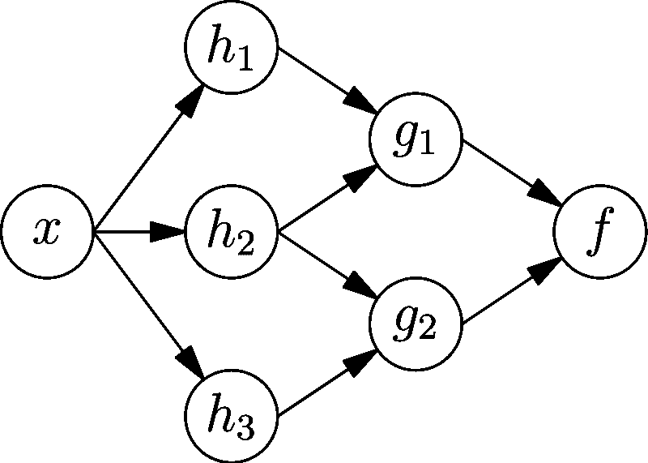
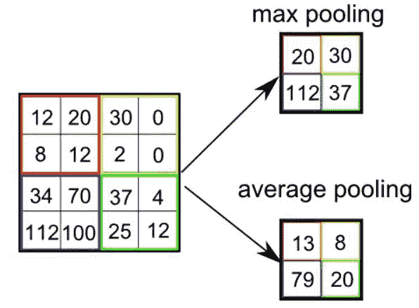

# 使用神经网络的分类

> 原文：<https://towardsdatascience.com/classification-using-neural-networks-b8e98f3a904f?source=collection_archive---------4----------------------->

神经网络是那些经常被用来给研究增加可信度的酷词之一。但是它们到底是什么呢？阅读完本文后，您应该对神经网络和卷积神经网络的内部机制有了大致的了解，并且能够用 Python 编写自己的简单神经网络模型。

**什么是神经网络**

神经网络从人脑的学习过程中获得灵感。它们由称为参数的人工功能网络组成，允许计算机通过分析新数据来学习和微调自己。每个参数，有时也称为神经元，是在接收一个或多个输入后产生输出的函数。这些输出然后被传递到下一层神经元，神经元将它们作为自己功能的输入，并产生进一步的输出。这些输出然后被传递到下一层神经元，如此继续，直到每一层神经元都被考虑，并且末端神经元接收到它们的输入。这些终端神经元然后输出模型的最终结果。

*图 1* 显示了这样一个网络的可视化表示。初始输入是 *x，*，然后被传递到第一层神经元(图 1*中的 h 气泡)*，在这里有三个函数考虑它们接收到的输入，并生成一个输出。该输出然后被传递到第二层(图 1 中的 g 气泡)。基于第一层的输出，计算进一步的输出。然后将该次级输出组合起来，以产生模型的最终输出。

*图 1:一个简单神经网络的可视化表示*



Image from: [https://en.wikipedia.org/wiki/Artificial_neural_network](https://en.wikipedia.org/wiki/Artificial_neural_network)

**神经网络如何学习？**

思考神经网络的另一种方式是将其视为一个巨大的函数，它接受输入并获得最终输出。由多层神经元完成的中间功能通常不会被观察到，幸好是自动化的。它们背后的数学既有趣又复杂，值得进一步研究。

如前所述，网络中的神经元与下一层中的神经元相互作用，每个输出都充当未来函数的输入。包括初始神经元在内的每个函数接收数字输入，并基于内化函数产生数字输出，该内化函数包括对每个神经元唯一的偏置项的添加。然后，通过乘以适当的权重，将该输出转换为下一层中函数的数字输入。这一直持续到产生网络的一个最终输出。

困难在于确定每个偏置项的最佳值，以及为神经网络中的每次传递找到最佳加权值。要做到这一点，必须选择一个成本函数。成本函数是一种计算特定解决方案离最佳可能解决方案有多远的方法。有许多不同的可能的成本函数，每一个都有优点和缺点，每一个都在特定的条件下最适合。因此，成本函数应该根据个人的研究需要来定制和选择。一旦确定了成本函数，就可以以最小化该成本函数的方式改变神经网络。

因此，优化权重和偏差的简单方法是简单地多次运行网络。第一次尝试时，预测必然是随机的。每次迭代后，将分析成本函数，以确定模型的表现如何，以及如何改进。从成本函数获得的信息然后被传递到优化函数，优化函数计算新的权重值以及新的偏差值。将这些新值集成到模型中后，模型将重新运行。这种情况一直持续到没有改变改进成本函数为止。

有三种学习方法:监督学习、非监督学习和强化学习。这些学习范例中最简单的是监督学习，其中神经网络被给予标记输入。标记的例子，然后被用来推断可推广的规则，可适用于未标记的情况。这是最简单的学习方法，因为它可以被认为是与“老师”一起操作，以一种函数的形式，允许网络将其预测与真实的、期望的结果进行比较。无监督方法不需要带标签的初始输入，而是不仅基于给定的数据，而且基于网络的输出来推断规则和函数。这妨碍了可以做出的预测类型。这种模型不能够分类，而是局限于聚类。

**什么是卷积神经网络？**

传统神经网络的一种变体是卷积神经网络。通常所说的神经网络提供了一些优于普通神经网络的显著优势，尤其是在图像分类方面。在这种情况下，初始输入将是由像素组成的图像。图像分类的传统问题是，对于具有许多颜色通道的大图像，训练一些模型在计算上很快变得不可行。CNN 试图做的是将图像转换成一种更容易处理的形式，同时仍然保留最重要的特征。这是通过在初始图像上传递滤波器来完成的，该滤波器在初始图像中的像素的子部分上进行矩阵乘法，它遍历子集，直到考虑了所有子集。过滤器旨在捕捉最关键的特征，同时允许消除冗余特征。过滤器在初始像素上的这种通过被称为卷积层。

卷积图层之后是汇集图层，在该图层中，将尝试减少卷积要素的空间大小。复杂性的降低，有时被称为降维，将降低对数据集进行分析的计算成本，从而使该方法更加稳健。在这一层，内核再次通过图像的所有像素子集。有两种常用的池内核。第一个是 Max Pooling，它保留子集的最大值。另一种内核是平均池，它做的正是您所期望的:它保留子集中所有像素的平均值。*图 2* 直观地显示了汇集阶段的流程。

*图 2:卷积神经网络的汇集阶段*



Image from: [https://towardsdatascience.com/a-comprehensive-guide-to-convolutional-neural-networks-the-eli5-way-3bd2b1164a53](/a-comprehensive-guide-to-convolutional-neural-networks-the-eli5-way-3bd2b1164a53)

在汇集阶段之后，信息将有望被压缩到足以用于常规神经网络模型。剩下要做的最后一件事是将合并阶段的最终输出变平，并将其输入到模型中。展平是通过将像素矩阵转换成像素矢量来完成的，然后该矢量可用于神经网络模型。

从那里，卷积神经网络就像常规神经网络一样工作，因为信息将被传递到一组神经元，这些神经元将值传递到其他层，直到达到最终输出。因此，卷积神经网络使得神经网络对于大数据集或复杂图像是可行的，因为它降低了分析所需的计算能力。

**神经网络有哪些应用？**

诸如神经网络之类的机器学习方法有许多应用。这些应用大多集中在图像的分类上。这些图像可以是任何东西，从某物是否是热狗，到识别笔迹。这种模式的实际可能性是广泛且有利可图的。让我们看一个例子。

许多公司都希望能够自动建立一个对服装进行分类的模型。这样做可以让他们洞察时尚趋势、购买习惯以及文化和社会经济群体之间的差异。为此，我们将使用一个神经网络，看看当给定一组 60，000 张图像时，是否可以构建一个适当的分类模型，这些图像带有标识它们是什么类型服装的标签。

所有这些图片都是由像素组成的，因为我们要做的是一个简单的神经网络，而不是卷积神经网络，所以这些像素将作为像素向量直接传递到网络中。


Image taken from: [https://medium.com/tensorist/classifying-fashion-articles-using-tensorflow-fashion-mnist-f22e8a04728a](https://medium.com/tensorist/classifying-fashion-articles-using-tensorflow-fashion-mnist-f22e8a04728a)

为了创建神经网络，必须指定模型中的层数。为了简单起见，我将模型限制为两层。还必须选择每层的激活类型。同样，为了保持简单，我将为第一层选择一个 sigmoid 激活，最后一层有 10 个节点，并设置为返回 10 个概率得分，指示图像是否属于十件可能的衣服之一的概率。为了编译模型，必须定义一个损失函数，这将是模型评估其自身性能的方式。还必须确定优化器，这就是如何使用来自成本函数的信息来改变每个节点的权重和偏差。

```
model = keras.Sequential([keras.layers.Flatten(input_shape (28,28)),
                keras.layers.Dense(128,activation = tf.nn.sigmoid),                          
                keras.layers.Dense(10,activation = tf.nn.softmax)])
model.compile(optimizer = 'adam',loss='sparse_categorical_crossentropy',metrics =['accuracy'])
```

有了这些参数输入，就可以训练一个模型。一旦模型被训练，就必须根据测试数据对其进行评估。要做到这一点，必须指明模型将考虑的历元数。历元决定了应该对数据进行多少次迭代。更多的历元将在计算上更加昂贵，但应该允许更好的拟合。我将考虑 5 个时代。可以看到，随着优化函数改变权重，在每次迭代之后，模型对训练数据的准确性如何提高。

```
model.fit(x_train, y_train,epochs = 5)
```


The Change in Accuracy for Each Epoch

模型如何执行的真正拟合是通过在测试集上运行模型，而不是用于构建模型。在这种情况下，神经网络的准确度为 0.7203:还不错！

**总结**

神经网络是复杂的模型，它试图模仿人脑制定分类规则的方式。神经网络由许多不同层的神经元组成，每一层接收来自前一层的输入，并将输出传递给下一层。每一层的输出成为下一层的输入的方式取决于给予特定链接的权重，该权重取决于成本函数和优化器。神经网络迭代预定次数的迭代，称为历元。在每个时期之后，分析成本函数以查看模型可以改进的地方。然后，优化函数根据成本函数提供的信息改变网络的内部机制，例如权重和偏差，直到成本函数最小化。

卷积神经网络是普通神经网络的变形，它试图通过两个独立的阶段减少图像分类中的像素数量来处理高维度问题:卷积阶段和汇集阶段。之后，它的表现就像一个普通的神经网络。

**关键词**

*   神经网络
*   卷积神经网络
*   汇集阶段
*   神经元
*   层
*   过滤
*   价值函数
*   【计算机】优化程序