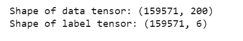

# 用 LSTM 和手套对有毒的网络评论进行分类

> 原文：<https://towardsdatascience.com/classify-toxic-online-comments-with-lstm-and-glove-e455a58da9c7?source=collection_archive---------7----------------------->


Photo credit: Pixabay

## 深度学习，文本分类，自然语言处理

这篇文章展示了如何使用一个简单的 [LSTM](https://en.wikipedia.org/wiki/Long_short-term_memory) 和一个预先训练好的[手套](https://nlp.stanford.edu/projects/glove/)文件为[有毒评论分类问题](https://www.kaggle.com/c/jigsaw-toxic-comment-classification-challenge)创建一个强大的基线。

本文由四个主要部分组成:

*   准备数据
*   实现一个简单的 LSTM (RNN)模型
*   训练模型
*   评估模型

# 数据

在下面的步骤中，我们将设置关键模型参数并拆分数据。

*   " ***MAX_NB_WORDS*** "设置被视为 tokenizer 特征的最大字数。
*   "***MAX _ SEQUENCE _ LENGTH***"在此字数之后(在 ***MAX_NB_WORDS*** 最常用的字中)切断文本。
*   ***VALIDATION _ SPLIT***设置一部分数据用于验证，不用于训练。
*   ***EMBEDDING _ DIM***定义了“矢量空间”的大小。
*   ***GLOVE_DIR*** 定义了手套文件的目录。
*   将数据分为文本和标签。

toxic_data.py

# 文本预处理

在下面的步骤中，我们删除停用词，标点符号，并使一切小写。

preprocessing_toxic.py

看一看样本数据。

```
print('Sample data:', texts[1], y[1])
```


*   我们创建一个分词器，配置成只考虑到 ***MAX_NB_WORDS*** 最常见的单词。
*   我们建立单词索引。
*   我们可以恢复计算出的单词索引。

```
tokenizer = Tokenizer(num_words=MAX_NB_WORDS)
tokenizer.fit_on_texts(texts)
sequences = tokenizer.texts_to_sequences(texts)
word_index = tokenizer.word_index
print('Vocabulary size:', len(word_index))
```


*   将整数列表转换为形状的 2D 整数张量(samples，maxlen)
*   每个序列后填充。

```
data = pad_sequences(sequences, padding = 'post', maxlen = MAX_SEQUENCE_LENGTH)print('Shape of data tensor:', data.shape)
print('Shape of label tensor:', y.shape)
```



*   打乱数据。

```
indices = np.arange(data.shape[0])
np.random.shuffle(indices)
data = data[indices]
labels = y[indices]
```

创建培训验证分解。

```
num_validation_samples = int(VALIDATION_SPLIT*data.shape[0])
x_train = data[: -num_validation_samples]
y_train = labels[: -num_validation_samples]
x_val = data[-num_validation_samples: ]
y_val = labels[-num_validation_samples: ]print('Number of entries in each category:')
print('training: ', y_train.sum(axis=0))
print('validation: ', y_val.sum(axis=0))
```


数据看起来是这样的:

```
print('Tokenized sentences: \n', data[10])
print('One hot label: \n', labels[10])
```


Figure 1

# 创建模型

*   我们将使用来自斯坦福的[预训练手套向量](https://nlp.stanford.edu/projects/glove/)通过解析预训练嵌入的数据转储来创建映射到已知嵌入的单词索引。
*   然后将单词嵌入加载到一个`**embeddings_index**`

embedding_index.py


*   创建嵌入层。
*   指定嵌入层的最大输入长度。
*   利用来自先前嵌入层的输出，该嵌入层将 3-D 张量输出到 LSTM 层。
*   使用[全局最大池层](https://keras.io/layers/pooling/)将 3D 张量重塑为 2D 张量。
*   我们设置丢弃层来丢弃 10%的节点。
*   我们定义密集层以产生 50 的输出尺寸。
*   我们再次将输出馈入一个漏失层。
*   最后，我们将输出送入一个“Sigmoid”层。

embedding_layers.py

是时候将模型编译成静态图进行训练了。

*   定义输入、输出并配置学习过程。
*   使用“Adam”优化器设置模型以优化我们的损失函数，将损失函数定义为“binary_crossentropy”。

```
model = Model(sequence_input, preds)
model.compile(loss = 'binary_crossentropy',
             optimizer='adam',
             metrics = ['accuracy'])
```

*   我们可以想象模型的设计师。

```
tf.keras.utils.plot_model(model)
```


Figure 2

# 培养

*   为每一批输入 32 个填充的索引句子。验证集将用于评估模型是否过度拟合。
*   该模型将运行 2 个时期，因为即使 2 个时期也足以过度拟合。

```
print('Training progress:')
history = model.fit(x_train, y_train, epochs = 2, batch_size=32, validation_data=(x_val, y_val))
```


# 评估模型

```
loss = history.history['loss']
val_loss = history.history['val_loss']epochs = range(1, len(loss)+1)plt.plot(epochs, loss, label='Training loss')
plt.plot(epochs, val_loss, label='Validation loss')
plt.title('Training and validation loss')
plt.xlabel('Epochs')
plt.ylabel('Loss')
plt.legend()
plt.show();
```


Figure 3

```
accuracy = history.history['accuracy']
val_accuracy = history.history['val_accuracy']plt.plot(epochs, accuracy, label='Training accuracy')
plt.plot(epochs, val_accuracy, label='Validation accuracy')
plt.title('Training and validation accuracy')
plt.ylabel('Accuracy')
plt.xlabel('Epochs')
plt.legend()
plt.show();
```


Figure 4

Jupyter 笔记本可以在 [Github](https://github.com/susanli2016/NLP-with-Python/blob/master/Toxic%20Comments%20LSTM%20GloVe.ipynb) 上找到。周一快乐！