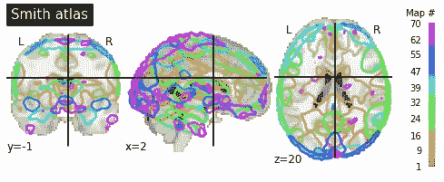
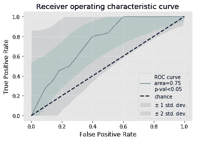

# 使用 LSTMs 和 rs-fMRI 数据从健康对照中分类 ADHD

> 原文：<https://towardsdatascience.com/classifying-adhd-from-healthy-controls-using-lstms-with-rs-fmri-data-300c1f3e9697?source=collection_archive---------16----------------------->

## 实践指南:从提取静息状态网络到计算分类重要性

image credit: [American health imaging](https://www.americanhealthimaging.com/brain-scan-help-diagnose-adhd/)

本教程介绍了使用机器学习分析 rs-fMRI 数据的实际步骤，更具体地说，是区分注意缺陷多动障碍(ADHD)和健康对照组。我讨论了(1)使用掩模的特征提取(2)递归神经网络(RNN)的优点和缺点，特别是用于分类 fMRI 数据的长短期记忆网络(LSTM )( 3)假设检验及其在模型评估中的应用。

有关如何准备用于分析的 fMRI 图像的更多详细信息，请访问 [*使用 ICAs 从 fMRI 数据中识别静息状态网络的预处理教程*](https://medium.com/@gili.karni/exploring-cognitive-differences-via-resting-state-networks-2112bf5291e2) 。

*注意*:如果你已经读过这些之前的帖子，你可能已经注意到我已经从精神分裂症(SZ)数据集换成了多动症数据集。主要原因是我自己缺乏预处理完整精神分裂症数据集的计算资源。我找不到预处理过的 SZ 数据集，但我找到了一个 ADHD 数据集。

**本教程的完整代码可从** [**这里**](https://github.com/karnigili/NetworksNeuroscience) **获得。**要做好准备，请下载 python 并安装以下包- [nilearn](https://nilearn.github.io/) 、 [sklearn](https://scikit-learn.org/stable/index.html) 、 [keras](https://keras.io/) 。

## 数据准备

正如我们之前提到的，fMRI 图像是 4D 矩阵，反映了三维空间和时间中每个体素的激活水平。然而，相关信息常常是由这些数据的子集描述的。比如这里，我们只对静息态网络感兴趣。为了省略不相关的数据，我们应用掩码。掩码是简单的过滤器，它传递所需的数据子集，而丢弃其余的数据。实际上，遮罩将不需要的体素的激活值替换为 0。

屏蔽 fMRI 数据的方式有很多种，这主要是由分析的目标决定的。本教程的重点是通过他们的静息状态网络将 ADHD 患者与对照组进行分类。因此，我应用史密斯的 rs-fMRI 组件图谱(史密斯等人，2009)。Smith atlas 反映了使用独立成分分析(ICA)对数千名健康患者获得的 70 个静息状态网络(RSN)。我更喜欢 Smith atlas，而不是使用特定于数据集的 ICA 组件，因为它有助于避免可能导致过度拟合的双重浸渍(即使用数据两次)。

史密斯地图集可通过 Nilearn 数据集获得:

多动症数据集也可以在 Nilearn 上找到。从第一幅图像的头部，我们看到该图像包含 176 个时间戳上的 73*61*61 个体素。此外，每个体素约为 3 毫米。需要注意的是，这一信息在整个数据集中可能并不一致。

OUTPUT: [ 4 61 73 61 176 1 1 1] // [-1\. 3\. 3\. 3\. 2\. 0\. 0\. 0.]

为了屏蔽数据，我们首先需要从 Smith 的图集生成屏蔽。应用标准化有助于特性的健壮性。在掩蔽的情况下，它可以通过对每个时间序列的切片进行居中和归一化来帮助增强信号。将数据混淆视为转换过程的一部分，也有助于通过消除混淆噪声来增强信号。

OUTPUT: N control: 20 / N ADHD: 20

如前所述，一个数据集可能不会拥有相同的扫描长度——这 40 名受试者表现出相当大的差异。然而，大多数机器学习算法(包括 Keras)需要所有对象的统一形状。为了优化数据保存，我们可以使用填充；在扫描结束后给每个主题添加零，以匹配最长扫描的长度。除了填充之外，我还重塑了数据，使其符合 Keras 提出的要求；(40，261，10)意味着我们有 40 名受试者，在 10 个地区有 261 个时间戳长的样本。

OUTPUT: data shape: (40, 261, 70)

## 数据准备

我们使用训练/测试分离范例来确保模型在全新的数据上进行测试。下面的函数随机地将数据分成训练和测试，并根据模型的要求重新塑造每个部分。

## LSTM 模型

长短期记忆(LSTM)模型在学习功能磁共振成像数据方面提供了一些好处。主要原因是，与大多数机器学习或深度学习方法不同，它们设法保留输入的上下文信息——从而在处理当前输入序列时，纳入输入序列之前部分的细节。也就是说，高度语境化并不总是一件好事。有些情况下，LSTMs 不是最佳选择；依赖上下文可能会导致对数据的过度解读。此外，LSTMs 可能比简单的 NN 运行时间更长，并且可能有更多的参数需要调整。重要的是要考虑各种选项，并从相关场景中找到最合适的模型(Culurciello，2018)。

在这种情况下，我选择展示 LSTMs 在分析 fMRIs 时的能力，因为它们具有上下文相关的性质。fMRI 数据代表了随时间变化的动态大脑活动，因此使用 LSTMs 可以在分析功能连接时利用时间信息(否则会丢失)(Dvornek 等人，2017)。

RSN LSTM classifier pipeline

注意-LSTM 的一个常见增强是使用支持分析空间结构的卷积神经网络(CNN)。然而，在这里，我们提取了 70 个反映整个网络激活的独立成分的离散值——因此放弃了数据的空间属性。因此，CNN 不太可能有用。

LSTMs 的一个问题是它们很容易过度拟合训练数据，降低了它们的预测能力。这个问题的解决方案是通过正则化，这阻止了模型的过拟合趋势。LSTM 网络中的一个常规正则化是丢失，它从概率上将单元排除在层连接之外。辍学有两种类型——输入性辍学和经常性辍学。输入的丢失意味着对于给定的概率，每个 LSTM 单元的输入连接上的数据将被排除在节点激活和权重更新之外(参见*丢失*参数)。递归输入上的漏失以相同的方式工作，但是在递归连接上(参见 *reccurent_dropout* 参数)。然而，重要的是不要过度正则化，因为这将从根本上阻碍模型学习(这可以通过严格的非指示性预测来检测)。

我在这里展示的模型是一个序列模型，具有三个堆叠的 LSTM 层和一个具有 sigmoid 激活的致密层。坦率地说，对于如何选择超参数，没有一个正确的答案。有很多试错和经验法则。我展示一些我收集的—

*   一般来说，我们希望至少有两个**隐藏层**(不包括最后一层)，因为神经网络的能力源于它们的深度(即零层只能表示线性函数..).然而，在精确度和训练时间之间有一个折衷——在不花费太多时间的情况下，找到显著增加精确度的层数(更多细节[此处](https://stats.stackexchange.com/questions/181/how-to-choose-the-number-of-hidden-layers-and-nodes-in-a-feedforward-neural-netw))。
*   我们希望从数量为**的单元**开始，小于或等于输入大小，并减少它(当时大约减少一半),直到到达最后一层。(参见完整讨论[此处](https://www.quora.com/Why-is-it-common-in-Neural-Network-to-have-a-decreasing-number-of-neurons-as-the-Network-becomes-deeper))
*   在分类的情况下，输出层的**单元数应该等于类别数。通常，二进制分类问题有一个输出。**
*   **输出层激活**主要是针对二元分类的 sigmoid，针对多类分类器的 softmax，以及针对回归的线性。
*   **分类损失函数**应与标签数量及其类型相匹配。binary_crossentropy 损失函数最适用于二进制分类，categorial _ cross entropy 最适用于具有一个热编码数据的多类，sparse _ categorical _ crossentropy 最适用于类似整数的标注。
*   准确性**指标**显示了正确分类的百分比。可以用一个以上！
*   越多的**周期**越好，从 30 开始，并遵循您的**验证** **设置**以减少损失并提高精度。如果您看到了改进，请增加历元的数量，否则—回到绘图板。
*   根据您对数据属性和网络深度的了解，选择**优化器**。例如，ada 优化器可以很好地处理稀疏数据，但随着网络的深入，性能会越来越差。从 Adam optimizer 开始是一个安全的选择，因为它是一个高效的优化器，不需要大量的调优(参见更多细节[此处](https://www.dlology.com/blog/quick-notes-on-how-to-choose-optimizer-in-keras/))。

*Image Credit:* [*CS231n*](https://cs231n.github.io/neural-networks-3/)

这是模型-

让我们试试这个模型，看看它是否能够学习。因此，它的精度增加，损失减少；

我们看到，随着历元数量的增加，模型的准确性有所提高，模型的损失有所减少。此外，训练集和验证集显示了相似的趋势。因此，我们(1)有了一个工作模型,( 2)可能没有过度拟合——因此，我们将继续。

*我们实际上如何使用模型？*

## 假设检验

我使用假设检验框架来评估模型，因为它有助于获得模型的准确性及其重要性。为了计算模型的重要性，我使用了 bootstrapping。简而言之，Bootstrapping 是一种强大的基于计算机的统计推断方法，它不依赖于太多的假设。它帮助我们通过对小数据样本的估计来估计总体的特性。

(简要地)它是如何工作的？

我们要测试的零假设表明，ADHD 患者和对照组之间没有差异，因此使用我们的模型比较两者的准确性应该是大约 0.5(意思是，机会)。

为了评估这一假设，我们将从数据中用替换法反复重新取样；将其分为训练和测试部分，拟合模型，预测测试数据的标签，并计算精度。这种重复将产生精确度的分布。我们使用的迭代次数越多，这种重采样(遵循中心极限定理)很可能接近高斯形状。因此，我们可以采用要求正态分布的统计检验(如 t 检验)。

如果 0.5 位于分布的尾部(即最后 5%)，我们可以得出结论，该分布不太可能以 0.5 为中心，并拒绝零假设。否则，我们将无法拒绝它。

下一个函数运行引导实验:

这两个函数计算并绘制与自举实验精度相关的 p 值。

最后，让我们用受试者工作特性(ROC)曲线来展示结果。ROC 曲线通过绘制真阳性率对假阳性率来反映模型的敏感性和特异性。

我选择呈现 ROC 曲线的中值(而不是平均值),因为它在数据偏斜的情况下提供了更稳健的测量(如果数据没有偏斜，它不应该呈现任何缺点)。

## 解释

上面看到的 ROC 曲线显示了显著高于平均水平的分类能力。我们看到，中间值及其周围的一个 SD 完全位于机会对角线上方。95%置信区间(由平均 ROC 曲线周围的 2 SD 表示)在机会对角线以下扩展，主要在左下角。这可能意味着该模型更有可能表达更高的敏感性，但特异性较低。

该模型的灵敏度是被正确识别为患有该疾病(即，真阳性)的患者占实际患有该疾病的患者总数的比例。该模型的特异性描述了被正确鉴定为未患病(即真阴性)的患者占未患病患者总数的比例。通常，这两者呈现相反的关系。

*敏感性还是特异性？*

看情况。然而，在诊断实验中，倾向于敏感性是很常见的——这样就不会漏掉任何真正患病的病人(并冒着错误诊断健康病人的风险)。然而，这样的决定与假设的性质高度相关(Parikh 等人，2008)。

## 摘要

在本教程中，我们建立了一个 LSTM 模型，通过 rs-fMRI 对 ADHD 患者和健康对照进行分类。我们已经讨论了假设检验，并在诊断实验中展示了它的好处。

## 参考

Borlase，T. R .梅尔策，Eggleston，M. J .，Darling，K. A .，& Rucklidge，J. J. (2019)。微量营养素治疗 10 周后 ADHD 儿童的静息状态网络和神经代谢产物:一项随机安慰剂对照试验的结果*营养神经科学*，1–11。

Culurciello，E. (2018)。RNN / LSTM 的陷落。检索于 2019 年 12 月 14 日，来自[https://towards data science . com/the-fall-of-rnn-lstm-2d 1594 c74 ce 0](/the-fall-of-rnn-lstm-2d1594c74ce0)

北卡罗来纳州德沃内克，p .文托拉，Pelphrey，K. A .，&邓肯，J. S. (2017 年 9 月)。利用长短期记忆网络从静息态功能磁共振成像中识别自闭症。在*医学成像机器学习国际研讨会*(第 362–370 页)。斯普林格，查姆。

Parikh，r .，Mathai，a .，Parikh，s .，Sekhar，G. C .，和 Thomas，R. (2008 年)。理解和使用敏感性、特异性和预测值。*印度眼科杂志*， *56* (1)，45。

史密斯、S. M .、福克斯、P. T .、米勒、K. L .、格拉恩、D. C .、福克斯、P. M .、麦凯、c . e .…&贝克曼、C. F. (2009 年)。激活和休息时大脑功能结构的对应。*美国国家科学院院刊*， *106* (31)，13040–13045。